# Case Assistant - Session Lifecycle Diagrams

## Document Metadata

| Field | Value |
|-------|-------|
| **Document Version** | 1.0.0 |
| **Last Updated** | 2026-03-17 |
| **Author** | Principal AI Engineer |
| **Related** | [Technical Design](./case_assistant_technical_design.md) |

---

## Table of Contents

1. [Session State Machine](#1-session-state-machine)
2. [Session Creation Flow](#2-session-creation-flow)
3. [Document Upload and Ingestion Flow](#3-document-upload-and-ingestion-flow)
4. [Query Execution Flow](#4-query-execution-flow)
5. [Session Extension Flow](#5-session-extension-flow)
6. [Session Deletion Flow](#6-session-deletion-flow)
7. [Automatic Cleanup Flow](#7-automatic-cleanup-flow)

---

## 1. Session State Machine

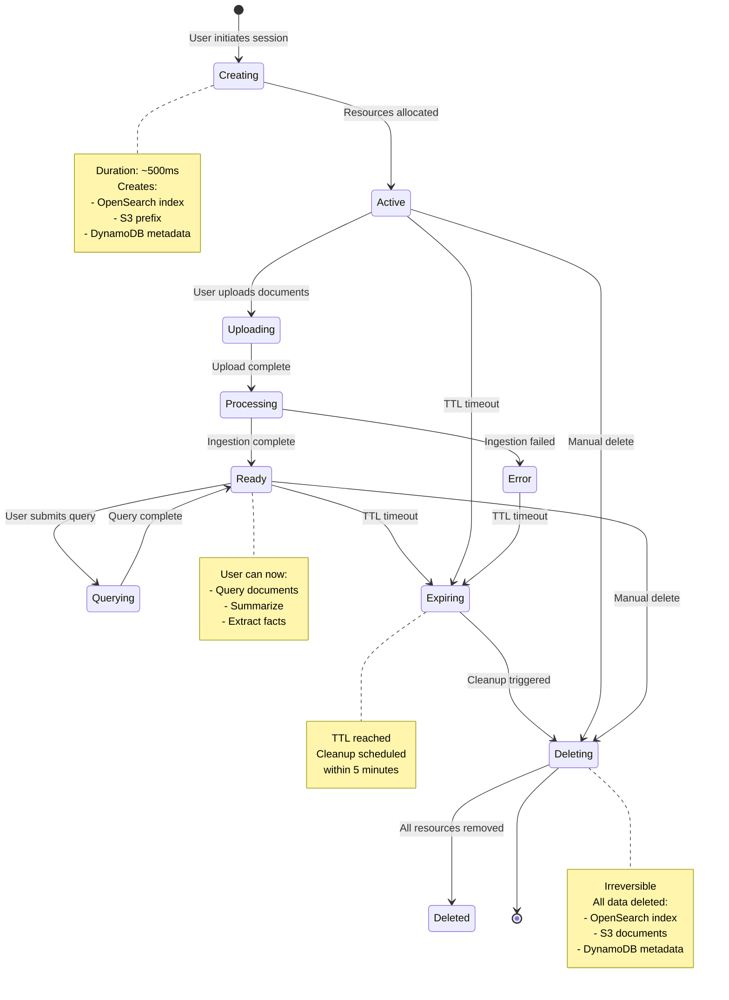

---

## 2. Session Creation Flow

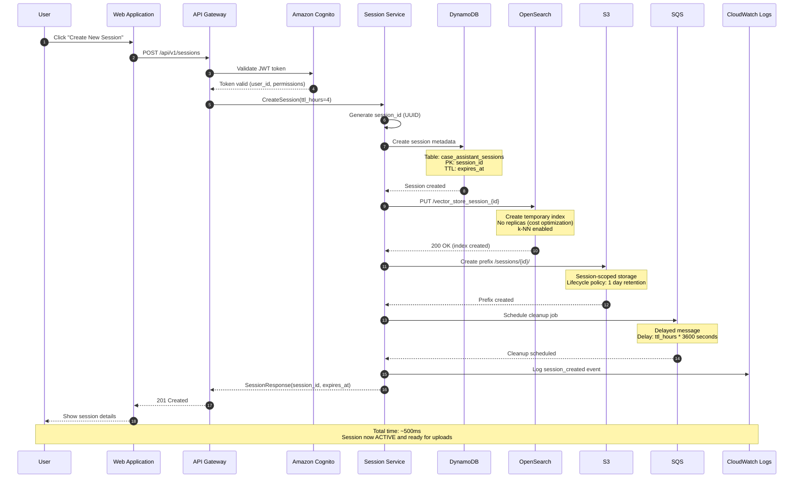

---

## 3. Document Upload and Ingestion Flow

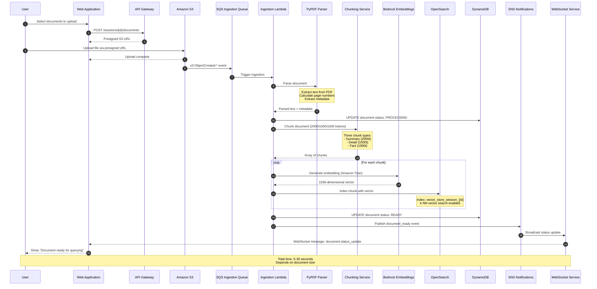

---

## 4. Query Execution Flow

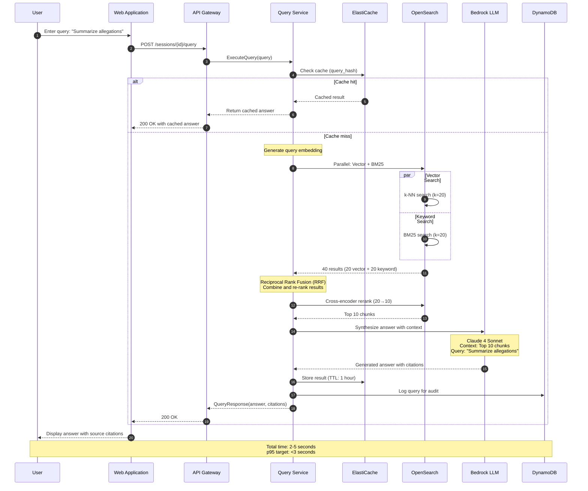

---

## 5. Session Extension Flow

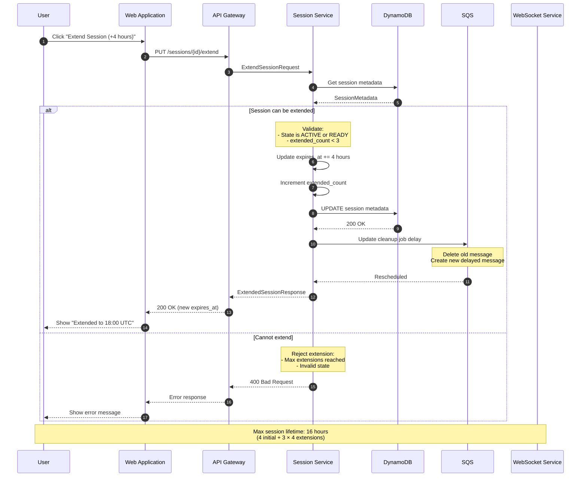

---

## 6. Session Deletion Flow (Manual)

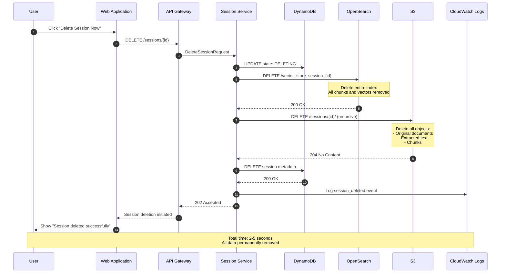

---

## 7. Automatic Cleanup Flow

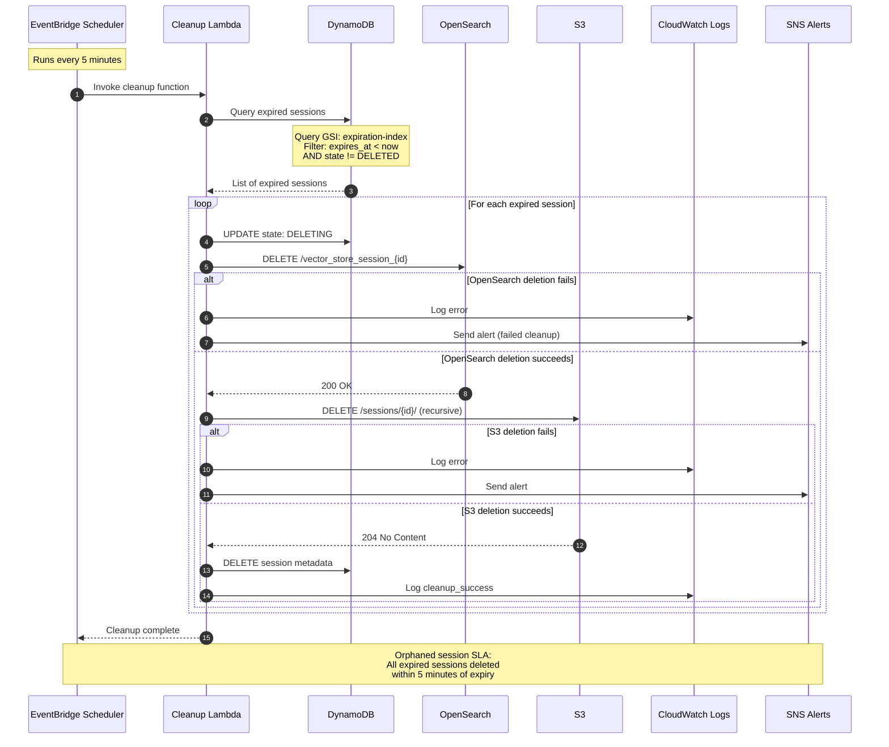

---

## 8. End-to-End User Journey

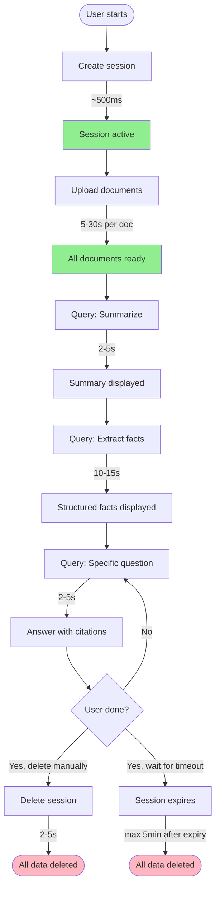

---

## 9. Error Handling Flows

### 9.1 Document Upload Failure

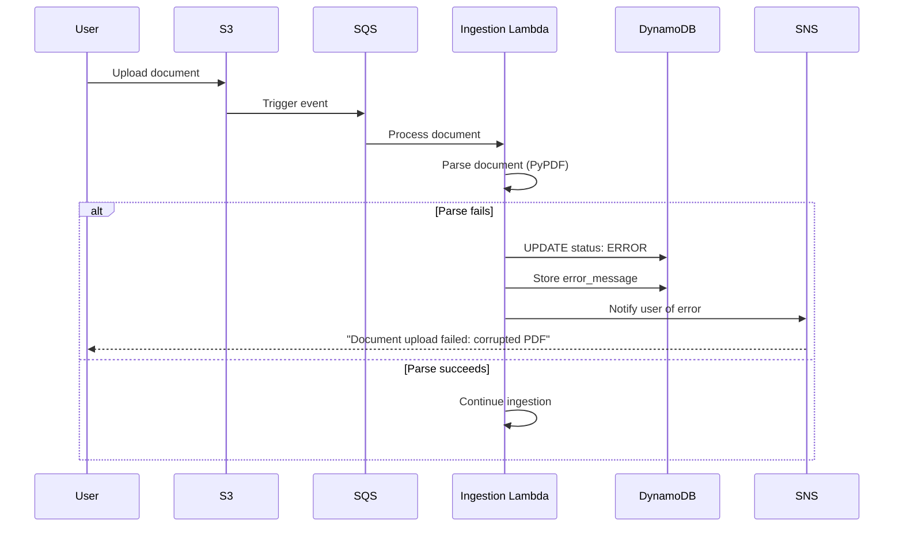

### 9.2 Query Timeout Handling

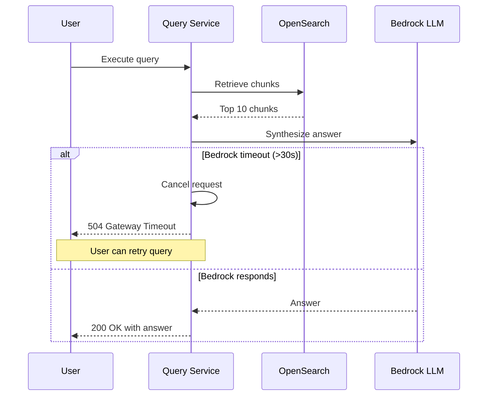

---

## 10. Performance Optimization Flows

### 10.1 Query Caching

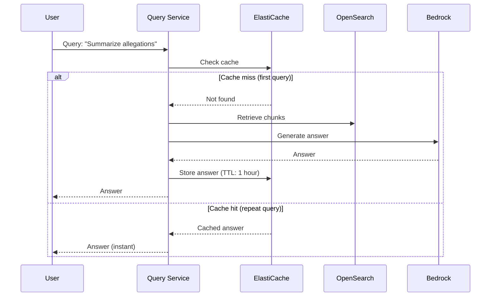

---

## Document Version History

| Version | Date | Author | Changes |
|---------|------|--------|---------|
| 1.0.0 | 2026-03-17 | Principal AI Engineer | Initial session lifecycle diagrams |

---

**END OF DOCUMENT**
