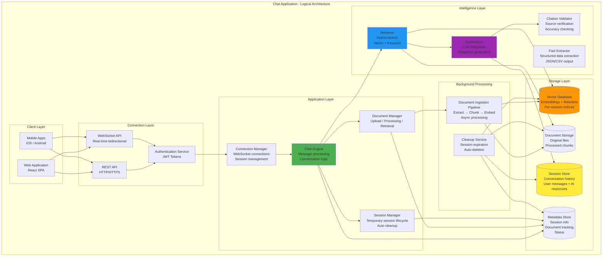
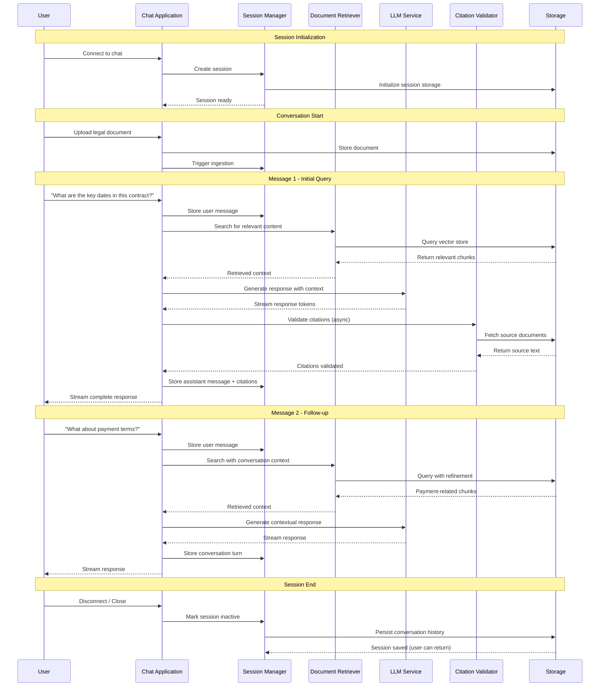

# 1. High-Level Architecture

## Table of Contents

- [1.1 Chat Application Architecture (Conceptual)](#11-chat-application-architecture-conceptual)
- [1.2 Chat Conversation Flow](#12-chat-conversation-flow)

---

## 1.1 Chat Application Architecture (Conceptual)

### Layer Descriptions

#### Client Layer
- **Web Application**: React SPA providing the primary interface
- **Mobile Apps**: Native iOS and Android applications

#### Connection Layer
- **REST API**: HTTP/HTTPS endpoints for stateless operations
- **WebSocket API**: Real-time bidirectional communication for streaming
- **Authentication Service**: JWT token-based authentication

#### Application Layer
- **Connection Manager**: Manages WebSocket connections and sessions
- **Chat Engine**: Core orchestration for chat conversations
- **Session Manager**: Manages temporary session lifecycle
- **Document Manager**: Handles document upload, processing, and retrieval

#### Intelligence Layer
- **Retriever**: Hybrid search combining vector and keyword search
- **Synthesizer**: LLM integration for response generation
- **Fact Extractor**: Structured data extraction
- **Citation Validator**: Source verification and accuracy checking

#### Storage Layer
- **Vector Database**: Per-session vector indices with embeddings and metadata
- **Document Storage**: Original files and processed chunks
- **Session Store**: Conversation history
- **Metadata Store**: Session info, document tracking, status

#### Background Processing
- **Document Ingestion Pipeline**: Async processing (extract → chunk → embed)
- **Cleanup Service**: Session expiration and auto-deletion

---

## 1.2 Chat Conversation Flow

### Flow Phases

#### Session Initialization
1. User connects to chat application
2. Session manager creates new session
3. Storage initializes session-specific resources
4. Session ready for user interaction

#### Document Upload
1. User uploads legal document
2. Document stored in document storage
3. Ingestion pipeline triggered for processing

#### Query Processing
1. User message stored in session
2. Retriever searches vector database for relevant content
3. Context retrieved and assembled
4. LLM generates response with citations
5. Citation validation runs asynchronously
6. Complete response streamed to user

#### Follow-up Questions
1. Subsequent messages include conversation context
2. Retriever refines search based on conversation history
3. Contextual responses generated

#### Session Persistence
1. On disconnect, session marked inactive
2. Conversation history persisted
3. User can return and resume conversation

---

## Related Documents

- **[02-document-ingestion.md](./02-document-ingestion.md)** - Document ingestion pipeline details
- **[03-message-routing.md](./03-message-routing.md)** - Message routing and orchestrator
- **[04-session-lifecycle.md](./04-session-lifecycle.md)** - Session lifecycle management
- **[06-core-components.md](./06-core-components.md)** - Component descriptions
