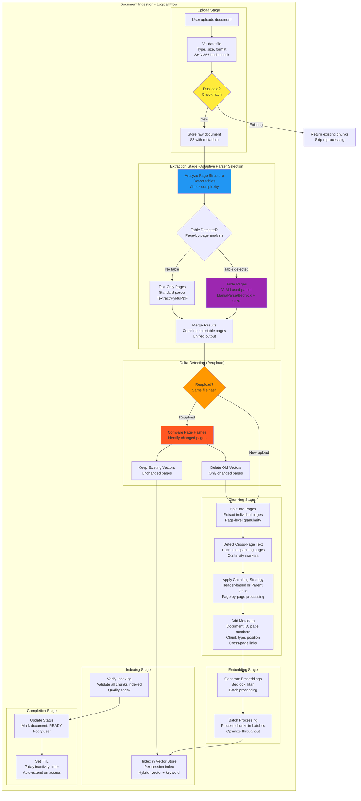
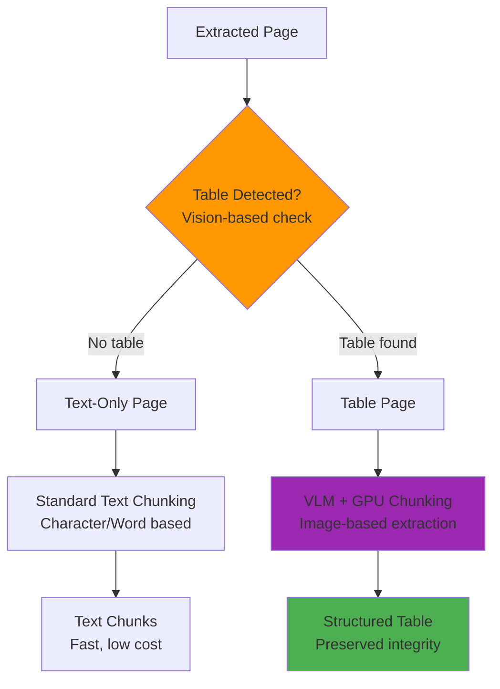
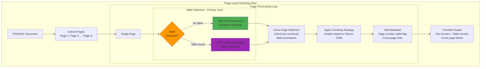
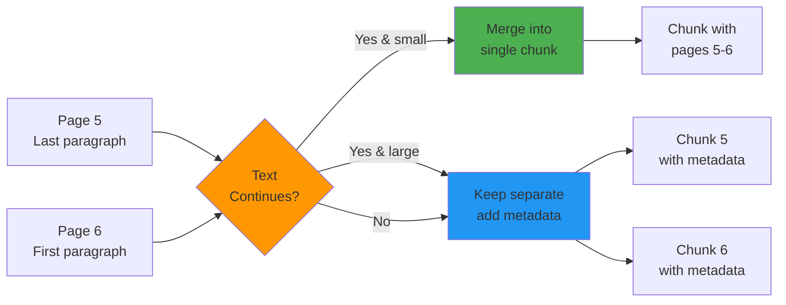

# Document Ingestion Pipeline

## 1.3 Document Ingestion Pipeline (Conceptual)



---

## Why Page-Level Splitting? Table Detection Problem

The primary reason for splitting documents into pages is to **detect and handle tables separately** to preserve their structural integrity.

### The Table Chunking Problem

| Issue | Description | Example |
|-------|-------------|---------|
| **Broken Columns** | Text chunking splits mid-column | "Column A: Value A123..." → broken |
| **Lost Rows** | Row relationships destroyed | Header row separated from data rows |
| **Merged Cells** | Complex tables lose structure | Spans not recognized after split |
| **Nested Tables** | Tables within tables broken | Inner table isolated from context |

### Example of Broken Table Chunking

❌ **WRONG - Text-based splitting**:
```
Chunk 1: "| Name | Age |"
Chunk 2: "| John | 25 |"
Chunk 3: "| Jane | 30 |"
```
→ **Problem**: No column context, headers separated from data

✅ **CORRECT - VLM with GPU**:
```
Table Page → VLM processes as image → Extracts complete table with structure
```
→ **Solution**: Preserves column/row relationships, merged cells, formatting

### VLM + GPU Solution for Tables

```
Table Page
    ↓
[VLM Model with GPU]
    ├─ LlamaParse (Vision Model)
    ├─ Bedrock Multimodal (Claude)
    └─ Processes page as IMAGE
    ↓
Structured Table Output
    ├─ Column headers preserved
    ├─ Row mappings intact
    ├─ Merged cells detected
    └─ Nested tables handled
```

### Why GPU is Required

| Requirement | Why GPU is Needed |
|-------------|-------------------|
| **Image Processing** | Table pages processed as images |
| **Cell Boundary Detection** | Precise visual boundary detection |
| **Merged Cell Recognition** | Complex spatial relationships |
| **Multi-Level Headers** | Nested structure understanding |
| **Cross-Page Tables** | Continuity across page breaks |
| **Batch Processing** | Faster inference with GPU acceleration |

---

## Page-Level Decision Flow



### Table Detection Criteria

| Feature | Detection Method | Action |
|---------|-----------------|--------|
| **Grid lines** | Visual detection | Flag for VLM |
| **Tabular patterns** | Layout analysis | Flag for VLM |
| **Multiple columns** | Structure analysis | Flag for VLM |
| **Merged cells** | Visual complexity | Flag for VLM |
| **Headers + data rows** | Pattern matching | Flag for VLM |

### Benefits of Page-Level Table Detection

1. **Preserve Table Integrity** - No broken columns/rows
2. **GPU Efficiency** - Only table pages use expensive GPU resources
3. **Cost Optimization** - Text pages use cheaper text extraction
4. **Accuracy** - Tables extracted with proper structure
5. **Scalability** - Targeted GPU usage, not whole document

---

## Page-Level Chunking Process



### Cross-Page Text Handling



---

## VLM + GPU Usage - Table Pages Only

The system uses **Vision Language Models (VLM) with GPU** for pages containing tables to preserve structural integrity:

| Page Type | Parser Used | GPU? | Cost | Examples |
|-----------|-------------|------|------|----------|
| **Text-only pages** | Textract/PyMuPDF | No | Low | Plain text contracts, letters, agreements |
| **Simple tables** | Textract Tables | No | Medium | Basic 2-column tables, simple lists |
| **Complex tables** | VLM (LlamaParse/Bedrock) | Yes | High | Merged cells, nested headers, multi-level tables |
| **Scanned docs** | Textract OCR | No | Medium | Image-based PDFs (no tables) |

### Table Detection Triggers VLM + GPU
- ✅ **Tables with merged cells** - Visual boundaries needed
- ✅ **Nested headers** - Multi-level column structure
- ✅ **Complex grid layouts** - Irregular cell sizes
- ✅ **Tables spanning pages** - Cross-page continuity
- ✅ **Financial tables** - Numbers, calculations, currencies
- ✅ **Legal tables** - Schedules, appendices, references

### Cost Optimization
- Page-level detection before VLM processing
- Only table pages use expensive GPU resources
- Text pages use cheaper text extraction
- ~60-70% cost savings vs. processing all pages with VLM

---

## Delta Update on Reupload

When same file is reuploaded:
1. Compare SHA-256 page hashes
2. Identify changed pages
3. Delete vectors ONLY from changed pages
4. Re-index only changed pages
5. Keep existing vectors from unchanged pages

**Benefit**: Faster reuploads, reduced embedding costs

---

## Page-Level Chunking with Cross-Page Tracking

The chunking process operates at **page-level granularity** for two critical reasons:

1. **PRIMARY: Table Detection** - Identify and route table pages to VLM+GPU
2. **SECONDARY: Delta Updates** - Enable efficient re-processing of changed pages

```
Document → Pages → Table Detection → Chunking → Vectors
                    ↓ (if table)
                  VLM + GPU
```

### Why Page-Level?

| Reason | Benefit |
|--------|---------|
| **Table Integrity** | Detect tables before chunking to preserve structure |
| **Targeted GPU Usage** | Only table pages use expensive VLM resources |
| **Efficient Updates** | Re-process only changed pages on re-upload |
| **Cross-Page Tracking** | Handle content spanning page boundaries |

### Process Flow

1. **Page Extraction**
   - Split document into individual pages
   - Each page gets a unique page_id
   - Store page boundaries for reference

2. **Table Detection (PRIMARY GOAL)**
   - Analyze page structure for tables
   - Detect grid lines, tabular patterns
   - Check for merged cells, complex layouts
   - **If table found**: Route to VLM + GPU
   - **If no table**: Use standard text extraction

3. **Cross-Page Content Detection**
   - Detect when text/tables span across pages
   - Mark continuation relationships
   - Track logical sentence boundaries across page breaks
   - Add metadata: `cross_page: true`, `continued_from: page_N`, `continues_to: page_N+1`

4. **Page-by-Page Chunking**
   - **Text pages**: Apply header-based or parent-child chunking
   - **Table pages**: VLM extracts structured table with preserved integrity
   - For cross-page content:
     - Option A: Merge split content into single chunk (if < max size)
     - Option B: Keep separate but add continuity metadata
   - Tag each chunk with source page number

5. **Metadata Enrichment**
   - Document ID, Session ID
   - Page number(s) (single or range for cross-page)
   - Content type: `text`, `table`, `cross_page_text`, `cross_page_table`
   - Chunk position in page
   - Cross-page flags and links
   - Table structure (for table chunks): columns, rows, merged cells

### Example

| Chunk | Content | Page | Type | Processing |
|-------|---------|------|------|------------|
| Chunk 1 | "The party of the first part..." | 5 | Text | Standard chunking |
| Chunk 2 | "Financial Schedule (table)" | 6 | Table | **VLM + GPU** |
| Chunk 3 | "\| Year \| Revenue \|" | 6 | Table cell | **VLM extracted** |
| Chunk 4 | "\| 2024 \| \$1.2M \|" | 6 | Table cell | **VLM extracted** |
| Chunk 5 | "...hereby agrees to the terms..." | 6-7 | Cross-page text | Merged chunk |
| Chunk 6 | "...continued from previous page" | 7 | Cross-page text | `continued_from: 6` |

### Benefits Summary

| Benefit | Description |
|---------|-------------|
| **Table Integrity** (PRIMARY) | No broken columns/rows, VLM preserves structure |
| **Targeted GPU Usage** | Only table pages use expensive VLM resources |
| **Targeted Updates** | Re-process only changed pages |
| **Context Preservation** | Track content across page boundaries |
| **Efficient Retrieval** | Search includes cross-page context |
| **Cost Savings** | Skip re-embedding unchanged pages |

---

## Related Documents

- **[01-chat-architecture.md](./01-chat-architecture.md)** - High-level chat architecture
- **[06-core-components.md](./06-core-components.md)** - Technology mapping and component details
- **[../system_designs_aws.md](../system_designs_aws.md)** - AWS-specific implementation
