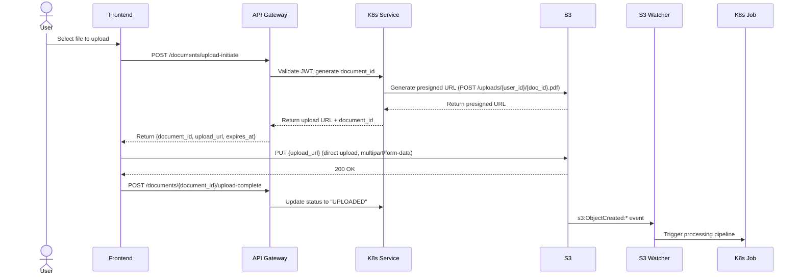
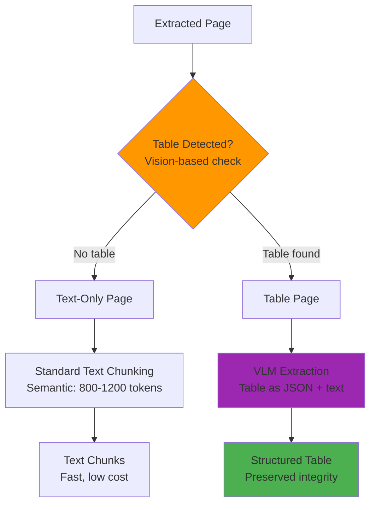
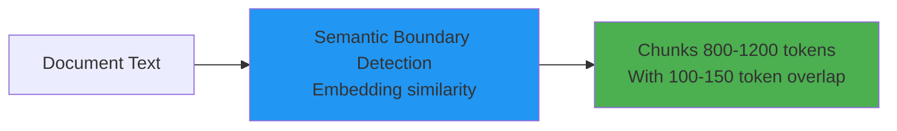
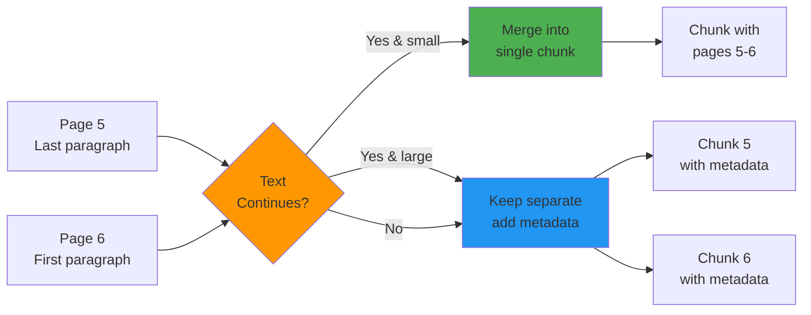

# Document Ingestion Pipeline

## 1. Document Ingestion Pipeline Overview

The Case Assistant system processes documents through a unified pipeline that extracts content, generates embeddings, and indexes into OpenSearch. The pipeline handles two distinct knowledge bases:

| Knowledge Base | Trigger | Volume | Processing Time |
|----------------|---------|--------|-----------------|
| **Static KB** | Scheduled (monthly) | 1,000-10,000 docs | 1-2 hours |
| **User Upload KB** | Event-driven (on upload) | 1 doc per upload | 1-3 minutes |

```mermaid
graph TB
    subgraph "Document Ingestion Pipeline"
        subgraph "Stage 1: Input"
            STATIC[Scheduled Trigger<br/>K8s CronJob Monthly]
            USER[User Upload<br/>API Gateway]
        end

        subgraph "Stage 2: Storage"
            RAW_S3[S3 Raw Bucket<br/>Document storage]
        end

        subgraph "Stage 3: Extraction"
            TEXTRACT[Document Extraction<br/>K8s Job + Textract]
            TABLE_DETECT{Table Detected?<br/>Page-level check}
            TEXT_PARSE[Text Pages<br/>Standard parser]
            TABLE_PARSE[Table Pages<br/>VLM + GPU]
        end

        subgraph "Stage 4: Processing"
            CHUNK[Chunking Strategy<br/>Semantic: 800-1200 tokens]
            EMBED[Embeddings<br/>Bedrock Titan v2]
            META[Metadata Extraction<br/>Citations, keywords]
        end

        subgraph "Stage 5: Indexing"
            INDEX[OpenSearch<br/>citation + unified indices]
            META_DOC[Document Metadata<br/>OpenSearch indices]
            VERSION[S3 Versioning<br/>History tracking]
        end

        subgraph "Stage 6: Completion"
            STATUS[Status Update<br/>S3 status file]
            NOTIFY[Notification<br/>SNS / User callback]
        end

        STATIC --> RAW_S3
        USER --> RAW_S3
        RAW_S3 --> TEXTRACT
        TEXTRACT --> TABLE_DETECT
        TABLE_DETECT -->|Text| TEXT_PARSE
        TABLE_DETECT -->|Table| TABLE_PARSE
        TEXT_PARSE --> CHUNK
        TABLE_PARSE --> CHUNK
        CHUNK --> EMBED
        EMBED --> META
        META --> INDEX
        META --> META_DOC
        META --> VERSION
        INDEX --> STATUS
        STATUS --> NOTIFY
    end
```



---

## 2. User Upload Flow with Presigned URLs

For user uploads, the system uses **presigned S3 URLs** to enable direct uploads from the user's browser to S3, bypassing the application servers.

### Why Presigned URLs?

| Approach | Pros | Cons |
|----------|------|------|
| **Upload via API** | Simple to implement | Bottleneck at app servers, high memory usage |
| **Presigned S3 URL** | Scalable, bypasses app servers, lower cost | Requires client-side multipart handling |

### Presigned URL Flow



### Step-by-Step Presigned URL Process

#### Step 1: Upload Initiation with Duplicate Detection

**API Request**:
```http
POST /api/v1/documents/upload-initiate
Authorization: Bearer {jwt_token}
Content-Type: application/json

{
  "filename": "my_tax_return.pdf",
  "file_size_bytes": 1048576,
  "content_type": "application/pdf",
  "sha256_hash": "a1b2c3d4..."  // Client calculates hash
}
```

**K8s Service Processing**:
```python
def handle_upload_initiation(user_id: str, filename: str, file_hash: str) -> dict:
    """
    Handle upload initiation with duplicate detection.
    """
    # Step 1: Check if document with same hash already exists for this user
    existing_doc = check_existing_document(user_id, file_hash)

    if existing_doc:
        # Same file already uploaded
        if existing_doc['status'] == 'COMPLETE':
            return {
                "document_id": existing_doc['document_id'],
                "status": "SKIP",
                "message": "Document already exists and is processed",
                "existing_document": {
                    "document_id": existing_doc['document_id'],
                    "filename": existing_doc['filename'],
                    "uploaded_at": existing_doc['uploaded_at'],
                    "chunk_count": existing_doc['chunk_count']
                },
                "action_required": "none"
            }
        elif existing_doc['status'] == 'PROCESSING':
            return {
                "status": "IN_PROGRESS",
                "message": "Document is currently being processed",
                "document_id": existing_doc['document_id'],
                "action_required": "wait"
            }

    # Step 2: New document or different version
    document_id = f"doc-{user_id}-{int(datetime.now().timestamp())}"
    s3_key = f"uploads/{user_id}/{document_id}.pdf"

    # Step 3: Generate presigned POST URL
    presigned_post = s3_client.generate_presigned_post(
        Bucket="case-assistant-uploads",
        Key=s3_key,
        Fields={"Content-Type": "application/pdf"},
        ExpiresIn=3600
    )

    # Step 4: Create initial metadata record with hash
    metadata = {
        "document_id": document_id,
        "user_id": user_id,
        "filename": filename,
        "file_hash": file_hash,
        "s3_key": s3_key,
        "status": "INITIATED",
        "upload_expires_at": (datetime.utcnow() + timedelta(hours=1)).isoformat()
    }

    opensearch.index(
        index="user-document-metadata",
        id=document_id,
        body=metadata
    )

    return {
        "document_id": document_id,
        "upload_url": presigned_post["url"],
        "fields": presigned_post["fields"],
        "expires_at": metadata["upload_expires_at"],
        "action_required": "upload_file"
    }

def check_existing_document(user_id: str, file_hash: str) -> dict | None:
    """
    Check if document with same hash already exists for this user.
    Returns document metadata if found, None otherwise.
    """
    response = opensearch.search(
        index="user-document-metadata",
        body={
            "query": {
                "bool": {
                    "must": [
                        {"term": {"user_id": user_id}},
                        {"term": {"file_hash": file_hash}}
                    ]
                }
            },
            "size": 1
        }
    )

    if response['hits']['hits']['total']['value'] > 0:
        return response['hits']['hits'][0]['_source']
    return None
```

**K8s Service Processing**:
```yaml
# Kubernetes Service/Deployment
apiVersion: v1
kind: Service
metadata:
  name: case-assistant-api
spec:
  selector:
    app: case-assistant
  ports:
  - port: 80
    targetPort: 8080
---
apiVersion: v1
kind: Pod
metadata:
  name: case-assistant-api-pod
spec:
  containers:
  - name: api
    image: case-assistant/api:latest
    env:
    - name: AWS_REGION
      value: "ap-southeast-2"
    - name: S3_UPLOAD_BUCKET
      value: "case-assistant-uploads"
```

**Presigned URL Generation**:
```python
import boto3
from datetime import datetime, timedelta

def generate_presigned_url(user_id: str, document_id: str, filename: str) -> dict:
    """
    Generate presigned S3 URL for direct upload.
    """
    s3_client = boto3.client('s3')

    # S3 key: /uploads/{user_id}/{document_id}.pdf
    s3_key = f"uploads/{user_id}/{document_id}.pdf"

    # Generate presigned POST URL (for file upload)
    presigned_url = s3_client.generate_presigned_post(
        Bucket="case-assistant-uploads",
        Key=s3_key,
        Fields={"Content-Type": "application/pdf"},
        ExpiresIn=3600  # 1 hour
    )

    # Create initial metadata record
    metadata = {
        "document_id": document_id,
        "user_id": user_id,
        "filename": filename,
        "s3_key": s3_key,
        "status": "INITIATED",
        "created_at": datetime.utcnow().isoformat(),
        "expires_at": (datetime.utcnow() + timedelta(hours=1)).isoformat()
    }

    # Store initial metadata in OpenSearch
    opensearch.index(
        index="user-document-metadata",
        id=document_id,
        body=metadata
    )

    return {
        "document_id": document_id,
        "upload_url": presigned_url["url"],
        "fields": presigned_url["fields"],
        "s3_key": s3_key,
        "expires_at": metadata["expires_at"]
    }
```

**API Response**:
```json
{
  "document_id": "doc-user-123-1711800000",
  "upload_url": "https://case-assistant-uploads.s3.amazonaws.com/",
  "method": "POST",
  "fields": {
    "key": "uploads/user-123/doc-user-123-1711800000.pdf",
    "Content-Type": "application/pdf",
    "X-Amz-Algorithm": "AWS4-HMAC-SHA256",
    "X-Amz-Credential": "...",
    "X-Amz-Date": "...",
    "X-Amz-Expires": "1711803600",
    "X-Amz-SignedHeaders": "host;x-amz-content-sha256",
    "X-Amz-Signature": "..."
  },
  "expires_at": "2026-03-30T11:00:00Z"
}
```

#### Step 2: Client-Side Upload

**Frontend Upload Handler**:
```typescript
// Frontend (React/TypeScript)
async function uploadDocument(file: File, documentId: string, uploadData: any) {
  const formData = new FormData();

  // Add S3 required fields
  Object.entries(uploadData.fields).forEach(([key, value]) => {
    formData.append(key, value);
  });

  // Add the file
  formData.append('file', file);

  // Direct upload to S3 (bypasses application servers)
  const response = await fetch(uploadData.upload_url, {
    method: 'POST',
    body: formData
  });

  if (!response.ok) {
    throw new Error('Upload failed');
  }

  // Notify backend that upload is complete
  await fetch(`/api/v1/documents/${documentId}/upload-complete`, {
    method: 'POST'
  });

  return { success: true, documentId };
}
```

#### Step 3: S3 Event Triggers Processing

**S3 Event Notification** → **K8s S3 Watcher**:

```yaml
# Kubernetes Deployment: S3 Event Watcher
apiVersion: v1
kind: Deployment
metadata:
  name: s3-event-watcher
spec:
  replicas: 2
  selector:
    matchLabels:
      app: s3-watcher
  template:
    metadata:
      labels:
        app: s3-watcher
    spec:
      containers:
      - name: watcher
        image: case-assistant/s3-watcher:latest
        env:
        - name: S3_BUCKET
          value: "case-assistant-uploads"
        - name: S3_PREFIX
          value: "uploads/"
        - name: SQS_QUEUE_URL
          value: "https://sqs.ap-southeast-2.amazonaws.com/..."
        resources:
          requests:
            memory: "256Mi"
            cpu: "250m"
```

**S3 Watcher Logic**:
```python
# S3 Event Watcher (runs in K8s)
import boto3
import json

def process_s3_events():
    """Poll SQS for S3 events and trigger processing jobs."""
    sqs_client = boto3.client('sqs')

    while True:
        messages = sqs_client.receive_message(
            QueueUrl=os.getenv('SQS_QUEUE_URL'),
            MaxNumberOfMessages=10,
            WaitTimeSeconds=20
        )

        for message in messages['Messages']:
            event = json.loads(message['Body'])

            # Extract S3 object info
            bucket = event['Records'][0]['s3']['bucket']['name']
            key = event['Records'][0]['s3']['object']['key']

            # Parse user_id and document_id from key
            # Key format: uploads/{user_id}/{document_id}.pdf
            parts = key.split('/')
            user_id = parts[1]
            document_id = parts[2].replace('.pdf', '')

            # Trigger processing job
            trigger_processing_job(document_id, user_id, bucket, key)

            # Delete message from queue
            sqs_client.delete_message(
                QueueUrl=os.getenv('SQS_QUEUE_URL'),
                ReceiptHandle=message['ReceiptHandle']
            )
```

#### Step 4: Status Tracking

**S3 Status File**:
```
s3://case-assistant-uploads/user-123/doc-user-123-001-status.json
```

```json
{
  "document_id": "doc-user-123-001",
  "user_id": "user-123",
  "status": "PROCESSING",
  "progress": 25,
  "stage": "EXTRACTING_PAGES",
  "started_at": "2026-03-30T10:00:00Z",
  "updated_at": "2026-03-30T10:02:30Z"
}
```

**Status Polling Endpoint**:
```http
GET /api/v1/documents/{document_id}/status
Authorization: Bearer {jwt_token}

Response:
{
  "document_id": "doc-user-123-001",
  "status": "COMPLETE",
  "progress": 100,
  "stage": "READY",
  "chunk_count": 45,
  "ready_for_query": true,
  "completed_at": "2026-03-30T10:03:45Z"
}
```

### Security Considerations

| Concern | Mitigation |
|---------|------------|
| **Unauthorized uploads** | Presigned URL requires specific key, expires in 1 hour |
| **File size limits** | Validate size at initiation (e.g., max 100MB) |
| **Content type validation** | Whitelist allowed types, validate during initiation |
| **User isolation** | S3 key includes user_id, enforce via IAM policy |
| **Malicious files** | Virus scanning after upload, sandbox processing |

### Duplicate Document Handling

When a user uploads a document, the system checks if they have previously uploaded the **same file** (by SHA-256 hash):

| Scenario | Detection | System Response | User Experience |
|----------|-----------|----------------|------------------|
| **Exact duplicate** | Same SHA-256 hash, same user | Skip processing, return existing doc | "Already processed, ready to use" |
| **Same filename, different content** | Different SHA-256 hash | Process as new version | Treated as new document |
| **Same file, different user** | Hash matches but different user_id | Process independently | Each user gets their own copy |
| **Re-uploading during processing** | Hash matches, status=PROCESSING | Return current status | "Still processing, please wait" |

### Version Update Flow

When user uploads an **updated version** of an existing document:

```
User uploads "my_tax_return_v2.pdf" (same name, different hash)

Step 1: Check hash → Different from existing
Step 2: Create new document_id (doc-user-123-v2-001)
Step 3: Generate new presigned URL
Step 4: Upload to S3 (new file, same bucket)
Step 5: Process with full refresh:
  - Delete old vectors from OpenSearch (document_id=doc-user-123-001)
  - Extract, chunk, embed new version
  - Index to OpenSearch with new document_id
Step 6: Update metadata (version increment)
Step 7: S3 versioning keeps both versions
```

**Key Points**:
- **SHA-256 hash calculated client-side** before upload (optional but recommended)
- **Hash can be calculated server-side** after upload (fallback)
- **Same file = same hash**: Skip processing, return existing
- **Different file = different hash**: Process as new/updated version
- **Old version preserved**: S3 versioning keeps history

```json
{
  "Version": "2012-10-17",
  "Statement": [
    {
      "Effect": "Allow",
      "Action": [
        "s3:PutObject",
        "s3:PutObjectAcl"
      ],
      "Resource": "arn:aws:s3:::case-assistant-uploads/uploads/${aws:username}/*",
      "Condition": {
        "StringEquals": {
          "s3:x-amz-acl": "bucket-owner-full-control"
        }
      }
    }
  ]
}
```

---

## 3. Page-Level Splitting for Table Detection

The primary reason for splitting documents into pages is to **detect and handle tables separately** to preserve their structural integrity.

### The Table Chunking Problem

| Issue | Description | Example |
|-------|-------------|---------|
| **Broken Columns** | Text chunking splits mid-column | "Column A: Value A123..." → broken |
| **Lost Rows** | Row relationships destroyed | Header row separated from data rows |
| **Merged Cells** | Complex tables lose structure | Spans not recognized after split |
| **Nested Tables** | Tables within tables broken | Inner table isolated from context |

### VLM + GPU Solution for Tables

```
Table Page
    ↓
[VLM Model with GPU]
    ├─ Textract Tables (for simple tables)
    ├─ Bedrock Multimodal (for complex tables)
    └─ Processes page as IMAGE
    ↓
Structured Table Output
    ├─ Column headers preserved
    ├─ Row mappings intact
    ├─ Merged cells detected
    └─ Nested tables handled
```

### Page-Level Decision Flow



### Table Detection Criteria

| Feature | Detection Method | Action |
|---------|-----------------|--------|
| **Grid lines** | Visual detection | Flag for VLM |
| **Tabular patterns** | Layout analysis | Flag for VLM |
| **Multiple columns** | Structure analysis | Flag for VLM |
| **Merged cells** | Visual complexity | Flag for VLM |
| **Headers + data rows** | Pattern matching | Flag for VLM |

### Cost Optimization

| Page Type | Parser Used | GPU? | Cost |
|-----------|-------------|------|------|
| **Text-only pages** | PyMuPDF/Textract | No | Low |
| **Simple tables** | Textract Tables | No | Medium |
| **Complex tables** | Bedrock Multimodal | Yes | High |

**Benefit**: Only table pages use expensive GPU resources → 60-70% cost savings.

---

## 3. Chunking Strategy

### Semantic Chunking (Primary Method)

**Chunk Size**: 800-1200 tokens (optimized for Titan v2's 1536 dimensions)

**Overlap**: 100-150 tokens (12-19%, reduced from 40-67%)



**Why Semantic Over Fixed-Size**:
- Preserves legal provision boundaries
- Maintains logical argument flow
- Reduces mid-sentence splits
- 15-20% better retrieval precision for legal documents

### Parent-Child Chunking

| Chunk Type | Size | Purpose | Index |
|------------|------|---------|-------|
| **Child chunks** | 800-1200 tokens | Precise semantic search | unified-legal-index |
| **Parent chunks** | 2400-3600 tokens | Complete legal context | unified-legal-index (linked) |

**Process**:
1. Create child chunks using semantic boundaries
2. Aggregate 3-6 child chunks into 1 parent chunk
3. Store both in OpenSearch with parent-child relationship
4. Query returns child chunks, expand to parent context as needed

### Cross-Page Content Handling



**Metadata for Cross-Page Chunks**:
```json
{
  "chunk_id": "chunk-doc-001-pages-5-6",
  "text": "...continued from page 5...",
  "metadata": {
    "page_numbers": [5, 6],
    "cross_page": true,
    "continued_from": 5,
    "continues_to": 6
  }
}
```

---

## 4. Index Population

The ingestion pipeline populates **2 indices** (simplified from original 6-index design):

### Index 1: Citation Index

**Purpose**: Fast exact-match lookup for legal citations

**Extraction Process**:
```text
For each chunk:
  1. Detect citation patterns:
     - Section citations: "Section 288-95", "s 288-95"
     - Ruling citations: "TR 2022/1", "TD 2023/5"
     - Case citations: "FCT v. Myer (1937)"

  2. Normalize to canonical form
  3. Generate aliases for matching variations
  4. Extract hierarchy (parent/child sections)

  5. Build citation document:
     - canonical: "s-288-95"
     - aliases: ["section-288-95", "s288-95", "sec-288-95"]
     - chunk_pointers: [chunk IDs containing this citation]
     - cross_references: [related citations]
```

**OpenSearch Document**:
```json
{
  "citation_id": "cit-itaa-1997-s-288-95",
  "citation_canonical": "s-288-95",
  "citation_aliases": ["section-288-95", "s288-95", "sec-288-95"],
  "act": "ITAA 1997",
  "title": "Failure to lodge return on time",
  "chunk_pointers": ["chunk-itaa-1997-s-288-95-001", "chunk-itaa-1997-s-288-95-002"],
  "cross_references": [
    {"citation": "s-995-1", "type": "definition", "relationship": "defines_term"},
    {"citation": "s-288-90", "type": "related_provision", "relationship": "related_to"}
  ],
  "metadata": {
    "document_type": "tax_legislation",
    "jurisdiction": "federal",
    "kb_type": "static"
  }
}
```

### Index 2: Unified Legal Index

**Purpose**: Hybrid vector + BM25 search with metadata filtering and parent-child context

**Document Structure**:
```json
{
  "chunk_id": "chunk-itaa-1997-s-288-95-001",
  "chunk_type": "child",
  "text": "A penalty of 210 penalty units applies...",
  "embedding": [0.123, 0.456, ...],  // Titan v2, 1536 dimensions
  "parent_chunk": {
    "parent_id": "parent-itaa-1997-s-288-95",
    "parent_text": "(1) An entity that fails to lodge..."
  },
  "metadata": {
    "document_type": "tax_legislation",
    "jurisdiction": "federal",
    "act": "ITAA 1997",
    "section": "288-95",
    "year": 1997,
    "status": "active",
    "kb_type": "static"
  },
  "citations": ["s-288-95", "s-995-1"],
  "keywords": ["penalty-units", "activity-statement"]
}
```

**What's Included** (combines 6 indices into 2):

| Original Index | Now Stored In |
|----------------|---------------|
| **Citation Index** | Separate citation-index (unchanged) |
| **Semantic Index** | unified-legal-index (embedding field) |
| **Keyword Index** | unified-legal-index (BM25 automatic) |
| **Context Index** | unified-legal-index (parent_chunk field) |
| **Metadata Index** | unified-legal-index (metadata field) |
| **Cross-Reference Index** | citation-index (cross_references array) |

---

## 5. Metadata and Version Tracking

### OpenSearch for Metadata

**Index: document-metadata**
```json
{
  "document_id": "itaa-1997",
  "current_version": 5,
  "document_type": "tax_legislation",
  "title": "Income Tax Assessment Act 1997",
  "source_url": "https://legislation.gov.au/...",
  "file_hash": "a1b2c3d4...",
  "chunk_count": 4500,
  "citation_count": 890,
  "last_ingested_at": "2026-03-30T02:15:00Z",
  "ingestion_status": "COMPLETE",
  "kb_type": "static",
  "s3_version_id": "5z9LW7xTi..."
}
```

**Index: user-document-metadata**
```json
{
  "user_id": "user-123",
  "document_id": "doc-user-123-001",
  "filename": "my_tax_return_2024.pdf",
  "file_size_bytes": 1048576,
  "status": "COMPLETE",
  "chunk_count": 45,
  "uploaded_at": "2026-03-30T10:00:00Z",
  "processed_at": "2026-03-30T10:02:30Z",
  "kb_type": "user_upload"
}
```

### S3 Versioning for History

**Automatic version tracking**:
```
case-assistant-raw/static/itaa-1997.pdf
  Version 1: 2026-01-01 (initial)
  Version 2: 2026-02-01 (amendment)
  Version 3: 2026-03-01 (amendment)
  Version 4: 2026-03-15 (amendment)
  Version 5: 2026-03-30 (current)
```

**Benefits**:
- Automatic with S3 versioning enabled
- All historical versions preserved
- OpenSearch stores version metadata
- Lifecycle policy manages old versions

---

## 6. AWS Services Step-by-Step

### Static KB Ingestion Flow

```
Step 1: K8s CronJob triggers K8s Job (monthly cron)
Step 2: K8s Job fetches from ATO sources
Step 3: Store raw PDFs in S3: /raw/static/YYYY-MM-DD/
Step 4: K8s Job extracts pages, detects tables
Step 5: Text pages → PyMuPDF, Table pages → Textract/VLM
Step 6: Semantic chunking (800-1200 tokens)
Step 7: Bedrock Titan v2 generates embeddings
Step 8: OpenSearch bulk indexing
Step 9: Update metadata in OpenSearch
Step 10: SNS notification
```

### User Upload Ingestion Flow

```
Step 1: User calls API Gateway: POST /documents/upload-initiate
Step 2: Cognito validates JWT
Step 3: K8s Job returns presigned S3 URL
Step 4: User uploads directly to S3
Step 5: S3 event triggers processing K8s Job
Step 6: K8s Job extracts pages, detects tables
Step 7: Text pages → PyMuPDF, Table pages → Textract/VLM
Step 8: Semantic chunking (800-1200 tokens)
Step 9: Bedrock Titan v2 generates embeddings
Step 10: OpenSearch bulk indexing with user_id scope
Step 11: Update user-document-metadata in OpenSearch
Step 12: Create status file in S3
Step 13: User polls or receives notification
```

---

## 7. Full Refresh Ingestion (Current Approach)

> **NOTE**: Incremental ingestion with delta detection was evaluated but **deferred for simplicity**. The current implementation uses full refresh for both knowledge bases.

### Full Refresh Process

```
When document is re-ingested:
  1. Compare file-level hash (SHA-256)
  2. If unchanged: Skip processing
  3. If changed:
     a. Delete all existing vectors for document_id
     b. Re-process all pages from scratch
     c. Re-chunk, re-embed, re-index all content
     d. Update metadata with new version
     e. S3 versioning keeps history
```

**Benefits**:
- Simpler implementation (2-3 days vs 2-3 weeks)
- Guaranteed consistency (no partial states)
- Easier debugging and maintenance
- Sufficient for initial launch

**When to Add Incremental (Phase 2)**:
- Cost/benefit analysis shows >70% savings
- Re-upload frequency >5x per document
- User experience demands faster updates

---

## 8. Error Handling

### Retry Strategy

```
Retry Configuration:
  - Max retries: 3
  - Backoff: Exponential (2^n seconds)
  - Jitter: ±20% random
  - Dead letter queue: Failed documents to S3 failed/
```

### Error Categories

| Error Type | Detection | Recovery |
|------------|-----------|----------|
| **Source Fetch Failed** | HTTP errors | Retry with backoff |
| **Textract Failed** | API timeout | Retry, fallback to PDF parser |
| **Embedding Failed** | Bedrock API error | Retry, continue on rate limit |
| **OpenSearch Failed** | Bulk API error | Retry failed chunks |
| **User Upload Failed** | Validation error | Return error to user |

---

## 9. Monitoring

### CloudWatch Metrics

| Metric | Namespace | Alarm Threshold |
|--------|-----------|-----------------|
| **Ingestion Duration** | CaseAssistant/Ingestion | > 2 hours (static), > 5 min (user) |
| **Textract API Errors** | CaseAssistant/Textract | > 5% |
| **Bedrock API Errors** | CaseAssistant/Bedrock | > 1% |
| **OpenSearch Index Errors** | CaseAssistant/OpenSearch | > 1% |
| **User Upload Failures** | CaseAssistant/UserUpload | > 5% |

### CloudWatch Dashboards

**Static KB Dashboard**:
- Last sync time and duration
- Documents processed per sync
- Error rates by service
- Storage usage trends

**User Upload Dashboard**:
- Uploads per hour/day
- Processing latency (p50, p95, p99)
- Error rates by error type
- Active users count

---

## Related Documents

- **[07-ingestion-strategies-comparison.md](./07-ingestion-strategies-comparison.md)** - Ingestion strategies and AWS service integration
- **[13-chunking-strategies.md](./13-chunking-strategies.md)** - Detailed chunking strategies for legal documents
- **[12-high-level-design.md](./12-high-level-design.md)** - Overall system architecture
