# Document Ingestion Pipeline

## 1. Document Ingestion Pipeline Overview

The Case Assistant system processes documents through a unified pipeline that extracts content, generates embeddings, and indexes into OpenSearch. The pipeline handles two distinct knowledge bases:

| Knowledge Base | Trigger | Volume | Processing Time | Chunking Strategy |
|----------------|---------|--------|-----------------|-------------------|
| **Static KB** | Scheduled (monthly) | 1,000-10,000 docs | 1-2 hours | Hybrid (structural + semantic) |
| **User Upload KB** | Event-driven (on upload) | 1 doc per upload | 1-3 minutes | Fixed-size with overlap |

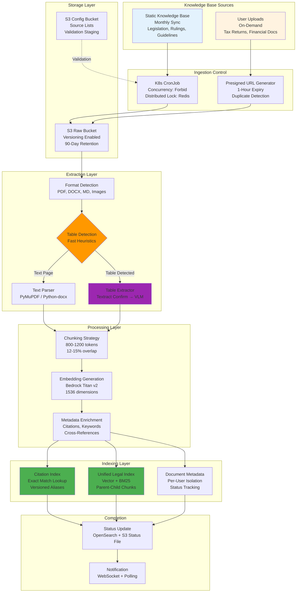

---

## 2. Static KB Ingestion Pipeline

### 2.1 Pipeline Architecture

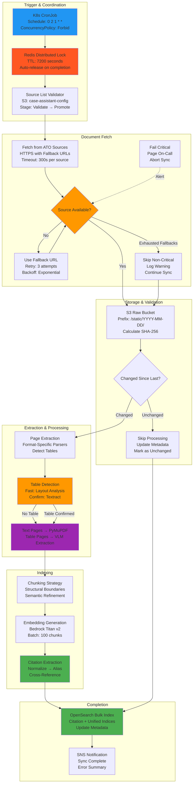

### 2.2 Source List Management

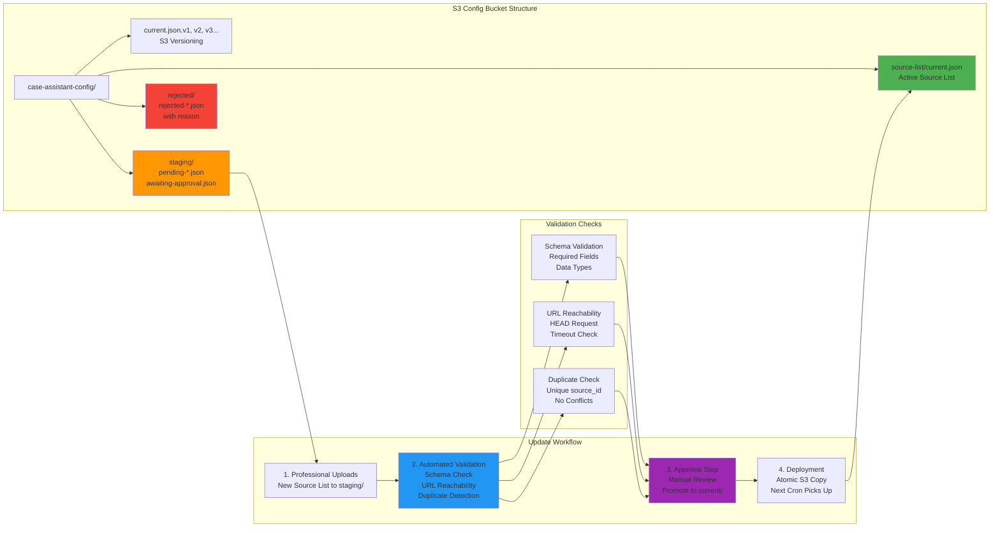

### 2.3 Source Priority Matrix

| Priority | Availability | Action | Notification |
|----------|--------------|--------|--------------|
| **Critical** | Available | Proceed | None |
| **Critical** | Unavailable | Fail entire sync, retry in 1 hour | Page on-call |
| **Critical** | Fallback Only | Use fallback, alert team | Warning notification |
| **High** | Available | Proceed | None |
| **High** | Unavailable | Skip, log warning, retry in 1 hour | Info log |
| **Normal** | Available | Proceed | None |
| **Normal** | Unavailable | Skip, log warning | None |
| **Low** | Available | Proceed | None |
| **Low** | Unavailable | Skip silently | None |

---

## 3. User Upload Ingestion Pipeline

### 3.1 Presigned URL Upload Flow

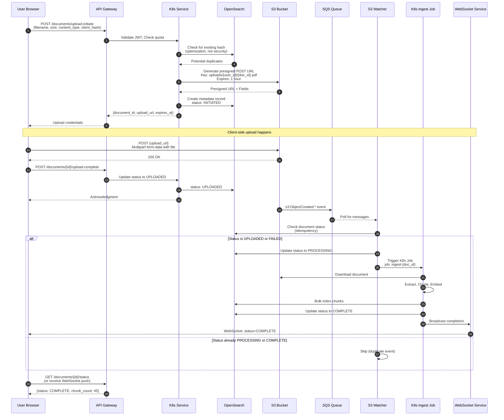

### 3.2 Document Status State Machine

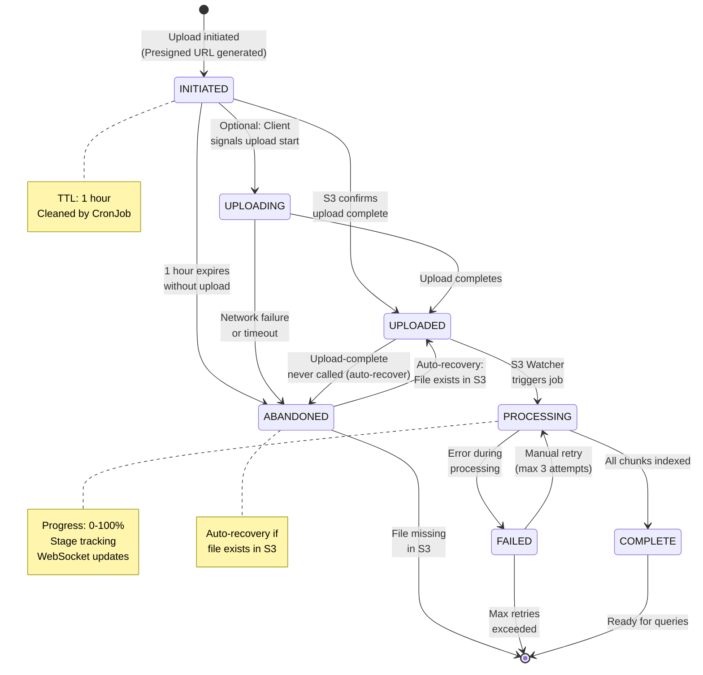

### 3.3 Idempotency Protection

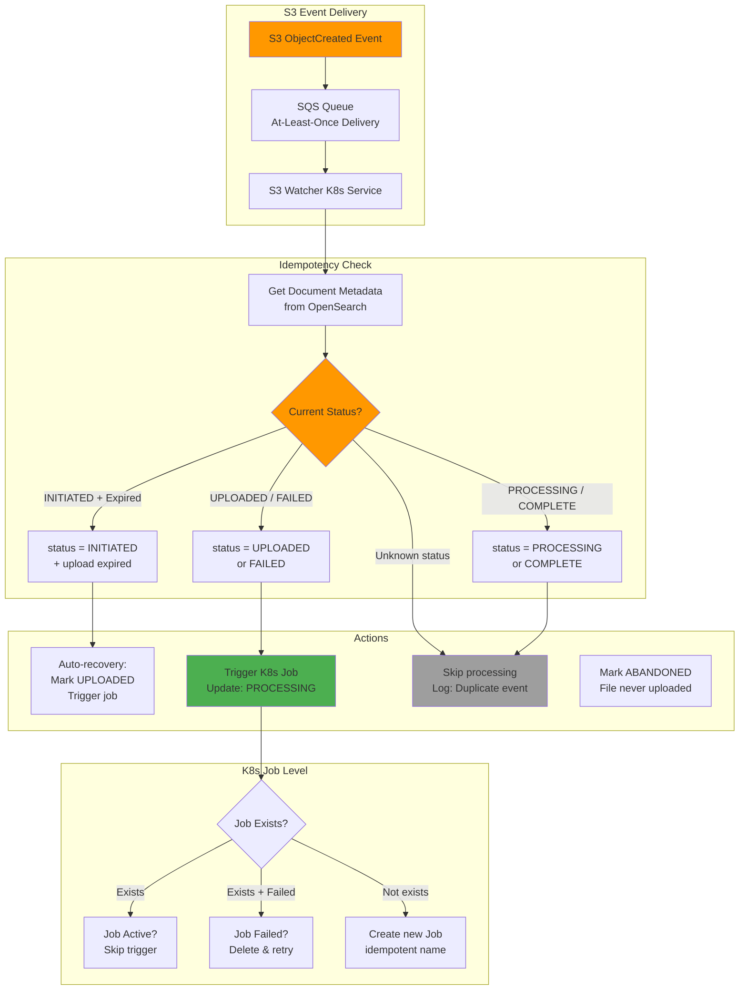

---

## 4. Document Format Support

### 4.1 Supported Formats

| Format | Extension | MIME Type | Parser | Table Support |
|--------|-----------|-----------|--------|---------------|
| **PDF** | .pdf | application/pdf | PyMuPDF + Textract | Yes (VLM) |
| **Word** | .docx | application/vnd.openxmlformats-officedocument.wordprocessingml.document | python-docx | Yes |
| **Legacy Word** | .doc | application/msword | antiword | Limited |
| **Markdown** | .md | text/markdown | markdown | N/A |
| **Plain Text** | .txt | text/plain | Native | N/A |
| **Excel** | .xlsx, .xls | application/vnd.openxmlformats-officedocument.spreadsheetml.sheet | openpyxl | Yes |
| **Images** | .png, .jpg, .jpeg, .tiff | image/* | Textract OCR | Limited |

### 4.2 Format Detection & Parser Selection

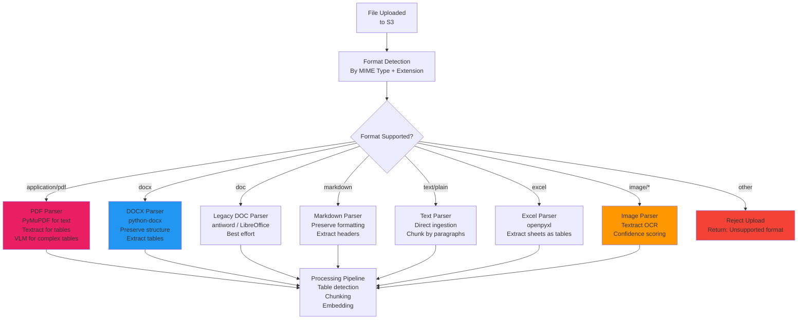

---

## 5. Table Detection & Extraction

### 5.1 Two-Stage Table Detection Strategy

```mermaid
graph TB
    subgraph "Stage 1: Fast Detection (Local, No API)"
        PAGE[PDF Page]
        HEURISTICS[Fast Heuristics<br/>O(1) checks]

        H1[Count Vector Lines<br/>> 5 lines?]
        H2[Text Density<br/>Regular spacing?]
        H3[Column Detection<br/>>= 3 columns?]

        SCORE[Calculate Score<br/>0-7 points]
        THRESHOLD{Score >= 4?}
    end

    subgraph "Stage 2: Confirmation (Textract API)"
        CONFIRM[Textract Table Detection<br/>FeatureTypes: TABLES<br/>Cost: $0.0015/page]
        CONFIRMED{Table Found?}
    end

    subgraph "Stage 3: Extraction"
        TEXT_PATH[Text Parser<br/>PyMuPDF<br/>Fast, Low Cost]
        TABLE_PATH[VLM Extraction<br/>Bedrock Multimodal<br/>Preserves Structure]
    end

    PAGE --> HEURISTICS
    HEURISTICS --> H1
    HEURISTICS --> H2
    HEURISTICS --> H3
    H1 --> SCORE
    H2 --> SCORE
    H3 --> SCORE
    SCORE --> THRESHOLD

    THRESHOLD -->|No| TEXT_PATH
    THRESHOLD -->|Yes| CONFIRM
    CONFIRM --> CONFIRMED
    CONFIRMED -->|No| TEXT_PATH
    CONFIRMED -->|Yes| TABLE_PATH

    style HEURISTICS fill:#4CAF50
    style CONFIRM fill:#FF9800
    style TABLE_PATH fill:#9C27B0
```

### 5.2 Cost Comparison

| Strategy | 100-page Document | 20 Tables | Cost |
|----------|-------------------|-----------|------|
| **VLM Every Page** | 100 VLM calls @ $0.02 | - | $2.00 |
| **Two-Stage Detection** | 100 free checks | 20 Textract @ $0.0015 + 20 VLM @ $0.02 | $0.43 |
| **Savings** | - | - | **78%** |

### 5.3 Multi-Page Table Handling

```mermaid
graph TB
    subgraph "Detection Phase"
        T1[Table on Page N]
        T2[First Table on Page N+1]

        CHECK{Check Continuation<br/>Indicators}

        IND1[Indicator 1:<br/>Column Count Match?]
        IND2[Indicator 2:<br/>Column Width Similar<br/>> 90%?]
        IND3[Indicator 3:<br/>No Bottom Border<br/>on Page N?]
        IND4[Indicator 4:<br/>No Header on<br/>Page N+1?]
    end

    subgraph "Decision Logic"
        COUNT{Count True<br/>Indicators}
        DECISION{2 or More<br/>Indicators True?}
    end

    subgraph "Decision"
        CONTINUE[Table Continues<br/>Mark for Merge]
        SEPARATE[Separate Tables<br/>Process independently]
    end

    subgraph "Merge Phase"
        GROUP[Group Sequential<br/>Continued Tables]
        MERGE[Merge Into Single<br/>Table Object]
        METADATA[Add Metadata:<br/>page_span: [N, N+1, N+2]<br/>is_multi_page: true]
    end

    T1 --> CHECK
    T2 --> CHECK
    CHECK --> IND1
    CHECK --> IND2
    CHECK --> IND3
    CHECK --> IND4

    IND1 --> COUNT
    IND2 --> COUNT
    IND3 --> COUNT
    IND4 --> COUNT

    COUNT --> DECISION
    DECISION -->|Yes| CONTINUE
    DECISION -->|No| SEPARATE

    CONTINUE --> GROUP
    GROUP --> MERGE
    MERGE --> METADATA

    style CHECK fill:#FF9800
    style DECISION fill:#FF9800
    style CONTINUE fill:#4CAF50
    style SEPARATE fill:#2196F3
```

**Multi-Page Table Metadata:**

```json
{
  "chunk_id": "chunk-table-tax-return-schedule-1",
  "chunk_type": "table",
  "is_multi_page": true,
  "page_span": [5, 6, 7],
  "page_count": 3,
  "row_count": 45,
  "column_count": 6,
  "headers": ["Item", "Description", "Amount", "Deduction", "Taxable", "Labels"]
}
```

---

## 6. Chunking Strategies

### 6.1 Strategy Comparison

| Aspect | Fixed-Size | Semantic | Hybrid (Recommended) |
|--------|-----------|----------|---------------------|
| **Split Method** | Character count | Embedding similarity | Structure first, semantic refinement |
| **API Calls** | 0 (for chunking) | 2x (detect + embed) | 0.2x (20% semantic refinement) |
| **Cost** | $ | $$ | $ |
| **Quality** | Good | Best | Very Good |
| **Use Case** | User uploads | Critical docs | Static KB |

### 6.2 Hybrid Chunking Flow

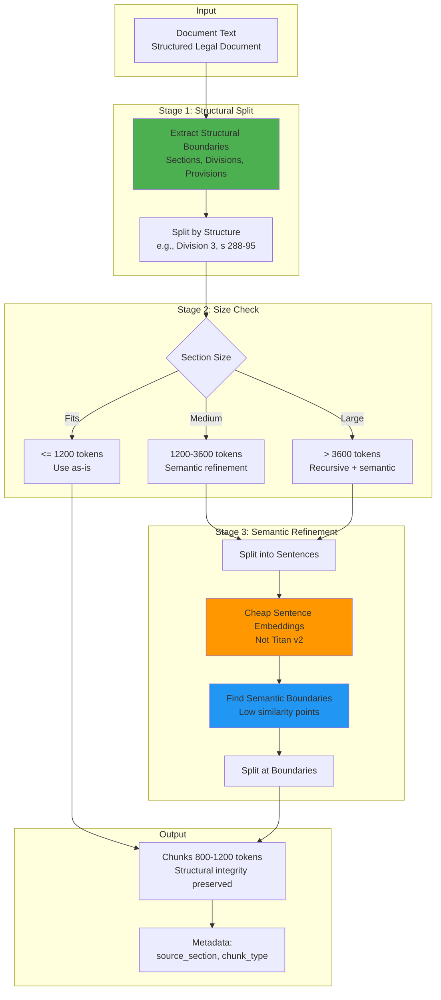

### 6.3 Parent-Child Chunking

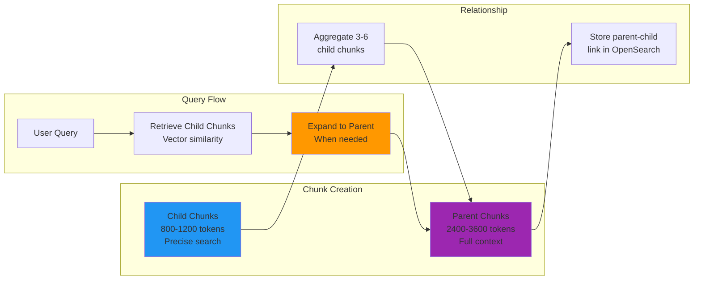

### 6.4 Cross-Page Content Handling

```mermaid
graph TB
    subgraph "Detection"
        P1[Page N<br/>Last Paragraph]
        P2[Page N+1<br/>First Paragraph]

        ANALYZE{Analyze Continuation}

        SIG1[Mid-sentence<br/>on Page N]
        SIG2[Semantic Similarity<br/>> 0.8]
        SIG3[No Section Break<br/>detected]
    end

    subgraph "Decision"
        MERGE[Merge into<br/>Single Chunk]
        SEPARATE[Keep Separate<br/>Add Cross-Reference]
    end

    subgraph "Metadata"
        META1[Merged Chunk:<br/>page_numbers: [N, N+1]<br/>cross_page: true]
        META2[Separate Chunks:<br/>continues_to: N+1<br/>continued_from: N]
    end

    P1 --> ANALYZE
    P2 --> ANALYZE
    ANALYZE --> SIG1
    ANALYZE --> SIG2
    ANALYZE --> SIG3

    SIG1 --> MERGE
    SIG2 --> MERGE
    SIG3 --> SEPARATE

    MERGE --> META1
    SEPARATE --> META2

    style ANALYZE fill:#FF9800
    style MERGE fill:#4CAF50
    style SEPARATE fill:#2196F3
```

---

## 7. Index Structure

### 7.1 Two-Index Architecture

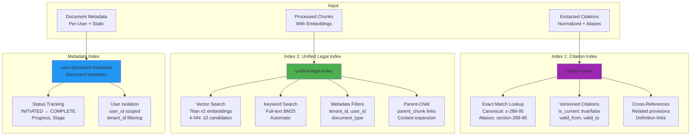

### 7.2 Document Isolation Architecture

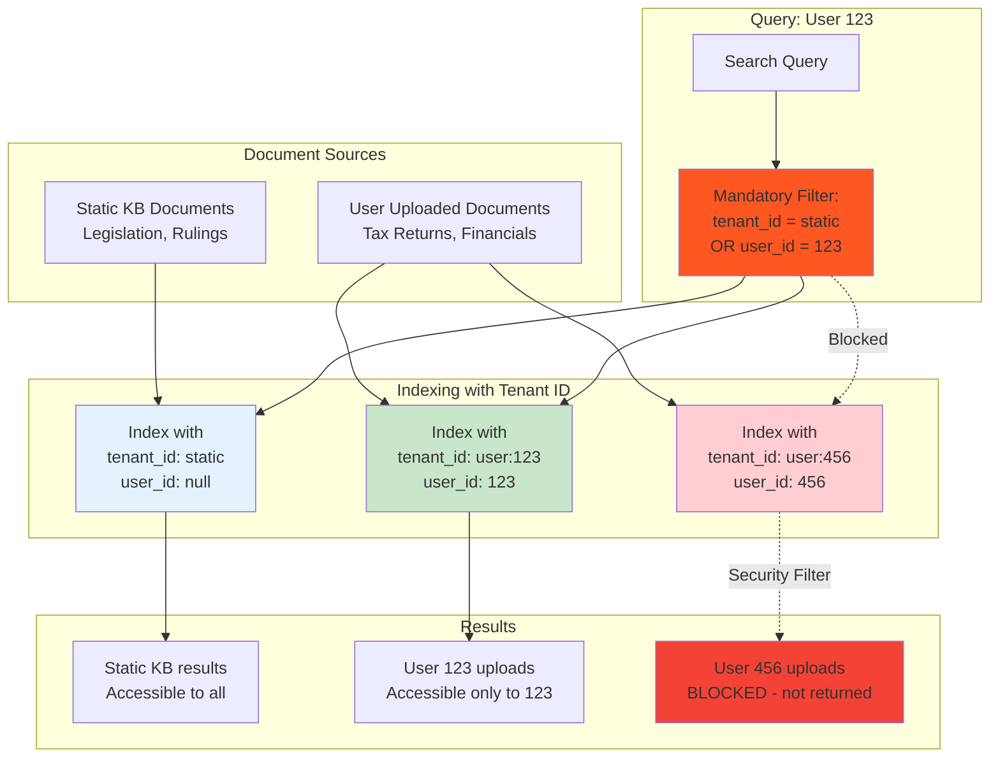

---

## 8. Citation Versioning

### 8.1 Citation Lifecycle

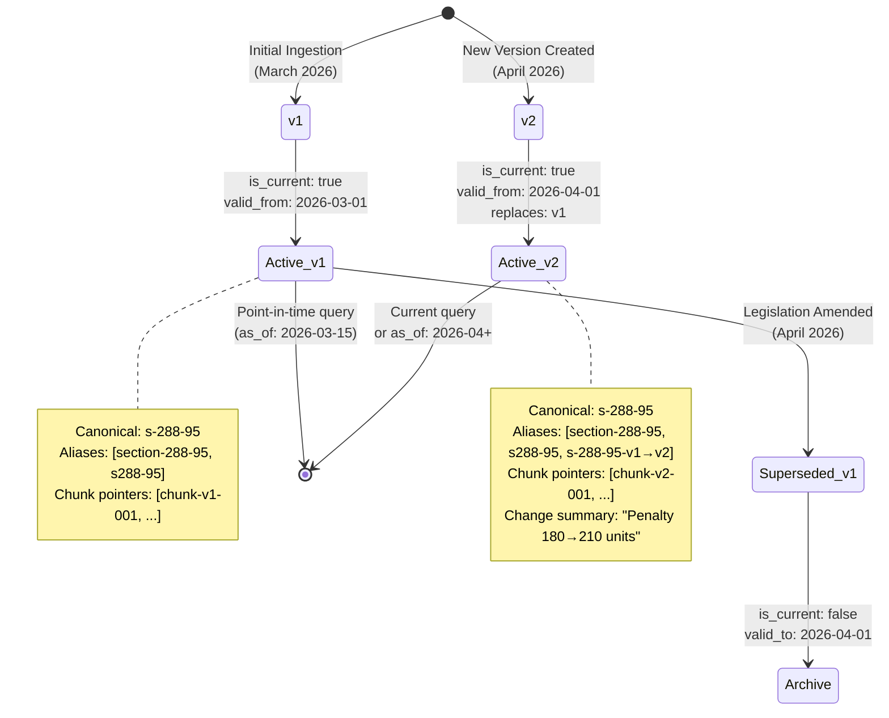

### 8.2 Citation Resolution Flow

```mermaid
graph TB
    subgraph "Query"
        USER_Q[User Query:<br/>"What is section 288-95?"]
        PARSE[Parse Citation<br/>Normalize: s-288-95]
    end

    subgraph "Resolution"
        POINT_IN_TIME{Is Point-in-Time<br/>Query?}
        CURRENT[Search for<br/>is_current: true]
        HISTORICAL[Search for<br/>valid_from <= as_of<br/>valid_to > as_or OR null]
    end

    subgraph "Result"
        CITATION[Return Citation<br/>With chunk pointers]
        ALIASES[Resolve Aliases<br/>Old → New mappings]
    end

    subgraph "Fallback"
        NOT_FOUND[Citation Not Found]
        SUGGEST[Suggest Similar<br/>Fuzzy match]
    end

    USER_Q --> PARSE
    PARSE --> POINT_IN_TIME
    POINT_IN_TIME -->|No| CURRENT
    POINT_IN_TIME -->|Yes| HISTORICAL
    CURRENT --> CITATION
    HISTORICAL --> CITATION
    CITATION --> ALIASES

    CURRENT -.Not found.-> NOT_FOUND
    HISTORICAL -.Not found.-> NOT_FOUND
    NOT_FOUND --> SUGGEST

    style CURRENT fill:#4CAF50
    style HISTORICAL fill:#FF9800
    style NOT_FOUND fill:#F44336
```

---

## 9. Error Handling & Monitoring

### 9.1 Error Handling Strategy

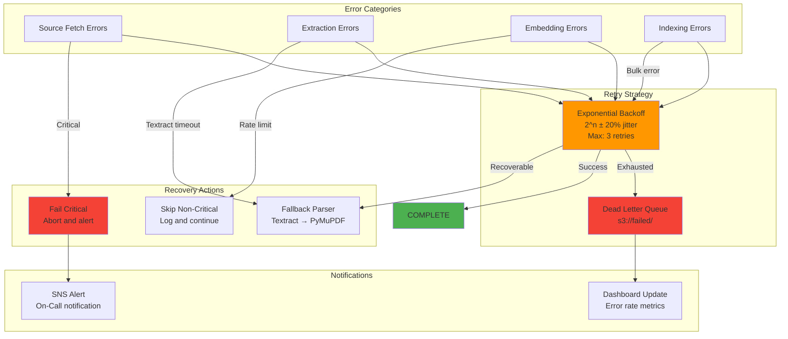

### 9.2 Monitoring Metrics

| Metric | Threshold | Alarm | Action |
|--------|-----------|-------|--------|
| **Ingestion Duration** | Static KB > 2 hours | Warning | Review job logs |
| **Ingestion Duration** | Static KB > 4 hours | Critical | Page on-call |
| **Ingestion Duration** | User upload > 5 min | Warning | Check processing |
| **Textract Error Rate** | > 5% | Warning | Review failed pages |
| **Bedrock Error Rate** | > 1% | Warning | Check quota/throttle |
| **OpenSearch Error Rate** | > 1% | Warning | Review bulk failures |
| **User Upload Failures** | > 5% | Warning | Review validation |
| **Abandoned Uploads** | > 10/hour | Warning | Check S3 events |

---

## 10. Data Deletion Workflow

### 10.1 30-Day Deletion Process

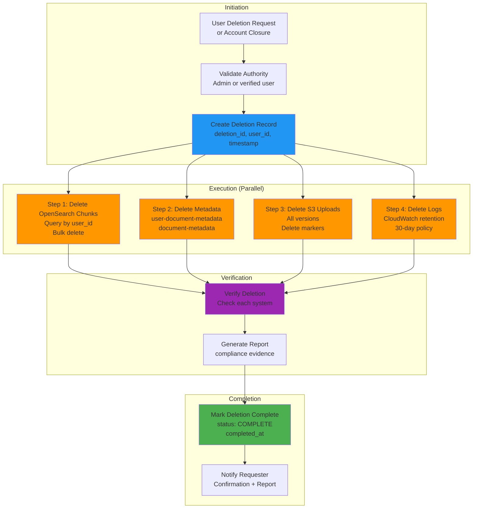

### 10.2 Deletion Verification

| System | Check Method | Success Criteria |
|--------|--------------|------------------|
| **OpenSearch Chunks** | Count query by user_id | 0 chunks |
| **OpenSearch Metadata** | Count query by user_id | 0 documents |
| **S3 Uploads** | List objects with prefix | 0 objects |
| **S3 Versions** | List object versions | 0 versions |
| **CloudWatch Logs** | Query logs | Past retention only |

---

## 11. OCR Quality Validation

### 11.1 Quality Check Flow

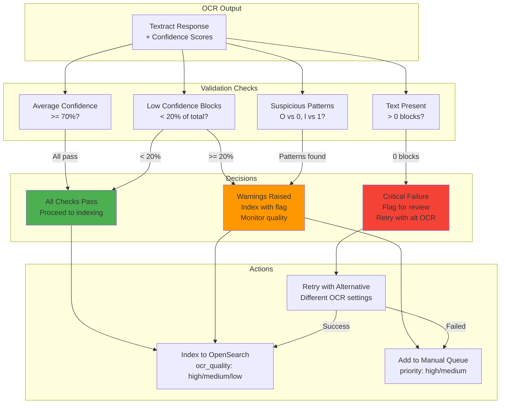

---

## 12. Full Refresh vs Incremental

### 12.1 Current Approach: Full Refresh

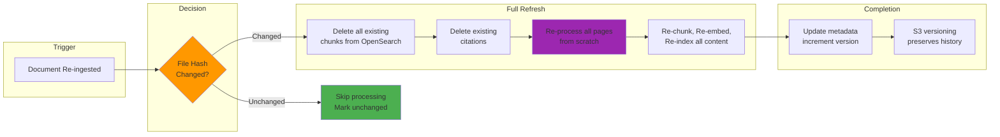

### 12.2 Incremental Strategy (Future - Phase 2)

**Trigger Criteria:**
- Monthly ingestion cost exceeds $500
- Static KB sync exceeds 4 hours consistently
- Users complain about re-upload processing time
- Static KB grows beyond 50,000 documents

**Proposed Approaches:**

| Level | Strategy | Complexity | Savings |
|-------|----------|------------|---------|
| **Document-Level** | Re-process only changed documents | Low (2-3 days) | 20-30% |
| **Page-Level** | Re-process only changed pages | Medium (1-2 weeks) | 40-50% |
| **Chunk-Level** | Re-embed only changed chunks | High (3-4 weeks) | 50-60% |

**Recommendation:** Start with document-level incremental if needed.

---

## Related Documents

- **[07-ingestion-strategies-comparison.md](./07-ingestion-strategies-comparison.md)** - Ingestion strategies and AWS service integration
- **[13-chunking-strategies.md](./13-chunking-strategies.md)** - Detailed chunking strategies for legal documents
- **[12-high-level-design.md](./12-high-level-design.md)** - Overall system architecture
- **[05-evaluation-strategy.md](./05-evaluation-strategy.md)** - Evaluation metrics and testing approaches
