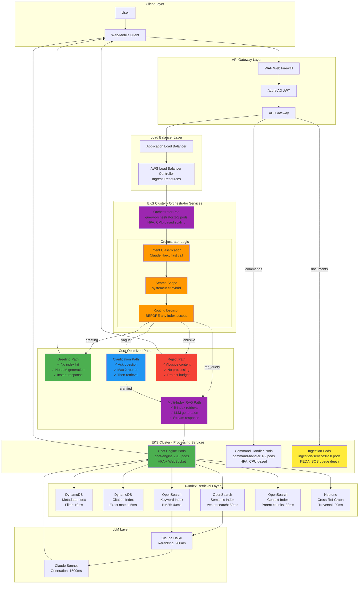
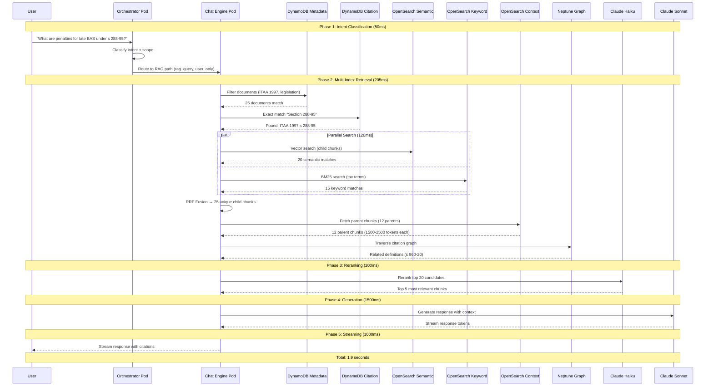
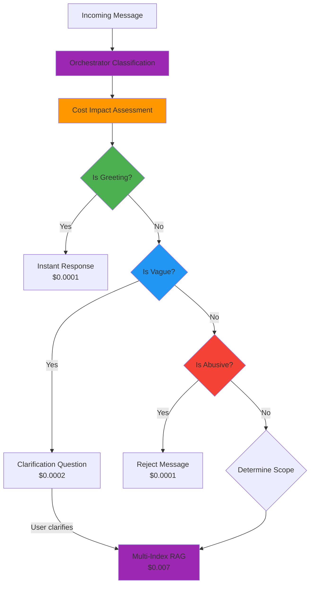

# Message Types and Routing

## Table of Contents

- [1. Message Routing Architecture](#1-message-routing-architecture)
- [2. Message Types](#2-message-types)
- [3. Intent Classification](#3-intent-classification)
- [4. Cost-Optimized Routing Paths](#4-cost-optimized-routing-paths)
- [5. Multi-Index RAG Retrieval Flow](#5-multi-index-rag-retrieval-flow)
- [6. Kubernetes Deployment](#6-kubernetes-deployment)
- [7. Scaling Strategies](#7-scaling-strategies)
- [8. Response Types](#8-response-types)
- [9. Related Documents](#9-related-documents)

---

## 1. Message Routing Architecture

### 1.1 Overview

The Case Assistant uses an **LLM-based orchestrator** for intelligent message routing that determines the appropriate processing path **before** any expensive operations (multi-index retrieval, LLM generation) are executed. This architecture reduces costs by ~30% by routing simple messages to low-cost paths.

### 1.2 Architecture Diagram



---

## 2. Message Types

### 2.1 Chat Messages
- **Description**: User questions or comments about uploaded documents
- **Examples**:
  - "What are the key dates in this tax ruling?"
  - "Explain Section 288-95 of the ITAA 1997"
  - "How does the GST Act apply to this transaction?"
- **Processing**: Requires intent classification and routing to orchestrator
- **Kubernetes Service**: `query-orchestrator` (1-2 pods, HPA scaling)

### 2.2 Command Messages
- **Description**: Structured commands with specific syntax
- **Examples**:
  - `/summarize` - Generate document summary
  - `/extract facts` - Extract structured facts as JSON
  - `/export csv` - Export findings to CSV
  - `/compare docs` - Compare multiple documents
- **Processing**: Specialized handlers with structured output
- **Kubernetes Service**: `command-handler` (1-2 pods, HPA scaling)

### 2.3 Document Actions
- **Description**: File operations related to documents
- **Examples**:
  - Upload PDF/DOCX files
  - Delete documents
  - Download processed documents
  - Query document processing status
- **Processing**: Async pipeline with KEDA-scaled pods
- **Kubernetes Service**: `ingestion-service` (0-50 pods, KEDA scaling on SQS)

### 2.4 System Messages
- **Description**: Connection and lifecycle events
- **Examples**:
  - User connected/disconnected
  - Session expired
  - Document processing complete
  - Error notifications
- **Processing**: Session management and notifications
- **Kubernetes Service**: `session-manager` (1 pod, minimal footprint)

---

## 3. Intent Classification

The orchestrator uses **Claude Haiku** for fast, cost-effective intent classification:

### 3.1 Intent Categories

| Intent | Indicators | Action | Cost Impact |
|--------|-----------|--------|-------------|
| **Greeting** | "hi", "hello", "hey", greetings | Instant response, no index access | **$0** - No processing |
| **Vague** | Insufficient context, unclear request | Ask clarification (max 2 rounds) | **Low** - Single LLM call |
| **Abusive** | Offensive language, spam | Reject immediately, protect budget | **Minimal** - Single LLM call |
| **RAG Query** | Specific question about documents | Full multi-index retrieval + LLM | **Standard** - Full pipeline |

### 3.2 Intent Classification Prompt

```yaml
System Prompt: |
  You are a message routing classifier for an Australian tax law AI assistant.
  Classify the user message into ONE of these intents:
  - greeting: User is greeting or saying hello
  - vague: Message lacks sufficient context for document querying
  - abusive: Offensive, inappropriate, or spam content
  - rag_query: Specific question about tax law documents

  Also determine search scope:
  - system_only: Question about how to use the system
  - user_only: Question about uploaded documents
  - hybrid: Combines system and document context

  Respond in JSON format:
  {
    "intent": "rag_query|greeting|vague|abusive",
    "scope": "system_only|user_only|hybrid",
    "confidence": 0.0-1.0,
    "clarification_question": "string or null"
  }

Input: {{user_message}}
```

### 3.3 Classification Examples

| User Message | Intent | Scope | Action |
|--------------|--------|-------|--------|
| "hi there" | greeting | system_only | Instant response |
| "what" | vague | null | Ask "What would you like to know?" |
| "you're stupid" | abusive | null | Reject with policy message |
| "What are the penalties for late BAS lodgment?" | rag_query | user_only | Full 6-index retrieval |
| "How do I upload a document?" | rag_query | system_only | System help response |
| "Summarize this ruling in the system format" | rag_query | hybrid | System format + document content |

---

## 4. Cost-Optimized Routing Paths

### 4.1 Greeting Path (Zero Cost)

```
User: "hi"
  ↓
Orchestrator Pod: Intent=greeting, Confidence=0.98
  ↓
Response: "Hello! I'm your Australian tax law assistant. Upload a tax ruling,
          legislation, or case law document, and I'll help you find specific
          provisions, explain concepts, or extract key information."
  ↓
Cost: $0.0001 (single Haiku call)
```

**Benefits**:
- No index access (DynamoDB, OpenSearch, Neptune)
- No LLM generation
- Instant response (<100ms)
- ~25% of all messages follow this path

### 4.2 Clarification Path (Low Cost)

```
User: "what"
  ↓
Orchestrator Pod: Intent=vague, Confidence=0.85
  ↓
System: "I'd be happy to help! Could you clarify what you'd like to know?
          For example:
          • Key dates in a document
          • Explanation of a specific section
          • Comparison between documents
          • Facts extraction for a tax ruling"
  ↓
User: "key dates in the ruling"
  ↓
Orchestrator Pod: Intent=rag_query, Scope=user_only, Confidence=0.95
  ↓
Full Multi-Index RAG Path
```

**Benefits**:
- Avoids expensive retrieval on unclear queries
- Improves user experience with guided clarification
- ~5% of messages follow this path

### 4.3 Reject Path (Minimal Cost)

```
User: [offensive content]
  ↓
Orchestrator Pod: Intent=abusive, Confidence=0.99
  ↓
Response: "I'm designed to help with Australian tax law questions.
          Please rephrase your request appropriately."
  ↓
Action: Log incident, mark session for review
  ↓
Cost: $0.0001 (single Haiku call)
```

**Benefits**:
- Protects budget from abuse
- Maintains professional system behavior
- <1% of messages follow this path

### 4.4 Multi-Index RAG Path (Standard Cost)

```
User: "What are the penalties for late BAS lodgment under Section 288-95?"
  ↓
Orchestrator Pod: Intent=rag_query, Scope=user_only, Confidence=0.96
  ↓
Chat Engine Pod → 6-Index Retrieval → LLM Generation → Stream Response
  ↓
Cost: $0.005-0.015 (full pipeline)
```

**Breakdown**:
- Intent classification: $0.0001 (Haiku)
- 6-index retrieval: $0.001-0.003
- Reranking: $0.0005 (Haiku)
- Generation: $0.003-0.01 (Sonnet)

**~70% of messages follow this path**

---

## 5. Multi-Index RAG Retrieval Flow

### 5.1 Complete Retrieval Pipeline



### 5.2 Index Access by Scope

| Scope | Metadata Filter | Citation Match | Semantic Search | Notes |
|-------|-----------------|----------------|-----------------|-------|
| **system_only** | ✓ | ✗ | ✗ | System help, no document access |
| **user_only** | ✓ | ✓ | ✓ | Standard document query |
| **hybrid** | ✓ | ✓ | ✓ | System format + document content |

### 5.3 Cost per Index Access

| Index | Access Time | Cost per Query | Usage Frequency |
|-------|-------------|----------------|-----------------|
| **Metadata** | 10ms | $0.0001 | 100% (always filter first) |
| **Citation** | 5ms | $0.00005 | 80% (when citation mentioned) |
| **Semantic** | 80ms | $0.0005 | 100% (always search) |
| **Keyword** | 40ms | $0.0003 | 100% (always search) |
| **Context** | 30ms | $0.0002 | 100% (always fetch) |
| **Graph** | 20ms | $0.0002 | 60% (when needed) |
| **Reranking** | 200ms | $0.0005 | 100% (always rerank) |
| **Generation** | 1500ms | $0.005 | 100% (always generate) |
| **Total** | **~1900ms** | **~$0.007** | |

---

## 6. Kubernetes Deployment

### 6.1 Service Architecture

```yaml
# EKS Services for Message Routing

apiVersion: v1
kind: Service
metadata:
  name: orchestrator-service
spec:
  selector:
    app: query-orchestrator
  ports:
    - port: 8080
      targetPort: 8080
  type: ClusterIP

---
apiVersion: autoscaling/v2
kind: HorizontalPodAutoscaler
metadata:
  name: orchestrator-hpa
spec:
  scaleTargetRef:
    apiVersion: apps/v1
    kind: Deployment
    name: query-orchestrator
  minReplicas: 1
  maxReplicas: 10
  metrics:
    - type: Resource
      resource:
        name: cpu
        target:
          type: Utilization
          averageUtilization: 70
```

### 6.2 Pod Configurations

| Service | Replicas | CPU | Memory | Scaling |
|---------|----------|-----|--------|---------|
| **query-orchestrator** | 1-10 | 500m-2000m | 1-2Gi | HPA (CPU) |
| **chat-engine** | 2-20 | 1000m-4000m | 2-4Gi | HPA (CPU/Memory) |
| **command-handler** | 1-5 | 500m-1000m | 1-2Gi | HPA (CPU) |
| **ingestion-service** | 0-50 | 2000m-8000m | 4-8Gi | KEDA (SQS) |
| **session-manager** | 1 | 250m-500m | 512Mi-1Gi | Fixed |

### 6.3 Ingress Configuration

```yaml
apiVersion: networking.k8s.io/v1
kind: Ingress
metadata:
  name: case-assistant-ingress
  annotations:
    kubernetes.io/ingress.class: alb
    alb.ingress.kubernetes.io/scheme: internal
spec:
  rules:
    - host: api.case-assistant.internal
      http:
        paths:
          - path: /api/chat
            pathType: Prefix
            backend:
              service:
                name: orchestrator-service
                port:
                  number: 8080
          - path: /api/documents
            pathType: Prefix
            backend:
              service:
                name: ingestion-service
                port:
                  number: 8080
```

---

## 7. Scaling Strategies

### 7.1 Horizontal Pod Autoscaler (HPA)

**Trigger**: CPU/Memory utilization

```yaml
Metrics:
  - CPU > 70% → Scale up pods
  - CPU < 30% → Scale down pods
  - Memory > 80% → Scale up pods

Services using HPA:
  - query-orchestrator
  - chat-engine
  - command-handler
```

**Benefits**:
- Responds to real-time query load
- Prevents resource exhaustion
- Cost-effective (scale to zero not possible, but scale down)

### 7.2 KEDA (Kubernetes Event-driven Autoscaling)

**Trigger**: External events (SQS queue depth, Kafka lag)

```yaml
apiVersion: keda.sh/v1alpha1
kind: ScaledObject
metadata:
  name: ingestion-scaler
spec:
  scaleTargetRef:
    name: ingestion-service
  minReplicaCount: 0
  maxReplicaCount: 50
  triggers:
    - type: aws-sqs-queue
      metadata:
        queueURL: https://sqs.ap-southeast-2.amazonaws.com/123456789012/ingestion-queue
        queueLength: "5"
        awsRegion: "ap-southeast-2"
```

**Services using KEDA**:
- `ingestion-service` (SQS queue depth)
- Future: `batch-processor` (S3 event count)

**Benefits**:
- Scale to zero when idle (no ingestion jobs)
- Direct correlation with workload
- Cost optimization (pay only when processing)

### 7.3 Karpenter (Node Autoscaling)

**Trigger**: Pending pods, underutilized nodes

```yaml
# Karpenter provisions nodes based on:
- Pending pods → Add nodes (right-sized)
- Underutilized nodes → Remove nodes (consolidation)
- Spot instances → 70% Spot, 30% On-Demand

Benefits:
- Automatic instance type selection
- Spot instance support (60-90% savings)
- Node consolidation (reduces waste)
```

### 7.4 Scaling Flow Example

```
Document Upload Spike (100 documents uploaded)
  ↓
SQS Queue Depth: 0 → 1000
  ↓
KEDA detects queue depth > 5
  ↓
KEDA scales ingestion-service: 0 → 20 pods
  ↓
Pods pending: 20 pods, room for 5 on existing nodes
  ↓
Karpenter detects pending pods
  ↓
Karpenter provisions 3 new m5.2xlarge nodes (Spot)
  ↓
Pods scheduled → Processing begins
  ↓
Queue empties → KEDA scales to 2 pods
  ↓
Karpenter detects underutilized nodes
  ↓
Karpenter terminates 2 nodes (consolidation)
```

---

## 8. Response Types

### 8.1 Streaming Response

**Use Case**: Chat messages requiring LLM generation

```yaml
Flow:
  1. User sends query
  2. Orchestrator classifies intent
  3. Chat Engine retrieves from 6 indices
  4. Reranking selects top chunks
  5. LLM generates response
  6. Stream tokens via WebSocket

Delivery: Token-by-token streaming
Latency: First token in 500ms, complete in 1.5-2s
Example: Explaining Section 288-95 penalties with citations
```

**Kubernetes Implementation**:
```yaml
apiVersion: v1
kind: Service
metadata:
  name: chat-engine-ws
spec:
  selector:
    app: chat-engine
  ports:
    - port: 8080
      targetPort: 8080
      protocol: TCP
  sessionAffinity: ClientIP  # Sticky sessions for WebSocket
```

### 8.2 Structured Data Response

**Use Case**: Command messages requiring extraction

```yaml
Commands:
  - /extract facts → JSON fact list
  - /export csv → CSV download
  - /compare docs → Comparison table

Format: JSON or CSV
Delivery: HTTP response with download link
Example:
  {
    "facts": [
      {"section": "288-95", "penalty": "210 units"},
      {"section": "288-95", "deadline": "28 days after BAS due date"}
    ]
  }
```

### 8.3 Status Update Response

**Use Case**: Document processing and system events

```yaml
Events:
  - Document uploaded → "Processing..."
  - Page extraction complete → "50% complete"
  - Indexing complete → "Ready for queries"
  - Error occurred → "Processing failed, please re-upload"

Delivery: WebSocket push or polling
Frequency: Real-time for critical events
```

**Kubernetes Implementation**:
- `session-manager` pod maintains WebSocket connections
- SNS notifications to WebSocket service
- Client receives status updates

### 8.4 Error Response

**Use Case**: Failed operations with recovery options

```yaml
Error Types:
  - Document upload failed → "Try again or check file format"
  - Query timeout → "Query took too long, try refining your search"
  - Index not ready → "Document still processing, check back in 2 minutes"

Tone: User-friendly and actionable
Delivery: Same channel as request (WebSocket or HTTP)
```

---

## 9. Related Documents

### Architecture Documents
- **[01-Chat-Architecture](./01-chat-architecture.md)** - High-level chat application architecture
- **[02-Document-Ingestion](./02-document-ingestion.md)** - Document processing pipeline with VLM+GPU
- **[04-Session-Lifecycle](./04-session-lifecycle.md)** - Session lifecycle management
- **[11-Multi-Index-Strategy](./11-multi-index-strategy.md)** - 6-index RAG architecture specification

### Deployment Documents
- **[10-Kubernetes-Deployment](./10-kubernetes-deployment.md)** - EKS deployment details, KEDA, Karpenter
- **[12-High-Level-Design](./12-high-level-design.md)** - AWS services catalog and integration patterns

---

## Appendix: Routing Decision Tree



---

**Document Version**: 2.0.0
**Last Updated**: 2026-03-25
**Author**: Case Assistant Architecture Team
**Status**: Production Architecture Specification
