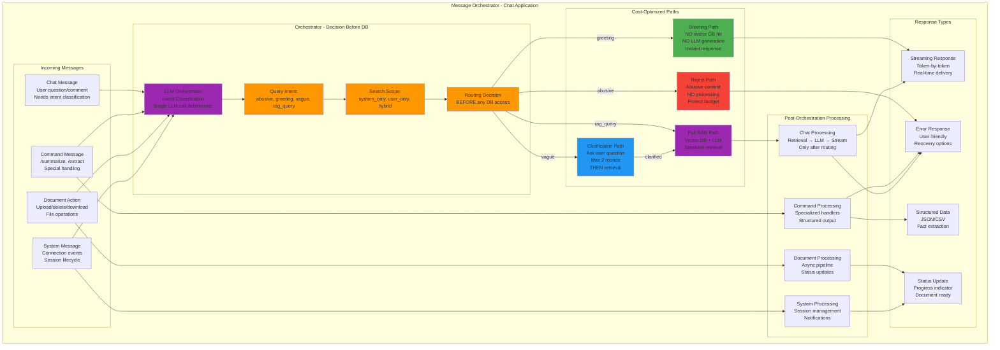
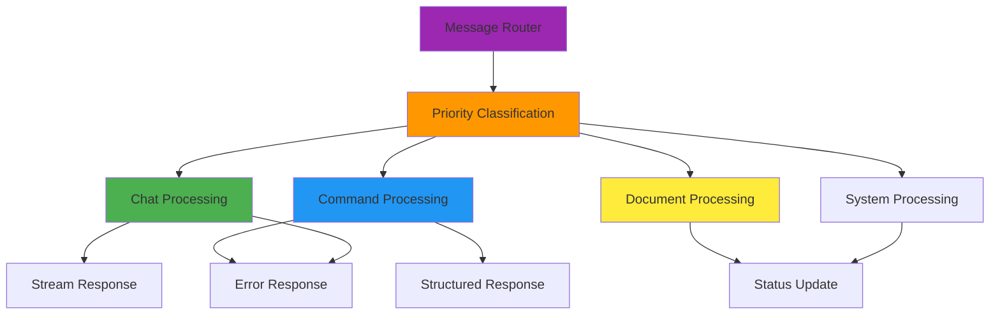

# Message Types and Routing

## 1.4 Message Types and Routing



---

## What is an Orchestrator?

An **Orchestrator** is a message routing component that uses LLM-based intent classification to determine the appropriate processing path **before** any expensive operations (vector DB queries, LLM generation) are executed.

### Key Characteristics

| Aspect | Description |
|--------|-------------|
| **Decision Point** | First component that processes every incoming message |
| **Single LLM Call** | Determines intent + scope + routing in one efficient call |
| **Cost Optimization** | Routes ~30% of messages to low-cost paths (greetings, clarifications) |
| **Pre-DB Classification** | Makes routing decisions BEFORE hitting vector database |
| **Not an Agent** | It's a router/classifier, not an autonomous decision-maker |

### Orchestrator vs Agent

| Orchestrator | Agent |
|--------------|-------|
| Routes messages based on intent | Makes autonomous decisions |
| Single decision point per message | Multi-step reasoning chains |
| Pre-determined paths | Dynamic behavior |
| Fast, predictable | Slower, exploratory |
| Best for: Chat applications | Best for: Complex workflows |

---

## Message Types

### 1. Chat Messages
- **Description**: User questions or comments about documents
- **Examples**: "What are the key dates?", "Explain this section"
- **Processing**: Requires intent classification and routing

### 2. Command Messages
- **Description**: Structured commands with specific syntax
- **Examples**: `/summarize`, `/extract facts`, `/export csv`
- **Processing**: Specialized handlers with structured output

### 3. Document Actions
- **Description**: File operations related to documents
- **Examples**: Upload, delete, download documents
- **Processing**: Async pipeline with status updates

### 4. System Messages
- **Description**: Connection and lifecycle events
- **Examples**: User connected, session expired, error notifications
- **Processing**: Session management and notifications

---

## Intent Classification

The orchestrator classifies messages into one of four intents:

### 1. Greeting
- **Indicators**: "hi", "hello", "hey", greetings
- **Action**: Instant response, no vector DB query, no LLM generation
- **Example Response**: "Hello! How can I help you today?"

### 2. Vague
- **Indicators**: Insufficient context, unclear request
- **Action**: Ask clarification question (max 2 rounds)
- **Example**: User says "what" → System asks "What would you like to know about the document?"

### 3. Abusive
- **Indicators**: Offensive language, spam, inappropriate content
- **Action**: Reject immediately, no processing
- **Example Response**: "I'm here to help with tax law questions. Please rephrase your request."

### 4. RAG Query
- **Indicators**: Specific question about uploaded documents
- **Action**: Full retrieval-augmented generation path
- **Processing**: Vector DB search → LLM generation → Streaming response

---

## Cost-Optimized Paths

### Greeting Path
```
User: "hi"
  ↓
Orchestrator: Intent=greeting
  ↓
Response: "Hello! How can I help?"
  ↓
Cost: $0 (no vector DB, no LLM generation)
```

### Clarification Path
```
User: "what"
  ↓
Orchestrator: Intent=vague
  ↓
System: "What would you like to know about the document?"
  ↓
User: "key dates"
  ↓
Orchestrator: Intent=rag_query (now clarified)
  ↓
Full RAG processing
```

### Reject Path
```
User: [offensive content]
  ↓
Orchestrator: Intent=abusive
  ↓
Response: "Please rephrase your request appropriately."
  ↓
Cost: Minimal (single orchestrator call)
```

### RAG Path (Standard)
```
User: "What are the key tax dates?"
  ↓
Orchestrator: Intent=rag_query, Scope=user_only
  ↓
Vector DB search → LLM generation → Stream response
  ↓
Cost: Standard (vector DB + LLM)
```

---

## Search Scope Classification

The orchestrator also determines the appropriate search scope:

| Scope | Description | When Used |
|-------|-------------|-----------|
| **system_only** | Query about system features | "How do I upload a document?" |
| **user_only** | Query about uploaded documents | "What are the key dates in this case?" |
| **hybrid** | Combines system and document context | "Summarize this document using the system's format" |

---

## Response Types

### 1. Streaming Response
- **Use Case**: Chat messages requiring LLM generation
- **Delivery**: Token-by-token streaming
- **Example**: Explaining a tax law concept

### 2. Structured Data
- **Use Case**: Command messages requiring extraction
- **Format**: JSON or CSV
- **Example**: `/extract facts` returns structured fact list

### 3. Status Update
- **Use Case**: Document processing and system events
- **Content**: Progress indicators, completion notifications
- **Example**: "Document processed and ready for queries"

### 4. Error Response
- **Use Case**: Failed operations with recovery options
- **Tone**: User-friendly and actionable
- **Example**: "Document upload failed. Please try again or contact support."

---

## Routing Flow Summary



---

## Related Documents

- **[01-chat-architecture.md](./01-chat-architecture.md)** - Chat application architecture
- **[04-session-lifecycle.md](./04-session-lifecycle.md)** - Session lifecycle management
- **[06-core-components.md](./06-core-components.md)** - Component descriptions
