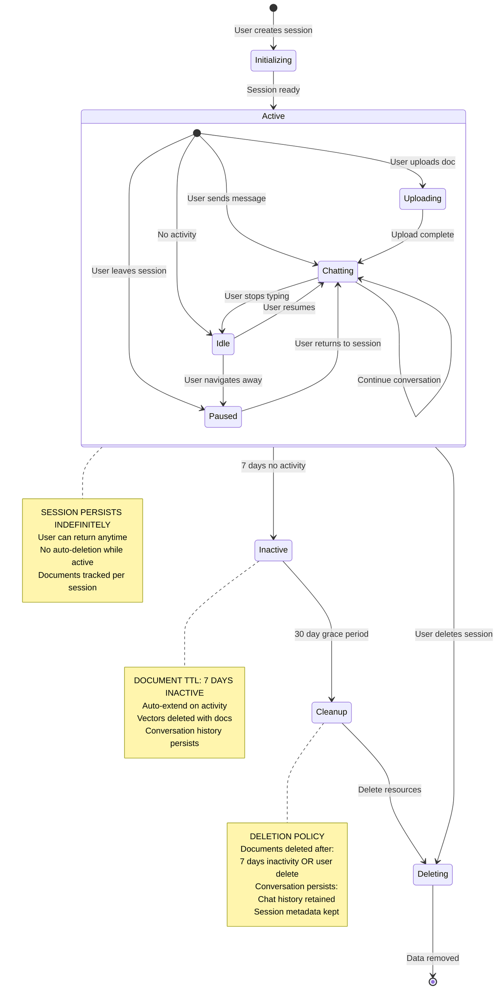
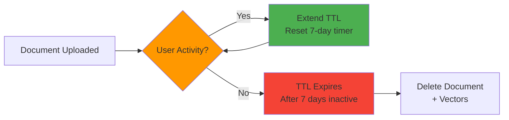
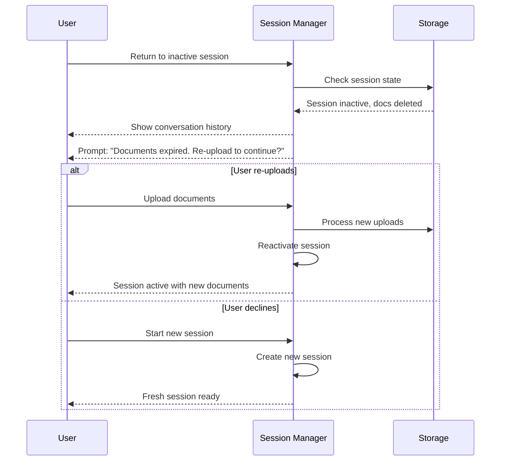
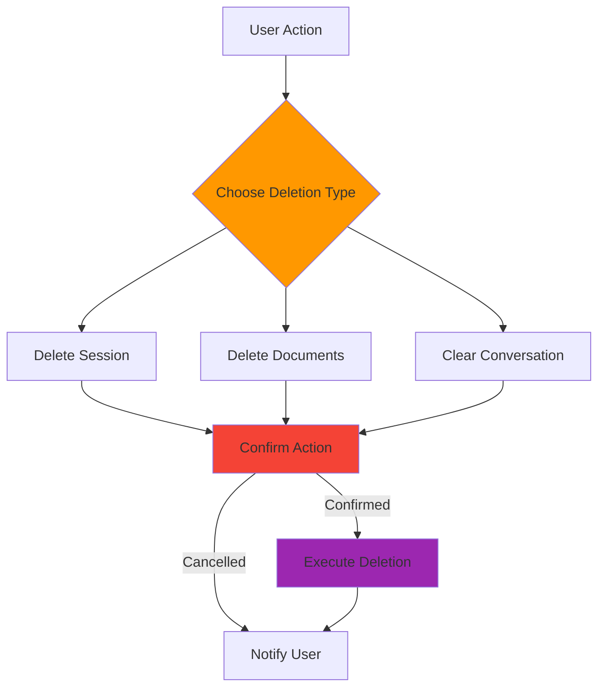

# Session Lifecycle

## 1.5 Session Lifecycle (Conceptual)

---

## Session States

### Initializing
- **Trigger**: User creates new session
- **Actions**:
  - Generate unique session ID
  - Initialize session storage
  - Set up per-session resources
  - Create conversation history
- **Next State**: Active (when ready)

### Active
The session is active and ready for user interaction.

#### Sub-states:

**Uploading**
- **Trigger**: User uploads document
- **Actions**:
  - Validate file
  - Store document
  - Trigger ingestion pipeline
  - Update status
- **Next State**: Chatting (when upload complete)

**Chatting**
- **Trigger**: User sends message
- **Actions**:
  - Process message through orchestrator
  - Execute retrieval and generation
  - Store conversation turn
  - Stream response
- **Next State**: Chatting (continue), Idle (stop), or Paused (leave)

**Idle**
- **Trigger**: No activity for configurable period
- **Actions**:
  - Monitor for activity
  - Track idle duration
- **Next State**: Chatting (user resumes) or Paused (user leaves)

**Paused**
- **Trigger**: User navigates away or closes connection
- **Actions**:
  - Maintain session state
  - Wait for user return
- **Next State**: Chatting (user returns) or Inactive (timeout)

### Inactive
- **Trigger**: 7 days of no activity
- **Actions**:
  - Mark session as inactive
  - Begin document TTL countdown
  - Retain conversation history
- **Next State**: Cleanup (after 30-day grace period) or Active (user returns)

### Cleanup
- **Trigger**: 30-day grace period expires
- **Actions**:
  - Prepare for deletion
  - Finalize data export (if applicable)
  - Schedule resource cleanup
- **Next State**: Deleting

### Deleting
- **Trigger**: Manual delete or cleanup completion
- **Actions**:
  - Delete vectors from vector store
  - Delete documents from storage
  - Purge metadata
  - Archive conversation history (optional)
- **Next State**: [*] (termination)

---

## Session Persistence Model

### Sessions vs Documents

| Aspect | Session | Documents |
|--------|---------|-----------|
| **Lifetime** | Indefinite (while active) | 7-day inactivity TTL |
| **User Control** | Can view and return anytime | Auto-deleted after TTL |
| **Deletion** | Manual only | Automatic or manual |
| **Content** | Conversation history, metadata | Uploaded files, vectors |
| **Recovery** | Can resume after inactivity | Must re-upload after deletion |

### Data Retention Rules

#### What Persists Indefinitely
- ✅ Conversation history (messages exchanged)
- ✅ Session metadata (creation date, user info)
- ✅ Session settings and preferences
- ✅ Query and response logs (for analytics)

#### What Has 7-Day TTL
- ⏰ Uploaded documents (files in S3)
- ⏰ Document vectors (embeddings in vector store)
- ⏰ Document metadata (processing status, chunks)
- ⏰ Cached retrieval results

#### What's Deleted Immediately
- ❌ Temporary processing artifacts
- ❌ Intermediate chunking results
- ❌ Failed upload attempts

---

## Document TTL Behavior

### Auto-Extend on Activity

### Activity That Extends TTL
- User sends a message
- User queries the document
- User views the document
- User uploads a new document
- User returns to the session

### TTL Expiration Process
1. Document marked for deletion
2. Vectors removed from vector store
3. File removed from document storage
4. Metadata purged from metadata store
5. Conversation history preserved (messages remain visible)

---

## Session Recovery

### Returning to Inactive Session

### User Experience
- **Inactive Session**: User sees past conversation but documents are gone
- **Recovery Option**: User can re-upload documents to continue where they left off
- **New Session**: User can always start fresh
- **No Data Loss**: Conversation history is always preserved

---

## Grace Period

### 30-Day Grace Period
After documents are deleted (7-day TTL), the session enters a 30-day grace period:

| Day | State | Documents | Conversation | Action |
|-----|-------|-----------|--------------|--------|
| 0-7 | Active | Available | Available | Normal use |
| 7 | Inactive | Deleted | Available | Can re-upload |
| 7-37 | Grace Period | Deleted | Available | Recovery window |
| 37 | Cleanup | Deleted | Archived | Session closed |

### Grace Period Purpose
- Allows users to recover documents before final cleanup
- Provides buffer for accidental inactivity
- Enables data export if needed
- Maintains conversation history for compliance

---

## Manual Deletion

### User-Initiated Deletion

Users can manually delete at any time:

#### Delete Session
- Removes all data (conversation + documents)
- Immediate, irreversible
- Confirmation required

#### Delete Documents
- Removes documents only
- Conversation history preserved
- Can re-upload to continue

#### Clear Conversation
- Removes messages only
- Documents remain available
- Fresh conversation start

### Deletion Flow

---

## Compliance Considerations

### Data Deletion Requirements
- **Right to be Forgotten**: Users can delete all data
- **Session Isolation**: No data leakage between sessions
- **Retention Policy**: 7-day document TTL enforced
- **Audit Trail**: Deletion events logged for compliance

### Security Measures
- **Authentication**: Only session owner can delete
- **Authorization**: Delete operations verified
- **Logging**: All deletions logged with timestamp
- **Verification**: Post-deletion verification confirms cleanup

---

## Related Documents

- **[01-chat-architecture.md](./01-chat-architecture.md)** - Chat application architecture
- **[03-message-routing.md](./03-message-routing.md)** - Message routing and orchestrator
- **[05-evaluation-strategy.md](./05-evaluation-strategy.md)** - Compliance evaluation
- **[06-core-components.md](./06-core-components.md)** - Component descriptions
