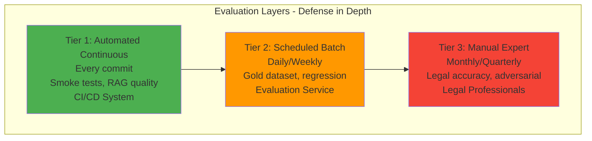
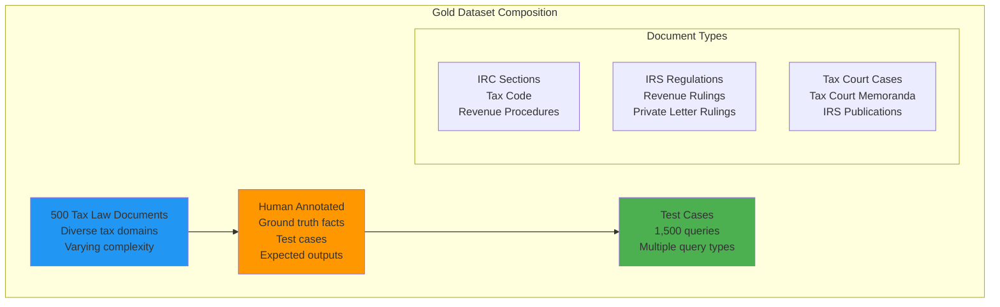
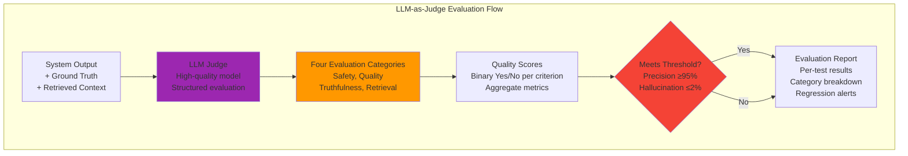
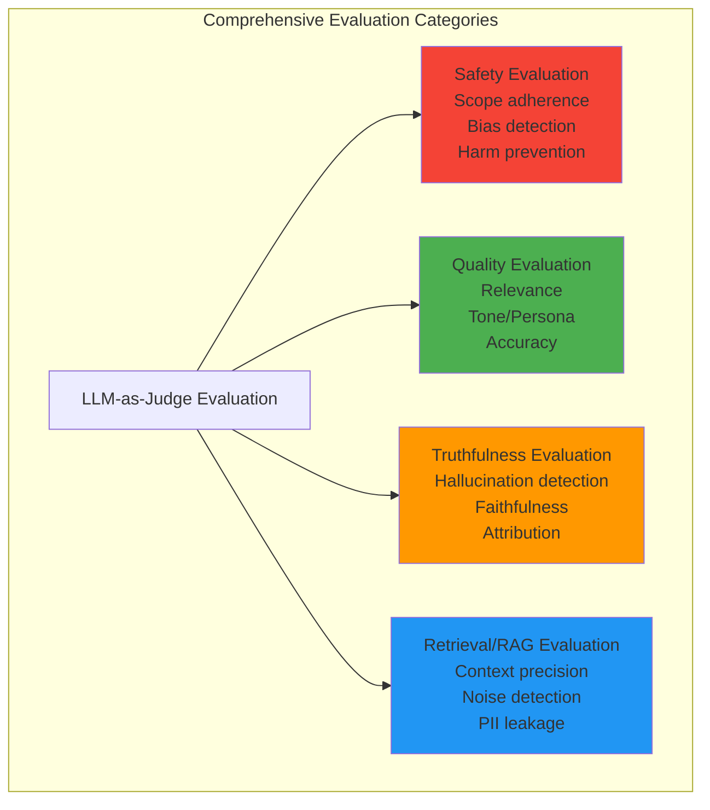
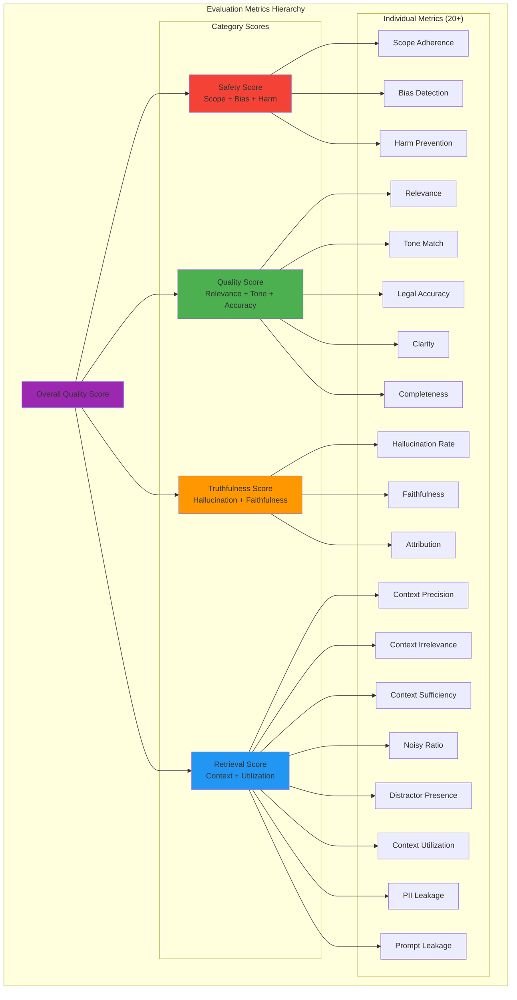
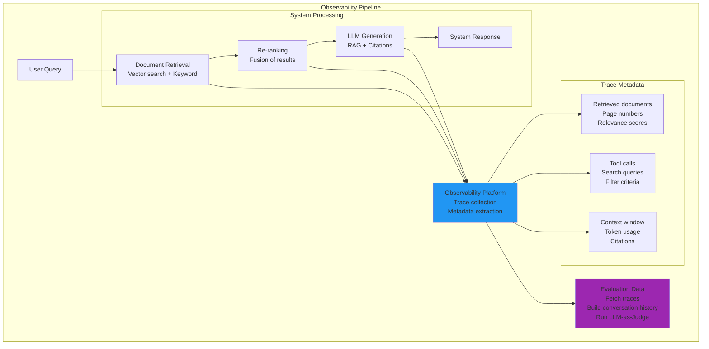
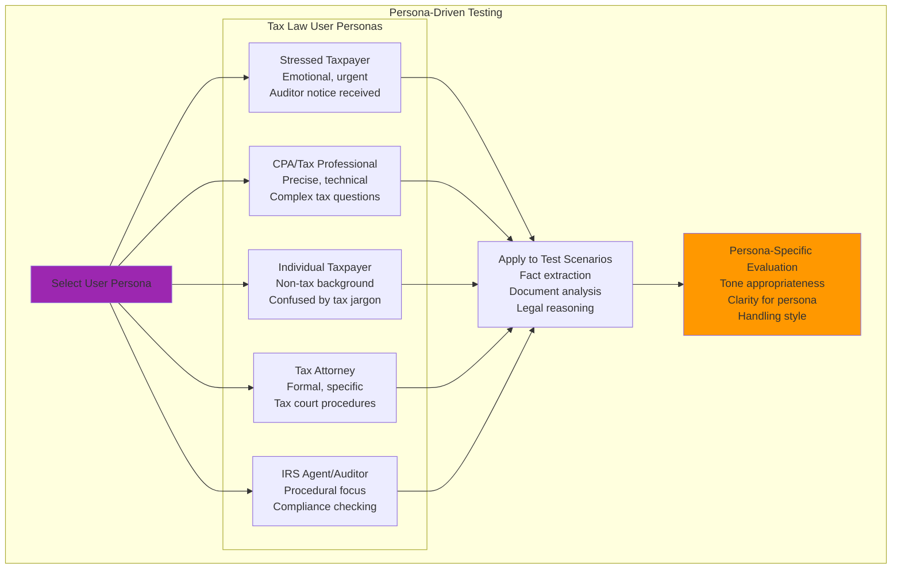
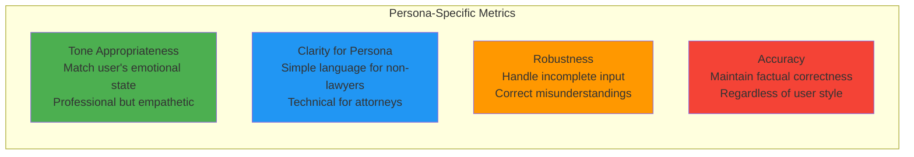
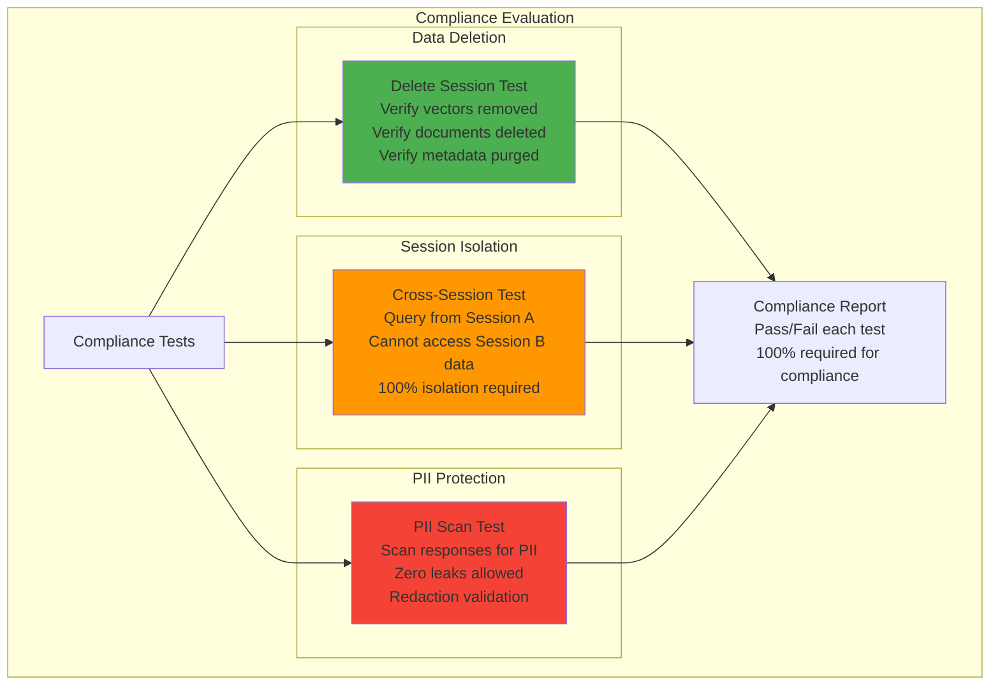

# Evaluation Strategy

## 1.6 Evaluation Strategy (Conceptual)

Evaluation ensures the **tax law AI system** produces accurate, trustworthy, and compliant outputs. Tax law AI requires a **defensive, attribution-first** approach where errors can result in incorrect tax advice, penalties, or legal liability.

---

## Evaluation Philosophy

| Aspect | General Chatbot | Tax Law AI |
|--------|----------------|-------------|
| **Error Impact** | User inconvenience | Incorrect tax advice, IRS penalties, legal liability |
| **Attribution** | Optional | Mandatory (IRC sections, tax court citations required) |
| **Accuracy** | ~80-90% acceptable | ≥95% required (tax codes are precise) |
| **Hallucinations** | Minor annoyance | Zero tolerance (cannot invent tax laws) |
| **Testing** | Basic QA tests | Multi-layered validation against tax code |

---

## Three-Tier Evaluation Model



### Tier Comparison

| Tier | Frequency | Scope | Owner | Pass Criteria |
|------|-----------|-------|-------|--------------|
| **Tier 1: Automated Continuous** | Every commit | Smoke tests, basic RAG quality | CI/CD System | 100% tests pass, precision ≥90% |
| **Tier 2: Scheduled Batch** | Daily/Weekly | Gold dataset, regression testing | Evaluation Service | Precision ≥95%, recall ≥90% |
| **Tier 3: Manual Expert** | Monthly/Quarterly | Legal accuracy, edge cases | Legal Professionals | Qualitative approval |

---

## Gold Dataset Approach

The **Gold Dataset** provides ground truth for systematic evaluation:



### Gold Dataset Characteristics

| Characteristic | Value |
|----------------|-------|
| **Total Documents** | 500 tax law documents |
| **Test Cases** | ~1,500 (3 per document) |
| **Tax Law Domains** | Federal tax code, IRS regulations, Tax court cases, State tax codes |
| **Document Types** | IRC sections, Revenue Rulings, Tax Court opinions, IRS forms, Private letter rulings |
| **Complexity Levels** | Simple (40%), Medium (40%), Complex (20%) |
| **Annotation** | 100% human-verified by tax professionals |
| **Ground Truth Facts** | ~10,000 facts (tax sections, regulations, case citations, tax amounts, deadlines) |

---

## LLM-as-Judge Framework

**Concept**: Use a high-quality LLM to evaluate system outputs against ground truth with **strict content confinement**.



### Four Evaluation Categories



### LLM Judge Responsibilities

#### 1. Safety Evaluation
- **Scope Adherence**: Does response stay within tax law domain (IRC, regulations, tax court)?
- **Bias & Harm**: Detect harmful bias in tax advice
- **Tax Advice Boundaries**: Ensure appropriate disclaimers (not professional tax advice)
- **Sensitive Topics**: Handle audits, penalties, tax debt appropriately

#### 2. Quality Evaluation
- **Relevance**: Directly relevant to user's tax question
- **Tone/Persona**: Professional, empathetic, tax-appropriate
- **Accuracy**: Tax-law sound advice (IRC citations, regulations)
- **Clarity**: Understandable to non-tax professionals
- **Completeness**: Addresses user's tax question fully

#### 3. Truthfulness Evaluation
- **Hallucination Detection** (3 types):
  - New facts not in source documents
  - Contradictions to source material
  - Fabricated legal citations
- **Faithfulness**: Response entirely based on retrieved facts
- **Attribution**: All claims properly sourced

#### 4. Retrieval/RAG Evaluation
- **Context Precision**: Enough relevant information retrieved
- **Context Irrelevance**: No significant irrelevant chunks
- **Context Sufficiency**: Information sufficient for complete answer
- **Noisy Ratio**: Noise doesn't interfere with understanding
- **Distractor Presence**: No semantically similar but incorrect chunks
- **Context Utilization**: Active use of provided context
- **PII Leakage**: Retrieved context doesn't expose PII
- **Prompt Leakage**: Response doesn't repeat system instructions

### Judge Question Schema

```json
{
  "type": "question",
  "question": "STRICTLY CONFINE YOUR EVALUATION to the content of the system_response. Does the response introduce any facts not present in the retrieved_context?",
  "category": "Truthfulness",
  "expected_answer": "No",
  "required_content": ["system_response", "retrieved_context"],
  "rationale": "Tax law AI must not hallucinate tax codes, regulations, or case law"
}
```

### Binary Yes/No Scale
- Every judge question has binary Yes/No answer
- Declared `expected_answer` for automated scoring
- Strict content confinement prevents external knowledge leakage

---

## Key Evaluation Metrics

### Comprehensive Metric Hierarchy



### Operational Metrics

| Metric | Target | Rationale |
|--------|--------|-----------|
| **Session Creation Success** | ≥99.9% | Core functionality must work |
| **Query Response Time (p95)** | <3 seconds | User experience |
| **Document Ingestion Success** | ≥99% | Users must be able to upload documents |

### Compliance Metrics

| Metric | Target | Rationale |
|--------|--------|-----------|
| **Data Deletion Compliance** | 100% | Legal requirement |
| **Session Isolation** | 100% | Security requirement |
| **PII Leakage** | 0 incidents | Privacy requirement |

---

## Observability and Trace Collection

**Concept**: Capture detailed traces of every query to understand what the system retrieved, how it processed information, and where it may have failed.



### Trace Metadata Collected

| Metadata Type | What It Captures | Evaluation Value |
|---------------|------------------|------------------|
| **Retrieved Documents** | Document IDs, page numbers, relevance scores | Evaluate retrieval quality |
| **Tool Calls** | Search queries, filters, database operations | Understand what system searched for |
| **Context Window** | Token usage, context size, truncation | Detect context overflow |
| **Citations** | Source locations, page references | Validate citation accuracy |
| **Timing** | Latency per component, total response time | Performance optimization |
| **Errors** | Failures, retries, fallbacks | Identify reliability issues |

---

## Test Case Categories

### Query Types

| Query Type | Description | Example | Evaluation Focus |
|------------|-------------|---------|------------------|
| **Fact Extraction** | Extract specific tax facts | "What are the key tax dates?" | Precision, Recall |
| **Summary** | Document summary | "Summarize this Tax Court opinion" | Completeness, Accuracy |
| **Cross-Document** | Multi-document queries | "Compare Section 199A and Section 162" | Synthesis, Citations |
| **Tax Law Reasoning** | Tax analysis | "What are the requirements for this deduction?" | Tax accuracy |
| **Adversarial** | Edge cases, attacks | "What if I don't report this income?" | Robustness, Hallucinations |

---

## Persona-Driven Stress Testing

**Concept**: Simulate different user communication styles to test system robustness and adaptability.



### Persona Definitions for Tax Law AI

| Persona | Communication Style | Tests |
|---------|---------------------|-------|
| **Stressed Taxpayer** | Emotional, rushed, typos, incomplete | Can system extract facts from audit notice? |
| **CPA/Tax Professional** | Precise, tax terminology, complex | Can system handle technical tax questions? |
| **Individual Taxpayer** | Non-tax background, confused by jargon | Can system explain tax concepts simply? |
| **Tax Attorney** | Formal, specific, tax court procedures | Does system provide proper procedural guidance? |
| **IRS Agent/Auditor** | Procedural focus, compliance checking | Does system handle audit-related queries accurately? |
| **Efficient User** | Brief, direct, minimal context | Can system work with minimal information? |
| **Verbose User** | Long-winded, story-telling | Can system extract key tax facts from narrative? |
| **Skeptical User** | Challenging, adversarial | Does system maintain composure and accuracy? |
| **Multi-Document User** | References many tax forms/cases | Can system synthesize across documents? |
| **Follow-up User** | Asks series of related tax questions | Does system maintain context? |

### Persona-Based Evaluation Criteria



### Example Persona Test

| Persona | User Query | System Should |
|---------|-----------|--------------|
| **Stressed Taxpayer** | "I got an IRS audit notice wat do I do HELP" | Calm response, extract notice details, explain audit process |
| **CPA** | "What are the Section 199A deduction limitations for specified service trades?" | Technical tax analysis, precise IRC citations |
| **Individual Taxpayer** | "I don't understand 'adjusted gross income' - what is it?" | Simple explanation, examples, plain language |
| **Tax Attorney** | "Cite controlling precedent for the economic substance doctrine in tax court" | Formal response, precise tax court citations |
| **IRS Agent** | "What documentation supports this Schedule C deduction?" | Procedural response, documentation requirements, compliance standards |

---

## Compliance Evaluation

Tax law AI systems must validate compliance requirements:



### Compliance Requirements

| Requirement | Test Method | Pass Criteria |
|-------------|-------------|---------------|
| **Data Deletion** | Delete session, verify cleanup | 0 vectors, 0 documents, 0 metadata remain |
| **Session Isolation** | Cross-session queries | 0% data leakage between sessions |
| **PII Protection** | PII scan on responses | 0 PII leaks |
| **Retention Policy** | Verify 7-day document TTL | Documents auto-deleted after inactivity |

---

## Evaluation-Driven Development

### Development Workflow

1. **Write Test Case First**
   - Define query and expected output
   - Add to gold dataset
   - Establish baseline metrics

2. **Implement Feature**
   - Build functionality
   - Run automated evaluation (Tier 1)

3. **Validate Against Gold Dataset**
   - Run LLM-as-Judge evaluation
   - Verify metrics meet thresholds
   - Fix regressions

4. **Manual Review (Critical Features)**
   - Legal professional review
   - Adversarial testing
   - Edge case validation

### Regression Prevention

- Every commit runs Tier 1 tests
- Daily runs full gold dataset (Tier 2)
- Any degradation blocks deployment
- Trends tracked over time
- Manual review for significant changes

---

## Related Documents

- **[01-chat-architecture.md](./01-chat-architecture.md)** - Chat application architecture
- **[06-core-components.md](./06-core-components.md)** - Component descriptions
- **[../evaluation_strategy.md](../evaluation_strategy.md)** - Detailed evaluation framework
