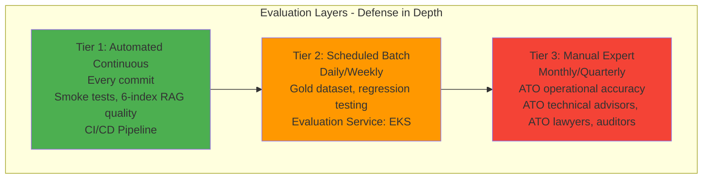
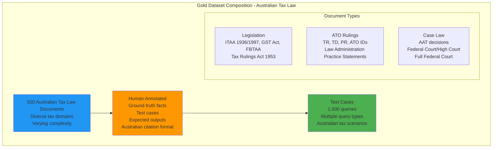
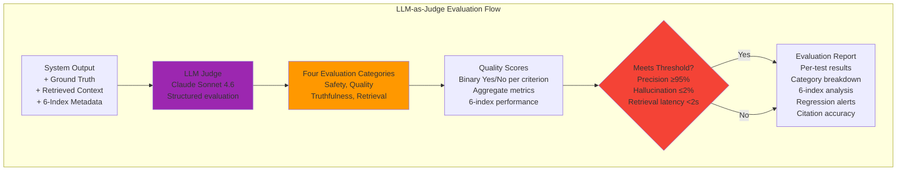
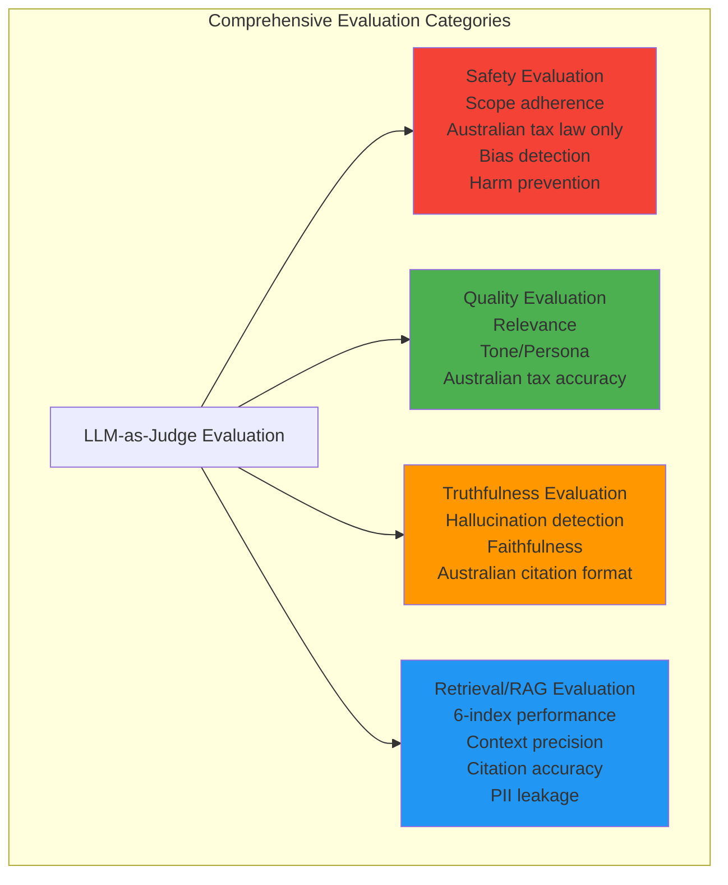
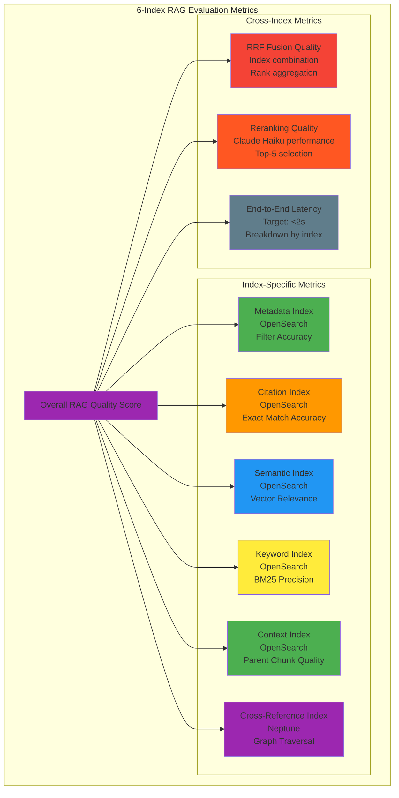
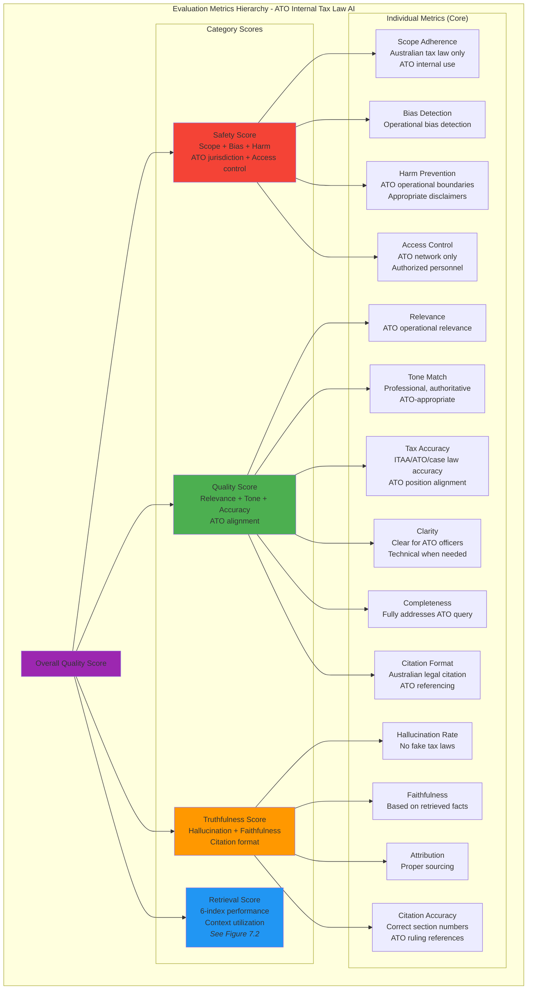
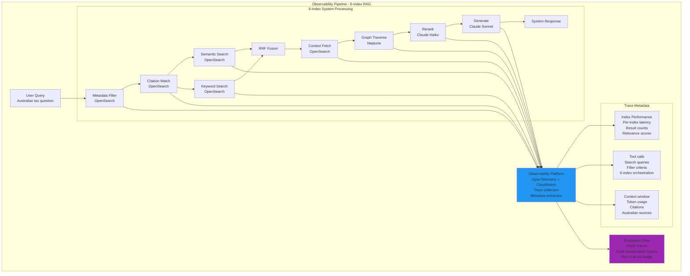
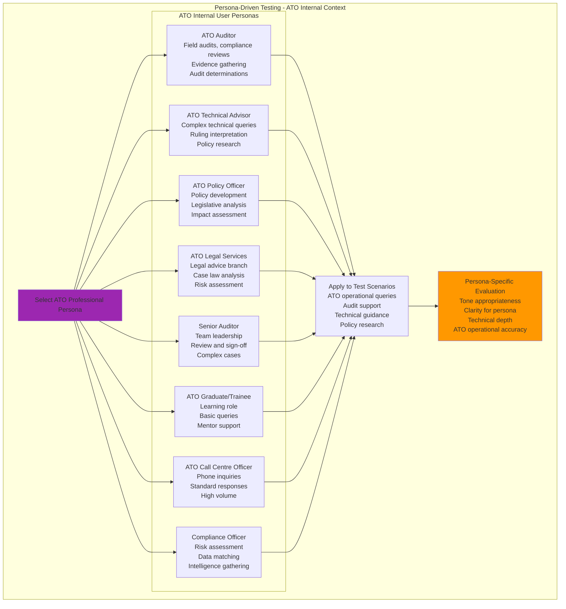
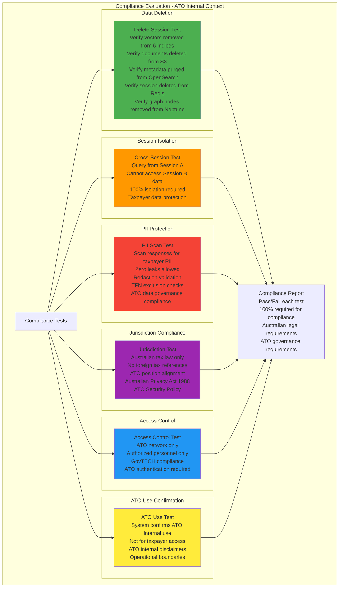

# Evaluation Strategy

## Table of Contents

- [1. Overview](#1-overview)
- [2. Evaluation Philosophy](#2-evaluation-philosophy)
- [3. Three-Tier Evaluation Model](#3-three-tier-evaluation-model)
- [4. Gold Dataset Approach](#4-gold-dataset-approach)
- [5. LLM-as-Judge Framework](#5-llm-as-judge-framework)
- [6. Multi-Index RAG Evaluation](#6-multi-index-rag-evaluation)
- [7. Key Evaluation Metrics](#7-key-evaluation-metrics)
- [8. Observability and Trace Collection](#8-observability-and-trace-collection)
- [9. Test Case Categories](#9-test-case-categories)
- [10. Persona-Driven Stress Testing](#10-persona-driven-stress-testing)
- [11. Compliance Evaluation](#11-compliance-evaluation)
- [12. Evaluation Service Deployment](#12-evaluation-service-deployment)
- [13. Related Documents](#13-related-documents)

---

## 1. Overview

Evaluation ensures the **Australian Taxation Office (ATO) Internal AI System** produces accurate, trustworthy, and compliant outputs for **ATO professional use only**. This system is designed exclusively for **internal ATO operations** - assisting ATO officers, auditors, technical advisors, and policy makers in their official duties. Tax law AI requires a **defensive, attribution-first** approach where errors can result in incorrect ATO determinations, flawed audit decisions, or administrative errors under Australian tax law.

**IMPORTANT**: This system is **NOT for taxpayer use**. It is an **internal ATO professional tool** for authorized ATO personnel only.

**Domain Scope**: This system is designed **exclusively for Australian taxation law**:
- **Legislation**: ITAA 1936, ITAA 1997, GST Act, FBTAA, Taxation Administration Act 1953
- **ATO Rulings**: Taxation Rulings (TR), Determinations (TD), Product Rulings (PR)
- **Case Law**: AAT decisions, Federal Court, High Court, Full Federal Court
- **Administrative**: ATO Interpretative Decisions, ATO IDs, Law Administration Practice Statements
- **ATO Internal**: ATO Practice Statements, Audit Manual, Compliance Guidelines

**Intended Users**: ATO officers, auditors, technical advisors, policy officers, legal services branch - all authorized ATO personnel with appropriate access levels (GovTECH, ATO network).

---

## 2. Evaluation Philosophy

| Aspect | General Chatbot | Australian Tax Law AI |
|--------|----------------|------------------------|
| **Primary User** | General public | **ATO officers, auditors, technical advisors (internal only)** |
| **Use Case** | Informational | **ATO operational support, audit decisions, technical guidance** |
| **Error Impact** | User inconvenience | **Incorrect ATO determinations, flawed audit decisions, administrative errors** |
| **Attribution** | Optional | **Mandatory** (ITAA sections, ATO rulings, case citations required) |
| **Accuracy** | ~80-90% acceptable | **≥95% required** (ATO determinations must be legally sound) |
| **Hallucinations** | Minor annoyance | **Zero tolerance** (cannot invent tax laws or misrepresent ATO positions) |
| **Testing** | Basic QA tests | Multi-layered validation against Australian tax legislation |
| **Citation Format** | Flexible | **Strict Australian legal citation** (ITAA 1997 s 6-5, TR 2022/1) |
| **Jurisdiction** | Global | **Australia-only** (no foreign tax law) |
| **Access Control** | Public | **ATO internal only (GovTECH, authorized personnel)** |
| **Disclaimer Required** | No | **Yes - ATO internal use confirmation** |

---

## 3. Three-Tier Evaluation Model



### Tier Comparison

| Tier | Frequency | Scope | Owner | Pass Criteria | Deployment |
|------|-----------|-------|-------|--------------|------------|
| **Tier 1: Automated Continuous** | Every commit | Smoke tests, basic 6-index RAG quality | CI/CD Pipeline | 100% tests pass, precision ≥90% | GitHub Actions / CodeBuild |
| **Tier 2: Scheduled Batch** | Daily (prod), Weekly (staging) | Gold dataset, regression testing, 6-index performance | Evaluation Service (EKS) | Precision ≥95%, recall ≥90%, retrieval latency <2s | EKS Cluster: CronJob |
| **Tier 3: Manual Expert** | Monthly (prod), Quarterly (comprehensive) | ATO operational accuracy, audit decision support, technical guidance | ATO Technical Advisors, ATO Legal Services Branch, Senior Auditors | Qualitative approval, zero critical findings for ATO operations | Manual review process |

---

## 4. Gold Dataset Approach

The **Gold Dataset** provides ground truth for systematic evaluation of Australian tax law queries.

### 4.1 Dataset Composition



### 4.2 Gold Dataset Characteristics

| Characteristic | Value | Australian Context |
|----------------|-------|-------------------|
| **Total Documents** | 500 Australian tax law documents | ITAA 1936, ITAA 1997, GST Act, FBTAA |
| **Test Cases** | ~1,500 (3 per document) | ATO operational scenarios |
| **Tax Law Domains** | Federal tax legislation, ATO rulings, AAT/Federal Court cases, ATO internal guidance | No state payroll tax, no foreign tax law |
| **Document Types** | ITAA sections, GST Act provisions, ATO rulings (TR/TD), AAT decisions, Federal Court cases, ATO IDs, ATO Practice Statements | |
| **Complexity Levels** | Simple (40%), Medium (40%), Complex (20%) | Based on ATO operational complexity |
| **Annotation** | 100% human-verified by ATO technical advisors and legal services | ATO officers with subject matter expertise |
| **Ground Truth Facts** | ~10,000 facts (ITAA sections, ATO ruling references, case citations, tax amounts, deadlines, GST rates, ATO positions) | ATO-specific operational facts |
| **Citation Format** | Strict Australian legal citation | ITAA 1997 s 6-5, TR 2022/D1, [2023] AATA 123 |
| **Use Case Focus** | ATO internal operations | Audit support, technical guidance, policy research |

### 4.3 Document Type Distribution

| Document Type | Count | Examples | Test Cases |
|---------------|-------|----------|------------|
| **Legislation** | 150 | ITAA 1997 s 6-5, GST Act s 9-5, FBTAA s 39 | 450 |
| **ATO Rulings** | 150 | TR 2022/1, TD 2022/1, PR 2022/1 | 450 |
| **ATO Internal** | 50 | ATO Practice Statements, Audit Manual chapters, Compliance Guidelines | 150 |
| **AAT Decisions** | 100 | [2023] AATA 123, [2022] AATA 456 | 300 |
| **Federal Court Cases** | 75 | FCA 123, [2023] FCA 456 | 225 |
| **High Court Cases** | 25 | CLR 123, [2022] HCA 45 | 75 |

---

## 5. LLM-as-Judge Framework

**Concept**: Use a high-quality LLM to evaluate system outputs against ground truth with **strict content confinement**.

### 5.1 Evaluation Flow



### 5.2 Four Evaluation Categories



### 5.3 LLM Judge Responsibilities

#### 1. Safety Evaluation
- **Scope Adherence**: Does response stay within Australian tax law domain (ITAA, ATO rulings, case law)?
- **Jurisdiction Check**: No foreign tax law (no IRS, no UK HMRC, no foreign systems)
- **Bias & Harm**: Detect harmful bias in tax administration guidance
- **ATO Position Accuracy**: Ensure responses align with current ATO positions and practices
- **Operational Boundaries**: Ensure appropriate disclaimers (ATO internal use, not binding advice)
- **Sensitive Topics**: Handle audit decisions, penalty determinations, taxpayer data appropriately
- **Access Control Confirmation**: System confirms ATO internal use only

#### 2. Quality Evaluation
- **Relevance**: Directly relevant to ATO officer's query or operational need
- **Tone/Persona**: Professional, authoritative, appropriate for ATO internal use
- **Accuracy**: Australian-tax-law-sound information (ITAA citations, ATO ruling references, case law)
- **Clarity**: Clear and actionable for ATO officers (technical when needed, explanatory for complex topics)
- **Completeness**: Fully addresses the ATO operational question or scenario
- **Citation Format**: Correct Australian legal citation (ITAA 1997 s 6-5, not IRC § 61)
- **ATO Alignment**: Responses align with current ATO practice statements and audit methodologies

#### 3. Truthfulness Evaluation
- **Hallucination Detection** (3 types):
  - New facts not in source Australian tax documents
  - Contradictions to Australian tax legislation or rulings
  - Fabricated legal citations (no fake ITAA sections, no fake AAT decisions)
- **Faithfulness**: Response entirely based on retrieved Australian tax facts
- **Attribution**: All claims properly sourced to Australian authorities
- **Citation Accuracy**: ITAA section numbers, ATO ruling references, case citations are correct

#### 4. Retrieval/RAG Evaluation (6-Index Specific)
- **Context Precision**: Enough relevant information retrieved from 6 indices
- **Citation Match Quality**: OpenSearch Citation Index accuracy for exact matches
- **Semantic Search Quality**: OpenSearch Semantic Index relevance
- **Keyword Search Quality**: OpenSearch Keyword Index (BM25) tax term matching
- **Parent Chunk Utilization**: OpenSearch Context Index providing full provisions
- **Graph Traversal Quality**: Neptune Cross-Reference Index expansion effectiveness
- **Metadata Filtering**: OpenSearch Metadata Index filtering correctness (document type, year)
- **Context Irrelevance**: No significant irrelevant chunks from any index
- **Context Sufficiency**: Information sufficient for complete Australian tax answer
- **Distractor Presence**: No semantically similar but incorrect chunks (e.g., similar sections in different acts)
- **Context Utilization**: Active use of provided context from all 6 indices
- **PII Leakage**: Retrieved context doesn't expose PII (Australian taxpayer privacy)
- **Prompt Leakage**: Response doesn't repeat system instructions

### 5.4 Judge Question Schema

```json
{
  "type": "question",
  "question": "STRICTLY CONFINE YOUR EVALUATION to the content of the system_response. Does the response introduce any facts not present in the retrieved_context (including ITAA sections, ATO rulings, case law)?",
  "category": "Truthfulness",
  "expected_answer": "No",
  "required_content": ["system_response", "retrieved_context"],
  "rationale": "Australian tax law AI must not hallucinate tax codes, ATO rulings, or case law",
  "domain": "Australian Taxation Law",
  "valid_sources": ["ITAA 1936", "ITAA 1997", "GST Act", "ATO Rulings", "AAT Decisions", "Federal Court Cases"]
}
```

### 5.5 Binary Yes/No Scale
- Every judge question has binary Yes/No answer
- Declared `expected_answer` for automated scoring
- Strict content confinement prevents external knowledge leakage
- **Domain confinement**: Response must only reference Australian tax authorities

---

## 6. Multi-Index RAG Evaluation

### 6.1 6-Index Performance Metrics



### 6.2 Index-Specific Evaluation Criteria

| Index | Evaluation Metrics | Target | Evaluation Method |
|-------|-------------------|--------|-------------------|
| **Metadata Index** | Filter accuracy, document type matching | ≥98% | Test queries with document type filters |
| **Citation Index** | Exact match accuracy, canonical form matching | ≥99% | Test ITAA section queries, ATO ruling references |
| **Semantic Index** | Vector relevance, semantic similarity | ≥90% precision | LLM-as-Judge evaluates semantic relevance |
| **Keyword Index** | BM25 precision, tax term matching | ≥85% precision | Test Australian tax terminology queries |
| **Context Index** | Parent chunk completeness, provision integrity | ≥95% | Verify full legal provisions retrieved |
| **Cross-Reference Index** | Graph traversal accuracy, related citations found | ≥90% | Test definition queries, related section links |

### 6.3 Cross-Index Evaluation

**RRF Fusion Quality**:
```yaml
Test Cases:
  - Query: "What are the penalties for late BAS lodgment?"
  - Expected: ITAA 1997 s 288-95 retrieved from Citation Index
  - Expected: Related penalty sections retrieved via Graph
  - Expected: ATO rulings on BAS lodgment retrieved via Semantic Index

Evaluation:
  - Correct index combination: Yes/No
  - Rank aggregation quality: 1-5 scale
  - Duplicate detection: All unique results
```

**Reranking Quality**:
```yaml
Test Cases:
  - Top-25 chunks from RRF fusion
  - Claude Haiku reranks to Top-5
  - Ground truth: Known correct chunks for query

Evaluation:
  - Ground truth chunks in Top-5: ≥90%
  - Irrelevant chunks in Top-5: ≤5%
  - Reranking latency: <200ms
```

**End-to-End Latency**:
```yaml
Breakdown Targets:
  - Metadata filter: <10ms
  - Citation match: <5ms
  - Semantic search: <80ms
  - Keyword search: <40ms
  - Context fetch: <30ms
  - Graph traversal: <20ms
  - RRF fusion: <10ms
  - Reranking: <200ms
  - Generation: <1500ms
  - Total: <1900ms (1.9s)
```

### 6.4 Parent-Child Chunking Evaluation

**Child Chunk Quality**:
```yaml
Evaluation:
  - Size: 300-500 tokens (allow ±10% variance)
  - Overlap: 200-250 tokens between adjacent chunks
  - Relevance: Semantic completeness maintained
  - Breakpoints: No mid-sentence breaks (prefer paragraph boundaries)
```

**Parent Chunk Quality**:
```yaml
Evaluation:
  - Size: 1500-2500 tokens (full legal provisions)
  - Completeness: Entire ITAA section or ATO ruling section
  - Child Mapping: All child chunks correctly linked to parent
  - Table Integrity: VLM-extracted tables preserved in parent chunks
```

---

## 7. Key Evaluation Metrics

### 7.1 Comprehensive Metric Hierarchy



**Note**: For detailed 6-index RAG/Retrieval metrics, see **Figure 7.2: 6-Index Retrieval Metrics** below.

---

### 7.2 6-Index Retrieval Metrics

```mermaid
graph TB
    subgraph "6-Index RAG Evaluation Metrics - ATO Internal Context"
        RAG[Retrieval/RAG Score]

        subgraph "Per-Index Performance Metrics"
            META[Metadata Index<br/>OpenSearch]
            CITATION[Citation Index<br/>OpenSearch]
            SEM[Semantic Index<br/>OpenSearch]
            KW[Keyword Index<br/>OpenSearch]
            CTX[Context Index<br/>OpenSearch]
            GRAPH[Cross-Reference Index<br/>Neptune]
        end

        subgraph "Cross-Index Quality Metrics"
            FUSION[RRF Fusion Quality<br/>Index combination<br/>Rank aggregation]
            RERANK[Reranking Quality<br/>Claude Haiku performance<br/>Top-5 selection]
            LATENCY[End-to-End Latency<br/>Target: <2s<br/>Breakdown by index]
        end

        subgraph "Context Quality Metrics"
            R1[Context Precision<br/>6-index relevance]
            R2[Context Irrelevance<br/>No noise across indices]
            R3[Context Sufficiency<br/>Sufficient info for ATO decision]
            R10[Distractor Presence<br/>No incorrect chunks]
            R11[Context Utilization<br/>Active use of retrieved context]
        end

        subgraph "ATO Data Protection Metrics"
            R12[PII Leakage<br/>Zero taxpayer PII<br/>ATO data governance]
            R13[Prompt Leakage<br/>No instruction leaks<br/>System integrity]
        end
    end

    RAG --> META
    RAG --> CITATION
    RAG --> SEM
    RAG --> KW
    RAG --> CTX
    RAG --> GRAPH
    RAG --> FUSION
    RAG --> RERANK
    RAG --> LATENCY
    RAG --> R1
    RAG --> R2
    RAG --> R3
    RAG --> R10
    RAG --> R11
    RAG --> R12
    RAG --> R13

    META --> M1[Filter Accuracy<br/>≥98%<br/>Document type matching]
    CITATION --> C1[Exact Match Accuracy<br/>≥99%<br/>ITAA/ATO citations]
    SEM --> S1[Vector Relevance<br/>≥90% precision<br/>Semantic similarity]
    KW --> K1[BM25 Precision<br/>≥85%<br/>Tax term matching]
    CTX --> C2[Parent Chunk Quality<br/>≥95% completeness<br/>Full provisions]
    GRAPH --> G1[Graph Traversal<br/>≥90% accuracy<br/>Cross-reference expansion]

    style RAG fill:#2196F3
    style META fill:#4CAF50
    style CITATION fill:#FF9800
    style SEM fill:#9C27B0
    style KW fill:#FFEB3B
    style CTX fill:#4CAF50
    style GRAPH fill:#9C27B0
    style FUSION fill:#F44336
    style RERANK fill:#FF5722
    style LATENCY fill:#607D8B
```



### 7.2 Operational Metrics

| Metric | Target | Rationale |
|--------|--------|-----------|
| **Session Creation Success** | ≥99.9% | Core functionality must work for ATO operations |
| **Query Response Time (p95)** | <3 seconds | ATO officer experience during operational work |
| **6-Index Retrieval Latency (p95)** | <2 seconds | Multi-index search performance for time-sensitive audits |
| **Document Ingestion Success** | ≥99% | ATO officers must be able to upload Australian tax documents |
| **Citation Accuracy** | ≥99% | Correct ITAA/ATO/case citations mandatory for ATO decisions |
| **ATO Position Alignment** | ≥95% | Responses must align with current ATO practice and policy |

### 7.3 Compliance Metrics (ATO Internal Context)

| Metric | Target | Rationale |
|--------|--------|-----------|
| **Data Deletion Compliance** | 100% | Australian Privacy Act 1988 + ATO data governance requirements |
| **Session Isolation** | 100% | Security requirement (taxpayer data protection, ATO network security) |
| **PII Leakage** | 0 incidents | Australian taxpayer privacy requirement + ATO security protocols |
| **Citation Format Compliance** | 100% | Australian legal citation standard |
| **Scope Adherence** | 100% | Australian tax law only (no foreign law) |
| **Access Control** | 100% | ATO internal network only, authorized personnel only |
| **ATO Use Confirmation** | 100% | System confirms ATO internal use on every interaction |

---

## 8. Observability and Trace Collection

**Concept**: Capture detailed traces of every query to understand what the 6-index system retrieved, how it processed Australian tax information, and where it may have failed.

### 8.1 Observability Pipeline



### 8.2 Trace Metadata Collected

| Metadata Type | What It Captures | Evaluation Value |
|---------------|------------------|------------------|
| **6-Index Performance** | Per-index latency, result counts, relevance scores | Evaluate each index's contribution |
| **Metadata Filter** | Document types filtered (ITAA, ATO, case law), year filters | Validate filtering accuracy |
| **Citation Matches** | Exact matches found (ITAA sections, ATO rulings) | Evaluate Citation Index accuracy |
| **Semantic Results** | Vector search results, similarity scores | Evaluate Semantic Index quality |
| **Keyword Results** | BM25 matches, tax term matches | Evaluate Keyword Index precision |
| **Context Chunks** | Parent chunks fetched, provision integrity | Evaluate Context Index completeness |
| **Graph Traversals** | Neptune graph queries, related citations | Evaluate Cross-Reference Index |
| **RRF Fusion** | Combined rankings, duplicate removal | Evaluate fusion quality |
| **Reranking** | Top-25 → Top-5 selection, reranking scores | Evaluate Haiku reranking |
| **Tool Calls** | Search queries, filters, 6-index orchestration | Understand what system searched for |
| **Context Window** | Token usage, context size, truncation | Detect context overflow |
| **Citations** | Australian source locations, ITAA sections, ATO rulings | Validate citation accuracy and format |
| **Timing** | Per-index latency, total response time | Performance optimization |
| **Errors** | Failures, retries, fallbacks per index | Identify reliability issues |

---

## 9. Test Case Categories

### 9.1 Query Types (ATO Operational Context)

| Query Type | Description | Example | Evaluation Focus |
|------------|-------------|---------|------------------|
| **Fact Extraction** | Extract specific Australian tax facts for ATO operations | "What are the key tax dates in TR 2022/1 for this audit?" | Precision, Recall, Citation accuracy |
| **Summary** | Document summary for ATO review | "Summarize this AAT decision on GST for audit consideration" | Completeness, Accuracy, ATO relevance |
| **Cross-Document** | Multi-document queries for complex cases | "Compare ITAA 1997 s 6-5 with s 8-1 implications for this taxpayer" | Synthesis, Citations, Cross-reference accuracy |
| **Tax Law Reasoning** | Australian tax analysis for ATO decisions | "What are the requirements for GST registration under s 23-5 for this business?" | Tax accuracy, ITAA citation, ATO ruling references |
| **Operational Guidance** | ATO operational procedure queries | "What is the correct ATO process for addressing this penalty situation?" | ATO position alignment, Procedural accuracy |
| **Citation Lookup** | Exact citation queries for legal research | "What does ITAA 1997 s 288-95 say about penalties?" | Citation Index accuracy, Exact match |
| **Definition Queries** | Tax term definitions for ATO interpretation | "Define 'taxable supply' under GST Act for ATO guidance" | Graph traversal, Definition accuracy |
| **Case Law Queries** | AAT/Federal Court case queries for ATO decisions | "What did the AAT decide in [2023] AATA 123 and how does it impact this audit?" | Case law accuracy, Citation format |
| **ATO Position Queries** | Current ATO practice and policy | "What is the current ATO position on SMSF non-arm's length income?" | ATO Practice Statement alignment, Current policy |

### 9.2 ATO Operational Test Cases

| Category | Test Case | Expected Behavior |
|----------|-----------|-------------------|
| **ITAA Citation** | "What are the penalty provisions under ITAA 1997 s 288-95 for this audit?" | Exact match from Citation Index, correct penalty amounts, audit-relevant |
| **ATO Ruling** | "Explain TR 2022/D1 on fringe benefits for technical guidance" | Retrieve from ATO ruling, accurate summary, technical detail |
| **AAT Decision** | "What was the AAT outcome in [2023] AATA 456 and implications for our case?" | Case law retrieved, accurate summary, relevance assessment |
| **GST Query** | "How does GST apply under s 9-5 to this transaction type?" | GST Act provision retrieved, application explained, ATO position |
| **Cross-Reference** | "What is the definition of 'entity' in ITAA 1997 and how does it impact this case?" | Graph traversal to s 960-20, definition retrieved, case application |
| **FBT Query** | "What are the FBT implications under FBTAA s 39 for this employer?" | FBTAA provision retrieved, FBT explained, ATO guidance |
| **Legislation Comparison** | "How do ITAA 1997 s 6-5 and s 8-5 interact for this taxpayer scenario?" | Both provisions retrieved, comparison accurate, interaction analysis |
| **ATO Practice** | "What is the ATO's current position on Part IVA in these circumstances?" | ATO Practice Statement references, current position, risk assessment |

---

## 10. Persona-Driven Stress Testing

**Concept**: Simulate different ATO professional roles and communication styles to test system robustness and adaptability for internal ATO operations.

### 10.1 ATO Professional Personas



### 10.2 Persona Definitions for ATO Internal System

| Persona | Communication Style | Tests |
|---------|---------------------|-------|
| **ATO Auditor** | Operational, evidence-focused, procedural | Can system support audit decision-making with accurate legal references? |
| **ATO Technical Advisor** | Highly technical, precise, research-oriented | Can system handle complex technical queries across ITAA, ATO rulings, case law? |
| **ATO Policy Officer** | Analytical, forward-looking, impact-focused | Can system support policy development with legislative analysis? |
| **ATO Legal Services** | Formal, precise, precedent-focused | Does system provide accurate case law analysis and risk assessment? |
| **Senior Auditor** | Strategic, review-focused, sign-off responsibility | Can system support review and sign-off processes with comprehensive information? |
| **ATO Graduate/Trainee** | Learning-oriented, foundational questions | Can system provide educational explanations with proper context? |
| **ATO Call Centre Officer** | High-volume, standard responses, time-pressured | Can system provide quick, accurate answers for common taxpayer inquiries? |
| **Compliance Officer** | Data-driven, risk-focused, intelligence-gathering | Can system support risk assessment and compliance research? |
| **Efficient Officer** | Brief, direct, minimal context | Can system work with minimal operational context? |
| **Detailed Officer** | Comprehensive, thorough, multiple considerations | Can system handle complex multi-factor scenarios? |
| **Skeptical Officer** | Challenging, verification-focused | Does system maintain accuracy under scrutiny? |
| **Multi-Area Officer** | Cross-domain queries (income tax, GST, FBT) | Can system synthesize across different tax domains? |

### 10.3 Example Persona Tests (ATO Internal Context)

| Persona | User Query | System Should |
|---------|-----------|--------------|
| **ATO Auditor** | "What are the penalty provisions under ITAA 1997 s 288-95 for late BAS lodgment in this audit case?" | Accurate penalty provisions, audit-relevant case law, ATO position on application |
| **Technical Advisor** | "Explain the interaction between ITAA 1997 s 6-5 and TR 2022/D1 regarding non-arm's length income for SMSFs" | Technical analysis, ruling interpretation, interaction effects, relevant case law |
| **Policy Officer** | "What legislative changes would be required to implement a new small business concession under ITAA 1997?" | Legislative analysis, current framework, impact assessment, relevant precedents |
| **ATO Legal** | "Cite Federal Court precedent on the 'discount capital gain' definition and analyze AAT alignment" | Accurate case law citations, precedent analysis, jurisdictional considerations |
| **Senior Auditor** | "Summarize the taxpayer's position across income tax, GST, and FBT for this complex audit" | Cross-domain synthesis, risk areas, evidentiary requirements |
| **ATO Graduate** | "What is the difference between a Taxation Ruling (TR) and Taxation Determination (TD)?" | Clear explanation, hierarchy differences, when each applies |
| **Call Centre Officer** | "What are the current BAS lodgment deadlines and penalties for late lodgment?" | Quick accurate answer, current dates, penalty references |
| **Compliance Officer** | "What are the high-risk indicators for GST fraud according to recent ATO intelligence?" | Risk indicators, legislative basis, case law examples, ATO guidance |

---

## 11. Compliance Evaluation

ATO internal tax law AI systems must validate compliance requirements under Australian law and ATO governance frameworks.

### 11.1 Compliance Framework



### 11.2 Compliance Requirements (ATO Internal)

| Requirement | Test Method | Pass Criteria | Legal/Governance Basis |
|-------------|-------------|---------------|------------------------|
| **Data Deletion** | Delete session, verify cleanup | 0 vectors, 0 documents, 0 metadata remain | Australian Privacy Act 1988, ATO Data Governance |
| **Session Isolation** | Cross-session queries | 0% data leakage between sessions | Taxation Administration Act 1953, ATO Security Policy |
| **PII Protection** | PII scan on responses | 0 PII leaks (excluding TFN if appropriately handled) | Privacy Act 1988, TFN Rules, ATO Data Governance |
| **Retention Policy** | Verify 7-day document TTL | Documents auto-deleted after inactivity | ATO Records Management Policy |
| **Jurisdiction Scope** | Scan for foreign tax references | 0 foreign tax law references (IRS, UK, etc.) | System scope limitation |
| **Citation Accuracy** | Validate ITAA/ATO/case citations | 100% accurate citations, correct format | ATO legal professional standards |
| **Access Control** | Verify ATO network access | 100% ATO network/authenticated access only | ATO Security Policy, GovTECH requirements |
| **ATO Use Confirmation** | Verify ATO internal disclaimers | 100% confirm ATO internal use | ATO governance, operational boundaries |
| **ATO Position Alignment** | Verify alignment with ATO policy | ≥95% alignment with current ATO positions | ATO Practice Statements, Audit Manual |

---

## 12. Evaluation Service Deployment

### 12.1 Kubernetes Architecture

```yaml
# EKS Deployment for Evaluation Service

apiVersion: apps/v1
kind: Deployment
metadata:
  name: evaluation-service
  namespace: case-assistant-eval
spec:
  replicas: 2
  selector:
    matchLabels:
      app: evaluation-service
  template:
    metadata:
      labels:
        app: evaluation-service
    spec:
      containers:
      - name: evaluator
        image: case-assistant/evaluator:latest
        resources:
          requests:
            cpu: 1000m
            memory: 2Gi
          limits:
            cpu: 4000m
            memory: 8Gi
        env:
        - name: JUDGE_MODEL
          value: "anthropic.claude-3-sonnet-4-6"
        - name: GOLD_DATASET_BUCKET
          value: "s3://case-assistant-gold-dataset"
        - name: RESULTS_BUCKET
          value: "s3://case-assistant-evaluation-results"

---
apiVersion: v1
kind: Service
metadata:
  name: evaluation-service
spec:
  selector:
    app: evaluation-service
  ports:
    - port: 8080
      targetPort: 8080
  type: ClusterIP

---
apiVersion: batch/v1
kind: CronJob
metadata:
  name: daily-evaluation
spec:
  schedule: "0 2 * * *"  # 2 AM daily AEDT
  jobTemplate:
    spec:
      template:
        spec:
          containers:
          - name: eval-runner
            image: case-assistant/eval-runner:latest
            command: ["/bin/eval-runner"]
            args: ["--run-gold-dataset", "--tier=2"]
          restartPolicy: OnFailure
```

### 12.2 Evaluation Triggers

| Trigger Type | Frequency | Kubernetes Resource | Purpose |
|--------------|-----------|---------------------|---------|
| **Pre-commit** | Every commit | GitHub Actions / CodeBuild | Fast smoke tests, block bad commits |
| **Nightly** | 2 AM daily | CronJob | Full gold dataset evaluation |
| **Weekly** | Sunday 2 AM | CronJob | Comprehensive evaluation + regression analysis |
| **Manual** | On-demand | Job | Ad-hoc evaluation for specific features |
| **Post-Deployment** | After production deploy | Job | Smoke test production system |

### 12.3 Scaling Evaluation Service

```yaml
# KEDA Scaling for Evaluation Jobs
apiVersion: keda.sh/v1alpha1
kind: ScaledObject
metadata:
  name: evaluation-scaler
spec:
  scaleTargetRef:
    name: evaluation-service
  minReplicaCount: 0
  maxReplicaCount: 10
  triggers:
    - type: aws-sqs-queue
      metadata:
        queueURL: https://sqs.ap-southeast-2.amazonaws.com/123456789012/evaluation-queue
        queueLength: "1"
        awsRegion: "ap-southeast-2"
```

**Benefits**:
- Scale to zero when no evaluation jobs
- Scale based on SQS queue depth (pending evaluation tasks)
- Cost-effective (no idle evaluation pods)

---

## 13. Related Documents

### Architecture Documents
- **[01-Chat-Architecture](./01-chat-architecture.md)** - Chat application architecture
- **[03-Message-Routing](./03-message-routing.md)** - Orchestrator-based routing, 6-index RAG flow
- **[11-Multi-Index-Strategy](./11-multi-index-strategy.md)** - 6-index RAG architecture specification
- **[12-High-Level-Design](./12-high-level-design.md)** - AWS services catalog and integration patterns

### Deployment Documents
- **[10-Kubernetes-Deployment](./10-kubernetes-deployment.md)** - EKS deployment architecture, KEDA, Karpenter

---

## Appendix: Evaluation Dashboard Metrics

### Real-Time Metrics (CloudWatch Dashboard)

```yaml
Dashboard: Case Assistant Evaluation

Panels:
  - Tier 1 Pass Rate (last 7 days)
  - Tier 2 Pass Rate (last 30 days)
  - 6-Index Retrieval Latency (p50, p95, p99)
  - Per-Index Performance (Metadata, Citation, Semantic, Keyword, Context, Graph)
  - LLM Judge Evaluation Scores (Safety, Quality, Truthfulness, Retrieval)
  - Gold Dataset Precision/Recall
  - Hallucination Rate
  - Citation Accuracy Rate
  - Australian Tax Law Scope Adherence
  - PII Leakage Incidents
  - Compliance Test Results
```

### Alert Thresholds

```yaml
Alerts:
  - Tier 2 Pass Rate < 95% → Alert engineering team
  - Hallucination Rate > 2% → Critical alert, block deployment
  - 6-Index Latency p95 > 3s → Performance investigation
  - Citation Accuracy < 99% → Legal review required
  - PII Leakage > 0 → Security incident response
  - Foreign Tax Law References > 0 → Scope violation alert
```

---

**Document Version**: 3.0.0
**Last Updated**: 2026-03-27
**Author**: Case Assistant Architecture Team
**Status**: Production Architecture Specification
**Domain**: Australian Taxation Law (100%)
**Intended Use**: ATO Internal Only - Authorized ATO Personnel
**Access Level**: GovTECH / ATO Network Only
