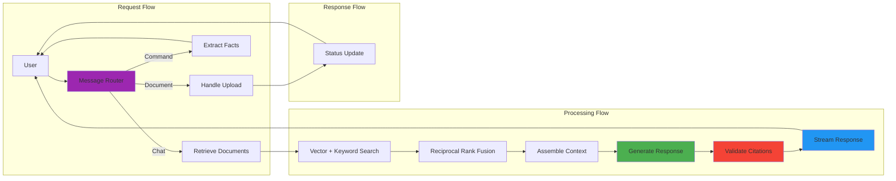
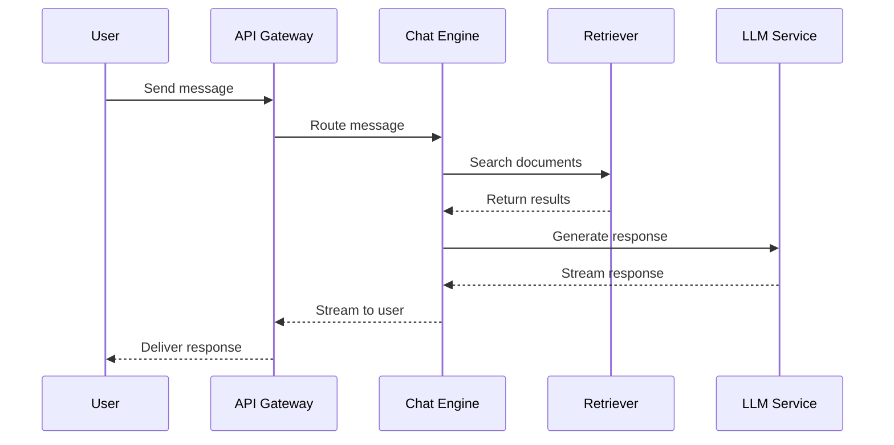
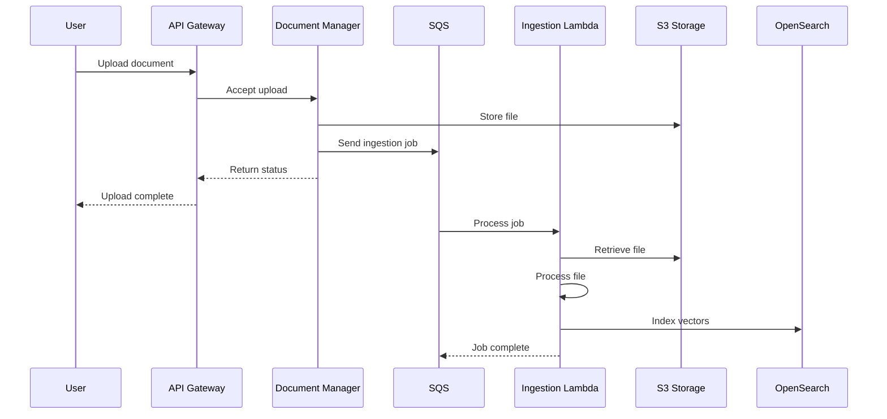

# Core Components and Data Flow

## Table of Contents

- [1.7 Core Component Descriptions](#17-core-component-descriptions)
- [1.8 Data Flow Overview](#18-data-flow-overview)
- [1.9 Technology Mapping Overview](#19-technology-mapping-overview)

---

## 1.7 Core Component Descriptions

### Connection Manager
- **Purpose**: Manages WebSocket connections and real-time communication
- **Responsibilities**:
  - Accept and authenticate WebSocket connections
  - Maintain connection registry (active sessions)
  - Route messages to appropriate handlers
  - Handle connection lifecycle (connect, disconnect, heartbeat)
  - Manage message queues per connection
  - Broadcast real-time updates (status changes, errors)

### Chat Engine
- **Purpose**: Core orchestration for chat conversations
- **Responsibilities**:
  - Process incoming messages
  - Coordinate conversation flow
  - Manage conversation state and history
  - Route to retriever for document queries
  - Invoke LLM for response generation
  - Stream responses back to client
  - Handle multi-turn context management

### Session Manager
- **Purpose**: Manage temporary session lifecycle
- **Responsibilities**:
  - Create ephemeral sessions (4-16 hour lifetime)
  - Track session expiration and extensions
  - Schedule automatic cleanup
  - Isolate data between sessions
  - Provide session-scoped resources (vector index, storage prefix)
  - Enforce zero data retention policy

### Document Manager
- **Purpose**: Handle document upload, processing, and retrieval
- **Responsibilities**:
  - Accept file uploads via presigned URLs
  - Trigger ingestion pipeline
  - Track document processing status
  - Provide document metadata
  - Enable document deletion
  - Manage per-document access control

### Retriever
- **Purpose**: Find relevant content from uploaded documents
- **Responsibilities**:
  - Hybrid search (vector + keyword)
  - Reciprocal Rank Fusion (RRF)
  - Context-aware retrieval (conversation history)
  - Query rewriting for follow-up questions
  - Reranking and result filtering
  - Citation extraction

### Synthesizer
- **Purpose**: Generate AI responses using LLM
- **Responsibilities**:
  - Build conversation context
  - Assemble retrieved documents
  - Invoke LLM with appropriate prompts
  - Stream responses in real-time
  - Handle different query types (summary, extraction, chat)
  - Manage conversation tone and style

### Fact Extractor
- **Purpose**: Extract structured data from documents
- **Responsibilities**:
  - Identify fact types (dates, parties, amounts, deadlines)
  - Generate structured output (JSON/CSV)
  - Provide confidence scores
  - Handle cross-document synthesis
  - Export results in multiple formats

### Citation Validator
- **Purpose**: Ensure response accuracy and attribution
- **Responsibilities**:
  - Verify citation accuracy
  - Check document existence
  - Validate page numbers
  - Confirm text snippets match sources
  - Assess relevance of citations
  - Filter invalid citations

---

## 1.8 Data Flow Overview



### Request Flow

1. **User Message** enters system
2. **Message Router** classifies intent and routes to appropriate handler
3. **Chat messages** → Document Retrieval
4. **Command messages** → Fact Extraction
5. **Document actions** → Upload Handler

### Processing Flow

1. **Retrieve Documents**: Hybrid vector + keyword search
2. **RRF**: Reciprocal Rank Fusion combines results
3. **Assemble Context**: Build context from retrieved chunks
4. **Generate Response**: LLM produces response with citations
5. **Validate Citations**: Async validation of source references
6. **Stream Response**: Real-time token streaming to user

### Response Flow

1. **Chat responses** streamed directly to user
2. **Fact extraction** returns structured data
3. **Document uploads** return status updates

---

## 1.9 Technology Mapping Overview

| Component Category | Conceptual | AWS Implementation |
|-------------------|------------|-------------------|
| **API Layer** | REST API + WebSocket | API Gateway |
| **Authentication** | JWT Tokens | Amazon Cognito |
| **Application** | Chat Engine, Session Manager | EKS with Kubernetes |
| **Background Jobs** | Ingestion, Cleanup | Lambda + SQS |
| **Vector Database** | Vector Store | Amazon OpenSearch |
| **Document Storage** | Document Store | Amazon S3 |
| **Session Storage** | Session Store, Conversation History | ElastiCache Redis |
| **Metadata Storage** | Metadata Store | OpenSearch |
| **LLM** | LLM Service | Amazon Bedrock |
| **Observability** | Observability Platform | Self-hosted on EKS |

### Layer-by-Layer Mapping

#### Client Layer
| Component | Conceptual | AWS |
|-----------|------------|-----|
| Web Application | React SPA | CloudFront + S3 |
| Mobile Apps | iOS / Android | App Store / Play Store |

#### Connection Layer
| Component | Conceptual | AWS |
|-----------|------------|-----|
| REST API | HTTP/HTTPS | API Gateway (REST) |
| WebSocket API | Real-time bidirectional | API Gateway (WebSocket) |
| Authentication | JWT Tokens | Amazon Cognito |

#### Application Layer
| Component | Conceptual | AWS |
|-----------|------------|-----|
| Connection Manager | WebSocket connections | EKS (Kubernetes) |
| Chat Engine | Message processing | EKS (Kubernetes) |
| Session Manager | Session lifecycle | EKS (Kubernetes) |
| Document Manager | Upload / Processing | EKS (Kubernetes) |

#### Intelligence Layer
| Component | Conceptual | AWS |
|-----------|------------|-----|
| Retriever | Hybrid search | EKS + OpenSearch |
| Synthesizer | LLM integration | EKS + Bedrock |
| Fact Extractor | Structured extraction | EKS + Bedrock |
| Citation Validator | Source verification | EKS + S3 |

#### Storage Layer
| Component | Conceptual | AWS |
|-----------|------------|-----|
| Vector Database | Per-session indices | Amazon OpenSearch |
| Document Storage | Original files, chunks | Amazon S3 |
| Session Store | Conversation history | DynamoDB + Redis |
| Metadata Store | Session info, tracking | DynamoDB + RDS PostgreSQL |

#### Background Processing
| Component | Conceptual | AWS |
|-----------|------------|-----|
| Ingestion Pipeline | Extract → Chunk → Embed | Lambda + SQS |
| Cleanup Service | Session expiration | Lambda + EventBridge |

---

## Component Interaction Patterns

### Synchronous Flow


### Asynchronous Flow


---

## Data Models

### Session Model
```python
@dataclass
class Session:
    session_id: str
    user_id: str
    created_at: datetime
    last_active: datetime
    status: SessionStatus  # ACTIVE, INACTIVE, DELETED
    document_ids: List[str]
    conversation_turns: int
```

### Document Model
```python
@dataclass
class Document:
    document_id: str
    session_id: str
    filename: str
    uploaded_at: datetime
    status: DocumentStatus  # UPLOADING, PROCESSING, READY, FAILED
    page_count: int
    chunk_count: int
    ttl: datetime
```

### Message Model
```python
@dataclass
class Message:
    message_id: str
    session_id: str
    role: MessageRole  # USER, ASSISTANT
    content: str
    timestamp: datetime
    citations: List[Citation]
    token_count: int
```

### Citation Model
```python
@dataclass
class Citation:
    citation_id: str
    document_id: str
    page_number: int
    chunk_id: str
    text_snippet: str
    confidence: float
```

---

## Scalability Considerations

### Horizontal Scaling
| Component | Scaling Strategy | State Management |
|-----------|-----------------|------------------|
| Chat Engine | Auto-scaling based on connections | Stateless (session state in OpenSearch/Redis) |
| Retriever | Scale with query volume | Stateless (state in OpenSearch) |
| Ingestion Pipeline | Scale with queue depth | Stateless (state in SQS) |
| API Gateway | Automatic scaling | Stateless |

### Vertical Scaling
| Component | Resource Requirements |
|-----------|---------------------|
| LLM Service | GPU instances for VLM processing |
| Vector Database | Memory-optimized for embeddings |
| Session Store | Memory-optimized for fast access |

### Performance Optimization
1. **Connection Pooling**: Reuse database connections
2. **Batch Processing**: Process multiple chunks together
3. **Caching**: Cache frequently accessed documents
4. **Lazy Loading**: Load conversation history on demand
5. **Streaming**: Stream responses to reduce latency

---

## Related Documents

- **[01-chat-architecture.md](./01-chat-architecture.md)** - Chat application architecture
- **[02-document-ingestion.md](./02-document-ingestion.md)** - Document ingestion pipeline
- **[03-message-routing.md](./03-message-routing.md)** - Message routing and orchestrator
- **[../system_designs_aws.md](../system_designs_aws.md)** - AWS-specific implementation details
