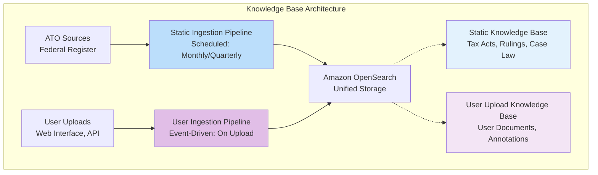
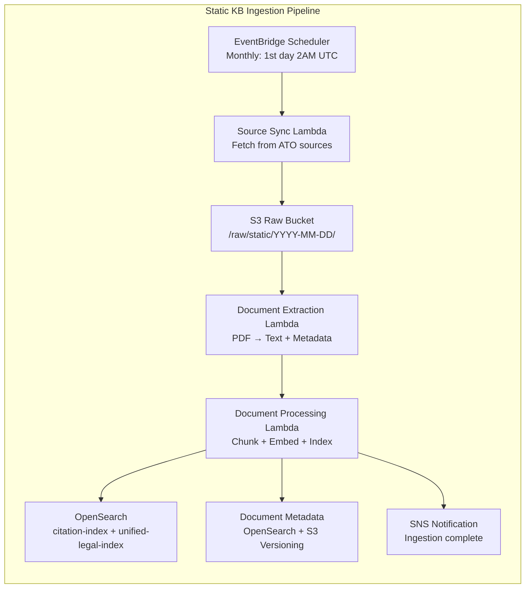
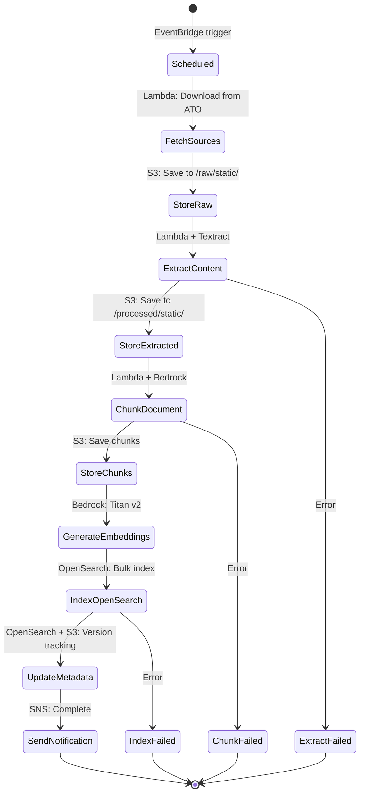
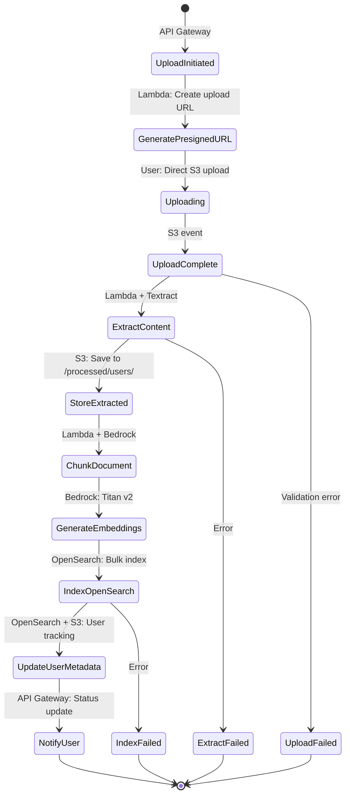

# Document Ingestion Strategies for Australian Tax Law RAG System

**Document Version**: 2.0.0
**Date**: 2026-03-30
**Author**: Principal AI Engineer
**Status**: Architecture Decision Record

---

## Table of Contents

1. [Executive Summary](#executive-summary)
2. [Knowledge Base Architecture](#knowledge-base-architecture)
3. [Static Knowledge Base Ingestion](#static-knowledge-base-ingestion)
4. [User Upload Knowledge Base Ingestion](#user-upload-knowledge-base-ingestion)
5. [AWS Service Integration](#aws-service-integration)
6. [Processing Pipelines](#processing-pipelines)
7. [Error Handling and Recovery](#error-handling-and-recovery)
8. [Monitoring and Observability](#monitoring-and-observability)
9. [Implementation Roadmap](#implementation-roadmap)

---

## Executive Summary

The Case Assistant system maintains two distinct knowledge bases with different ingestion requirements:

| Knowledge Base | Update Frequency | Update Source | Strategy | Complexity |
|----------------|------------------|---------------|----------|------------|
| **Static KB** | Monthly/Quarterly | ATO authoritative sources | Full refresh, document-level delta | Low |
| **User Upload KB** | On-demand | Individual users | Full refresh per upload | Low |

> **NOTE**: Incremental ingestion with page-level delta detection was evaluated but **deferred for simplicity**. The initial implementation uses full refresh ingestion for both knowledge bases. Incremental ingestion can be added in Phase 2 if cost/benefit analysis justifies the additional complexity.

**Key Decision**: Full refresh ingestion provides:
- Simpler implementation (2-3 weeks vs 6-8 weeks)
- Sufficient performance for initial launch
- Easier debugging and maintenance
- Lower operational risk
- Clear upgrade path to incremental if needed

---

## Knowledge Base Architecture



### Knowledge Base Characteristics

| Characteristic | Static KB | User Upload KB |
|----------------|-----------|----------------|
| **Document Types** | Tax acts, rulings, determinations, case law | User documents, annotations, correspondence |
| **Document Size** | 50-500 pages | 5-100 pages |
| **Update Frequency** | Scheduled (monthly/quarterly) | On-demand (per user action) |
| **Update Source** | Automated sync from ATO sources | Manual user upload |
| **Volume per Update** | 1,000-10,000 documents | 1 document per upload |
| **Consistency Requirement** | High (legal accuracy) | Medium (user-specific) |
| **Retention** | All versions (legal requirement) | Configurable per user |
| **Access Pattern** | Read-heavy, write-rarely | Read-write per user |

---

## Static Knowledge Base Ingestion

### Overview

Static knowledge base contains authoritative Australian tax law documents that change infrequently through scheduled updates from government sources.

### Data Sources

| Source | Content | Update Frequency | Format | Access Method |
|--------|---------|------------------|---------|---------------|
| **Federal Register of Legislation** | Tax Acts, Amendments | Daily (check monthly) | HTML, PDF | API, Web scraping |
| **ATO Website** | Tax Rulings (TR, TD, ID) | Weekly (check monthly) | HTML, PDF | API, Web scraping |
| **AustLII** | Case law, decisions | Weekly (check monthly) | HTML, PDF | API, Web scraping |
| **Legislation.gov.au** | Consolidated legislation | Daily (check monthly) | HTML, PDF | API |

### Ingestion Architecture



### Step-by-Step Process

#### Step 1: Scheduled Trigger

**Service**: Amazon EventBridge

**Configuration**:
```
Rule: static-kb-sync-monthly
Schedule: cron(0 2 1 * ? *)  # 2AM UTC on 1st of month
Target: static-sync-lambda
```

**Step function**:
1. EventBridge triggers Static Sync Lambda at scheduled time
2. Lambda checks for any manual trigger via API
3. Lambda initiates source sync process

#### Step 2: Source Document Fetch

**Service**: AWS Lambda (Python)

**Process**:
1. Connect to Federal Register API
2. Fetch list of updated tax legislation since last sync
3. Download PDF documents for updated items
4. Store raw PDFs in S3 bucket: `s3://case-assistant-raw/static/YYYY-MM-DD/source-document-id.pdf`
5. Generate manifest file with document metadata

**AWS Services Used**:
- Lambda: Compute for fetch logic
- S3: Raw document storage
- Secrets Manager: API credentials storage

**S3 Structure**:
```
case-assistant-raw/
├── static/
│   ├── 2026-03-01/
│   │   ├── manifest.json
│   │   ├── itaa-1997.pdf
│   │   ├── tr-2024-1.pdf
│   │   └── fct-v-case-2024.pdf
│   └── 2026-04-01/
│       ├── manifest.json
│       └── ...
```

#### Step 3: Document Extraction

**Service**: AWS Lambda + Amazon Textract

**Process**:
1. Read PDF from S3 raw bucket
2. For text-only pages: Use PDF parsing library
3. For table-containing pages: Use Amazon Textract
4. Extract text, tables, and document structure
5. Generate page-level metadata (page numbers, sections, headers)
6. Store extracted content in S3 processed bucket

**AWS Services Used**:
- Lambda: Orchestration
- Textract: Table and form extraction
- S3: Processed content storage

**Extraction Output Format** (stored in S3):
```json
{
  "document_id": "itaa-1997",
  "source_file": "itaa-1997.pdf",
  "extracted_at": "2026-03-30T02:00:00Z",
  "pages": [
    {
      "page_number": 1,
      "content_type": "text",
      "text": "Income Tax Assessment Act 1997...",
      "sections": [{"type": "title", "text": "No. 38 of 1995"}],
      "tables": []
    },
    {
      "page_number": 50,
      "content_type": "table",
      "text": "Table contents...",
      "sections": [],
      "tables": [
        {
          "table_id": "t1",
          "headers": ["Taxable Income", "Tax Rate"],
          "rows": [["$0-$18,200", "0%"], ["$18,201-$45,000", "19%"]]
        }
      ]
    }
  ]
}
```

#### Step 4: Text Processing and Chunking

**Service**: AWS Lambda + Amazon Bedrock

**Process**:
1. Read extracted content from S3
2. For each page, determine chunking strategy:
   - Text pages: Semantic chunking (800-1200 tokens)
   - Table pages: Extract table as structured JSON + text representation
3. For each chunk:
   - Add contextual enhancement using Claude (optional, Phase 2)
   - Extract legal citations
   - Extract keywords
   - Assign chunk ID
4. Generate embeddings using Amazon Titan Embeddings v2

**AWS Services Used**:
- Lambda: Chunking logic
- Bedrock: Embeddings (Titan v2), Contextual enhancement (Claude - optional)
- S3: Store processed chunks

**Chunk Output Format**:
```json
{
  "chunk_id": "chunk-itaa-1997-s-288-95-001",
  "document_id": "itaa-1997",
  "page_number": 245,
  "chunk_type": "child",
  "text": "A penalty of 210 penalty units applies...",
  "embedding": [0.123, 0.456, ...],
  "metadata": {
    "act": "ITAA 1997",
    "section": "288-95",
    "subsection": "1",
    "document_type": "tax_legislation"
  },
  "citations": ["s-288-95", "s-995-1"],
  "keywords": ["penalty-units", "activity-statement"]
}
```

#### Step 5: OpenSearch Indexing

**Service**: Amazon OpenSearch (Provisioned)

**Process**:
1. For Citation Index:
   - Extract unique citations from all chunks
   - Create citation documents with aliases and cross-references
   - Bulk index to `citation-index`

2. For Unified Legal Index:
   - Create child chunk documents with embeddings
   - Create parent chunk documents (aggregate 3-6 children)
   - Bulk index to `unified-legal-index`
   - Configure parent-child relationships

3. For each document:
   - Delete existing vectors for document_id (if updating)
   - Index new vectors
   - Update document metadata in OpenSearch

**AWS Services Used**:
- OpenSearch: Vector and keyword storage
- OpenSearch: Document metadata storage

**Bulk Indexing Process**:
```
For each batch of 100 chunks:
  1. Build bulk index request
  2. Send to OpenSearch bulk API
  3. Handle response (success/failure)
  4. Retry failed chunks with exponential backoff
  5. Update metadata in OpenSearch with indexed chunk IDs
```

#### Step 6: Metadata and Version Tracking

**Services**: OpenSearch + S3 Versioning

**Process**:
1. Store document metadata in OpenSearch:
   - Create document metadata record in `document-metadata` index
   - Include: Document ID, source URL, fetch date, hash, version
   - Include: Chunk count, citation count, ingestion status

2. S3 Versioning handles document history:
   - Enable S3 versioning on raw bucket
   - Each re-upload creates new version
   - All versions preserved for rollback
   - Lifecycle policy manages old versions

**OpenSearch Document Metadata**:

**Index: document-metadata**
```json
{
  "document_id": "itaa-1997",
  "current_version": 5,
  "document_type": "tax_legislation",
  "title": "Income Tax Assessment Act 1997",
  "source_url": "https://legislation.gov.au/...",
  "file_hash": "a1b2c3d4...",
  "chunk_count": 4500,
  "citation_count": 890,
  "last_ingested_at": "2026-03-30T02:15:00Z",
  "ingestion_status": "COMPLETE",
  "kb_type": "static",
  "s3_version_id": "5z9LW7xTi...",
  "s3_location": "s3://case-assistant-raw/static/itaa-1997.pdf"
}
```

**Index: document-versions**
```json
{
  "document_id": "itaa-1997",
  "version": 5,
  "file_hash": "a1b2c3d4...",
  "ingested_at": "2026-03-30T02:15:00Z",
  "changes_summary": "Sections 200-250 amended",
  "s3_version_id": "5z9LW7xTi...",
  "previous_version": 4
}
```

**S3 Versioning** (automatic):
```
case-assistant-raw/static/itaa-1997.pdf
  Version 1: 2026-01-01 (initial)
  Version 2: 2026-02-01 (amendment)
  Version 3: 2026-03-01 (amendment)
  Version 4: 2026-03-15 (amendment)
  Version 5: 2026-03-30 (current)
```

#### Step 7: Notification

**Service**: Amazon SNS

**Process**:
1. Publish ingestion completion message
2. Include statistics: documents processed, chunks indexed, errors
3. Notify monitoring system
4. Trigger any downstream processes

**SNS Message Format**:
```json
{
  "event_type": "static_kb_ingestion_complete",
  "timestamp": "2026-03-30T03:00:00Z",
  "statistics": {
    "documents_processed": 125,
    "chunks_created": 45000,
    "citations_extracted": 8900,
    "errors": 0,
    "processing_time_seconds": 3600
  },
  "sync_date": "2026-03-01"
}
```

---

## User Upload Knowledge Base Ingestion

### Overview

User upload knowledge base contains documents uploaded by individual users. Each user can upload, view, and manage their own documents.

### Ingestion Architecture

```mermaid
graph LR
    subgraph "User Upload Ingestion Pipeline"
        USER[User Action<br/>Upload Document]

        API[API Gateway<br/>POST /documents]

        AUTH[Cognito Authorizer<br/>User Authentication]

        UPLOAD[Presigned URL Generation<br/>S3 Direct Upload]

        STORAGE[S3 User Upload Bucket<br/>/uploads/{user_id}/]

        TRIGGER[S3 Event Notification<br/>Object Created]

        PROCESS[Document Processing Lambda<br/>Extract → Chunk → Embed → Index]

        OPENSEARCH[OpenSearch<br/>User-scoped indices]

        USER_METADATA[User Metadata<br/>OpenSearch index]

        RESPONSE[Real-time Response<br/>WebSocket/Status Polling]

        USER --> API
        API --> AUTH
        AUTH --> UPLOAD
        UPLOAD --> USER
        USER --> STORAGE
        STORAGE --> TRIGGER
        TRIGGER --> PROCESS
        PROCESS --> OPENSEARCH
        PROCESS --> USER_METADATA
        PROCESS --> RESPONSE
        RESPONSE --> USER
    end
```

### Step-by-Step Process

#### Step 1: User Upload Initiation

**Service**: Amazon API Gateway + Amazon Cognito

**Process**:
1. User uploads document via web interface
2. Frontend calls API Gateway: `POST /api/v1/documents/upload-initiate`
3. Cognito authorizer validates JWT token
4. Generate unique document ID: `doc-{user_id}-{timestamp}`
5. Create initial status file in S3 with status "UPLOADING"

**API Request**:
```http
POST /api/v1/documents/upload-initiate
Authorization: Bearer {jwt_token}
Content-Type: application/json

{
  "filename": "my_tax_return_2024.pdf",
  "file_size_bytes": 1048576,
  "document_type": "user_document"
}
```

**API Response**:
```json
{
  "document_id": "doc-user-123-1711800000",
  "upload_url": "https://s3.../presigned-url...",
  "upload_expires": 3600,
  "chunk_size_mb": 100,
  "status": "UPLOADING"
}
```

#### Step 2: Direct Upload to S3

**Service**: Amazon S3 (Presigned URLs)

**Process**:
1. Frontend uploads file directly to S3 using presigned URL
2. S3 stores file in user-scoped prefix: `/uploads/{user_id}/{document_id}.pdf`
3. Upload progress shown to user via progress callbacks

**S3 Event Configuration**:
```
Event: s3:ObjectCreated:*
Prefix: uploads/
Destination: Document Processing Lambda
```

**S3 Structure**:
```
case-assistant-uploads/
├── user-123/
│   ├── doc-user-123-001.pdf
│   ├── doc-user-123-002.pdf
│   └── doc-user-123-003.pdf
├── user-456/
│   └── doc-user-456-001.pdf
└── failed/
    └── {failed uploads for investigation}
```

#### Step 3: Document Processing Trigger

**Service**: AWS Lambda (triggered by S3 event)

**Process**:
1. S3 event triggers Document Processing Lambda
2. Lambda reads event details (bucket, key, user_id)
3. Update document status to "PROCESSING"
4. Begin extraction and processing pipeline

**S3 Event Format**:
```json
{
  "Records": [
    {
      "eventVersion": "2.1",
      "eventSource": "aws:s3",
      "s3": {
        "bucket": {"name": "case-assistant-uploads"},
        "object": {
          "key": "user-123/doc-user-123-001.pdf",
          "size": 1048576
        }
      }
    }
  ]
}
```

#### Step 4: Document Extraction

**Service**: AWS Lambda + Amazon Textract

**Process**:
1. Read PDF from S3 uploads bucket
2. Determine document complexity:
   - Simple PDF: Use PDF parsing library
   - Complex PDF (tables, forms): Use Amazon Textract
3. Extract text, tables, and structure
4. Generate page-level metadata
5. Store extracted content in S3 processed bucket

**Textract Async Process for Large Documents**:
```
If document pages > 5:
  1. Start Textract async job
  2. Get job ID
  3. Poll for completion (every 5 seconds)
  4. Retrieve results when complete
  5. Parse Textract JSON response
```

#### Step 5: Text Processing and Chunking

**Service**: AWS Lambda + Amazon Bedrock

**Process**:
1. Read extracted content from S3
2. Apply chunking strategy:
   - Small docs (<20 pages): Fixed-size chunking (1000 tokens)
   - Large docs (>20 pages): Semantic chunking
3. For each chunk:
   - Extract citations (if any)
   - Extract keywords
   - Generate embeddings using Titan v2
4. Store processed chunks in S3

**Chunking Decision Tree**:
```
Document type?
├── Legislation reference → Use pre-cached chunks from static KB
├── User annotation → Store as-is, link to referenced document
├── Tax return forms → Extract structured data + text chunks
└── General document → Standard semantic chunking
```

#### Step 6: OpenSearch Indexing

**Service**: Amazon OpenSearch

**Process**:
1. Add user_id to all chunk metadata
2. Index chunks to `unified-legal-index` with user scope
3. Create parent chunks for context
4. Update user document metadata in OpenSearch

**User-Scoped Indexing**:
```json
{
  "chunk_id": "chunk-user-123-doc-001-001",
  "user_id": "user-123",
  "document_id": "doc-user-123-001",
  "chunk_type": "child",
  "text": "...",
  "embedding": [0.123, 0.456, ...],
  "metadata": {
    "kb_type": "user_upload",
    "user_id": "user-123",
    "document_type": "user_document",
    "filename": "my_tax_return.pdf"
  }
}
```

#### Step 7: User Metadata Update

**Services**: OpenSearch + S3 Status Files

**Process**:
1. Create/update document metadata in OpenSearch:
   - Status: "COMPLETE" or "FAILED"
   - Chunk count, citation count
   - Processing time, error details (if failed)
   - Store in `user-document-metadata` index

2. Create status file in S3:
   - Store `status.json` alongside processed chunks
   - Enable real-time status polling

**OpenSearch User Document Metadata**:

**Index: user-document-metadata**
```json
{
  "user_id": "user-123",
  "document_id": "doc-user-123-001",
  "filename": "my_tax_return_2024.pdf",
  "file_size_bytes": 1048576,
  "file_hash": "x1y2z3w4...",
  "status": "COMPLETE",
  "chunk_count": 45,
  "citation_count": 8,
  "uploaded_at": "2026-03-30T10:00:00Z",
  "processed_at": "2026-03-30T10:02:30Z",
  "processing_time_seconds": 150,
  "kb_type": "user_upload",
  "s3_location": "s3://case-assistant-uploads/user-123/doc-001.pdf",
  "chunks_location": "s3://case-assistant-processed/user-123/doc-001/"
}
```

**S3 Status File**:
```
s3://case-assistant-uploads/user-123/doc-001-status.json
```
```json
{
  "user_id": "user-123",
  "document_id": "doc-user-123-001",
  "status": "COMPLETE",
  "progress": 100,
  "chunks_processed": 45,
  "error": null,
  "updated_at": "2026-03-30T10:02:30Z"
}
```

**User Statistics** (computed on demand):
```
Query: Get user's document count and total storage

OpenSearch aggregation:
  GET /user-document-metadata/_search
  {
    "query": {"term": {"user_id": "user-123"}},
    "aggs": {
      "total_documents": {"value_count": {"field": "document_id"}},
      "total_storage": {"sum": {"field": "file_size_bytes"}}
    }
  }
```

#### Step 8: Response to User

**Service**: API Gateway + WebSocket (optional)

**Process**:
1. Update document status to "COMPLETE"
2. Notify user via WebSocket or status polling
3. User can now query their document

**Status Polling Endpoint**:
```http
GET /api/v1/documents/{document_id}/status
Authorization: Bearer {jwt_token}

Response:
{
  "document_id": "doc-user-123-001",
  "status": "COMPLETE",
  "progress": 100,
  "chunk_count": 45,
  "ready_for_query": true
}
```

---

## AWS Service Integration

### Service Mapping

| Step | Service | Purpose | Configuration |
|------|---------|---------|--------------|
| **Scheduling** | EventBridge | Trigger static KB sync | Monthly cron rule |
| **API Layer** | API Gateway | User upload endpoints | REST API, JWT auth |
| **Authentication** | Cognito | User identity management | JWT tokens |
| **Storage (Raw)** | S3 | Raw document storage | Standard tier, lifecycle policies |
| **Storage (Processed)** | S3 | Extracted content storage | Standard tier |
| **Compute** | Lambda | Processing logic | Memory: 1GB, Timeout: 15 min |
| **OCR/Extraction** | Textract | Table and form extraction | Async for large docs |
| **Embeddings** | Bedrock | Vector generation | Titan Text Embeddings v2 |
| **LLM Enhancement** | Bedrock | Contextual enhancement (optional) | Claude 3.5 Sonnet |
| **Vector Search** | OpenSearch | Vector + keyword storage | Provisioned domain |
| **Metadata** | OpenSearch | Document metadata, versions | Included in domain |
| **Messaging** | SNS | Ingestion notifications | Standard topics |
| **Monitoring** | CloudWatch | Logs, metrics, alarms | Standard logs |
| **Error Tracking** | X-Ray | Distributed tracing | Enabled |

### Data Flow Summary

```
Static KB:
  EventBridge → Lambda → S3 (fetch) → S3 (store) → Lambda → Textract
  → Lambda → Bedrock → S3 (chunks) → Lambda → OpenSearch
  → SNS

User Upload:
  User → API Gateway → Cognito → Lambda (presigned URL) → User
  → S3 (direct upload) → S3 event → Lambda → Textract → Lambda
  → Bedrock → S3 (chunks) → Lambda → OpenSearch → S3 (status)
  → API Gateway → User
```

---

## Processing Pipelines

### Static KB Pipeline (State Machine)



### User Upload Pipeline (State Machine)



---

## Error Handling and Recovery

### Error Categories

| Error Type | Detection | Recovery | Notification |
|------------|-----------|----------|-------------|
| **Source Fetch Failed** | Lambda timeout, HTTP errors | Retry with exponential backoff | SNS alert after 3 failures |
| **Textract Failed** | Async job timeout, API error | Retry up to 3 times, fallback to PDF parser | CloudWatch alarm |
| **Embedding Failed** | Bedrock API error | Retry with backoff, continue on rate limit | CloudWatch metric |
| **OpenSearch Failed** | Bulk API error | Retry failed chunks, quarantine bad docs | SNS alert |
| **User Upload Failed** | API error, validation error | Return error to user, store in failed/ | User notification |

### Retry Strategy

```
Retry Configuration:
  - Max retries: 3
  - Backoff: Exponential (2^n seconds)
  - Jitter: ±20% random
  - Dead letter queue: Failed documents stored for investigation

Example:
  Attempt 1: Immediate
  Attempt 2: Wait 2-4 seconds
  Attempt 3: Wait 4-8 seconds
  Attempt 4: Wait 8-16 seconds
  Failed: Store in S3 failed/ bucket, alert via SNS
```

### Dead Letter Queue

**S3 Structure for Failed Documents**:
```
case-assistant-uploads/
└── failed/
    ├── static/
    │   ├── 2026-03-01_failed_documents.json
    │   └── itaa-1997_failed.pdf
    └── users/
        ├── user-123/
        │   └── doc-001_failed.pdf
        └── failed_documents.json
```

**Failed Document Metadata**:
```json
{
  "document_id": "doc-001",
  "original_location": "s3://uploads/doc-001.pdf",
  "failed_at": "2026-03-30T10:05:00Z",
  "failure_reason": "TextractAsyncJobTimeout",
  "retry_count": 3,
  "last_error": "Job exceeded maximum wait time",
  "quarantine_location": "s3://failed/doc-001.pdf"
}
```

---

## Monitoring and Observability

### CloudWatch Metrics

| Metric | Namespace | Dimension | Alarm Threshold |
|--------|-----------|-----------|-----------------|
| **Ingestion Duration** | CaseAssistant/StaticKB | SyncRun | > 2 hours |
| **Documents Processed** | CaseAssistant/StaticKB | SyncRun | < 100 (expect ~1000) |
| **Textract API Errors** | CaseAssistant/Textract | ErrorType | > 5% |
| **Bedrock API Errors** | CaseAssistant/Bedrock | ErrorType | > 1% |
| **OpenSearch Index Errors** | CaseAssistant/OpenSearch | IndexName | > 1% |
| **User Upload Duration** | CaseAssistant/UserUpload | UserId | > 5 minutes |
| **User Upload Failures** | CaseAssistant/UserUpload | ErrorType | > 5% |

### CloudWatch Logs

**Log Groups**:
```
/aws/lambda/case-assistant-static-sync
/aws/lambda/case-assistant-document-processing
/aws/lambda/case-assistant-chunking
/aws/lambda/case-assistant-indexing
/aws/case-assistant/user-uploads
```

**Log Structure** (JSON):
```json
{
  "timestamp": "2026-03-30T10:00:00Z",
  "level": "INFO",
  "service": "document-processing",
  "user_id": "user-123",
  "document_id": "doc-001",
  "message": "Document processing started",
  "metadata": {
    "file_size": 1048576,
    "pages": 25,
    "estimated_duration_seconds": 120
  }
}
```

### X-Ray Tracing

**Enable X-Ray for**:
- All Lambda functions
- API Gateway
- OpenSearch client calls

**Traced Operations**:
1. Static KB sync: S3 fetch → Textract → Bedrock → OpenSearch
2. User upload: API Gateway → Lambda → S3 → Textract → Bedrock → OpenSearch

### Dashboards

**Static KB Dashboard**:
- Last sync time and duration
- Documents processed per sync
- Error rates by service
- Storage usage trends

**User Upload Dashboard**:
- Uploads per hour/day
- Processing latency (p50, p95, p99)
- Error rates by error type
- Active users count

---

## Implementation Roadmap

### Phase 1: Foundation (Week 1-2)

**Tasks**:
1. Set up AWS infrastructure (S3, Lambda, OpenSearch)
2. Implement basic static KB sync (fetch + extract)
3. Implement user upload API (presigned URL + S3 event trigger)
4. Set up authentication with Cognito
5. Configure OpenSearch domains and indices

**Deliverables**:
- Working CloudFormation/Terraform stack
- Basic static KB ingestion (no chunking/embedding)
- User upload to S3 working

### Phase 2: Processing Pipeline (Week 3-4)

**Tasks**:
1. Integrate Textract for table extraction
2. Implement chunking logic (semantic for large docs)
3. Integrate Bedrock for embeddings (Titan v2)
4. Implement OpenSearch bulk indexing
5. Set up OpenSearch metadata indices

**Deliverables**:
- Complete static KB ingestion pipeline
- Complete user upload processing pipeline
- Documents queryable via OpenSearch

### Phase 3: Error Handling and Monitoring (Week 5)

**Tasks**:
1. Implement retry logic with exponential backoff
2. Set up dead letter queue for failed documents
3. Configure CloudWatch metrics and alarms
4. Set up X-Ray tracing
5. Create CloudWatch dashboards

**Deliverables**:
- Production-ready error handling
- Comprehensive monitoring
- Operational runbooks

### Phase 4: Testing and Optimization (Week 6)

**Tasks**:
1. Load testing (100 concurrent user uploads)
2. Performance optimization (chunk sizes, batch sizes)
3. Cost optimization (right-sizing Lambda, S3 lifecycle policies)
4. Security audit (IAM policies, encryption)
5. Documentation and handoff

**Deliverables**:
- Validated performance (p95 latency < 3 minutes)
- Cost projections and budget alerts
- Complete documentation
- Production deployment

---

## Cost Estimates

### Static KB (Monthly)

| Service | Usage | Cost |
|---------|-------|------|
| **Lambda** | 1000 docs × 1000 sec = 1.67M seconds | $27/month |
| **S3 Storage** | 100GB raw + 50GB processed + versions | $5/month |
| **Textract** | 1000 docs × 20 pages = 20K pages | $20/month |
| **Bedrock** | 50K chunks × $0.0001 = $5 | $5/month |
| **OpenSearch** | r6g.large.search × 2 nodes (includes metadata) | $280/month |
| **Data Transfer** | 10GB out | $0.80/month |
| **Monitoring** | CloudWatch logs, metrics | $15/month |
| **Total** | | **$353/month** |

### User Upload KB (Monthly) - 10K Users

| Service | Usage | Cost |
|---------|-------|------|
| **Lambda** | 10K docs × 200 sec = 2M seconds | $33/month |
| **S3 Storage** | 500GB uploads + status files | $15/month |
| **Textract** | 10K docs × 10 pages = 100K pages | $100/month |
| **Bedrock** | 500K chunks × $0.0001 = $50 | $50/month |
| **OpenSearch** | Included in static KB | $0 |
| **API Gateway** | 100K requests | $1/month |
| **Cognito** | 10K MAU | $0 (free tier) |
| **Data Transfer** | 50GB out | $4/month |
| **Monitoring** | CloudWatch logs, metrics | $30/month |
| **Total** | | **$233/month** |

### Total Monthly Cost: ~$586/month

**Annual Cost**: ~$7,032/year

---

## Future Enhancements

### Phase 2+ Considerations

1. **Incremental Ingestion** (deferred for simplicity)
   - Page-level delta detection for static KB
   - Chunk-level delta detection for user uploads
   - Cost savings: 70-90% for re-uploaded documents
   - Implementation: 4-6 weeks additional development

2. **Contextual Retrieval**
   - Prepend document context to chunks using Claude
   - Expected improvement: 49% reduction in retrieval failures
   - Additional cost: $0.30 per 1M chunks

3. **Advanced Caching**
   - Cross-user document deduplication
   - Embedding cache for identical chunks
   - Expected savings: 30-50% for common documents

4. **Streaming Ingestion**
   - Real-time processing during upload
   - User sees progress bar
   - Better UX for large documents

---

## Related Documents

- **[02-document-ingestion.md](./02-document-ingestion.md)** - Detailed ingestion pipeline
- **[13-chunking-strategies.md](./13-chunking-strategies.md)** - Chunking and indexing strategies
- **[12-high-level-design.md](./12-high-level-design.md)** - Overall system architecture
- **[../system_designs_aws.md](../system_designs_aws.md)** - AWS-specific implementation details

---

**Document End**
