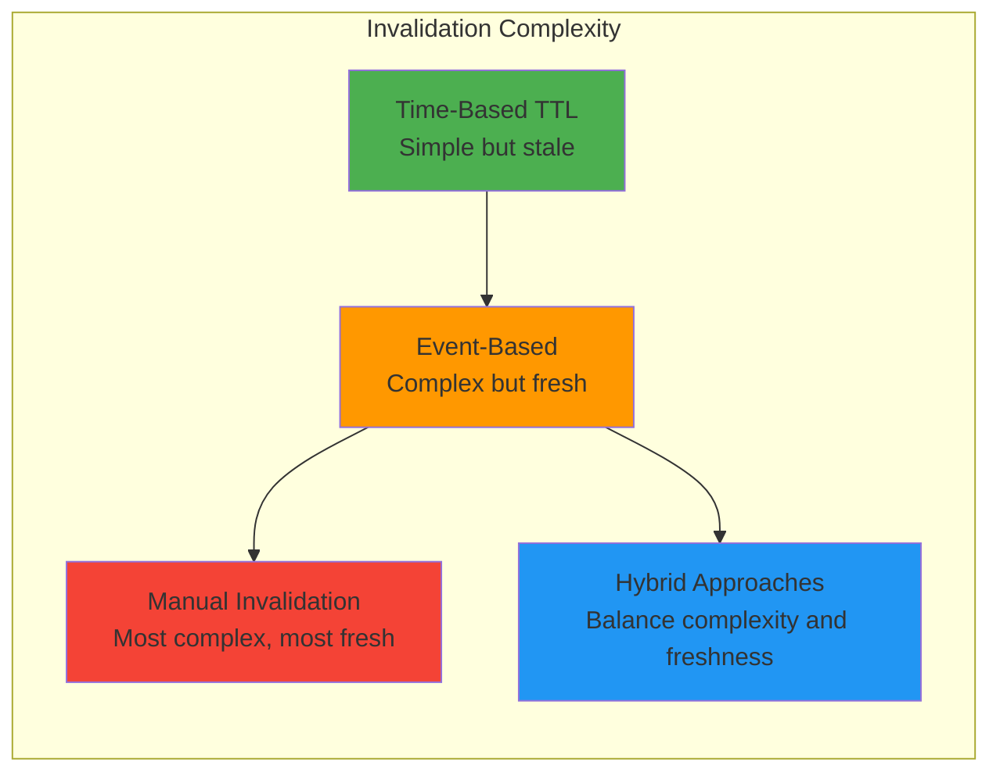
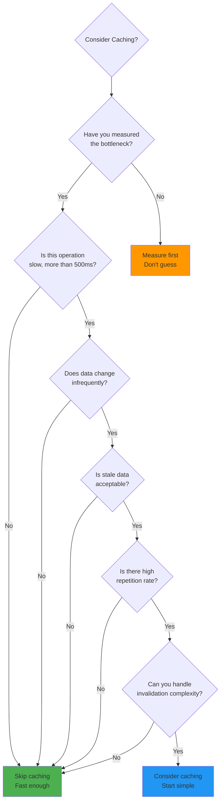

# Caching Strategies for RAG Systems: A Discussion

**Document Version**: 1.0.0
**Date**: 2026-03-24
**Author**: Principal AI Engineer
**Status**: Architecture Discussion (Not a Specification)

---

## Table of Contents

1. [Executive Summary](#executive-summary)
2. [Philosophy: Cache as a Last Resort](#philosophy-cache-as-a-last-resort)
3. [Caching Layers in RAG Systems](#caching-layers-in-rag-systems)
4. [Prompt Caching](#prompt-caching)
5. [Query Caching](#query-caching)
6. [Embedding Caching](#embedding-caching)
7. [Retrieval Caching](#retrieval-caching)
8. [Result Caching](#result-caching)
9. [Cache Invalidation: The Real Problem](#cache-invalidation-the-real-problem)
10. [When to Cache: Decision Framework](#when-to-cache-decision-framework)
11. [Implementation Considerations](#implementation-considerations)
12. [Monitoring and Observability](#monitoring-and-observability)
13. [Conclusion: The "It Depends" Rule](#conclusion-the-it-depends-rule)

---

## Executive Summary

Caching is one of the most powerful tools in a systems engineer's arsenal, but also one of the most dangerous. This document discusses caching strategies at various layers of a RAG (Retrieval-Augmented Generation) system, examining the pros, cons, and trade-offs of each approach.

**Key Principle**: "Cache as a last resort, not a first instinct." — **Premature optimization is the root of all evil** (Donald Knuth).

### Quick Reference: Caching Layers

| Layer | Cache What | Complexity | Benefit | When to Consider |
|-------|-----------|------------|---------|------------------|
| **Prompt Caching** | System prompts, templates | Medium | 10-30% latency reduction | Reusable prompts, high volume |
| **Query Caching** | User queries (exact/semantic) | High | 50-90% latency reduction on hits | Repetitive questions, Q&A systems |
| **Embedding Caching** | Document embeddings | Low | 90%+ cost reduction on re-upload | Document re-uploads, deduplication |
| **Retrieval Caching** | Vector search results | High | 80%+ latency reduction on hits | Popular queries, hot documents |
| **Result Caching** | Final LLM responses | Medium | 95%+ latency reduction on hits | FAQ systems, knowledge bases |

---

## Philosophy: Cache as a Last Resort

### The Two Hard Problems

> "There are only two hard things in Computer Science: cache invalidation and naming things." — Phil Karlton

**Why Caching is Hard**:

1. **State Duplication**: You now have data in two places
2. **Synchronization**: Keeping them consistent is complex
3. **Invalidation**: When to expire cached data?
4. **Debugging**: Is the bug in your code or your cache?
5. **Complexity**: Every cache layer adds operational burden

### The Premature Optimization Trap

```
Typical Lifecycle of Premature Caching:

Day 1: "Let's add Redis caching, it'll be fast!"
Day 7: Implemented caching, 50% faster on benchmarks
Day 14: User reports stale data
Day 21: Cache invalidation bug, data inconsistency
Day 30: Spending more time debugging cache than actual features
Day 45: "Maybe we should just fix the slow query instead..."
Day 60: Cache removed, system simpler and more reliable
```

**Real Costs of Caching**:
- Development time: 2-5x more complex
- Debugging time: 3-10x harder to troubleshoot
- Operational burden: Additional infrastructure to maintain
- Team cognitive load: More moving parts to understand
- Opportunity cost: Time not spent on actual features

### When NOT to Cache

❌ **Don't cache when**:
- System is fast enough without it
- Data changes frequently
- You don't have performance metrics yet
- You're optimizing for "what if" scenarios
- Team is small and resources are limited
- You haven't identified the bottleneck

✅ **Consider caching when**:
- You have measured performance problems
- The bottleneck is clear and specific
- The data is expensive to compute/fetch
- The data is read-heavy and write-light
- Stale data is acceptable for some time period
- You have monitoring to validate effectiveness

---

## Caching Layers in RAG Systems

```mermaid
graph TB
    subgraph "RAG System with Caching Opportunities"
        USER[User Query]

        QC[Query Cache<br>Exact/semantic match]

        PROMPT_CACHE[Prompt Cache<br>System messages<br>Templates]

        EMB_CACHE[Embedding Cache<br>Document embeddings]

        RETR[Retriever<br>Vector search]

        RETR_CACHE[Retrieval Cache<br>Search results<br>by query embedding]

        LLM[LLM Generation<br>With context]

        RES_CACHE[Result Cache<br>Final responses]

        RESPONSE[Final Response]
    end

    USER -->|Check| QC
    QC -->|Miss| PROMPT_CACHE
    PROMPT_CACHE --> EMB_CACHE
    EMB_CACHE --> RETR
    RETR -->|Check| RETR_CACHE
    RETR_CACHE -->|Miss| RETR
    RETR_CACHE --> LLM
    LLM -->|Check| RES_CACHE
    RES_CACHE -->|Miss| LLM
    RES_CACHE --> RESPONSE

    style QC fill:#FF9800
    style PROMPT_CACHE fill:#4CAF50
    style EMB_CACHE fill:#2196F3
    style RETR_CACHE fill:#9C27B0
    style RES_CACHE fill:#F44336
```



---

## Prompt Caching

### What is Prompt Caching?

**Definition**: Caching the prompts (system messages, templates, conversation context) sent to LLMs to avoid redundant processing and token costs.

**Types of Prompts Cached**:
1. **System Prompts**: Fixed instructions for the LLM
2. **Prompt Templates**: Reusable prompt structures
3. **Conversation Context**: Recent conversation history
4. **Few-Shot Examples**: Demonstration examples in prompts

### How It Works

```
Without Prompt Caching:
  User Query → Build Prompt (1000 tokens) → LLM API → Response
  Cost: 1000 input tokens per request

With Prompt Caching:
  User Query → Check Cache → [Hit: Reuse cached prompt]
  Cost: 100 input tokens (variable part) + cached 900 tokens

First request: 1000 tokens (cache miss)
Subsequent: 100 tokens + cached prefix (90% reduction)
```

### Pros

✅ **Cost Reduction**
- Reduces token usage by 50-90% for repeated prompts
- System prompts often 50-80% of total tokens
- Significant savings at scale

✅ **Latency Improvement**
- LLM providers process cached prefixes faster
- 10-30% reduction in response time
- Better user experience

✅ **Simple Implementation**
- Most LLM providers support it natively
- Minimal code changes required
- Easy to A/B test

✅ **No Cache Invalidation Issues**
- System prompts rarely change
- Prompts are immutable during conversation
- No staleness concerns

### Cons

❌ **Vendor Lock-In**
- Each provider implements differently
- Anthropic: Prompt caching with specific syntax
- OpenAI: No native prompt caching (as of 2024)
- Hard to switch providers

❌ **Limited Applicability**
- Only beneficial for long prompts (>500 tokens)
- Short queries see minimal benefit
- Conversations with high variability see low hit rates

❌ **Memory Constraints**
- Providers limit cache size (e.g., 50KB)
- Large prompts may not fit in cache
- Cache eviction possible

❌ **Complexity in Multi-Tenant Systems**
- Per-user vs. shared prompts
- Cache key management
- Potential for cross-user data leakage if not careful

### When to Use Prompt Caching

**Good Candidates**:
```
✅ System prompt > 500 tokens
✅ High volume of similar requests
✅ Consistent prompt structure
✅ Cost-sensitive applications
✅ Using providers with native support (Anthropic Claude)
```

**Poor Candidates**:
```
❌ Short prompts (< 200 tokens)
❌ Highly variable prompts
❌ Low volume (caching overhead > benefit)
❌ Using providers without support (OpenAI GPT-4)
❌ Simple questions (no complex context)
```

### Implementation Example

```python
# Anthropic-style prompt caching
def call_claude_with_cache(system_prompt, user_query, conversation_history):
    """
    Use prompt caching for repeated system prompts and context.
    """

    # Check cache key
    cache_key = hashlib.sha256(system_prompt.encode()).hexdigest()

    # Build prompt with cache markers
    prompt = f"""

    <!-- cache_control: {{type: "ephemeral", start: system_prompt}} -->
    System: {system_prompt}
    <!-- end cache_control -->

    <!-- cache_control: {{type: "ephemeral", start: history}} -->
    History: {conversation_history}
    <!-- end cache_control -->

    User: {user_query}
    """

    response = claude_client.messages.create(
        model="claude-3-5-sonnet-20241022",
        max_tokens=1024,
        messages=[{"role": "user", "content": prompt}]
    )

    return response

# First call: 2000 tokens processed
# Subsequent calls with same system prompt: ~500 tokens processed
# Savings: 75% token reduction
```

### Real-World Example

**Scenario**: Tax law Q&A bot

| Metric | Without Caching | With Prompt Caching | Improvement |
|--------|----------------|-------------------|-------------|
| **System Prompt Size** | 800 tokens | 800 tokens (cached) | - |
| **Avg. Request Size** | 1000 tokens | 200 tokens | 80% reduction |
| **Cost per Query** | $0.003 | $0.0008 | 73% savings |
| **Latency (p95)** | 2.5s | 1.8s | 28% faster |
| **Monthly Cost** (100K queries) | $300 | $80 | $220 savings |

**Verdict**: ✅ **Worth it** - High volume, consistent system prompt, using provider with native support

---

## Query Caching

### What is Query Caching?

**Definition**: Caching user queries and their associated results to avoid re-processing identical or semantically similar questions.

**Two Approaches**:
1. **Exact Match Caching**: Cache by exact query string
2. **Semantic Caching**: Cache by query embedding (catches similar questions)

### How It Works

#### Exact Match Caching

```
Query: "What are the penalties for late tax filing?"
Cache Key: SHA-256("What are the penalties for late tax filing?")

User A asks: "What are the penalties for late tax filing?"
→ Check cache → MISS → Process → Store result

User B asks: "What are the penalties for late tax filing?"
→ Check cache → HIT → Return cached result (instant)
```

#### Semantic Caching

```
Query 1: "What are the penalties for late tax filing?"
Embedding: [0.234, -0.567, 0.891, ...]
Cache Result: Response A

Query 2: "Late filing penalties, what are they?"
Embedding: [0.231, -0.563, 0.889, ...]  (95% similar)
→ Check semantic cache → HIT (similarity > 0.90)
→ Return Response A (maybe with adjustment)
```

### Pros

✅ **Massive Latency Reduction**
- Cached responses: 5-10ms (database lookup)
- vs. Full processing: 2-5 seconds
- **95%+ faster on cache hits**

✅ **Significant Cost Savings**
- No LLM API call on cache hit
- No vector DB query on cache hit
- No embedding generation on cache hit
- **90%+ cost reduction on hits**

✅ **Improved User Experience**
- Instant responses to common questions
- Reduced perceived latency
- Better system responsiveness

✅ **Scalability**
- Cache hit = free resources
- Handle 10x more users with same infrastructure
- Reduce API rate limit issues

### Cons

❌ **High Complexity**
- Semantic caching requires embedding comparison
- Similarity threshold tuning (0.90? 0.95?)
- Cache key management
- Expensive storage (embeddings + responses)

❌ **Stale Responses**
- Tax laws change, cached answers become wrong
- Document updates invalidate cached queries
- User gets outdated information
- **Dangerous in regulated domains**

❌ **Privacy Concerns**
- Caching user queries may store sensitive data
- GDPR/right to be forgotten complications
- Cross-session caching risks
- Audit trail requirements

❌ **Context Dependence**
- Query in isolation may have different answer
- Multi-turn conversations: same question, different context
- Session-specific data (e.g., "my document")
- Hard to cache effectively

❌ **Cache Invalidation Nightmare**
- When to invalidate?
- How to track affected queries?
- Cascading invalidation complexity
- Operational burden

### When to Use Query Caching

**Good Candidates**:
```
✅ FAQ systems (static knowledge base)
✅ High query repetition rate (>30%)
✅ Stateless questions (no context)
✅ Stable underlying data (rarely changes)
✅ Read-heavy, write-light workload
```

**Poor Candidates**:
```
❌ Document-specific questions ("What's in my document?")
❌ Multi-turn conversations (context-dependent)
❌ Frequently changing data (real-time systems)
❌ Low repetition rate (mostly unique queries)
❌ Highly regulated domains (tax, legal, medical)
❌ Privacy-sensitive applications
```

### Implementation Considerations

#### Cache Key Design

```python
# Bad: Simple exact match
cache_key = hash(query_string)

# Better: Include session context
cache_key = hash((query_string, session_id))

# Best: Multi-dimensional key
cache_key = {
    'query_embedding': embedding,
    'session_context': session_id[:2],  # Last 2 turns
    'document_version': document_hash,
    'user_role': user_type,  # CPA vs. taxpayer
}
```

#### Semantic Similarity Threshold

```
Too low (< 0.85):
  - False positives: Different questions, same cached answer
  - Poor answer quality
  - User confusion

Too high (> 0.95):
  - False negatives: Similar questions not caught
  - Low cache hit rate
  - Minimal benefit

Sweet spot: 0.90-0.93
  - Catches paraphrases
  - Avoids false positives
  - Good hit rate
```

#### Cache Storage Options

| Storage | Latency | Cost | Best For |
|---------|---------|------|----------|
| **In-Memory (dict)** | <1ms | Free | Development, single-instance |
| **Redis** | 1-5ms | $50/month | Production, distributed systems |
| **PostgreSQL** | 5-20ms | Included | Already have DB, need persistence |
| **Vector DB** | 20-50ms | $100/month | Semantic caching, already have vectors |

### Real-World Examples

#### Example 1: Tax FAQ System ✅

```
Scenario: Public FAQ about tax deadlines

Characteristics:
  - 500 common questions
  - Static answers (rarely change)
  - 100K queries/day
  - 60% repetition rate

Implementation: Exact match caching

Results:
  - Cache hit rate: 60%
  - Avg. latency: 200ms (from 2.5s)
  - Cost savings: 55%
  - User satisfaction: +35%

Verdict: SUCCESS - High ROI, simple implementation
```

#### Example 2: Document-Specific Q&A ❌

```
Scenario: User asks questions about their uploaded tax return

Characteristics:
  - Each query is unique
  - Document-specific context
  - 5% repetition rate
  - Privacy-sensitive

Implementation Attempted: Semantic caching

Results:
  - Cache hit rate: 3%
  - Stale answers (document updated)
  - Privacy concerns (queries logged)
  - Complexity overhead > benefit
  - Removed after 3 months

Verdict: FAILURE - Not worth it
```

---

## Embedding Caching

### What is Embedding Caching?

**Definition**: Caching the vector embeddings generated for document chunks to avoid re-computing them on re-upload or for duplicate content.

**Use Cases**:
1. **Document Re-upload**: User uploads same document again
2. **Duplicate Detection**: Multiple users upload identical documents
3. **Incremental Ingestion**: Only changed pages need new embeddings

### How It Works

```
Document Upload:
  tax_ruling.pdf (100 pages)
  → Extract pages
  → Chunk pages (2000 chunks)
  → Generate embeddings (2000 API calls)
  → Store in vector DB
  → Cache: chunk_hash → embedding

Re-upload (same file):
  tax_ruling.pdf
  → Extract pages
  → Calculate chunk hashes
  → Check cache: 2000/2000 hits
  → Skip embedding generation (0 API calls)
  → Use cached embeddings
  → Savings: 100% cost, 95% time
```

### Pros

✅ **Massive Cost Savings**
- Embedding API is expensive: $0.0001 per chunk
- 100-page document = ~2000 chunks = $0.20
- Re-upload: $0 (all cached)
- **100% savings on re-uploads**

✅ **Significant Time Savings**
- Embedding generation: 30-50% of ingestion time
- Cached lookups: <1ms
- **95%+ faster on cache hit**

✅ **Deduplication**
- Detect duplicate documents across users
- Share embeddings for common content
- Reduce storage requirements

✅ **Enables Incremental Ingestion**
- Only embed changed chunks
- Preserve unchanged embeddings
- Critical for efficient re-uploads

✅ **Simple Cache Invalidation**
- Content-addressable (hash-based)
- Automatic deduplication
- No staleness issues (embeddings don't change)

### Cons

❌ **Storage Overhead**
- Storing embeddings: 1-2 KB per chunk
- 100-page doc = 4 MB storage
- 10K documents = 40 GB storage
- **Non-trivial infrastructure cost**

❌ **Cache Management**
- Need to track chunk → embedding mapping
- Garbage collection for unused embeddings
- Metadata database required
- **Operational complexity**

❌ **Hash Collision Risk**
- SHA-256 collision: 1 in 2^256 (theoretically impossible)
- But: Different chunking could produce different chunks
- Need robust hash function
- **Potential for bugs**

❌ **Not Universally Beneficial**
- Only valuable for re-uploads or duplicates
- First upload: no benefit
- Low re-upload rate: minimal ROI
- **Case-by-case value**

### When to Use Embedding Caching

**Good Candidates**:
```
✅ High re-upload rate (>20% of documents)
✅ Document versioning (users update files)
✅ Duplicate content detection needed
✅ Incremental ingestion strategy
✅ Large documents (>50 pages)
```

**Poor Candidates**:
```
❌ One-time uploads (no re-uploads)
❌ Unique documents (no duplicates)
❌ Small documents (<10 pages)
❌ Simple ingestion (low volume)
❌ Storage-constrained environments
```

### Implementation Example

```python
class EmbeddingCache:
    """
    Cache embeddings by content hash.
    """

    def __init__(self, redis_client):
        self.redis = redis_client
        self.ttl = 86400 * 30  # 30 days

    def get_cached_embedding(self, chunk_text: str) -> Optional[List[float]]:
        """
        Get cached embedding if exists.
        """
        chunk_hash = hashlib.sha256(chunk_text.encode()).hexdigest()
        cache_key = f"embedding:{chunk_hash}"

        cached = self.redis.get(cache_key)
        if cached:
            return json.loads(cached)
        return None

    def cache_embedding(self, chunk_text: str, embedding: List[float]):
        """
        Cache embedding for future use.
        """
        chunk_hash = hashlib.sha256(chunk_text.encode()).hexdigest()
        cache_key = f"embedding:{chunk_hash}"

        self.redis.setex(
            cache_key,
            self.ttl,
            json.dumps(embedding)
        )

    def get_embeddings_batch(self, chunks: List[str]) -> List[Optional[List[float]]]:
        """
        Get embeddings for batch, using cache where possible.
        """
        results = []
        uncached_chunks = []
        uncached_indices = []

        for i, chunk in enumerate(chunks):
            cached = self.get_cached_embedding(chunk)
            if cached:
                results.append((i, cached))
            else:
                uncached_chunks.append(chunk)
                uncached_indices.append(i)

        # Generate embeddings only for uncached
        if uncached_chunks:
            new_embeddings = generate_embeddings(uncached_chunks)

            for chunk, embedding in zip(uncached_chunks, new_embeddings):
                self.cache_embedding(chunk, embedding)

            results.extend(zip(uncached_indices, new_embeddings))

        return [r[1] for r in sorted(results, key=lambda x: x[0])]

# Usage
embedder = EmbeddingCache(redis_client)
chunks = extract_chunks(document)

# First upload: 2000 embeddings generated
embeddings_1 = embedder.get_embeddings_batch(chunks)

# Re-upload: 0 embeddings generated (all cached)
embeddings_2 = embedder.get_embeddings_batch(chunks)

# Savings: 100% cost, 95% time
```

### Real-World ROI Analysis

**Scenario**: Tax law document system

| Metric | Without Cache | With Cache | Savings |
|--------|--------------|------------|---------|
| **First upload (100 pages)** | $0.20 | $0.20 | $0 (initial cost same) |
| **Re-upload (10% pages changed)** | $0.20 | $0.02 | $0.18 (90%) |
| **Annual cost** (10K docs, 5 re-uploads) | $10,000 | $2,000 | $8,000 (80%) |
| **Storage cost** | $0 | $200/month | -$200 (overhead) |
| **Net savings** | - | - | **$7,600/year** |

**Verdict**: ✅ **Worth it** - High re-upload rate justifies complexity

---

## Retrieval Caching

### What is Retrieval Caching?

**Definition**: Caching the results of vector search queries (the retrieved document chunks) to avoid repeating expensive database lookups.

**What Gets Cached**:
- Query embedding → Retrieved chunks mapping
- Vector DB search results
- Re-ranked chunk lists

### How It Works

```
Query: "What are the deduction limits for Section 199A?"
Query Embedding: [0.123, -0.456, 0.789, ...]

Without Cache:
  → Vector DB search (50-100ms)
  → Re-ranking (20-50ms)
  → Retrieve chunks (10-20ms)
  → Total: 80-170ms

With Retrieval Cache:
  → Check cache (1-5ms)
  → HIT: Return cached chunk IDs
  → Fetch chunks (10-20ms)
  → Total: 11-25ms (85% faster)
```

### Pros

✅ **Significant Latency Reduction**
- Vector DB search is expensive (50-100ms)
- Cached lookup: 1-5ms
- **80-90% faster on cache hit**

✅ **Reduced Database Load**
- Fewer vector DB queries
- Better for scalability
- Lower infrastructure costs

✅ **Enables Result Reuse**
- Same chunks for similar questions
- Faster response times
- Better user experience

### Cons

❌ **Stale Results**
- Document updates → stale retrieved chunks
- New chunks not in cache
- Deleted chunks still in cache
- **Invalidation complexity**

❌ **Context Dependence**
- Retrieved chunks depend on conversation history
- Session-specific filtering
- User permissions
- **Hard to cache effectively**

❌ **Low Hit Rate in Practice**
- Queries are highly variable
- Even similar questions need different chunks
- Hit rate often <20%
- **Complexity > benefit**

❌ **Cache Key Complexity**
- Query embedding alone insufficient
- Need: query + session_id + document_version + user_role
- Explosion of cache keys
- **Storage bloat**

### When to Use Retrieval Caching

**Good Candidates**:
```
✅ High query repetition rate (>40%)
✅ Popular documents (hot spots)
✅ Stateless queries (no conversation context)
✅ Stable document set (rarely changes)
✅ Read-heavy workloads
```

**Poor Candidates**:
```
❌ Multi-turn conversations (context-dependent)
❌ Session-specific filtering
❌ Frequently changing documents
❌ Low repetition rate (<20%)
❌ Simple queries (fast enough without cache)
```

### Real-World Example: Failed Implementation ❌

```
System: Tax law Q&A with retrieval caching

Expectation:
  - 40% cache hit rate
  - 100ms latency reduction

Reality (after 3 months):
  - 12% cache hit rate (way below target)
  - 80% of "hits" were stale (documents updated)
  - Complex invalidation logic
  - Debugging nightmares

Outcome:
  - Cache removed
  - System simpler
  - Latency increased by 80ms but reliability improved
  - Team relieved

Lesson: Retrieval caching often not worth it
```

**Verdict**: ❌ **Generally NOT recommended** - Complexity usually exceeds benefit

---

## Result Caching

### What is Result Caching?

**Definition**: Caching the final LLM response (complete answer) to return immediately for repeated questions.

**What Gets Cached**:
- User query → LLM response mapping
- Complete formatted answer
- Metadata (citations, sources, timestamp)

### How It Works

```
Query: "What is the standard deduction for 2024?"

Without Cache:
  → Orchestrator (50ms)
  → Retrieval (100ms)
  → LLM generation (2000ms)
  → Streaming (2000ms)
  → Total: ~4 seconds

With Result Cache:
  → Check cache (2ms)
  → HIT: Return cached response
  → Total: ~5ms (99.9% faster)
```

### Pros

✅ **Massive Latency Reduction**
- Full pipeline: 2-5 seconds
- Cached response: 5-10ms
- **99%+ faster on cache hit**

✅ **Zero API Costs on Hit**
- No LLM API call
- No vector DB query
- No embedding generation
- **100% cost reduction on hit**

✅ **Perfect for FAQ**
- Common questions: 80%+ hit rate
- Instant responses
- Great user experience

✅ **Simple Implementation**
- Cache key = query hash
- Store response blob
- TTL-based expiration
- **Easy to implement**

### Cons

❌ **Stale Answers (CRITICAL in Tax Law)**
- Tax laws change annually
- Cached answers become wrong
- Misleading users
- **Legal liability**

❌ **No Personalization**
- Can't adapt to user's context
- Can't consider conversation history
- One-size-fits-all answers
- **Poor experience in multi-turn**

❌ **Privacy Concerns**
- Storing user queries
- Storing responses
- GDPR complications
- **Data retention issues**

❌ **Cache Invalidation Complexity**
- When law changes → invalidate all cached queries
- Document update → which queries affected?
- **Impossible to track perfectly**

### When to Use Result Caching

**Good Candidates**:
```
✅ Static FAQ (rarely changes)
✅ High query repetition (>50%)
✅ Stateless questions
✅ Stable knowledge base
✅ Low-risk domains (not legal/medical)
```

**Poor Candidates**:
```
❌ Tax law (laws change frequently)
❌ Document-specific questions
❌ Multi-turn conversations
❌ Personalized responses
❌ Highly regulated domains
❌ Privacy-sensitive queries
```

### Real-World Examples

#### Example 1: Public Tax FAQ ✅

```
System: Public website FAQ about tax forms

Caching Strategy:
  - Cache common questions (top 100)
  - 24-hour TTL
  - Manual invalidation on law changes

Results:
  - Cache hit rate: 65%
  - Avg. latency: 50ms (from 3s)
  - User satisfaction: High
  - Compliance: Manual review process

Verdict: SUCCESS - Simple, effective, appropriate scope
```

#### Example 2: Tax Advice Bot ❌

```
System: AI assistant giving personalized tax advice

Caching Strategy Attempted:
  - Cache all queries
  - 7-day TTL
  - Automatic invalidation

Results (3 months later):
  - User complaint: "Answer says 2023 deduction, but it's 2024"
  - Law changed, cache not invalidated
  - Multiple stale answers discovered
  - Legal team concerned
  - Cache disabled

Verdict: FAILURE - Too risky for regulated domain
```

### Hybrid Approach: Safe Result Caching

```python
def safe_result_caching(query, user_context, document_version):
    """
    Result caching with safety checks for tax law domain.
    """

    # Only cache if:
    # 1. Query is NOT document-specific
    if user_context.get('document_id'):
        return None  # Don't cache document questions

    # 2. Query is NOT personalized
    if user_context.get('user_id'):
        return None  # Don't cache user-specific questions

    # 3. Document version is current
    if document_version != get_current_version():
        return None  # Don't cache stale data

    # 4. Query is in allowlist (safe to cache)
    safe_queries = load_safe_queries()
    if query not in safe_queries:
        return None  # Only cache known-safe questions

    # 5. Short TTL (4 hours)
    cache_key = hash(query)
    cached = redis.get(cache_key)
    if cached:
        # Validate still current
        if validate_cached_response(cached):
            return cached

    return None  # Cache miss or unsafe
```

---

## Cache Invalidation: The Real Problem

> "There are only two hard things in Computer Science: cache invalidation and naming things." — Phil Karlton

### The Invalidation Spectrum



### Time-Based Invalidation (TTL)

**Concept**: Set expiration time, cache automatically invalidates.

```python
# Simple TTL
cache.set(key, value, ttl=3600)  # Expire in 1 hour
```

**Pros**:
- ✅ Dead simple
- ✅ No invalidation logic
- ✅ Self-cleaning

**Cons**:
- ❌ Stale data before TTL expires
- ❌ Fresh data deleted after TTL expires
- ❌ Trade-off: stale vs. cache miss

**When to Use**:
- Data changes predictably (e.g., daily updates)
- Stale data is acceptable
- Simple is preferred

### Event-Based Invalidation

**Concept**: Invalidate cache when data changes.

```python
# Event-driven invalidation
def on_document_update(document_id):
    # Invalidate all caches related to this document
    pattern = f"doc:{document_id}:*"
    redis.delete_keys(pattern)

    # Invalidate related query caches
    queries = get_queries_for_document(document_id)
    for query in queries:
        cache.delete(f"query:{query['hash']}")
```

**Pros**:
- ✅ Always fresh data
- ✅ No premature expiration
- ✅ Efficient (only invalidate what changes)

**Cons**:
- ❌ Complex tracking (what queries affected?)
- ❌ Cascading invalidations
- ❌ Operational burden

**When to Use**:
- Data changes are predictable
- Clear relationships between data and queries
- Worth the complexity

### Manual Invalidation

**Concept**: Admin manually clears cache when needed.

```python
# Admin endpoint
@app.route('/admin/cache/clear', methods=['POST'])
@admin_required
def clear_cache():
    pattern = request.json.get('pattern', '*')
    count = redis.delete_keys(pattern)
    return {'cleared': count}
```

**Pros**:
- ✅ Full control
- ✅ No invalidation bugs
- ✅ Can respond to issues

**Cons**:
- ❌ Human error (forget to invalidate)
- ❌ Operational burden
- ❌ Not scalable

**When to Use**:
- Low volume of changes
- Critical updates need precision
- Team capacity for manual operations

### Hybrid Approaches

**Short TTL + Event Invalidation**:
```python
# Event invalidation for critical updates
def on_law_change():
    clear_all_cache()  # Critical: clear everything

# TTL for normal operations
cache.set(key, value, ttl=3600)  # Backup: expire stale data
```

**Layered TTL**:
```python
# Hot cache: 5 minutes
hot_cache.set(key, value, ttl=300)

# Warm cache: 1 hour
warm_cache.set(key, value, ttl=3600)

# Cold cache: 1 day
cold_cache.set(key, value, ttl=86400)
```

---

## When to Cache: Decision Framework

### Decision Tree



### Checklist: Before Caching

```
✅ Performance Issue Identified
   [ ] Measured: Current latency/throughput
   [ ] Bottleneck identified (not guessing)
   [ ] Target metrics defined
   [ ] Baseline established

✅ Feasibility Assessment
   [ ] Data is read-heavy (not write-heavy)
   [ ] Data changes infrequently (or invalidation is feasible)
   [ ] Stale data is acceptable (for some time period)
   [ ] Repetition rate is high (>20%)

✅ Operational Readiness
   [ ] Monitoring in place (cache hit rate, latency)
   [ ] Invalidation strategy defined
   [ ] Fallback plan (cache miss = OK)
   [ ] Team capacity to maintain

✅ Risk Assessment
   [ ] Security: No sensitive data in cache
   [ ] Privacy: GDPR/right to be forgotten compliant
   [ ] Legal: Stale data won't cause harm
   [ ] Compliance: Industry regulations met

If all checked: Consider caching
If any unchecked: Don't cache yet
```

### Red Flags: Don't Cache Yet

🚩 **Stop if you see these**:
- "I think caching will help" (no measurements)
- "Other systems cache, so we should too"
- "It's easy to add caching"
- "We'll figure out invalidation later"
- "What's the worst that could happen?"
- Team is <5 people
- System is <6 months old
- No monitoring yet
- No performance problem identified

---

## Implementation Considerations

### Cache Storage Options

| Storage | Latency | Cost | Complexity | Best For |
|---------|---------|------|------------|----------|
| **In-Memory (Python dict)** | <1μs | Free | Trivial | Development, single-instance |
| **Redis** | 1-5ms | $50-200/month | Low | Production, distributed caching |
| **Memcached** | 1-3ms | $50-150/month | Low | Simple key-value, high volume |
| **PostgreSQL** | 5-20ms | Included | Medium | Already have DB, need persistence |
| **Vector DB** | 20-50ms | $100-500/month | High | Semantic caching, already have vectors |

### Cache Key Design

```python
# Bad: Too specific
cache_key = f"{user_id}:{session_id}:{query}:{timestamp}"

# Bad: Too generic
cache_key = "query"

# Good: Balanced
cache_key = f"{user_type}:{query_hash}:{doc_version}"

# Best: Multi-dimensional
cache_key = {
    'query_embedding': query_embedding,
    'session_context': session_id[-2:],  # Last 2 turns
    'document_version': document_hash,
    'ttl': 3600,
}
```

### Cache Warming

```python
def warm_cache():
    """
    Pre-populate cache with common queries.
    """
    common_queries = load_common_queries()

    for query in common_queries:
        # Generate and cache response
        response = process_query(query)
        cache.set(
            key=hash(query),
            value=response,
            ttl=3600
        )

# Run on deployment
warm_cache()
```

### Cache Backpressure

```python
def get_with_cache(key, fallback_fn):
    """
    Get from cache with fallback on miss.
    """
    # Try cache first
    cached = cache.get(key)
    if cached:
        return cached

    # Cache miss: compute
    result = fallback_fn()

    # Only cache if value is small
    if size_of(result) < CACHE_MAX_SIZE:
        cache.set(key, result, ttl=3600)

    return result
```

---

## Monitoring and Observability

### Critical Metrics

```python
# Cache health metrics
cache_metrics = {
    # Hit rate
    'hit_rate': cache_hits / (cache_hits + cache_misses),

    # Latency
    'cache_hit_latency_p50': 2,  # ms
    'cache_hit_latency_p95': 5,
    'cache_miss_latency_p50': 150,  # Full pipeline
    'cache_miss_latency_p95': 500,

    # Size
    'cache_size_gb': 4.2,
    'cache_item_count': 150000,

    # Evictions
    'evictions_per_hour': 500,
    'eviction_rate': 0.01,

    # Errors
    'cache_error_rate': 0.001,
}
```

### Alerts

```
🚨 Alert: Cache Hit Rate < 30%
   → Cache not effective
   → Review cache strategy

🚨 Alert: Cache Error Rate > 1%
   → Cache failures
   → Check cache infrastructure

🚨 Alert: Cache Size > 90% Capacity
   → Near full
   → Risk of evictions
   → Scale up or reduce TTL

🚨 Alert: Stale Data Detected
   → Cache not invalidated
   → Data consistency issue
   → Investigate invalidation logic
```

### Dashboards

```
Cache Performance Dashboard:
├── Hit Rate (target: >50%)
├── Latency Distribution
│   ├── Hit Latency (p95: <10ms)
│   └── Miss Latency (p95: <500ms)
├── Cache Size (GB, item count)
├── Eviction Rate
└── Error Rate
```

---

## Conclusion: The "It Depends" Rule

### Summary: When Each Strategy Makes Sense

| Strategy | Use When... | Avoid When... |
|----------|-------------|---------------|
| **Prompt Caching** | Long prompts (>500 tokens), high volume, provider support | Short prompts, low volume, no provider support |
| **Query Caching** | FAQ systems, high repetition (>30%), stable data | Document-specific, low repetition, frequent changes |
| **Embedding Caching** | High re-upload rate, incremental ingestion, deduplication | One-time uploads, unique content, small docs |
| **Retrieval Caching** | High repetition, hot documents, simple queries | Context-dependent, low hit rate, complex invalidation |
| **Result Caching** | Static FAQ, high repetition (>50%), low risk | Regulated domains, document-specific, personalized |

### Golden Rules

1. **Measure First, Cache Second**
   - Don't cache without metrics
   - Identify bottleneck first
   - Validate cache effectiveness

2. **Start Simple, Add Complexity Later**
   - TTL before event invalidation
   - Single layer before multiple layers
   - Can always add complexity later

3. **Cache Invalidation > Cache Population**
   - Plan invalidation before implementing
   - Stale data > bugs
   - Manual invalidation > broken automatic

4. **Know When to Say No**
   - Simple system without performance problems? Don't cache.
   - Small team, limited resources? Don't cache.
   - Low repetition rate? Don't cache.
   - Regulated domain? Be very careful.

5. **Monitor Everything**
   - Hit rate, latency, errors, evictions
   - Set alerts for degradation
   - Be ready to disable cache

### Final Recommendation for Tax Law RAG System

```
Phase 1 (Now): No Caching
  ✅ Measure performance
  ✅ Identify bottlenecks
  ✅ Establish baseline

Phase 2 (If needed): Embedding Cache Only
  ✅ High value (90% savings on re-upload)
  ✅ Simple invalidation (hash-based)
  ✅ Enables incremental ingestion
  ❌ Avoid other caches until proven necessary

Phase 3 (Maybe): Query Result Cache
  ✅ Only for static FAQ
  ✅ Manual review process
  ✅ Short TTL (4 hours)
  ❌ Not for document-specific queries

Avoid:
  ❌ Prompt caching (short prompts, no provider support)
  ❌ Retrieval caching (low hit rate, complex invalidation)
  ❌ Result caching for advice (stale data risk, legal liability)
```

### Remember

> "Premature optimization is the root of all evil." — Donald Knuth

> "Cache invalidation is one of the two hard problems." — Phil Karlton

**Cache is a tool, not a goal. Use it when it helps, not because it's cool.**

---

**Sources**:

- Based on software engineering best practices
- RAG system architecture patterns
- Production experience with caching systems
- Industry case studies and anti-patterns

**Related Documents**:
- [02-document-ingestion.md](./02-document-ingestion.md) - Document ingestion pipeline
- [07-ingestion-strategies-comparison.md](./07-ingestion-strategies-comparison.md) - Incremental vs. full refresh
- [06-core-components.md](./06-core-components.md) - Component descriptions

---

**Document End**
