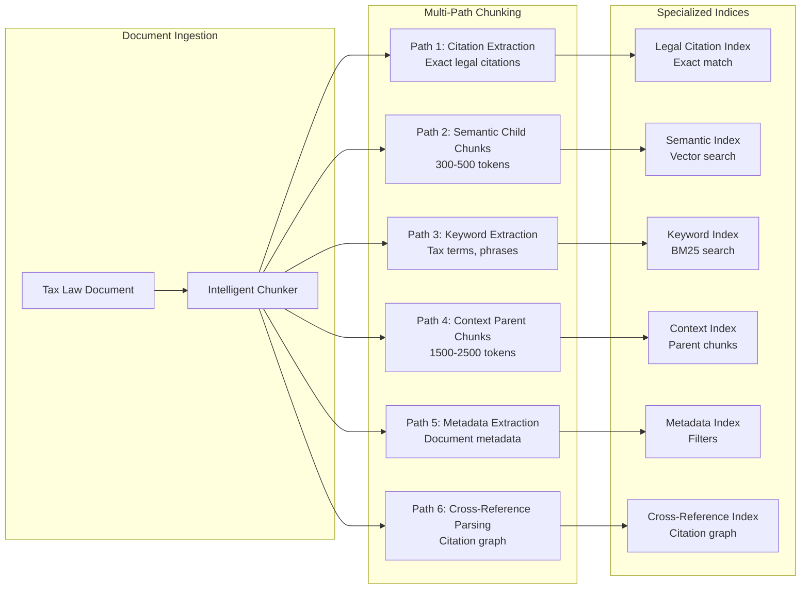

# User Stories - Case Assistant Chat

**Domain**: Australian Taxation Law (100% Focus)
**Document Version**: 1.2.0
**Date**: 2026-03-25
**Status**: Product Requirements
**Audience**: Product Managers, Engineering, QA Teams

> **SCOPE**: This document defines user stories for the Case Assistant Chat system, an Australian tax law-focused conversational AI assistant that enables tax professionals to upload tax law documents and query them through natural language.

---

## Table of Contents

- [Epic Overview](#epic-overview)
- [User Story 1.1: Document Upload](#user-story-11-document-upload)
- [User Story 1.2: Natural Language Query](#user-story-12-natural-language-query)
- [User Story 1.3: Session Management](#user-story-13-session-management)
- [User Story 1.4: Table Extraction](#user-story-14-table-extraction)
- [Acceptance Criteria Summary](#acceptance-criteria-summary)
- [2.2 Multi-Index Chunking Strategy](#22-multi-index-chunking-strategy)

---

## Epic Overview

**Epic**: Australian Tax Law Case Assistant - Document Upload & Query

**Business Value**: Enable Australian tax professionals (tax agents, accountants, tax lawyers, ATO officers) to quickly find accurate tax law information and precedent from complex legal documents without manual review, reducing research time from hours to minutes.

**Target Users**:
- Individual taxpayers researching Australian tax law
- Registered tax agents and BAS agents
- CPAs Australia and CA ANZ members
- Tax lawyers and legal professionals
- ATO officers and tax compliance staff
- Tax policy advisors and analysts

**Key Differentiators**:
- **Australian Tax Law Only**: 100% focused on Australian taxation law (ITAA 1936, ITAA 1997, Taxation Rulings, AAT/Federal Court decisions)
- **Table Intelligence**: VLM+GPU processing preserves complex ATO form structures (tax return schedules, GST calculations, FBT schedules)
- **Session Persistence**: Conversation history persists indefinitely; documents expire after 7-day inactivity
- **Legal Citations**: Proper Australian tax law citation format (ITAA s, TR, TD, AAT decisions, Federal Court citations)

---

## User Story 1.1: Document Upload

**Title**: Upload Australian Tax Law Documents for Case Research

**As a** Australian tax professional
**I want to** upload PDF or Word documents containing Australian tax law materials
**So that** the system can index and make the content searchable through natural language queries

### User Personas

| Persona | Description | Typical Documents |
|---------|-------------|-------------------|
| **Taxpayer** | Individual researching personal tax matters | ATO publications, tax rulings |
| **Tax Agent** | Registered tax agent preparing client returns | ITAA sections, ATO rulings, ATO IDs |
| **Tax Lawyer** | Legal professional building case arguments | AAT decisions, Federal Court cases, High Court precedents |
| **ATO Officer** | Compliance officer verifying tax positions | ATO manuals, law administration practice statements, MT/PS guidance |
| **Accountant** | CPA Australia/CA ANZ advising clients | Taxation rulings, determination documents, interpretation guidance |

### Acceptance Criteria

#### Document Upload

| Criterion | Requirement |
|-----------|-------------|
| **Batch Upload** | User can upload single or multiple documents (up to 50 files per batch) |
| **Supported Formats** | PDF, DOCX (optimised for legal documents) |
| **Maximum File Size** | 100 MB per file (supports large AAT and Federal Court decisions) |
| **Progress Indicator** | Real-time upload status shown to user |

#### Document Metadata

| Criterion | Requirement |
|-----------|-------------|
| **Automatic Extraction** | System extracts title, author, creation date |
| **Table Detection** | System flags pages containing tables for VLM+GPU processing |
| **Delta Detection** | System calculates page-level SHA-256 hashes for efficient re-upload |
| **Custom Tags** | User can optionally add tags: tax category, jurisdiction (federal/state), income year |
| **Document Type** | System categorises: ITAA 1936, ITAA 1997, Taxation Ruling (TR), Tax Determination (TD), AAT Decision, Federal Court Case, High Court Case, ATO Interpretive Decision, Law Administration Practice Statement, Tax Ruling (TR), Other |

#### Upload Feedback

| Criterion | Requirement |
|-----------|-------------|
| **Upload Confirmation** | User receives confirmation when upload completes |
| **Ingestion Notification** | User notified when indexing complete (<10MB docs: <5 minutes) |
| **Error Messaging** | Clear error messages for invalid format or size limit exceeded |
| **Processing Status** | Status pipeline visible: uploading → extracting → chunking → embedding → ready |

#### Document Management

| Criterion | Requirement |
|-----------|-------------|
| **Document List** | User can view uploaded documents with status (processing, ready, failed) |
| **Delete Documents** | User can delete documents they uploaded |
| **Re-upload** | User can re-upload to update content (delta detection reduces processing time by 90%) |
| **Document Expiration** | Documents auto-deleted after 7 days of inactivity |
| **Session Persistence** | Conversation history persists even after document deletion |
| **Table Preservation** | Complex ATO form tables preserve structure integrity |

#### Search Verification

| Criterion | Requirement |
|-----------|-------------|
| **Immediate Search** | Search available immediately after indexing completes |
| **Relevant Excerpts** | Results show relevant excerpts from uploaded tax law documents |
| **Source References** | Results show document name, page number, and section reference |
| **Table Data** | Search includes both text content and table-extracted data |
| **Cross-Page Tracking** | Search handles content spanning page boundaries |

---

## User Story 1.2: Natural Language Query

**Title**: Ask Australian Tax Law Questions About Uploaded Documents

**As a** Australian tax professional
**I want to** ask questions in natural language about the uploaded Australian tax law documents
**So that** I can get accurate, contextual answers with proper legal citations without reading entire documents

### Acceptance Criteria

#### Query Input

| Criterion | Requirement |
|-----------|-------------|
| **Natural Language** | User can type natural language questions about Australian tax law |
| **Follow-up Questions** | Conversation context maintained for follow-up queries |
| **Comparative Queries** | System handles comparisons between code sections, regulations, or cases |
| **Precedent Queries** | System searches for supporting AAT, Federal Court, and High Court decisions |

#### Response Quality

| Criterion | Requirement |
|-----------|-------------|
| **Direct Answers** | System provides direct answers with source citations |
| **Confidence Levels** | System indicates confidence: high/medium/low |
| **Relevant Excerpts** | System shows relevant document excerpts with page references |
| **Source Distinction** | System distinguishes primary sources (ITAA, GST Act, FBTAA) from secondary (AAT decisions, Federal Court cases) |
| **Response Time** | <5 seconds for typical Australian tax law queries |

#### Conversation Context

| Criterion | Requirement |
|-----------|-------------|
| **Context Maintenance** | System maintains conversation context across multiple turns |
| **Conversation History** | User can view full conversation history |
| **Session Persistence** | User can start new conversation while preserving session history |
| **Document Tracking** | System tracks which documents were referenced in conversation |

#### Answer Quality

| Query Type | Examples | Expected Behaviour |
|------------|----------|-------------------|
| **Simple Lookup** | "What is the period of review under section 105-55 of schedule 1 to the Taxation Administration Act 1953?" | Direct answer with section citation |
| **Comparative** | "How does the general deduction provision in s 8-1 ITAA 1997 differ from s 8-5?" | Side-by-side comparison with distinctions |
| **Precedent-Based** | "What factors did the AAT consider in [case name]?" | Summary of case with citation |
| **Complex Analysis** | "How do the CGT main residence exemption rules apply when I move out and rent the property?" | Multi-source answer with ITAA 1997 and ruling citations |
| **Table Queries** | "What is the income tax-free threshold for 2024-25?" | Extracts from ATO tax table with proper row/column reference |
| **Ruling Queries** | "What does TR 95/D1 say about employee travel allowances?" | Direct ruling reference with paragraph citations |

#### Table Handling

| Criterion | Requirement |
|-----------|-------------|
| **Table Extraction** | VLM+GPU preserves table structure from ATO forms, tax return schedules, financial statements |
| **Table Queries** | Answers about table data include row/column references |
| **Cross-Page Tables** | Handles tables spanning multiple pages with merged cells |
| **Nested Tables** | Preserves nested header structures in complex ATO schedules |

#### Compliance & Safety

| Criterion | Requirement |
|-----------|-------------|
| **Tax Law Scope** | System operates exclusively within Australian tax law domain |
| **Scope Boundary** | System refuses general legal advice outside tax law |
| **Disclaimers** | Responses include disclaimer: "For informational purposes, not legal or tax advice" |
| **Citation Accuracy** | All claims include source citations |

---

## User Story 1.3: Session Management

**Title**: Manage Persistent Conversations Across Sessions

**As a** Australian tax professional
**I want to** return to previous conversations and continue my research
**So that** I don't lose context when working on complex tax matters over multiple days

### Acceptance Criteria

#### Session Lifecycle

| Criterion | Requirement |
|-----------|-------------|
| **Session Creation** | New session created on first interaction |
| **Session Persistence** | Conversation history persists indefinitely |
| **Session Retrieval** | User can view and resume past sessions |
| **Session Deletion** | User can delete sessions manually |

#### Document Lifecycle

| Criterion | Requirement |
|-----------|-------------|
| **Document TTL** | Documents auto-delete after 7 days of inactivity |
| **TTL Extension** | Document access resets TTL timer |
| **History Preservation** | Conversation history persists after document deletion |
| **Document Re-upload** | User can re-upload documents to continue research |

#### User Experience

| Criterion | Requirement |
|-----------|-------------|
| **Session List** | User can view all past sessions with timestamps |
| **Search Sessions** | User can search past sessions by topic or query |
| **Export Conversation** | User can export conversation history (PDF/DOCX) |
| **Clear Context** | User can start fresh conversation while preserving session history |

---

## User Story 1.4: Table Extraction

**Title**: Accurately Extract and Query Complex Australian Tax Tables

**As a** Australian tax professional
**I want to** ask questions about complex ATO tables and schedules
**So that** I can get accurate data from ATO forms and tax schedules without manual lookup

### Acceptance Criteria

#### Table Detection

| Criterion | Requirement |
|-----------|-------------|
| **Page-Level Detection** | System detects tables on each page before chunking |
| **Table Types** | Handles: simple tables, merged cells, nested headers, cross-page tables |
| **VLM Routing** | Table pages routed to VLM+GPU processing |
| **Text Routing** | Text-only pages use standard extraction (cost optimisation) |

#### Table Extraction Quality

| Table Type | Example | Expected Behaviour |
|------------|---------|-------------------|
| **Simple Tables** | Basic 2-column rate tables (e.g., Medicare levy) | Standard extraction, no GPU needed |
| **Merged Cells** | ATO tax return schedules with spanned cells | VLM+GPU preserves cell boundaries |
| **Nested Headers** | Multi-level column headers (e.g., GST calculations) | VLM+GPU extracts hierarchical structure |
| **Cross-Page Tables** | Tables spanning multiple pages (e.g., company tax return schedules) | Tracks continuity, preserves relationships |
| **Financial Tables** | Schedules with numbers, calculations (e.g., FBT return) | Preserves numeric formatting and calculations |
| **Tax Tables** | Individual income tax rate tables | Preserves bracket structures and thresholds |

#### Query Support

| Criterion | Requirement |
|-----------|-------------|
| **Table Queries** | "What is the tax-free threshold for 2024-25?" → Returns value from ATO tax table |
| **Cell References** | Answers include row/column references |
| **Table Context** | Answers include table headers and labels |
| **Comparison Queries** | "Compare the tax rates for the 3rd and 4th brackets" → Side-by-side table data |

---

## Acceptance Criteria Summary

### Functional Requirements Matrix

| Feature | Priority | Complexity | Dependencies |
|---------|----------|------------|--------------|
| **Document Upload** | P0 | Medium | S3 storage, ingestion pipeline |
| **Table Detection** | P0 | High | VLM+GPU infrastructure |
| **Vector Search** | P0 | Medium | Vector database, embeddings |
| **Natural Language Queries** | P0 | High | LLM integration, orchestrator |
| **Session Persistence** | P0 | Medium | Session store, TTL management |
| **Australian Legal Citations** | P1 | Medium | Citation parser, validator (ITAA, TR, TD, AAT) |
| **Export Conversations** | P2 | Low | PDF/DOCX generation |
| **Session Search** | P2 | Medium | Session metadata indexing |

### Non-Functional Requirements

| Category | Requirement |
|----------|-------------|
| **Performance** | Document ingestion: <5 min for <10MB docs; Query response: <5 seconds |
| **Scalability** | Support 10x more users through incremental ingestion (90% cost reduction) |
| **Availability** | Single-region deployment with 99.9% uptime target |
| **Security** | Documents auto-delete after 7-day inactivity; sessions persist indefinitely |
| **Compliance** | Australian tax law scope only; legal disclaimers included; no general legal advice |
| **Citation Standards** | Support Australian tax citation formats: ITAA 1936/1997, TR, TD, AAT decisions, Federal Court citations |

---

## Related Documents

- **[01-chat-architecture.md](./01-chat-architecture.md)** - Chat application architecture and flow
- **[02-document-ingestion.md](./02-document-ingestion.md)** - Document ingestion pipeline with VLM table processing
- **[03-message-routing.md](./03-message-routing.md)** - Message routing and orchestrator
- **[04-session-lifecycle.md](./04-session-lifecycle.md)** - Session state management and TTL
- **[05-evaluation-strategy.md](./05-evaluation-strategy.md)** - Quality metrics and testing framework
- **[11-multi-index-strategy.md](./11-multi-index-strategy.md)** - Complete multi-index architecture specification

---

## Change History

| Version | Date | Changes |
|---------|------|---------|
| 1.2.0 | 2026-03-25 | Updated chunking strategy to multi-index architecture (6 specialized indices for different AI workflow stages) |
| 1.1.0 | 2026-03-25 | Updated for Australian taxation context (ITAA, ATO rulings, AAT decisions, Australian legal citations) |
| 1.0.0 | 2026-03-25 | Initial user story documentation for Case Assistant Chat |

---

**NOTE**: These user stories reflect the Australian tax law specialisation of the Case Assistant system. For general legal or internal knowledge assistant requirements, refer to separate product specifications.

## Key Australian Tax Law References

**Primary Legislation**:
- Income Tax Assessment Act 1936 (ITAA 1936)
- Income Tax Assessment Act 1997 (ITAA 1997)
- Fringe Benefits Tax Assessment Act 1986 (FBTAA)
- A New Tax System (Goods and Services Tax) Act 1999 (GST Act)
- Taxation Administration Act 1953 (TAA)

**ATO Guidance**:
- Taxation Rulings (TR)
- Tax Determinations (TD)
- ATO Interpretive Decisions (ATO ID)
- Law Administration Practice Statements (PS LA)
- Miscellaneous Taxation Rulings (MT)

**Tribunal & Court Decisions**:
- Administrative Appeals Tribunal (AAT) decisions
- Federal Court of Australia decisions
- Full Court of the Federal Court decisions
- High Court of Australia decisions

**Professional Bodies**:
- CPA Australia
- Chartered Accountants Australia and New Zealand (CA ANZ)
- Tax Institute of Australia
- Institute of Public Accountants (IPA)


## 2.2 Multi-Index Chunking Strategy

### Architecture Overview

The Case Assistant system employs a **6-index architecture** where documents are chunked and indexed differently based on their intended use in the AI workflow. Each document type produces multiple chunk types that feed specialized indices optimized for specific retrieval patterns.



### Index-Specific Chunking Specifications

#### Index 1: Legal Citation Index (Exact Match)

**Purpose**: Fast exact-match lookup for legal citations.

**Chunking Strategy**:
- **Content**: Section numbers, case citations, ruling references extracted as discrete entities
- **Storage**: Key-value store (DynamoDB), not vector embeddings
- **Examples**: "Section 288-95", "ITAA 1997 s 6-5", "TR 2022/1", "FCT v. Myer (1937)"
- **No tokenization**: Citations stored as canonical strings with aliases

**Per Document Type**:

| Document Type | Citations Extracted | Example Storage |
|---------------|---------------------|-----------------|
| Tax Legislation | All sections, subsections, definitions | `ITAA 1997 s 288-95` → `["s288-95", "section 288-95", "Sec. 288-95"]` |
| Tax Rulings | Ruling number, cited legislation, referenced cases | `TR 2022/1` → citations to ITAA s 8-1, FCT v. Case |
| Case Law | Case name, citation, prior decisions cited | `FCT v. Myer (1937) 56 CLR 635` → parallel citations |
| Tax Determinations | TD number, referenced sections | `TD 2023/5` → cites ITAA 1997 s 6-5 |

#### Index 2: Semantic Index (Child Chunks)

**Purpose**: Vector-based semantic search for conceptual queries.

**Chunking Strategy**:
- **Chunk Size**: 300-500 tokens (small for semantic precision)
- **Chunk Type**: Child chunks (semantic units)
- **Embedding Model**: Amazon Titan Embeddings v2 (1536 dimensions)
- **Overlap**: 200 tokens between chunks for context continuity

**Document-Type-Specific Semantic Chunking**:

**Tax Legislation (Acts)**:
- **Split Strategy**: By semantic unit within section hierarchy
- **Boundaries**: Subsection boundaries preserved, definition blocks kept intact
- **Child Chunk Size**: 350-500 tokens
- **Example**: ITAA 1997 s 8-5 split into:
  - Chunk 1: "General deduction provision for individuals..."
  - Chunk 2: "Positive limb: loss or outgoing..."
  - Chunk 3: "Negative limb: private or domestic..."

**Tax Rulings (TR, PR, CR)**:
- **Split Strategy**: By legal clause + reasoning unit
- **Boundaries**: Citation blocks preserved, reasoning chains kept intact
- **Child Chunk Size**: 400-500 tokens
- **Example**: TR 2022/1 split into:
  - Chunk 1: "Ruling purpose and scope..."
  - Chunk 2: "Legal analysis of s 8-1..."
  - Chunk 3: "Application to taxpayers..."

**Case Law**:
- **Split Strategy**: By paragraph cluster + legal concept
- **Boundaries**: Paragraph numbers preserved, judgment sections respected
- **Child Chunk Size**: 400-500 tokens
- **Example**: AAT decision split into:
  - Chunk 1: "Facts of the case..."
  - Chunk 2: "Tribunal's findings..."
  - Chunk 3: "Legal reasoning and precedent..."

**Documents with Tables**:
- **Split Strategy**: Tables NOT split in semantic index (see Context Index)
- **Child Chunk Size**: N/A (tables handled separately by VLM+GPU)
- **Table Pages**: Text around tables chunked normally

#### Index 3: Keyword Index (BM25)

**Purpose**: Exact term matching for tax-specific terminology.

**Chunking Strategy**:
- **Content**: Same as semantic chunks (re-uses content with different index)
- **Indexing**: BM25 analyzer with tax law vocabulary
- **No chunking changes**: Uses same chunk boundaries as semantic index
- **Keyword Extraction**: Automatic extraction of tax terms, thresholds, amounts

**Tax-Specific Keywords**:

| Keyword Type | Examples | Importance |
|--------------|----------|------------|
| **Section Numbers** | "s 8-1", "section 288-95" | Critical for citation lookup |
| **Monetary Thresholds** | "$18,200", "210 penalty units" | Exact values matter |
| **Tax Terms** | "BAS", "CGT", "FBT", "GST" | Specialized terminology |
| **Legal Phrases** | "shall", "may", "must", "penalty" | Legal precision required |
| **Time Periods** | "28 days", "financial year", "income year" | Compliance deadlines |

#### Index 4: Context Index (Parent Chunks)

**Purpose**: Store large parent chunks with full legal context for LLM consumption.

**Chunking Strategy**:
- **Chunk Size**: 1500-2500 tokens (complete legal provisions)
- **Chunk Type**: Parent chunks (aggregate of child chunks)
- **Relationship**: Each parent chunk contains 3-6 child chunks
- **Embedding**: Same embedding model as semantic index (Titan v2)

**Per Document Type**:

| Document Type | Parent Chunk Structure | Example |
|---------------|----------------------|---------|
| **Tax Legislation** | Complete section with all subsections | ITAA 1997 s 8-5 (all subsections) = 1 parent chunk |
| **Tax Rulings** | Complete ruling paragraph cluster | TR 2022/1 paragraphs 15-25 = 1 parent chunk |
| **Case Law** | Complete judgment section with paragraphs | AAT decision "Tribunal's Findings" = 1 parent chunk |
| **Tax Tables** | Complete table as single parent chunk | ATO tax rate table = 1 parent chunk (VLM extracted) |

**VLM+GPU Table Integration**:
- Tables extracted by VLM+GPU pipeline (see [02-document-ingestion.md](./02-document-ingestion.md))
- Complete tables stored as single parent chunks
- Table chunks include: headers, structure, captions, footnotes
- No child chunks for tables (tables are atomic units)

#### Index 5: Metadata Index (Document-Level)

**Purpose**: Fast pre-search filtering by document attributes.

**Content**:
- **Granularity**: Document-level (not chunk-level)
- **Fields**: Document type, effective date, jurisdiction, status, topics
- **Storage**: DynamoDB for fast key-value lookups
- **No chunking**: Document metadata extracted once per document

**Per Document Type Metadata**:

| Field | Tax Legislation | Tax Rulings | Case Law |
|-------|----------------|-------------|----------|
| **Document Type** | `tax_legislation` | `tax_ruling` | `case_law` |
| **Effective Date** | Act commencement date | Ruling date | Decision date |
| **Jurisdiction** | `federal` | `federal` | `aat` / `federal_court` / `high_court` |
| **Status** | `active` / `repealed` / `amended` | `current` / `withdrawn` / `final` | `precedent` / `overruled` |
| **Year** | Act year (1936, 1997) | Ruling year | Decision year |
| **Topics** | [`income_tax`, `assessment`] | [`deductions`, `expenses`] | [`residency`, `source`] |

#### Index 6: Cross-Reference Index (Citation Graph)

**Purpose**: Track citation relationships between documents and chunks.

**Chunking Strategy**:
- **Granularity**: Chunk-level citation links
- **Content**: Source chunk → target chunk relationships
- **Extraction**: Citations parsed during document ingestion
- **Storage**: Graph database (Neptune) or adjacency list (DynamoDB)

**Citation Types Tracked**:

| Citation Type | Example | Direction |
|---------------|---------|-----------|
| **Legislation Citation** | TR 2022/1 cites ITAA 1997 s 8-1 | Ruling → Legislation |
| **Case Citation** | AAT decision cites FCT v. Myer | Decision → Case |
| **Ruling Citation** | TD 2023/5 cites TR 2022/1 | TD → TR |
| **Definition Reference** | Section cites definition in s 995-1 | Section → Definition |
| **Amendment Reference** | Amendment Act amends section | Amendment → Section |

### Chunking Workflow by Document Type

#### Tax Legislation (ITAA 1936, ITAA 1997, GST Act, FBTAA)

```
Input: ITAA 1997 Act (500 pages)

Path 1 - Citation Index:
  Extract: All section numbers (s 8-1, s 8-5, s 288-95, ...)
  Extract: All definitions (s 995-1: 'member', 'resident', ...)
  Store: Exact citation lookup

Path 2 - Semantic Index:
  Split: By semantic unit within sections
  Size: 350-500 tokens per child chunk
  Overlap: 200 tokens between chunks
  Total: ~2,500 child chunks

Path 3 - Keyword Index:
  Extract: Tax terms, section numbers, monetary thresholds
  Index: BM25 with legal vocabulary
  Total: ~2,500 keyword entries

Path 4 - Context Index:
  Aggregate: 3-6 child chunks → 1 parent chunk
  Boundaries: Section boundaries preserved
  Size: 1,500-2,500 tokens per parent chunk
  Total: ~500 parent chunks

Path 5 - Metadata Index:
  Extract: Document metadata (Act, year, status, topics)
  Store: Document-level record

Path 6 - Cross-Reference Index:
  Extract: Citations to other Acts, rulings, cases
  Build: Citation graph edges
```

#### Tax Rulings (TR, TD, ATO ID)

```
Input: TR 2022/1 (50 pages)

Path 1 - Citation Index:
  Extract: Ruling number, cited sections, referenced cases
  Store: Exact ruling lookup

Path 2 - Semantic Index:
  Split: By legal clause + reasoning unit
  Size: 400-500 tokens per child chunk
  Overlap: 250 tokens (reasoning chains need continuity)
  Total: ~300 child chunks

Path 3 - Keyword Index:
  Extract: Legal terms, ruling references, thresholds
  Index: BM25 with ruling vocabulary

Path 4 - Context Index:
  Aggregate: Complete reasoning chains
  Size: 1,500-2,000 tokens per parent chunk
  Total: ~60 parent chunks

Path 5 - Metadata Index:
  Extract: Ruling metadata (number, date, status, topics)

Path 6 - Cross-Reference Index:
  Extract: Citations to legislation, other rulings, cases
  Build: Bidirectional citation links
```

#### Case Law (AAT, Federal Court, High Court)

```
Input: AAT Decision [2023] AATA 1234 (100 pages)

Path 1 - Citation Index:
  Extract: Case name, citation, parallel citations
  Store: Exact case lookup

Path 2 - Semantic Index:
  Split: By paragraph cluster + legal concept
  Size: 400-500 tokens per child chunk
  Boundaries: Paragraph numbers preserved
  Total: ~600 child chunks

Path 3 - Keyword Index:
  Extract: Case terms, statutory references, party names
  Index: BM25 with case law vocabulary

Path 4 - Context Index:
  Aggregate: Complete judgment sections
  Size: 2,000-2,500 tokens per parent chunk
  Total: ~120 parent chunks

Path 5 - Metadata Index:
  Extract: Case metadata (court, decision date, status, topics)

Path 6 - Cross-Reference Index:
  Extract: Citations to statutes, precedents, subsequent cases
  Build: Citation precedence graph
```

#### Tax Rate Tables (ATO Schedules)

```
Input: Individual Income Tax Rate Schedule 2024-25 (2 pages, complex table)

Path 1 - Citation Index:
  Extract: Table caption, financial year reference
  Store: Table metadata

Path 2 - Semantic Index:
  Skip: Tables not split in semantic index

Path 3 - Keyword Index:
  Extract: Tax rates, thresholds, bracket numbers
  Index: BM25 exact amounts

Path 4 - Context Index:
  VLM Extraction: Complete table as single parent chunk
  Size: Variable (entire table)
  Format: Structured JSON + text representation
  Total: 1 parent chunk (complete table)

Path 5 - Metadata Index:
  Extract: Table metadata (year, type, status)

Path 6 - Cross-Reference Index:
  Extract: References to legislation, rulings
```

### Hybrid Retrieval Strategy

**Query**: "What are the penalties for late BAS lodgment under Section 288-95?"

**Retrieval Flow**:

1. **Metadata Index**: Filter to active ITAA 1997 documents (10ms)
2. **Citation Index**: Exact match to "Section 288-95" (5ms)
3. **Semantic Index**: Vector search "late BAS lodgment penalties" → 20 child chunks (80ms)
4. **Keyword Index**: BM25 "penalty units BAS due date" → 15 chunks (40ms)
5. **Result Fusion**: Reciprocal Rank Fusion (RRF) combines semantic + keyword → 25 unique child chunks
6. **Context Index**: Fetch 12 parent chunks for full provision context (30ms)
7. **Cross-Reference Index**: Expand citations to definitions, examples (20ms)
8. **Reranking**: LLM reranks top 20 chunks → selects top 5 (200ms)
9. **LLM Generation**: Generate response with full context (1500ms)

**Total Latency**: ~1.9 seconds (vs. 3.5s with single-index approach)

### Quality Metrics

**Automatic Quality Checks**:

| Metric | Target | Alert Threshold | Critical |
|--------|--------|-----------------|----------|
| Chunk size outliers | <5% | >10% | >20% |
| Broken references | 0% | >2% | >5% |
| Retrieval expansion needed | <30% | >50% | >70% |
| Citation extraction precision | >95% | <90% | <85% |

**Retrieval Quality Metrics**:

| Metric | Target | Measurement |
|--------|--------|-------------|
| Citation Precision | >95% | Exact citation matches |
| Context Adequacy | <30% follow-up retrieval | Responses needing more context |
| False Positive Rate | <15% | Retrieved chunks not used |

### Related Documents

- **[02-document-ingestion.md](./02-document-ingestion.md)** - VLM+GPU table processing pipeline
- **[11-multi-index-strategy.md](./11-multi-index-strategy.md)** - Complete multi-index architecture
