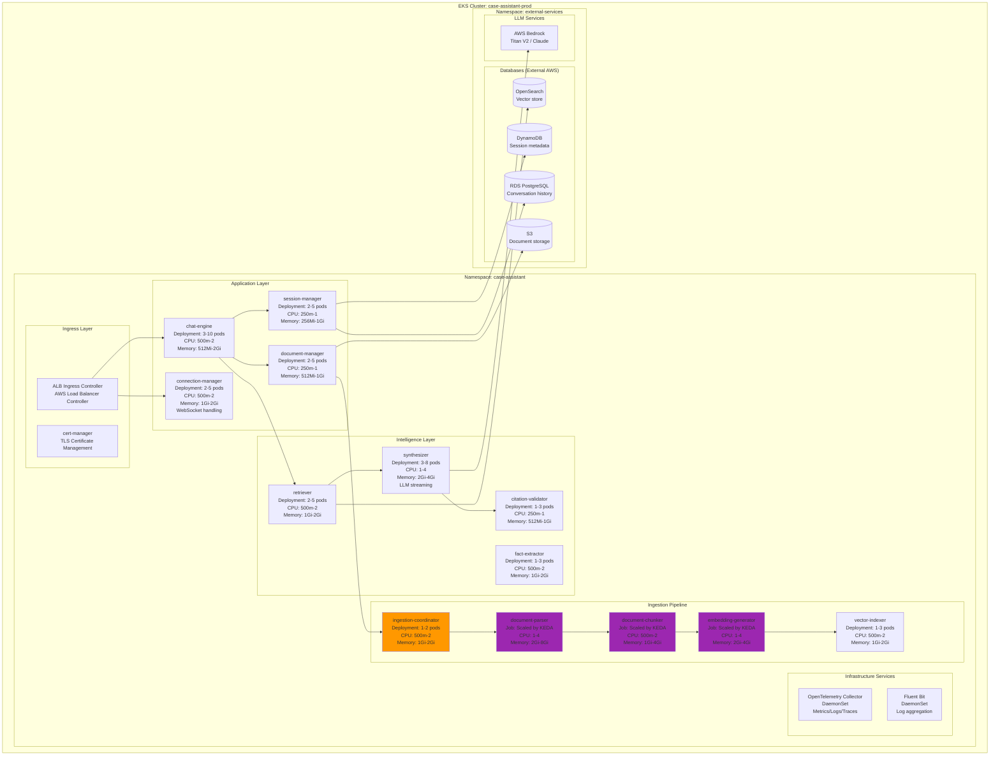
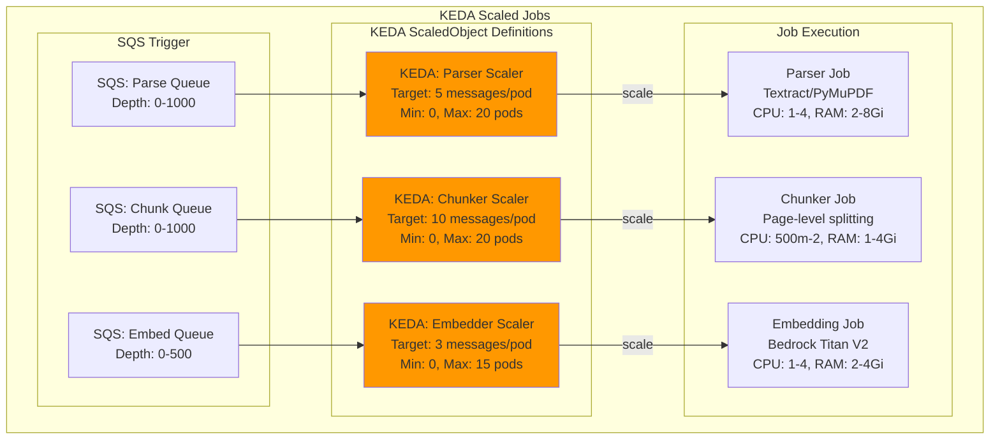
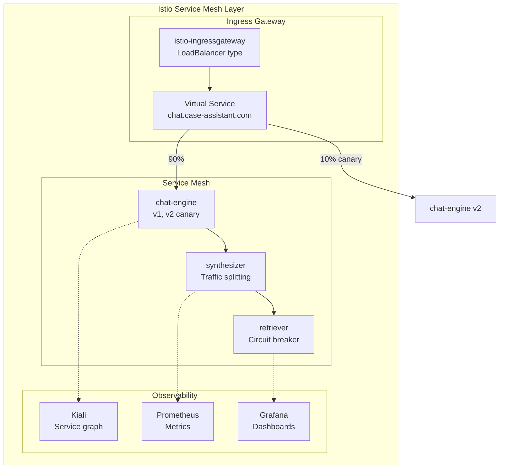

# Kubernetes Deployment Architecture

## Table of Contents

- [10.1 Kubernetes Architecture Overview](#101-kubernetes-architecture-overview)
- [10.2 Component Deployment Patterns](#102-component-deployment-patterns)
- [10.3 Resource Management](#103-resource-management)
- [10.4 Ingestion Pipeline on Kubernetes](#104-ingestion-pipeline-on-kubernetes)
- [10.5 Storage & State Management](#105-storage--state-management)
- [10.6 Networking & Service Mesh](#106-networking--service-mesh)
- [10.7 Observability in Kubernetes](#107-observability-in-kubernetes)
- [10.8 Security & Compliance](#108-security--compliance)
- [10.9 CI/CD & GitOps](#109-cicd--gitops)

---

## 10.1 Kubernetes Architecture Overview

### Deployment Model

The Case Assistant system deploys on **Amazon EKS** (Elastic Kubernetes Service) with a hybrid approach:



### Architecture Principles

| Principle | Implementation |
|-----------|----------------|
| **Cloud-Native** | Stateless services where possible, external managed databases |
| **GitOps** | Declarative config with ArgoCD, version-controlled in Git |
| **Horizontal Scaling** | HPA for CPU/memory, KEDA for event-driven scaling |
| **Resource Efficiency** | Right-sized requests/limits, bin-packing for cost optimization |
| **Zero-Downtime** | Rolling updates, pod disruption budgets, readiness probes |
| **Observability First** | OpenTelemetry everywhere, structured logs, distributed traces |

---

## 10.2 Component Deployment Patterns

### Stateless Services (Deployments)

```yaml
# chat-engine-deployment.yaml
apiVersion: apps/v1
kind: Deployment
metadata:
  name: chat-engine
  namespace: case-assistant
  labels:
    app: chat-engine
    version: v1
spec:
  replicas: 3
  strategy:
    type: RollingUpdate
    rollingUpdate:
      maxSurge: 1
      maxUnavailable: 0
  selector:
    matchLabels:
      app: chat-engine
  template:
    metadata:
      labels:
        app: chat-engine
        version: v1
      annotations:
        prometheus.io/scrape: "true"
        prometheus.io/port: "9090"
        prometheus.io/path: "/metrics"
    spec:
      serviceAccountName: chat-engine
      securityContext:
        runAsNonRoot: true
        runAsUser: 1000
        fsGroup: 1000
      containers:
      - name: chat-engine
        image: ${ECR_REGISTRY}/chat-engine:${IMAGE_TAG}
        ports:
        - name: http
          containerPort: 8080
          protocol: TCP
        - name: grpc
          containerPort: 9090
          protocol: TCP
        env:
        - name: LOG_LEVEL
          value: "info"
        - name: OTEL_EXPORTER_OTLP_ENDPOINT
          value: "http://otel-collector:4317"
        envFrom:
        - configMapRef:
            name: chat-engine-config
        - secretRef:
            name: chat-engine-secrets
        resources:
          requests:
            cpu: 500m
            memory: 512Mi
          limits:
            cpu: 2000m
            memory: 2Gi
        livenessProbe:
          httpGet:
            path: /healthz
            port: http
          initialDelaySeconds: 30
          periodSeconds: 10
          timeoutSeconds: 5
          failureThreshold: 3
        readinessProbe:
          httpGet:
            path: /readyz
            port: http
          initialDelaySeconds: 10
          periodSeconds: 5
          timeoutSeconds: 3
          failureThreshold: 2
        volumeMounts:
        - name: tmp
          mountPath: /tmp
      volumes:
      - name: tmp
        emptyDir: {}
      terminationGracePeriodSeconds: 30
```

### Horizontal Pod Autoscaler

```yaml
# chat-engine-hpa.yaml
apiVersion: autoscaling/v2
kind: HorizontalPodAutoscaler
metadata:
  name: chat-engine-hpa
  namespace: case-assistant
spec:
  scaleTargetRef:
    apiVersion: apps/v1
    kind: Deployment
    name: chat-engine
  minReplicas: 3
  maxReplicas: 10
  metrics:
  - type: Resource
    resource:
      name: cpu
      target:
        type: Utilization
        averageUtilization: 70
  - type: Resource
    resource:
      name: memory
      target:
        type: Utilization
        averageUtilization: 80
  behavior:
    scaleDown:
      stabilizationWindowSeconds: 300
      policies:
      - type: Percent
        value: 50
        periodSeconds: 60
    scaleUp:
      stabilizationWindowSeconds: 0
      policies:
      - type: Percent
        value: 100
        periodSeconds: 30
      - type: Pods
        value: 2
        periodSeconds: 30
      selectPolicy: Max
```

### Pod Disruption Budget

```yaml
# chat-engine-pdb.yaml
apiVersion: policy/v1
kind: PodDisruptionBudget
metadata:
  name: chat-engine-pdb
  namespace: case-assistant
spec:
  minAvailable: 2
  selector:
    matchLabels:
      app: chat-engine
```

### Service Definitions

```yaml
# chat-engine-service.yaml
apiVersion: v1
kind: Service
metadata:
  name: chat-engine
  namespace: case-assistant
  labels:
    app: chat-engine
  annotations:
    service.beta.kubernetes.io/aws-load-balancer-type: "nlb"
spec:
  type: ClusterIP
  ports:
  - name: http
    port: 80
    targetPort: http
    protocol: TCP
  - name: grpc
    port: 9090
    targetPort: grpc
    protocol: TCP
  selector:
    app: chat-engine
---
apiVersion: v1
kind: Service
metadata:
  name: chat-engine-headless
  namespace: case-assistant
  labels:
    app: chat-engine
spec:
  type: ClusterIP
  clusterIP: None
  ports:
  - name: http
    port: 80
    targetPort: http
  selector:
    app: chat-engine
```

---

## 10.3 Resource Management

### Resource Profiles by Component

| Component | CPU Request | CPU Limit | Memory Request | Memory Limit | Scaling |
|-----------|-------------|-----------|----------------|--------------|---------|
| **chat-engine** | 500m | 2 | 512Mi | 2Gi | 3-10 pods |
| **session-manager** | 250m | 1 | 256Mi | 1Gi | 2-5 pods |
| **document-manager** | 250m | 1 | 512Mi | 1Gi | 2-5 pods |
| **connection-manager** | 500m | 2 | 1Gi | 2Gi | 2-5 pods |
| **retriever** | 500m | 2 | 1Gi | 2Gi | 2-5 pods |
| **synthesizer** | 1 | 4 | 2Gi | 4Gi | 3-8 pods |
| **citation-validator** | 250m | 1 | 512Mi | 1Gi | 1-3 pods |
| **fact-extractor** | 500m | 2 | 1Gi | 2Gi | 1-3 pods |
| **ingestion-coordinator** | 500m | 2 | 1Gi | 2Gi | 1-2 pods |
| **document-parser (Job)** | 1-4 | 4-8 | 2Gi | 8Gi | KEDA: 0-20 |
| **document-chunker (Job)** | 500m-2 | 2-4 | 1Gi | 4Gi | KEDA: 0-20 |
| **embedding-generator (Job)** | 1-4 | 4-8 | 2Gi | 4Gi | KEDA: 0-20 |
| **vector-indexer** | 500m | 2 | 1Gi | 2Gi | 1-3 pods |

### Node Pool Strategy

```mermaid
graph TB
    subgraph "EKS Node Groups"
        subgraph "Node Group: critical (m5.large)"
            CRIT1[m5.large - 2 vCPU, 8Gi RAM]
            CRIT2[m5.large - 2 vCPU, 8Gi RAM]
            CRIT3[m5.large - 2 vCPU, 8Gi RAM]
        end

        subgraph "Node Group: standard (m5.xlarge)"
            STD1[m5.xlarge - 4 vCPU, 16Gi RAM]
            STD2[m5.xlarge - 4 vCPU, 16Gi RAM]
            STD3[m5.xlarge - 4 vCPU, 16Gi RAM]
        end

        subgraph "Node Group: compute-optimized (c5.2xlarge)"
            COMP1[c5.2xlarge - 8 vCPU, 16Gi RAM]
            COMP2[c5.2xlarge - 8 vCPU, 16Gi RAM]
        end

        subgraph "Node Group: memory-optimized (r5.2xlarge)"
            MEM1[r5.2xlarge - 8 vCPU, 64Gi RAM]
            MEM2[r5.2xlarge - 8 vCPU, 64Gi RAM]
        end

        subgraph "Node Group: gpu-inf (g4dn.xlarge)"
            GPU1[g4dn.xlarge - 4 vCPU, 16Gi RAM, 1 T4 GPU]
            GPU2[g4dn.xlarge - 4 vCPU, 16Gi RAM, 1 T4 GPU]
        end
    end

    CRIT1 --> |chat-engine, session-mgr| CRIT_PODS[Critical Pods]
    STD1 --> |retriever, synthesizer| STD_PODS[Standard Pods]
    COMP1 --> |synthesizer, embedding-gen| COMP_PODS[CPU-Intensive Jobs]
    MEM1 --> |document-parser, chunker| MEM_PODS[Memory-Intensive Jobs]
    GPU1 --> |VLM table processing| GPU_PODS[GPU Jobs]
```



### Node Selector & Tolerations

```yaml
# For GPU-intensive parsing jobs
apiVersion: batch/v1
kind: Job
metadata:
  name: document-parser-gpu
spec:
  template:
    spec:
      nodeSelector:
        node.kubernetes.io/instance-type: g4dn.xlarge
      tolerations:
      - key: nvidia.com/gpu
        operator: Exists
        effect: NoSchedule
      containers:
      - name: parser
        resources:
          limits:
            nvidia.com/gpu: 1
```

### Resource Quotas per Namespace

```yaml
# resource-quota.yaml
apiVersion: v1
kind: ResourceQuota
metadata:
  name: compute-resources
  namespace: case-assistant
spec:
  hard:
    requests.cpu: "20"
    requests.memory: 40Gi
    limits.cpu: "50"
    limits.memory: 100Gi
    persistentvolumeclaims: "10"
---
apiVersion: v1
kind: LimitRange
metadata:
  name: default-limits
  namespace: case-assistant
spec:
  limits:
  - default:
      cpu: 500m
      memory: 512Mi
    defaultRequest:
      cpu: 250m
      memory: 256Mi
    type: Container
```

---

## 10.4 Ingestion Pipeline on Kubernetes

### KEDA-Based Scaling for Ingestion Jobs



### KEDA ScaledObject Definition

```yaml
# parser-keda.yaml
apiVersion: keda.sh/v1alpha1
kind: ScaledObject
metadata:
  name: parser-scaledobject
  namespace: case-assistant
spec:
  scaleTargetRef:
    name: document-parser-job
    jobTargetRef:
      parallelism: 1
      completions: 1
      backoffLimit: 3
  minReplicaCount: 0
  maxReplicaCount: 20
  pollingInterval: 30
  cooldownPeriod: 300
  triggers:
  - type: aws-sqs-queue
    metadata:
      queueURL: https://sqs.${AWS_REGION}.amazonaws.com/${ACCOUNT_ID}/case-assistant-parse-queue
      queueLength: "5"
      awsRegion: "${AWS_REGION}"
      identityOwner: operator
  advanced:
    horizontalPodAutoscalerConfig:
      behavior:
        scaleDown:
          stabilizationWindowSeconds: 300
          policies:
          - type: Percent
            value: 50
            periodSeconds: 60
        scaleUp:
          stabilizationWindowSeconds: 0
          policies:
          - type: Percent
            value: 100
            periodSeconds: 30
```

### Ingestion Job Definition

```yaml
# document-parser-job.yaml
apiVersion: batch/v1
kind: Job
metadata:
  name: document-parser-job
  namespace: case-assistant
spec:
  template:
    metadata:
      labels:
        app: document-parser
    spec:
      restartPolicy: OnFailure
      serviceAccountName: ingestion-service-account
      securityContext:
        runAsNonRoot: true
        runAsUser: 1000
      containers:
      - name: parser
        image: ${ECR_REGISTRY}/document-parser:${IMAGE_TAG}
        command:
        - /app/parser
        - --s3-bucket=$(S3_BUCKET)
        - --s3-key=$(S3_KEY)
        - --output-queue=$(CHUNK_QUEUE_URL)
        env:
        - name: S3_BUCKET
          value: "case-assistant-documents-${ENVIRONMENT}"
        - name: S3_KEY
          valueFrom:
            fieldRef:
              fieldPath: metadata.annotations['s3-key']
        - name: CHUNK_QUEUE_URL
          valueFrom:
            secretKeyRef:
              name: sqs-urls
              key: chunk-queue-url
        - name: TABLE_DETECTION_ENABLED
          value: "true"
        - name: VLM_ENDPOINT
          valueFrom:
            secretKeyRef:
              name: bedrock-config
              key: vlm-endpoint
        envFrom:
        - configMapRef:
            name: parser-config
        resources:
          requests:
            cpu: 1000m
            memory: 2Gi
          limits:
            cpu: 4000m
            memory: 8Gi
        volumeMounts:
        - name: workspace
          mountPath: /workspace
      volumes:
      - name: workspace
        emptyDir:
          sizeLimit: 10Gi
      activeDeadlineSeconds: 3600
      backoffLimit: 3
```

### Ingestion Coordinator Deployment

```yaml
# ingestion-coordinator-deployment.yaml
apiVersion: apps/v1
kind: Deployment
metadata:
  name: ingestion-coordinator
  namespace: case-assistant
spec:
  replicas: 1
  strategy:
    type: RollingUpdate
  selector:
    matchLabels:
      app: ingestion-coordinator
  template:
    metadata:
      labels:
        app: ingestion-coordinator
    spec:
      serviceAccountName: ingestion-service-account
      containers:
      - name: coordinator
        image: ${ECR_REGISTRY}/ingestion-coordinator:${IMAGE_TAG}
        ports:
        - name: http
          containerPort: 8080
        env:
        - name: PARSE_QUEUE_URL
          valueFrom:
            secretKeyRef:
              name: sqs-urls
              key: parse-queue-url
        - name: REDIS_ENDPOINT
          valueFrom:
            secretKeyRef:
              name: redis-config
              key: endpoint
        resources:
          requests:
            cpu: 500m
            memory: 1Gi
          limits:
            cpu: 2000m
            memory: 2Gi
        livenessProbe:
          httpGet:
            path: /healthz
            port: http
          initialDelaySeconds: 30
        readinessProbe:
          httpGet:
            path: /readyz
            port: http
          initialDelaySeconds: 10
```

---

## 10.5 Storage & State Management

### Storage Classes

```yaml
# gp3-storage-class.yaml
apiVersion: storage.k8s.io/v1
kind: StorageClass
metadata:
  name: gp3-encrypted
  annotations:
    storageclass.kubernetes.io/is-default-class: "true"
provisioner: kubernetes.io/aws-ebs
parameters:
  type: gp3
  fsType: ext4
  encrypted: "true"
  kmsKeyId: ${KMS_KEY_ARN}
allowVolumeExpansion: true
reclaimPolicy: Delete
volumeBindingMode: WaitForFirstConsumer
---
apiVersion: storage.k8s.io/v1
kind: StorageClass
metadata:
  name: gp3-expanding
provisioner: kubernetes.io/aws-ebs
parameters:
  type: gp3
  fsType: ext4
  encrypted: "true"
  kmsKeyId: ${KMS_KEY_ARN}
allowVolumeExpansion: true
reclaimPolicy: Retain
volumeBindingMode: Immediate
```

### Persistent Volume Claims for Staging

```yaml
# ingestion-staging-pvc.yaml
apiVersion: v1
kind: PersistentVolumeClaim
metadata:
  name: ingestion-staging
  namespace: case-assistant
spec:
  accessModes:
  - ReadWriteMany
  storageClassName: gp3-encrypted
  resources:
    requests:
      storage: 100Gi
---
apiVersion: v1
kind: PersistentVolumeClaim
metadata:
  name: vector-cache
  namespace: case-assistant
spec:
  accessModes:
  - ReadWriteOnce
  storageClassName: gp3-expanding
  resources:
    requests:
      storage: 50Gi
```

### StatefulSet for Stateful Services (if needed)

```yaml
# Example: Redis for caching (if self-hosted)
apiVersion: apps/v1
kind: StatefulSet
metadata:
  name: redis
  namespace: case-assistant
spec:
  serviceName: redis-headless
  replicas: 3
  selector:
    matchLabels:
      app: redis
  template:
    metadata:
      labels:
        app: redis
    spec:
      containers:
      - name: redis
        image: redis:7-alpine
        ports:
        - name: redis
          containerPort: 6379
        resources:
          requests:
            cpu: 250m
            memory: 512Mi
          limits:
            cpu: 500m
            memory: 1Gi
        volumeMounts:
        - name: data
          mountPath: /data
  volumeClaimTemplates:
  - metadata:
      name: data
    spec:
      accessModes: [ "ReadWriteOnce" ]
      storageClassName: gp3-encrypted
      resources:
        requests:
          storage: 10Gi
```

---

## 10.6 Networking & Service Mesh

### Istio Service Mesh (Optional for Advanced Traffic Management)



### Virtual Service for Canary Deployment

```yaml
# chat-engine-vs.yaml
apiVersion: networking.istio.io/v1beta1
kind: VirtualService
metadata:
  name: chat-engine
  namespace: case-assistant
spec:
  hosts:
  - chat-engine
  http:
  - match:
    - headers:
        x-canary:
          exact: "true"
    route:
    - destination:
        host: chat-engine
        subset: v2
      weight: 100
  - route:
    - destination:
        host: chat-engine
        subset: v1
      weight: 95
    - destination:
        host: chat-engine
        subset: v2
      weight: 5
---
apiVersion: networking.istio.io/v1beta1
kind: DestinationRule
metadata:
  name: chat-engine
  namespace: case-assistant
spec:
  host: chat-engine
  subsets:
  - name: v1
    labels:
      version: v1
  - name: v2
    labels:
      version: v2
```

### Network Policies for Security

```yaml
# network-policy.yaml
apiVersion: networking.k8s.io/v1
kind: NetworkPolicy
metadata:
  name: case-assistant-policy
  namespace: case-assistant
spec:
  podSelector: {}
  policyTypes:
  - Ingress
  - Egress
  ingress:
  - from:
    - namespaceSelector:
        matchLabels:
          name: istio-system
    - podSelector:
        matchLabels:
          app: istio-ingressgateway
    ports:
    - protocol: TCP
      port: 8080
  egress:
  - to:
    - namespaceSelector: {}
    ports:
    - protocol: TCP
      port: 443  # AWS APIs
  - to:
    - podSelector:
        matchLabels:
          app: chat-engine
    ports:
    - protocol: TCP
      port: 8080
```

---

## 10.7 Observability in Kubernetes

### OpenTelemetry Collector Deployment

```yaml
# otel-collector-deployment.yaml
apiVersion: apps/v1
kind: Deployment
metadata:
  name: otel-collector
  namespace: case-assistant
  labels:
    app: otel-collector
spec:
  replicas: 1
  selector:
    matchLabels:
      app: otel-collector
  template:
    metadata:
      labels:
        app: otel-collector
    spec:
      containers:
      - name: otel-collector
        image: otel/opentelemetry-collector-contrib:0.91.0
        args:
        - --config=/etc/otelcol-contrib/config.yaml
        ports:
        - name: otlp-grpc
          containerPort: 4317
        - name: otlp-http
          containerPort: 4318
        volumeMounts:
        - name: config
          mountPath: /etc/otelcol-contrib
        resources:
          requests:
            cpu: 100m
            memory: 200Mi
          limits:
            cpu: 500m
            memory: 1Gi
      volumes:
      - name: config
        configMap:
          name: otel-collector-config
---
apiVersion: v1
kind: ConfigMap
metadata:
  name: otel-collector-config
  namespace: case-assistant
data:
  config.yaml: |
    receivers:
      otlp:
        protocols:
          grpc:
          http:
    processors:
      batch:
      memory_limiter:
        limit_mib: 512
    exporters:
      awsxray:
      prometheusremotewrite:
        endpoint: "http://prometheus-server:9090/api/v1/write"
    service:
      pipelines:
        traces:
          receivers: [otlp]
          processors: [batch, memory_limiter]
          exporters: [awsxray]
        metrics:
          receivers: [otlp]
          processors: [batch]
          exporters: [prometheusremotewrite]
```

### Prometheus ServiceMonitor

```yaml
# chat-engine-servicemonitor.yaml
apiVersion: monitoring.coreos.com/v1
kind: ServiceMonitor
metadata:
  name: chat-engine
  namespace: case-assistant
  labels:
    app: chat-engine
spec:
  selector:
    matchLabels:
      app: chat-engine
  endpoints:
  - port: grpc
    path: /metrics
    interval: 30s
    scheme: http
```

### Dashboards (Grafana)

Key metrics to monitor:

| Component | Metrics | Alerts |
|-----------|---------|--------|
| **All Services** | CPU/Memory usage, Pod restarts | Resource exhaustion |
| **chat-engine** | Request rate, latency, error rate | High error rate, SLA breach |
| **synthesizer** | LLM call duration, token throughput | Slow LLM responses |
| **ingestion-jobs** | Job completion rate, queue depth | Processing backlog |
| **OpenSearch** | Query latency, index size | Slow queries, disk space |
| **Bedrock** | Token usage, rate limits | Cost spike, throttling |

---

## 10.8 Security & Compliance

### Pod Security Standards

```yaml
# pod-security-policy.yaml
apiVersion: v1
kind: Namespace
metadata:
  name: case-assistant
  labels:
    pod-security.kubernetes.io/enforce: restricted
    pod-security.kubernetes.io/enforce-version: latest
    pod-security.kubernetes.io/audit: restricted
    pod-security.kubernetes.io/warn: baseline
```

### Secrets Management

```yaml
# External Secrets Operator
apiVersion: external-secrets.io/v1beta1
kind: SecretStore
metadata:
  name: aws-secrets-manager
  namespace: case-assistant
spec:
  provider:
    aws:
      service: SecretsManager
      region: ${AWS_REGION}
      auth:
        jwt:
          serviceAccountRef:
            name: external-secrets-sa
---
apiVersion: external-secrets.io/v1beta1
kind: ExternalSecret
metadata:
  name: bedrock-credentials
  namespace: case-assistant
spec:
  refreshInterval: 1h
  secretStoreRef:
    name: aws-secrets-manager
    kind: SecretStore
  target:
    name: bedrock-credentials
    creationPolicy: Owner
  data:
  - secretKey: access-key-id
    remoteRef:
      key: case-assistant/bedrock-credentials
      property: access_key_id
  - secretKey: secret-access-key
    remoteRef:
      key: case-assistant/bedrock-credentials
      property: secret_access_key
```

### IAM Roles for Service Accounts (IRSA)

```yaml
# service-account.yaml
apiVersion: v1
kind: ServiceAccount
metadata:
  name: chat-engine
  namespace: case-assistant
  annotations:
    eks.amazonaws.com/role-arn: ${IAM_ROLE_ARN}
---
# IAM Policy (AWS CLI)
aws iam put-role-policy \
  --role-name case-assistant-chat-engine \
  --policy-name bedrock-access \
  --policy-document '{
    "Version": "2012-10-17",
    "Statement": [
      {
        "Effect": "Allow",
        "Action": [
          "bedrock:InvokeModel",
          "bedrock:InvokeModelWithResponseStream"
        ],
        "Resource": [
          "arn:aws:bedrock:*:::foundation-model/amazon.titan-embed-text-v2*",
          "arn:aws:bedrock:*:::foundation-model/anthropic.claude-3*"
        ]
      },
      {
        "Effect": "Allow",
        "Action": [
          "s3:GetObject",
          "s3:PutObject"
        ],
        "Resource": "arn:aws:s3:::case-assistant-documents-*"
      }
    ]
  }'
```

---

## 10.9 CI/CD & GitOps

### ArgoCD Application

```yaml
# argocd-application.yaml
apiVersion: argoproj.io/v1alpha1
kind: Application
metadata:
  name: case-assistant
  namespace: argocd
  finalizers:
  - resources-finalizer.argocd.argoproj.io
spec:
  project: case-assistant
  source:
    repoURL: https://github.com/your-org/case-assistant-infra
    targetRevision: main
    path: kubernetes/overlays/production
    helm:
      valueFiles:
      - values.yaml
  destination:
    server: https://kubernetes.default.svc
    namespace: case-assistant
  syncPolicy:
    automated:
      prune: true
      selfHeal: true
      allowEmpty: false
    syncOptions:
    - CreateNamespace=true
    - PruneLast=true
    retry:
      limit: 5
      backoff:
        duration: 5s
        factor: 2
        maxDuration: 3m
```

### Helm Chart Structure

```
helm/case-assistant/
├── Chart.yaml
├── values.yaml
├── values-production.yaml
└── templates/
    ├── chat-engine/
    │   ├── deployment.yaml
    │   ├── service.yaml
    │   ├── hpa.yaml
    │   └── pdb.yaml
    ├── session-manager/
    ├── synthesizer/
    ├── ingestion/
    │   ├── coordinator-deployment.yaml
    │   ├── parser-job.yaml
    │   ├── chunker-job.yaml
    │   └── keda-scalers.yaml
    ├── networking/
    │   ├── ingress.yaml
    │   └── network-policy.yaml
    ├── observability/
    │   ├── servicemonitors.yaml
    │   └── podmonitors.yaml
    └── configmaps/
        └── application-config.yaml
```

### GitHub Actions CI/CD Pipeline

```yaml
# .github/workflows/deploy.yml
name: Deploy to EKS

on:
  push:
    branches: [main]
  pull_request:
    branches: [main]

jobs:
  build-and-push:
    runs-on: ubuntu-latest
    steps:
    - uses: actions/checkout@v4

    - name: Configure AWS credentials
      uses: aws-actions/configure-aws-credentials@v4
      with:
        aws-access-key-id: ${{ secrets.AWS_ACCESS_KEY_ID }}
        aws-secret-access-key: ${{ secrets.AWS_SECRET_ACCESS_KEY }}
        aws-region: ${{ secrets.AWS_REGION }}

    - name: Login to Amazon ECR
      id: login-ecr
      uses: aws-actions/amazon-ecr-login@v2

    - name: Build and push images
      env:
        ECR_REGISTRY: ${{ steps.login-ecr.outputs.registry }}
        IMAGE_TAG: ${{ github.sha }}
      run: |
        for service in chat-engine synthesizer ingestion-coordinator; do
          docker build -t $ECR_REGISTRY/case-assistant-$service:$IMAGE_TAG -f docker/$service/Dockerfile .
          docker push $ECR_REGISTRY/case-assistant-$service:$IMAGE_TAG
        done

    - name: Update Helm values
      run: |
        sed -i "s|IMAGE_TAG|${{ github.sha }}|g" helm/case-assistant/values-production.yaml

    - name: Deploy to EKS via ArgoCD
      run: |
        kubectl set image deployment/chat-engine chat-engine=$ECR_REGISTRY/case-assistant-chat-engine:${{ github.sha }} -n case-assistant
```

---

## Summary

This Kubernetes deployment architecture provides:

1. **Scalable Application Services**: HPA for CPU/memory scaling, KEDA for event-driven ingestion jobs
2. **Resource Efficiency**: Right-sized requests/limits, node pooling for cost optimization
3. **High Availability**: Pod disruption budgets, multi-AZ node groups, rolling updates
4. **Security**: Pod security standards, network policies, IRSA for AWS integration
5. **Observability**: OpenTelemetry everywhere, Prometheus/Grafana dashboards
6. **GitOps**: Declarative config with ArgoCD, version-controlled infrastructure

## Related Documents

- **[02-document-ingestion.md](./02-document-ingestion.md)** - Ingestion pipeline details
- **[06-core-components.md](./06-core-components.md)** - Component descriptions
- **[../system_designs_aws.md](../system_designs_aws.md)** - AWS-specific services integration
