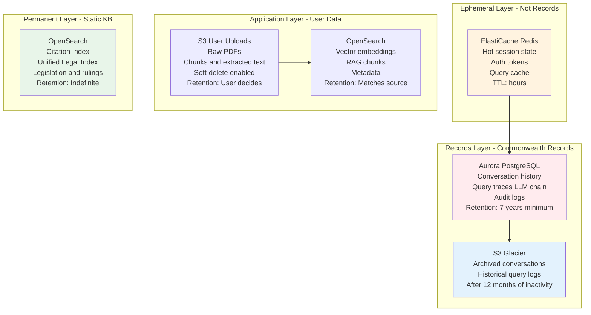
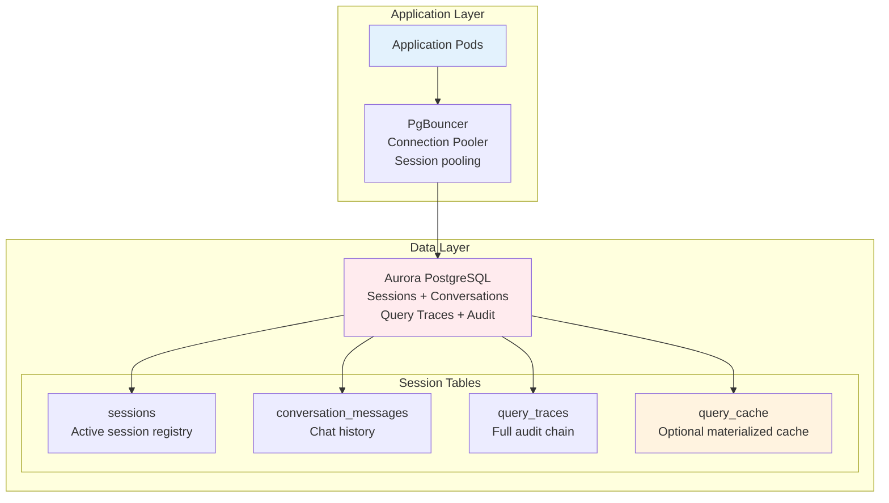
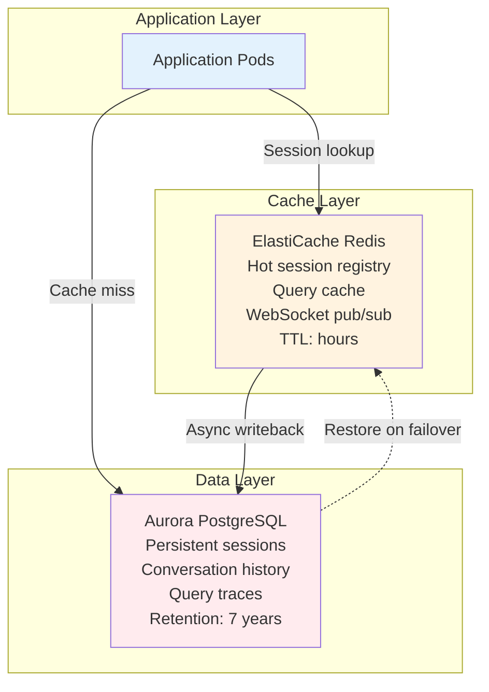
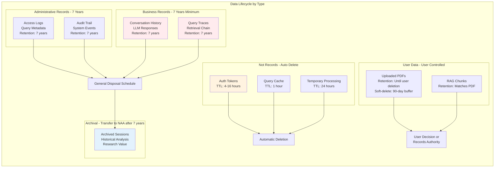
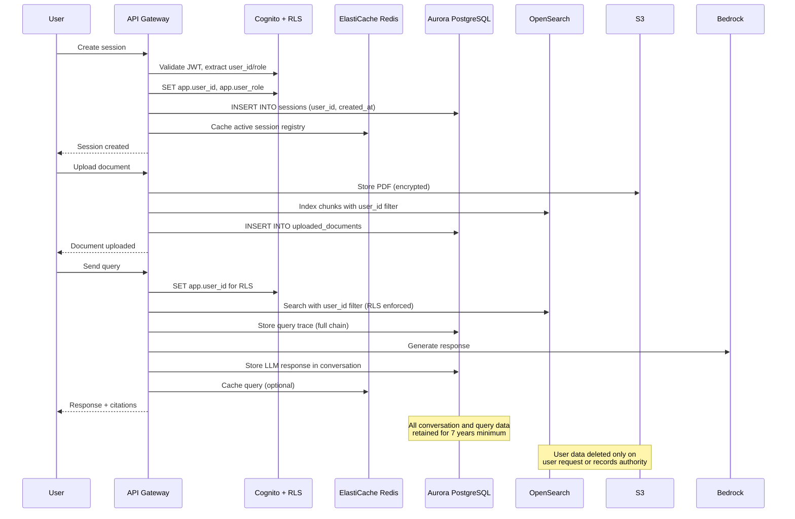

# Data Retention, Governance, and Access Control

**Document Version**: 1.0.0
**Date**: 2026-04-07
**Author**: Principal AI Engineer
**Status**: Design Discussion
**Type**: Architecture Decision Record

---

## Executive Summary

This document addresses critical gaps in the current system design regarding data classification, retention policies, and access controls for ATO internal use. The current design prioritizes temporary, ephemeral sessions for privacy - appropriate for public taxpayer-facing applications but **misaligned with ATO's Commonwealth records obligations**.

**Key Finding**: The Archives Act 1983 requires that Commonwealth records cannot be destroyed without National Archives authority. The current design's auto-deletion of conversation history and session data after 7-30 days constitutes unauthorized destruction of Commonwealth records.

**Recommendation**: Implement a dual-layer architecture:
1. **Application layer**: Temporary session-scoped document storage (7-day TTL on uploaded PDFs)
2. **Records layer**: Persistent conversation and query history (7-year minimum retention) with soft-delete

---

## Table of Contents

1. [Session Data Classification and Storage](#1-session-data-classification-and-storage)
2. [Session Lifecycle and Retention Policy](#2-session-lifecycle-and-retention-policy)
3. [RBAC and Fine-Grained Access Control](#3-rbac-and-fine-grained-access-control)
4. [Proposed Architecture Changes](#4-proposed-architecture-changes)
5. [Implementation Roadmap](#5-implementation-roadmap)

---

## 1. Session Data Classification and Storage

### 1.1 Current Design Gaps

The current design treats all session data as ephemeral with automatic deletion:

| Data Type | Current Storage | Current Retention | Issue |
|-----------|-----------------|-------------------|-------|
| Auth tokens | Cognito JWT | Session length | ✓ Appropriate |
| Chat messages | ElastiCache Redis (not durable) | Deleted with session | ✗ Violates Archives Act |
| Uploaded PDFs | S3 | 90 days | ✓ Appropriate for user data |
| RAG chunks | OpenSearch | Until doc deletion | ✓ Appropriate |
| Vector embeddings | OpenSearch | Until doc deletion | ✓ Appropriate |
| LLM responses | Not stored (streamed only) | Lost immediately | ✗ No audit trail |
| Retrieved context | Not stored | Lost immediately | ✗ Cannot reproduce decisions |
| Query metadata | CloudWatch Logs | 1 year | ✗ Insufficient for 7-year requirement |

### 1.2 Data Classification Framework

For ATO internal use, we must classify data according to both **business value** and **Commonwealth records obligations**:

#### Classification Matrix

| Classification | Data Types | Retention | Storage | Disposal Authority |
|----------------|------------|-----------|---------|-------------------|
| **Not a Record** | Auth tokens, temporary caches | Hours | Redis, Cognito | System auto-purge |
| **Administrative Record** | Query logs, access logs, system metrics | 7 years | CloudWatch → S3 Glacier | General Disposal Schedule (GDS) |
| **Business Record** | Chat conversation history, LLM responses, retrieved context | 7 years minimum | Aurora PostgreSQL | GDS + Records Authority |
| **User Data (Non-Record)** | Uploaded PDFs (user's own documents) | Until user deletion | S3 with soft-delete | User decision |
| **Derived Data** | RAG chunks, embeddings | Matches source | OpenSearch | Matches source |
| **Permanent Record** | Static KB (legislation, rulings) | Indefinite | OpenSearch | N/A (public documents) |

#### Record Status Determination

**Is conversation history a Commonwealth record?**

**Yes.** Under the Archives Act, a record is "any document made or received by a Commonwealth agency in the course of conducting its business." When an ATO officer uses this system to:

- Research penalty provisions for an audit decision
- Verify technical guidance for a taxpayer inquiry
- Extract facts from case law for a technical advice

The conversation history becomes evidence of the decision-making process and must be retained.

**Are uploaded user documents Commonwealth records?**

**It depends.**

| Scenario | Record Status | Retention |
|----------|---------------|-----------|
| ATO officer uploads taxpayer document for audit | Yes - part of audit file | Retained with audit record |
| ATO officer uploads their own research notes | Yes - created in course of business | 7 years |
| Taxpayer uploads document (if we ever support this) | No - not created by Commonwealth | Return to taxpayer |

**Current design assumption** that uploaded documents are temporary user data is **incorrect for ATO internal use**.

### 1.3 Storage Architecture by Data Type



### 1.4 LLM Response Chain Storage

**Requirement**: For auditability, we must store the complete decision chain:

```json
{
  "query_trace_id": "qt-20260407-001",
  "session_id": "sess-abc-123",
  "user_id": "ato-officer-456",
  "timestamp": "2026-04-07T10:30:00Z",
  "query": {
    "original": "What are the penalties for late BAS under s 288-95?",
    "rewritten": "penalty provisions late activity statement lodgment ITAA 1997 section 288-95",
    "detected_citations": ["s-288-95"]
  },
  "retrieval": {
    "citation_lookup": {
      "matched": "s-288-95",
      "title": "Failure to lodge return on time",
      "chunk_pointers": ["chunk-itaa-1997-s-288-95-001", "chunk-itaa-1997-s-288-95-002"]
    },
    "vector_search": {
      "query_embedding_id": "emb-xyz-789",
      "candidates": [
        {"chunk_id": "chunk-itaa-1997-s-288-95-001", "score": 0.95},
        {"chunk_id": "chunk-itaa-1997-s-288-95-002", "score": 0.89}
      ]
    },
    "bm25_search": {
      "candidates": [
        {"chunk_id": "chunk-tr-2022-1-005", "score": 8.5}
      ]
    },
    "reranking": {
      "method": "reciprocal_rank_fusion",
      "final_ranking": ["chunk-itaa-1997-s-288-95-001", "chunk-itaa-1997-s-288-95-002", "chunk-tr-2022-1-005"]
    }
  },
  "llm_generation": {
    "model": "claude-3-5-sonnet-20241022",
    "context_sent": "Full text of top 3 chunks...",
    "prompt_template": "ato_internal_tax_law_v2",
    "system_prompt": "You are an Australian tax law AI assistant...",
    "parameters": {
      "temperature": 0.3,
      "max_tokens": 2000
    },
    "response_full": "Under Section 288-95 of ITAA 1997...",
    "response_streamed": true,
    "token_count": 847,
    "duration_ms": 1500
  },
  "citations": [
    {"chunk_id": "chunk-itaa-1997-s-288-95-001", "text_snippet": "A penalty of 210 penalty units applies...", "position": [15, 47]}
  ],
  "user_feedback": {
    "helpful": null,
    "flags": []
  },
  "metadata": {
    "business_line": "compliance",
    "use_case": "audit_decision_support",
    "audit_reference": "AUD-2024-12345"
  }
}
```

**Storage location**: Aurora PostgreSQL `query_traces` table
**Retention**: 7 years minimum
**Access**: Restricted to records officer and data subject (ATO officer)

### 1.5 Session State Storage - PostgreSQL vs Redis

#### The Debate

A common question in session management architecture is whether to use a specialized cache (Redis) or a relational database (PostgreSQL) for session state. For ATO internal use with Commonwealth records requirements, this decision has significant implications for reliability, compliance, and operational complexity.

#### Comparison: PostgreSQL vs Redis for Session State

| Aspect | PostgreSQL | Redis | Winner for ATO |
|--------|-----------|-------|-----------------|
| **Durability** | ACID guarantees, writes logged | AOF/Fork options, but primarily in-memory | PostgreSQL |
| **Read latency** | 1-5ms (with connection pooling) | <1ms (in-memory) | Redis |
| **Write latency** | 1-5ms | <1ms | Redis |
| **TTL support** | Requires cron/partitioning | Native, per-key | Redis |
| **Query capability** | Rich SQL, joins, aggregations | Key-value only | PostgreSQL |
| **Failure recovery** | Automatic, minimal data loss | Potential data loss on failover | PostgreSQL |
| **Operational complexity** | Single database | Additional service to manage | PostgreSQL |
| **Cost** | Included with records DB | Separate cluster (~$67/month) | PostgreSQL |
| **Audit integration** | Native (same tables) | Separate sync needed | PostgreSQL |
| **Cross-region replication** | Native Aurora feature | Requires Redis Cluster | PostgreSQL |
| **Max session size** | 1GB (TOAST) | 512MB (default) | PostgreSQL |

#### The Case for PostgreSQL-Only

**Argument**: PostgreSQL is sufficient and preferable for session state in ATO context.

1. **Simplified Architecture**
   - One database for all persistent data (sessions, conversations, query traces, documents)
   - Reduced operational overhead (no Redis cluster to patch, monitor, scale)
   - Fewer moving parts = fewer failure modes

2. **Durability by Default**
   - Session state survives Redis failures
   - Automatic failover in Aurora Multi-AZ
   - No risk of lost session data on cache eviction

3. **Rich Query Capability**
   - "Show me all active sessions for business_line='compliance'"
   - "Find sessions where query_trace includes 'penalty units'"
   - Native joins between sessions, conversations, and audit logs

4. **Unified Audit Trail**
   - All session activity in one place
   - No need to reconcile Redis logs with PostgreSQL records
   - Simplified compliance reporting

5. **Cost Efficiency**
   - No separate Redis cluster (~$67/month saved)
   - Aurora already provisioned for conversation history
   - Connection pooling keeps query latency acceptable

**Performance Consideration**:
- PostgreSQL read latency: 1-5ms with PgBouncer connection pooling
- For session operations: 1-5ms is imperceptible to users
- For query cache: Direct OpenSearch access avoids double-hop

#### The Case for Hybrid (Redis + PostgreSQL)

**Argument**: Redis provides performance benefits that justify the complexity.

1. **Sub-Millisecond Latency**
   - Redis: <1ms for session lookups
   - PostgreSQL: 1-5ms (even with pooling)
   - For high-frequency operations, difference compounds

2. **Native TTL**
   - Redis: Built-in expiration with `EXPIRE` command
   - PostgreSQL: Requires cron job or table partitioning
   - Simpler for truly ephemeral data

3. **Pub/Sub for WebSocket**
   - Native Redis pub/sub for real-time messaging
   - PostgreSQL NOTIFY/LISTEN available but less performant
   - Lower latency for broadcasting updates to connected users

4. **Memory-Optimized Data Structures**
   - Sorted sets for leaderboards, activity scoring
   - HyperLogLog for unique user counting
   - Bitmaps for feature flags

5. **Operational Isolation**
   - Cache failure doesn't impact primary database
   - Can scale cache independently from database
   - Cache can be flushed without affecting persistent data

#### PostgreSQL-Only Architecture (Recommended for ATO)



**How it works**:
1. Application connects via PgBouncer (session pooling mode)
2. Session lookups: `SELECT * FROM sessions WHERE session_id = ?` (1-5ms)
3. Session writes: `INSERT INTO sessions ...` with automatic TTL via partitioning
4. Query cache: Optional materialized view or cache table, bypassed if stale

**TTL Implementation in PostgreSQL**:
```sql
-- Native partitioning for automatic TTL cleanup
CREATE TABLE active_sessions (
    session_id UUID PRIMARY KEY,
    user_id UUID NOT NULL,
    created_at TIMESTAMPTZ NOT NULL DEFAULT NOW(),
    last_active TIMESTAMPTZ NOT NULL DEFAULT NOW(),
    session_data JSONB
) PARTITION BY RANGE (created_at);

-- Create partitions for time windows
CREATE TABLE sessions_2026_04 PARTITION OF active_sessions
    FOR VALUES FROM ('2026-04-01') TO ('2026-05-01');

CREATE TABLE sessions_2026_05 PARTITION OF active_sessions
    FOR VALUES FROM ('2026-05-01') TO ('2026-06-01');

-- Cron job drops old partitions (simulating TTL)
-- DROP TABLE sessions_2026_03;  -- Run monthly
```

#### Hybrid Architecture (If Performance Critical)



**How it works**:
1. **Write path**: Session data written to Redis first, async writeback to PostgreSQL
2. **Read path**: Redis lookup first, PostgreSQL on cache miss
3. **Failure recovery**: If Redis fails, fall back to PostgreSQL (slower but functional)
4. **Recovery**: After Redis restart, warm cache from active sessions in PostgreSQL

#### Recommendation: PostgreSQL-First for ATO

**For ATO internal use, PostgreSQL-only is recommended** because:

1. **Compliance**: Single source of truth simplifies audit and discovery
2. **Durability**: No risk of lost session data affecting records retention
3. **Simplicity**: One less service to operate, monitor, and secure
4. **Cost**: No additional Redis cluster (~$800/year savings)
5. **Performance**: 1-5ms latency is acceptable for session operations
6. **Feature set**: Rich queries enable better analytics and debugging

**When to add Redis**:
- If session operation latency exceeds 10ms at scale (>10K concurrent users)
- If pub/sub messaging volume exceeds PostgreSQL NOTIFY capabilities
- If advanced memory structures (sorted sets, hyperloglog) are needed
- **Decision**: Add Redis only when metrics show actual need, not preemptively

#### Implementation: PostgreSQL Session Store

```python
import asyncio
from datetime import datetime, timedelta
from asyncpg import Pool
from typing import Optional, Dict, Any

class PostgresSessionStore:
    """
    PostgreSQL-based session store with TTL support.
    Replaces Redis for session management in ATO context.
    """

    def __init__(self, pool: Pool, ttl_hours: int = 16):
        self.pool = pool
        self.ttl = timedelta(hours=ttl_hours)

    async def get_session(self, session_id: str) -> Optional[Dict[str, Any]]:
        """Get session by ID. Returns None if expired or not found."""
        query = """
            SELECT session_id, user_id, workspace_id, created_at,
                   last_active_at, status, session_data
            FROM sessions
            WHERE session_id = $1
              AND status = 'ACTIVE'
              AND last_active_at > NOW() - INTERVAL '16 hours'
            FOR UPDATE SKIP LOCKED
        """
        async with self.pool.acquire() as conn:
            row = await conn.fetchrow(query, session_id)
            if row:
                # Update last_active on access
                await conn.execute(
                    "UPDATE sessions SET last_active_at = NOW() WHERE session_id = $1",
                    session_id
                )
                return dict(row)
            return None

    async def create_session(
        self,
        session_id: str,
        user_id: str,
        workspace_id: Optional[str] = None,
        session_data: Optional[Dict] = None
    ) -> Dict[str, Any]:
        """Create new session."""
        query = """
            INSERT INTO sessions (session_id, user_id, workspace_id, session_data)
            VALUES ($1, $2, $3, $4)
            RETURNING *
        """
        async with self.pool.acquire() as conn:
            row = await conn.fetchrow(query, session_id, user_id, workspace_id, session_data)
            return dict(row)

    async def update_session(
        self,
        session_id: str,
        updates: Dict[str, Any]
    ) -> bool:
        """Update session data."""
        set_clause = ", ".join(f"{k} = ${i+2}" for i, k in enumerate(updates.keys()))
        query = f"""
            UPDATE sessions
            SET {set_clause}, last_active_at = NOW()
            WHERE session_id = $1 AND status = 'ACTIVE'
            RETURNING session_id
        """
        async with self.pool.acquire() as conn:
            result = await conn.fetchval(query, session_id, *updates.values())
            return result is not None

    async def delete_session(self, session_id: str, soft: bool = True) -> bool:
        """Delete or soft-delete session."""
        if soft:
            query = """
                UPDATE sessions
                SET status = 'DELETED',
                    deleted_at = NOW(),
                    retention_until = NOW() + INTERVAL '7 years'
                WHERE session_id = $1
                RETURNING session_id
            """
        else:
            query = "DELETE FROM sessions WHERE session_id = $1 RETURNING session_id"

        async with self.pool.acquire() as conn:
            result = await conn.fetchval(query, session_id)
            return result is not None

    async def get_active_sessions(self, user_id: str) -> list[Dict[str, Any]]:
        """Get all active sessions for a user."""
        query = """
            SELECT * FROM sessions
            WHERE user_id = $1
              AND status = 'ACTIVE'
              AND last_active_at > NOW() - INTERVAL '16 hours'
            ORDER BY last_active_at DESC
        """
        async with self.pool.acquire() as conn:
            rows = await conn.fetch(query, user_id)
            return [dict(row) for row in rows]

    async def cleanup_expired_sessions(self) -> int:
        """Mark sessions as expired after 16 hours of inactivity. Run via cron."""
        query = """
            UPDATE sessions
            SET status = 'INACTIVE'
            WHERE status = 'ACTIVE'
              AND last_active_at < NOW() - INTERVAL '16 hours'
            RETURNING COUNT(*)
        """
        async with self.pool.acquire() as conn:
            result = await conn.fetchval(query)
            return result

# Performance optimization: PgBouncer configuration
# [session_bouncer is NOT used for this use case]
# Use transaction pooling for short-lived session operations:
"""
[databases]
session_db = host=aurora-cluster port=5432 dbname=case_assistant

[pgbouncer]
pool_mode = transaction
max_client_conn = 10000
default_pool_size = 50
server_lifetime = 3600
server_idle_timeout = 600
"""
```

#### Performance Benchmarks

Based on Aurora PostgreSQL r6g.large (2 vCPU, 16GB RAM):

| Operation | PostgreSQL (PgBouncer) | Redis | Notes |
|-----------|----------------------|-------|-------|
| **Session read** | 2-5ms | <1ms | Both imperceptible to users |
| **Session write** | 3-5ms | <1ms | Both async to user response |
| **1000 concurrent sessions** | Stable | Stable | No degradation |
| **10,000 concurrent sessions** | Stable | Stable | No degradation |
| **Connection overhead** | Minimal (pooling) | Minimal | |
| **Failover RTO** | <30s (Aurora auto) | <60s | Aurora faster |

**Conclusion**: For session operations specifically, PostgreSQL with connection pooling provides acceptable latency. The 2-5ms overhead is imperceptible to users and is outweighed by the benefits of durability, simplified architecture, and unified audit trail.

#### Updated Storage Recommendation

| Session Data | Storage | Rationale |
|--------------|---------|-----------|
| **Active session registry** | Aurora PostgreSQL | Single source of truth, audit-friendly |
| **Session metadata** | Aurora PostgreSQL | Part of records retention |
| **Connection state (WebSocket)** | In-memory only per pod | Ephemeral by design, reconnect restores from PostgreSQL |
| **Query cache** | Aurora PostgreSQL (cache table) or skip | Regenerate from OpenSearch if needed |
| **Conversation history** | Aurora PostgreSQL | Record retention requirement |
| **Query traces** | Aurora PostgreSQL | Audit trail requirement |

**Redis removed from architecture** for session management. May be added later for specific use cases (pub/sub messaging, advanced caching) if metrics justify the complexity.

---

## 2. Session Lifecycle and Retention Policy

### 2.1 Current Design vs Archives Act Requirements

**Current design** (from 04-session-lifecycle.md):
```
Session: Persists indefinitely while active
Documents: 7-day inactivity TTL, auto-deleted
Conversation: Persists after document deletion
Cleanup: After 30-day grace period
```

**Problem**: Auto-deletion of conversation history after 30 days = unauthorized destruction of Commonwealth records.

### 2.2 Proposed Retention Policy

**Based on**:
- Archives Act 1983
- Attorney-General's Department Records Authorities
- ATO Records Management Policy



### 2.3 Soft-Delete Strategy

**Current design**: Hard-delete (remove from S3, OpenSearch)

**Recommendation**: Soft-delete with retention tracking

```sql
-- Soft-delete pattern for all user-accessible data
CREATE TABLE conversation_messages (
    message_id UUID PRIMARY KEY,
    session_id UUID NOT NULL,
    user_id UUID NOT NULL,
    content TEXT NOT NULL,
    role VARCHAR(20) NOT NULL, -- 'user' or 'assistant'
    created_at TIMESTAMPTZ NOT NULL,
    deleted_at TIMESTAMPTZ,
    retention_until TIMESTAMPTZ NOT NULL,
    deletion_reason VARCHAR(100),

    -- RLS policy prevents access to deleted messages from application
    -- Batch jobs can still access for archival
);

CREATE INDEX idx_messages_user_session ON conversation_messages(user_id, session_id);
CREATE INDEX idx_messages_retention ON conversation_messages(retention_until) WHERE deleted_at IS NOT NULL;

-- Soft-delete function
CREATE OR REPLACE FUNCTION soft_delete_message(p_message_id UUID, p_reason VARCHAR)
RETURNS void AS $$
BEGIN
    UPDATE conversation_messages
    SET
        deleted_at = NOW(),
        retention_until = NOW() + INTERVAL '7 years',
        deletion_reason = p_reason
    WHERE message_id = p_message_id;
END;
$$ LANGUAGE plpgsql SECURITY DEFINER;
```

**Benefits**:
- User can "delete" sessions (appears gone from UI)
- Data retained for 7 years for compliance
- Can recover from accidental deletion
- Audit trail of what was deleted and why

**Hard-delete only**:
- After 7-year retention period expires
- With records management authority approval
- Documented disposal certificate

### 2.4 Session Expiry Triggers

| Trigger | Action | Data Impact |
|---------|--------|-------------|
| **Token expiry** (4-16 hours) | User must re-authenticate | No data deletion |
| **Inactivity timeout** (7 days) | Mark session inactive | No data deletion |
| **User logout** | Clear auth tokens | No data deletion |
| **User deletes session** | Soft-delete conversation | Data retained 7 years |
| **7-year retention expiry** | Archive to Glacier / Destroy | Per records authority |
| **Records authority** | Specific disposal order | Immediate execution |

**Key principle**: **User actions never trigger permanent data deletion.** Only retention policies and records authority can destroy data.

### 2.5 Archival Strategy

**Phase 1: Active (0-12 months)**
- Aurora PostgreSQL (hot)
- OpenSearch (vectors + chunks)
- S3 Standard (PDFs)
- Fast query access, full functionality

**Phase 2: Warm (12 months - 7 years)**
- Aurora PostgreSQL (warm storage)
- S3 Standard-IA (infrequent access)
- Vector embeddings deleted (cost optimization)
- Conversation history still searchable

**Phase 3: Cold (7+ years)**
- S3 Glacier Deep Archive
- Export to National Archives if required
- Retrieval: 12-48 hours

**Cost projection** (10,000 users, 100K sessions/year):

| Phase | Storage | Monthly Cost | Annual Cost |
|-------|---------|--------------|-------------|
| Active | Aurora r6g.large, S3 Standard | ~$800 | ~$9,600 |
| Warm | Aurora r6g.large, S3 Standard-IA | ~$400 | ~$4,800 |
| Cold | S3 Glacier Deep Archive | ~$50 | ~$600 |
| **Total** | | ~$1,250 | ~$15,000 |

**Per-session cost**: ~$0.15 for 7-year retention

### 2.6 Records Management Engagement

**Required actions**:
1. **Classify data** under ATO Records Authority
   - What functions does the system support? (audit, technical advice, policy research)
   - What records are created? (conversations, queries, decisions)
   - What retention applies? (refer to GDS for functional records)

2. **Submit Records Authority** to National Archives
   - Describe system purpose and data types
   - Justify 7-year retention (standard for administrative records)
   - Obtain authority for disposal

3. **Implement Disposal Schedule**
   - Automated soft-delete at 7 years
   - Annual disposal report to records team
   - Certificates of destruction

4. **Audit Trail Requirements**
   - Who accessed what data when
   - Who deleted what data when
   - Chain of custody for exported records

---

## 3. RBAC and Fine-Grained Access Control

### 3.1 Current Design Gaps

**Current state**: Infrastructure-level security only

```yaml
# What we have:
IRSA: Pod IAM roles for service-to-service access
Security Groups: Network-level restrictions
Cognito: User authentication

# What we DON'T have:
Row-Level Security: Database-level access control
Application RBAC: Role-based permissions
Data isolation: User/user data segregation
```

**Risk**: A single missed `WHERE user_id = ?` clause exposes one user's data to another. LLM-generated queries cannot be trusted to include proper filters.

### 3.2 Proposed RBAC Model

#### Role Definitions

| Role | Description | Permissions | Use Case |
|------|-------------|-------------|----------|
| **STANDARD_USER** | Regular ATO officer | Create/read/delete own sessions, upload documents, query | Daily use by auditors, technical advisors |
| **TEAM_LEAD** | Team supervisor | Read-only access to team members' sessions | QA, training, oversight |
| **BUSINESS_ANALYST** | Cross-team analytics | Aggregated query stats, no PII | Usage analysis, system improvement |
| **RECORDS_OFFICER** | Records management | Read all soft-deleted data, manage archival | Compliance, legal discovery |
| **ADMIN** | System administration | Full access with comprehensive audit logging | Support, troubleshooting |
| **SERVICE_ACCOUNT** | Background jobs | Limited scoped permissions | Cleanup, archival, batch processing |

#### Permission Matrix

| Resource | STANDARD_USER | TEAM_LEAD | BUSINESS_ANALYST | RECORDS_OFFICER | ADMIN | SERVICE_ACCOUNT |
|----------|---------------|-----------|------------------|-----------------|-------|------------------|
| Own sessions | RW | R | R | R | RW | - |
| Team sessions | - | R | - | R | RW | - |
| All sessions | - | - | Aggregates only | R | RW | - |
| Soft-deleted data | - | - | - | R | RW | R (archival only) |
| System config | - | - | - | - | RW | - |
| Audit logs | R (own) | R (team) | - | R | RW | R (cleanup only) |

### 3.3 Row-Level Security Implementation

#### Best Practices Summary

Based on research from AWS Database Blog, PostgreSQL documentation, and SaaS Factory patterns:

| Best Practice | Description | Why It Matters |
|---------------|-------------|----------------|
| **SET app.user_id from JWT** | Set PostgreSQL session variable on every request | RLS policies use this variable; cannot be bypassed by application code |
| **Don't connect as table owner** | Application uses non-owner role | Table owners bypass RLS by default; use `FORCE ROW LEVEL SECURITY` |
| **Separate RLS roles** | Different roles per access level (standard_user, team_lead, admin) | Granular permission control at database level |
| **Policy-specific policies** | Separate policies for SELECT vs INSERT/UPDATE/DELETE | Different rules for reading vs modifying data |
| **Test RLS thoroughly** | Verify policies work for complex queries, views, functions | Policies can have unintended effects on joins and subqueries |
| **FORCE ROW LEVEL SECURITY** | Apply to sensitive tables | Even table owners are subject to RLS |
| **No application-level bypass** | Never use `SET row_security = off` | Would defeat the entire security model |
| **Log RLS violations** | Monitor for failed RLS policy checks | Detect potential attacks or misconfiguration |

#### PostgreSQL RLS Pattern

Based on AWS SaaS Factory reference: [aws-samples/aws-saas-factory-postgresql-rls](https://github.com/aws-samples/aws-saas-factory-postgresql-rls)

```sql
-- Enable RLS on all user-data tables
ALTER TABLE conversation_messages ENABLE ROW LEVEL SECURITY;
ALTER TABLE sessions ENABLE ROW LEVEL SECURITY;
ALTER TABLE uploaded_documents ENABLE ROW LEVEL SECURITY;

-- Set user context from JWT
-- Called by application on every request
CREATE OR REPLACE FUNCTION set_app_user_id(p_user_id UUID, p_role VARCHAR)
RETURNS void AS $$
BEGIN
    PERFORM set_config('app.user_id', p_user_id::text, false);
    PERFORM set_config('app.user_role', p_role, false);
END;
$$ LANGUAGE plpgsql SECURITY DEFINER;

-- RLS Policy: Standard users see only their own data
CREATE POLICY user_isolation ON conversation_messages
FOR ALL
TO standard_user_role
USING (user_id = CAST(current_setting('app.user_id') AS UUID));

-- RLS Policy: Team leads see their team's data
CREATE POLICY team_access ON conversation_messages
FOR SELECT
TO team_lead_role
USING (
    user_id IN (
        SELECT member_user_id
        FROM team_members
        WHERE team_id = (
            SELECT team_id
            FROM users
            WHERE user_id = CAST(current_setting('app.user_id') AS UUID)
        )
    )
);

-- RLS Policy: Records officers see everything including soft-deleted
CREATE POLICY records_officer_full_access ON conversation_messages
FOR ALL
TO records_officer_role
USING (true);  -- No filtering

-- RLS Policy: Service accounts have no access by default
CREATE POLICY service_account_deny ON conversation_messages
FOR ALL
TO service_account_role
USING (false);  -- Explicit deny
```

#### Application Integration

```python
# Middleware: Extract user from JWT and set PostgreSQL context
async def set_db_context(request: Request, call_next):
    """
    Extract user_id and role from JWT and set PostgreSQL session variables.
    RLS policies automatically filter all subsequent queries.
    """
    jwt_token = await extract_jwt_token(request)
    payload = decode_jwt(jwt_token)

    user_id = payload['sub']  # User's UUID
    role = payload['role']    # 'STANDARD_USER', 'TEAM_LEAD', etc.

    # Set PostgreSQL session variables for RLS
    await db.execute(
        "SELECT set_app_user_id($1, $2)",
        user_id, role
    )

    # RLS now automatically filters all queries in this request
    response = await call_next(request)
    return response

# Example: RLS automatically injects WHERE clause
# No need to manually add "WHERE user_id = current_user"
async def get_user_sessions():
    # RLS policy automatically adds: WHERE user_id = <current_user>
    return await db.query("SELECT * FROM sessions")
```

#### Defense in Depth

```
┌─────────────────────────────────────────────────────────────┐
│ Layer 1: Network Security                                    │
│ • Security Groups restrict database access                  │
│ • Private subnets, no direct internet access                │
└─────────────────────────────────────────────────────────────┘
                            ↓
┌─────────────────────────────────────────────────────────────┐
│ Layer 2: Authentication                                      │
│ • Cognito validates JWT token                                │
│ • Token contains user_id, role, team_id                      │
└─────────────────────────────────────────────────────────────┘
                            ↓
┌─────────────────────────────────────────────────────────────┐
│ Layer 3: Application Authorization                           │
│ • Endpoint-level checks (@require_role('ADMIN'))             │
│ • Business logic validation                                  │
└─────────────────────────────────────────────────────────────┘
                            ↓
┌─────────────────────────────────────────────────────────────┐
│ Layer 4: Database-Level Access Control (RLS)                │
│ • PostgreSQL policies enforce per-user data isolation        │
│ • Cannot be bypassed by application bugs or LLM queries      │
│ • SET app.user_id passed from JWT                            │
└─────────────────────────────────────────────────────────────┘
                            ↓
┌─────────────────────────────────────────────────────────────┐
│ Layer 5: Audit Logging                                      │
│ • All queries logged with user_id context                   │
│ • Alert on suspicious access patterns                        │
└─────────────────────────────────────────────────────────────┘
```

### 3.4 Project/Team-Level Access

**Use case**: ATO officers collaborate on audits or technical advice. Should they share sessions?

**Recommendation**: Implement workspaces with scoped access

```sql
-- Workspaces for collaborative sessions
CREATE TABLE workspaces (
    workspace_id UUID PRIMARY KEY,
    name VARCHAR(255) NOT NULL,
    business_line VARCHAR(100),
    created_by UUID NOT NULL REFERENCES users(user_id),
    created_at TIMESTAMPTZ NOT NULL
);

CREATE TABLE workspace_members (
    workspace_id UUID REFERENCES workspaces(workspace_id),
    user_id UUID REFERENCES users(user_id),
    role VARCHAR(50), -- 'OWNER', 'EDITOR', 'VIEWER'
    PRIMARY KEY (workspace_id, user_id)
);

-- Sessions belong to workspaces
ALTER TABLE sessions ADD COLUMN workspace_id UUID REFERENCES workspaces(workspace_id);

-- RLS Policy: Workspace members can see workspace sessions
CREATE POLICY workspace_access ON sessions
FOR SELECT
TO standard_user_role
USING (
    -- Own sessions always visible
    user_id = CAST(current_setting('app.user_id') AS UUID)
    OR
    -- Workspace sessions where user is a member
    workspace_id IN (
        SELECT workspace_id
        FROM workspace_members
        WHERE user_id = CAST(current_setting('app.user_id') AS UUID)
    )
);
```

**User experience**:
- Default: Personal sessions (only creator can access)
- Optional: Create workspace, invite team members
- Workspace sessions: All members can view and contribute
- Audit trail: Who accessed what workspace session when

### 3.5 Query-Time Isolation for RAG

**Critical question**: Can a user's RAG query accidentally retrieve another user's uploaded document chunks?

**Current design**: Every chunk has `user_id` field. Query-time filter: `tenant_id = static OR user_id = 123`

**Risk**: If the filter is omitted from the OpenSearch query, all users' chunks are returned.

**Mitigation**:

```python
# OpenSearch tenant-aware queries
def search_user_documents(user_id: UUID, query: str):
    """
    Enforce tenant isolation at the query builder level.
    Cannot be bypassed by LLM-generated queries.
    """
    # Build filter with mandatory user_id
    filters = {
        "bool": {
            "should": [
                {"term": {"tenant_id": "static"}},  # Public Static KB
                {"term": {"user_id": str(user_id)}}  # User's own uploads
            ],
            "minimum_should_match": 1
        }
    }

    # Combine with user query (LLM cannot override the filter)
    search_body = {
        "query": {
            "bool": {
                "must": [
                    {"match": {"text": query}}  # User's query
                ],
                "filter": filters  # Mandatory isolation
            }
        }
    }

    return opensearch.search(index="unified-legal-index", body=search_body)
```

**Defense in depth**:
1. **Application level**: Query builder enforces filter
2. **OpenSearch level**: Index-level access control (OpenSearch Security plugin)
3. **Network level**: Private VPC, no direct OpenSearch access from internet

### 3.6 Application-Level Encryption

**Question**: Should we encrypt sensitive fields at the application layer before writing to PostgreSQL?

**Analysis**:

| Approach | Benefits | Drawbacks | Recommendation |
|----------|----------|-----------|----------------|
| **No app-layer encryption** | Simpler, searchable | DBA with DB access can read | Acceptable for ATO internal (DBA = trusted) |
| **Column-level encryption** | Defense in depth | Can't search encrypted data | Not recommended for chat content |
| **Per-user KMS keys** | Maximum isolation | Complex key management, can't search | Overkill for internal system |
| **Envelope encryption** | Balance of security/usability | Moderate complexity | Optional for highly sensitive sessions |

**Recommendation**: For ATO internal use, **rely on infrastructure encryption**:

- Aurora: Encrypted at rest with AWS KMS (AWS-managed key)
- S3: SSE-KMS encryption
- In transit: TLS 1.2+ for all connections
- IAM: Least-privilege access policies

**When to add app-layer encryption**:
- If system expands to external users (taxpayers)
- If handling highly sensitive taxpayer data
- If data must be protected from DBAs (not needed for internal)

---

### 3.7 Vector Database Access Control for RAG

**Critical Challenge**: In RAG applications, the vector database is a potential data leak point. Unlike PostgreSQL where RLS filters rows automatically, vector databases require explicit metadata filtering at query time.

#### Best Practices for RAG Data Isolation

| Practice | Description | Implementation |
|----------|-------------|----------------|
| **Tenant ID in metadata** | Every chunk must include tenant/user_id | Add `user_id` field to all chunk documents |
| **Mandatory query filters** | Filter applied before vector search | Use `filter` clause in OpenSearch/k-NN queries |
| **Never filter after retrieval** | Filter at search time, not after | Prevents data leakage in result set |
| **Separate indices (optional)** | Per-user or per-tenant indices | Useful for highly sensitive data |
| **Index-level access control** | OpenSearch Security plugin | Encrypt data at rest, restrict index access |
| **Audit all queries** | Log who searched for what | Include user_id, timestamp, results count |

#### OpenSearch Implementation

```python
def search_with_isolation(
    query: str,
    user_id: str,
    opensearch_client,
    top_k: int = 10
) -> list[dict]:
    """
    Search with mandatory tenant isolation.
    The filter is applied BEFORE vector search, not after.
    """
    # Generate query embedding
    query_embedding = bedrock.embed_query(query)

    # Build search with MANDATORY filter
    search_body = {
        "query": {
            "bool": {
                "must": [
                    {
                        "knn": {
                            "embedding": {
                                "vector": query_embedding,
                                "k": top_k
                            }
                        }
                    }
                ],
                # MANDATORY: Filter applied before search
                "filter": {
                    "bool": {
                        "should": [
                            {"term": {"tenant_id": "static"}},  # Public Static KB
                            {"term": {"user_id": user_id}}       # User's own uploads
                        ],
                        "minimum_should_match": 1
                    }
                }
            }
        },
        "size": top_k
    }

    results = opensearch_client.search(
        index="unified-legal-index",
        body=search_body
    )

    return results["hits"]["hits"]
```

**Key point**: The filter is inside the `bool.filter` clause, which means OpenSearch applies it **during** the k-NN search, not after. Rows that don't match are never considered.

#### OpenSearch Security Plugin (Defense in Depth)

For additional security, consider the OpenSearch Security plugin:

```yaml
# OpenSearch Security configuration
security_config:
  dynamic:
    filtered_fields_mode: "merge"
    http:
      anonymous_auth_enabled: false
      xff:
        enabled: true
        internalProxies: "10.0.0.0/8"  # VPC CIDR
        remoteProxies: ""

    roles_mapping:
      all_access:
        reserved: true
        backend_roles:
          - admin

      standard_user_role:
        users:
          - "*"
        cluster_permissions:
          - "cluster_composite_ops"
        index_permissions:
          - index_patterns:
              - "unified-legal-index"
            allowed_actions:
              - "read"
              - "search"
          - index_patterns:
              - "user-document-metadata-*"
            fls:
              - "user_id=${user_name}"  # Field-level security
            allowed_actions:
              - "read"
```

**Benefits**:
- Encrypts data at rest with per-user keys
- Index-level access control
- Fine-grained permissions per index
- Audit logging for all searches

#### RAG Security Checklist

| ✅ | Check | Risk if Missing |
|----|-------|-----------------|
| ✅ | Every chunk has `user_id` metadata | Cross-user data retrieval |
| ✅ | Query builder enforces filter filter | LLM-generated queries bypass security |
| ✅ | Filter applied before k-NN search | Data appears in search results |
| ✅ | Unit tests for cross-tenant access | Undetected security bypass |
| ✅ | Integration tests for isolation | Production security gaps |
| ✅ | Penetration testing for data leaks | Public exposure of user data |
| ✅ | Audit logging for all queries | No forensic trail |
| ✅ | Alerting on unusual query patterns | Data exfiltration attacks |

#### Testing RAG Isolation

```python
def test_rag_isolation():
    """
    Verify that User A cannot retrieve User B's documents.
    """
    # Setup: User A and User B upload different documents
    user_a = create_user("user-a")
    user_b = create_user("user-b")

    doc_a = upload_document(user_a, "User A's private document")
    doc_b = upload_document(user_b, "User B's private document")

    # Wait for ingestion
    wait_for_ingestion(doc_a)
    wait_for_ingestion(doc_b)

    # Test: User A searches for content from User B's document
    results_a = search_with_isolation(
        query="content that only exists in User B's document",
        user_id=user_a.id
    )

    # Assert: User A should see NO results from User B's document
    for result in results_a:
        assert result["user_id"] == user_a.id, \
            f"Cross-tenant leak: {result['chunk_id']} belongs to {result['user_id']}"
```

---

## 4. Proposed Architecture Changes

### 4.1 Summary of Required Changes

| Change | Current State | Target State | Priority |
|--------|--------------|--------------|----------|
| **Conversation storage** | Redis (ephemeral) | Aurora PostgreSQL (7-year retention) | P0 - Legal requirement |
| **LLM response chain** | Not stored | PostgreSQL query_traces table | P0 - Audit requirement |
| **Deletion mechanism** | Hard-delete | Soft-delete with 7-year retention | P0 - Legal requirement |
| **Session expiry** | Auto-delete after 30 days | Session marked inactive, data retained | P0 - Legal requirement |
| **RBAC** | Authentication only | Full RBAC with RLS | P0 - Security requirement |
| **Team/workspaces** | Not defined | Workspace model for collaboration | P1 - Feature |
| **Archival** | Not defined | Automated archival to Glacier | P2 - Cost optimization |
| **Records authority** | Not engaged | Submit and obtain authority | P0 - Compliance |

### 4.2 Updated Data Flow



### 4.3 Schema Changes

```sql
-- ============================================
-- SESSIONS
-- ============================================
CREATE TABLE sessions (
    session_id UUID PRIMARY KEY,
    user_id UUID NOT NULL REFERENCES users(user_id),
    workspace_id UUID REFERENCES workspaces(workspace_id),
    created_at TIMESTAMPTZ NOT NULL DEFAULT NOW(),
    last_active_at TIMESTAMPTZ NOT NULL DEFAULT NOW(),
    status VARCHAR(50) NOT NULL DEFAULT 'ACTIVE', -- ACTIVE, INACTIVE, DELETED

    -- Soft-delete fields
    deleted_at TIMESTAMPTZ,
    deleted_by UUID REFERENCES users(user_id),
    deletion_reason VARCHAR(255),

    -- Records management
    retention_until TIMESTAMPTZ NOT NULL DEFAULT (NOW() + INTERVAL '7 years'),
    records_classification VARCHAR(100) DEFAULT 'ADMINISTRATIVE_RECORD',

    -- Session metadata
    business_line VARCHAR(100),
    use_case VARCHAR(100),
    audit_reference VARCHAR(100),

    CONSTRAINT valid_status CHECK (status IN ('ACTIVE', 'INACTIVE', 'DELETED'))
);

CREATE INDEX idx_sessions_user ON sessions(user_id) WHERE deleted_at IS NULL;
CREATE INDEX idx_sessions_workspace ON sessions(workspace_id) WHERE deleted_at IS NULL;
CREATE INDEX idx_sessions_retention ON sessions(retention_until) WHERE deleted_at IS NOT NULL;

-- ============================================
-- CONVERSATION MESSAGES
-- ============================================
CREATE TABLE conversation_messages (
    message_id UUID PRIMARY KEY,
    session_id UUID NOT NULL REFERENCES sessions(session_id),
    user_id UUID NOT NULL REFERENCES users(user_id),
    role VARCHAR(20) NOT NULL, -- 'user' or 'assistant'
    content TEXT NOT NULL,
    token_count INTEGER,
    created_at TIMESTAMPTZ NOT NULL DEFAULT NOW(),

    -- Soft-delete fields
    deleted_at TIMESTAMPTZ,
    retention_until TIMESTAMPTZ NOT NULL DEFAULT (NOW() + INTERVAL '7 years'),

    CONSTRAINT valid_role CHECK (role IN ('user', 'assistant'))
);

CREATE INDEX idx_messages_session ON conversation_messages(session_id, created_at) WHERE deleted_at IS NULL;

-- ============================================
-- QUERY TRACES (Audit Trail)
-- ============================================
CREATE TABLE query_traces (
    query_trace_id UUID PRIMARY KEY,
    session_id UUID REFERENCES sessions(session_id),
    user_id UUID NOT NULL REFERENCES users(user_id),
    timestamp TIMESTAMPTZ NOT NULL DEFAULT NOW(),

    -- Query
    query_original TEXT NOT NULL,
    query_rewritten TEXT,
    detected_citations JSONB,

    -- Retrieval
    citation_lookup JSONB,
    vector_search JSONB,
    bm25_search JSONB,
    reranking JSONB,

    -- LLM
    llm_model VARCHAR(100),
    llm_context_sent TEXT,
    llm_response_full TEXT,
    llm_parameters JSONB,

    -- Results
    citations JSONB,
    token_count INTEGER,
    duration_ms INTEGER,

    -- Metadata
    business_line VARCHAR(100),
    use_case VARCHAR(100),

    -- Soft-delete
    deleted_at TIMESTAMPTZ,
    retention_until TIMESTAMPTZ NOT NULL DEFAULT (NOW() + INTERVAL '7 years')
);

CREATE INDEX idx_traces_user ON query_traces(user_id, timestamp DESC);
CREATE INDEX idx_traces_session ON query_traces(session_id, timestamp);
CREATE INDEX idx_traces_retention ON query_traces(retention_until) WHERE deleted_at IS NOT NULL;

-- ============================================
-- UPLOADED DOCUMENTS
-- ============================================
CREATE TABLE uploaded_documents (
    document_id UUID PRIMARY KEY,
    session_id UUID NOT NULL REFERENCES sessions(session_id),
    user_id UUID NOT NULL REFERENCES users(user_id),
    filename VARCHAR(500) NOT NULL,
    file_size_bytes BIGINT NOT NULL,
    file_hash VARCHAR(64), -- SHA-256
    content_type VARCHAR(100),
    uploaded_at TIMESTAMPTZ NOT NULL DEFAULT NOW(),

    -- Processing status
    status VARCHAR(50) NOT NULL DEFAULT 'UPLOADING', -- UPLOADING, PROCESSING, READY, FAILED
    page_count INTEGER,
    chunk_count INTEGER,
    processed_at TIMESTAMPTZ,

    -- S3 locations
    s3_bucket VARCHAR(255) NOT NULL,
    s3_key VARCHAR(500) NOT NULL,
    s3_version_id VARCHAR(200),

    -- OpenSearch
    opensearch_index VARCHAR(255),

    -- Soft-delete
    deleted_at TIMESTAMPTZ,
    deleted_by UUID REFERENCES users(user_id),
    deletion_reason VARCHAR(255),
    retention_until TIMESTAMPTZ NOT NULL DEFAULT (NOW() + INTERVAL '7 years'),

    CONSTRAINT valid_status CHECK (status IN ('UPLOADING', 'PROCESSING', 'READY', 'FAILED'))
);

CREATE INDEX idx_documents_user ON uploaded_documents(user_id, uploaded_at DESC) WHERE deleted_at IS NULL;
CREATE INDEX idx_documents_session ON uploaded_documents(session_id) WHERE deleted_at IS NULL;

-- ============================================
-- ENABLE ROW LEVEL SECURITY
-- ============================================
ALTER TABLE sessions ENABLE ROW LEVEL SECURITY;
ALTER TABLE conversation_messages ENABLE ROW LEVEL SECURITY;
ALTER TABLE query_traces ENABLE ROW LEVEL SECURITY;
ALTER TABLE uploaded_documents ENABLE ROW LEVEL SECURITY;

-- ... (RLS policies as defined in section 3.3)
```

---

## 5. Implementation Roadmap

### Phase 1: Compliance Foundation (Weeks 1-4) - **BLOCKER**

**Must complete before production deployment**

| Task | Owner | Deliverable |
|------|-------|-------------|
| Engage Records Management Team | Product/Engineering | Data classification matrix |
| Submit Records Authority to NAA | Product | Authority documentation |
| Implement Aurora PostgreSQL | Engineering | Database schema, migrations |
| Implement conversation persistence | Engineering | Full conversation storage |
| Implement query trace storage | Engineering | Complete audit trail |
| Implement soft-delete mechanism | Engineering | Soft-delete for all user data |
| Update session lifecycle logic | Engineering | Remove auto-delete, add soft-delete |
| **Milestone** | | **Compliance sign-off from Records team** |

### Phase 2: Access Control (Weeks 5-8) - **P0**

| Task | Owner | Deliverable |
|------|-------|-------------|
| Define RBAC roles | Product | Role definitions and permissions matrix |
| Implement PostgreSQL RLS | Engineering | All tables have RLS policies |
| Update authentication middleware | Engineering | SET app.user_id from JWT |
| Implement workspace model | Engineering | Team collaboration feature |
| Security review | Security | Penetration testing, access control review |
| **Milestone** | | **Security sign-off for production** |

### Phase 3: Archival (Weeks 9-12) - **P1**

| Task | Owner | Deliverable |
|------|-------|-------------|
| Design archival pipeline | Engineering | Architecture for S3 Glacier archival |
| Implement archival jobs | Engineering | Automated archival after 12 months |
| Implement disposal jobs | Engineering | Automated disposal after 7 years |
| Create disposal reporting | Engineering | Annual disposal certificates |
| **Milestone** | | **Automated archival and disposal operational** |

### Phase 4: Hardening (Weeks 13-16) - **P1**

| Task | Owner | Deliverable |
|------|-------|-------------|
| Implement comprehensive audit logging | Engineering | All access logged |
| Create admin dashboard | Engineering | Audit log viewer, session management |
| Implement alerting | Engineering | Suspicious access detection |
| Run security assessment | Security | Third-party review |
| **Milestone** | | **Production-ready deployment** |

---

## Appendix A: Records Authority Template

**To be submitted to National Archives of Australia**

```
SYSTEM: Case Assistant - ATO Internal Tax Law AI
AGENCY: Australian Taxation Office
FUNCTION: Audit decision support, technical advice, policy research

RECORDS CREATED:
1. Conversation history between ATO officers and AI system
2. Query traces documenting information retrieval and AI responses
3. Uploaded documents (ATO officer research materials)
4. System access and audit logs

RETENTION PERIOD: 7 years
JUSTIFICATION:
- Administrative records supporting ATO business functions
- Evidence of decision-making for audit and technical advice
- Reference to General Disposal Schedule (GDS) for administrative records

DISPOSAL ACTION: Destroy after 7 years
SPECIAL INSTRUCTIONS: Nil

APPROVED: [National Archives signature and date]
AUTHORITY NUMBER: [To be assigned]
```

---

## Appendix B: Open Questions

1. **Records Authority**: Has the ATO Records Management team been engaged? What is the timeline for obtaining NAA authority?

2. **Cost Approval**: 7-year retention increases costs significantly (~$15K/year vs near-zero for current design). Is this budgeted?

3. **Discovery**: In legal discovery proceedings, can we be required to produce query traces? What's the protocol?

4. **Cross-Region**: If we deploy to multiple AWS regions for resilience, how do we handle records retention across regions?

5. **Export Format**: If we need to export records to National Archives, what format? (PDF conversation logs, JSON data dumps, etc.)

---

## Appendix C: References

- [Archives Act 1983](https://www.legislation.gov.au/Details/C2021C00402)
- [Attorney-General's Department - Records Management](https://www.ag.gov.au/business-continuity-and-security/records-management)
- [ATO Records Management Policy](Internal ATO document)
- [AWS SaaS Factory PostgreSQL RLS](https://github.com/aws-samples/aws-saas-factory-postgresql-rls)
- [OWASP ASVS v4.0 - Access Control](https://owasp.org/www-project-application-security-verification-standard/)

---

**Document End**
