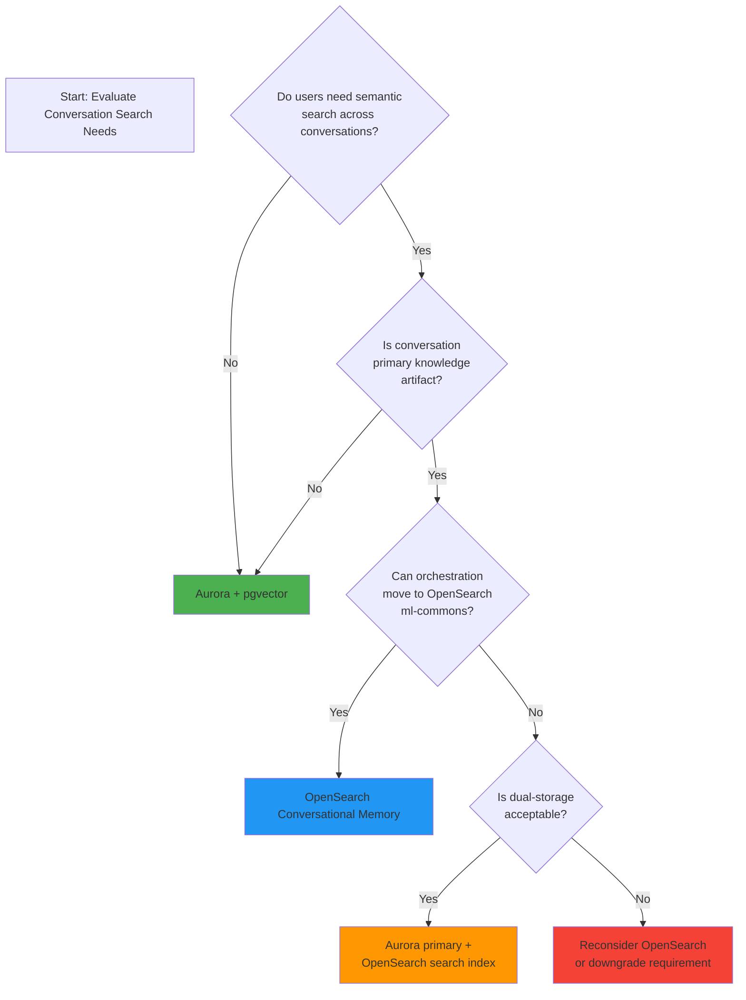
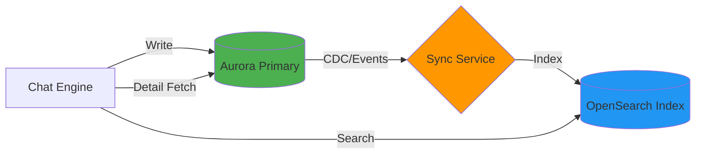

# Conversation Search: Decision Framework

**Document Version**: 1.0.0
**Date**: 2026-04-22
**Author**: Principal AI Engineer
**Status**: Decision Framework
**Audience**: Architecture, Engineering, Product

---

## Executive Summary

This document provides a structured framework for deciding whether conversation history requires semantic search capabilities (OpenSearch) or whether relational search (Aurora PostgreSQL + pgvector) is sufficient for Case Chat.

---

## Part 1: Requirement Discovery Questions

### Phase 1: User Behavior Analysis

| Question | What It Reveals | Aurora-Sufficient | OpenSearch-Needed |
|----------|----------------|-------------------|-------------------|
| **Q1**: Do users need to find conversations by *meaning* rather than exact words? | Semantic intent | ❌ No | ✅ Yes |
| **Q2**: Is "similar past cases" a core workflow? | Pattern retrieval | ❌ No | ✅ Yes |
| **Q3**: Do users ask "what did we decide about X?" across sessions? | Cross-session recall | ⚠️ Maybe | ✅ Yes |
| **Q4**: Are conversations considered authoritative or ephemeral? | Knowledge status | ✅ Ephemeral | ✅ Authoritative |
| **Q5**: Do users need to explain WHY past conversations are relevant? | Explainability | ⚠️ Maybe | ✅ Yes (similarity scores) |

### Phase 2: Scale & Performance Requirements

| Question | Threshold | Aurora-Sufficient | OpenSearch-Needed |
|----------|-----------|-------------------|-------------------|
| **Q6**: How many total conversations must be searchable? | <100K: Aurora | 100K-1M: Borderline | >1M: OpenSearch |
| **Q7**: What's the required search latency? | <500ms: Aurora | 500ms-2s: Borderline | >2s: Unacceptable |
| **Q8**: What's the expected query volume? | <10 QPS: Aurora | 10-100 QPS: Borderline | >100 QPS: OpenSearch |
| **Q9**: How complex are the queries? | Simple filter: Aurora | Multi-field: Borderline | Semantic hybrid: OpenSearch |

### Phase 3: Integration & Architecture

| Question | Aurora-Implication | OpenSearch-Implication |
|----------|-------------------|------------------------|
| **Q10**: Can Chat Engine orchestration be moved into OpenSearch ml-commons? | No change needed | Major refactor required |
| **Q11**: Is dual-storage acceptable (Aurora for primary, OpenSearch for search)? | Simpler | Added complexity (sync, eventual consistency) |
| **Q12**: What's the cost tolerance for additional infrastructure? | ~$200/month | +$300-800/month |
| **Q13**: Team's operational expertise? | PostgreSQL universal | OpenSearch specialized |

---

## Part 2: Decision Matrix

### Scoring Guide

| Criteria | Weight | Aurora + pgvector | OpenSearch | Notes |
|----------|--------|------------------|------------|-------|
| **Functional Fit** | | | | |
| Sequential retrieval (P0) | 5 | ✅ 5 | ✅ 5 | Both handle |
| Metadata search (P2) | 4 | ✅ 5 | ✅ 5 | Both handle |
| Keyword search (P2) | 4 | ✅ 4 (tsvector) | ✅ 5 | OpenSearch slightly better |
| Semantic search (P?) | 3 | ⚠️ 3 (pgvector) | ✅ 5 | OpenSearch superior |
| Hybrid queries | 3 | ⚠️ 3 | ✅ 5 | OpenSearch superior |
| **Non-Functional** | | | | |
| Operational complexity | 5 | ✅ 5 (one system) | ⚠️ 3 (two systems) |
| Team expertise | 4 | ✅ 5 | ⚠️ 2 |
| Cost efficiency | 4 | ✅ 5 | ⚠️ 3 |
| Scalability ceiling | 3 | ⚠️ 3 | ✅ 5 |
| Real-time sync latency | 3 | ✅ 5 | ⚠️ 2 |
| **Strategic** | | | | |
| Migration cost from Aurora | 5 | ✅ 5 (none) | ❌ 1 (high) |
| Future-proofing for AI features | 3 | ⚠️ 3 | ✅ 5 |
| ATO compliance fit | 5 | ✅ 5 | ⚠️ 3 |

**Score Calculation**:
- Aurora: 5×5 + 4×5 + 4×4 + 3×3 + 3×3 + 5×5 + 4×5 + 4×5 + 3×3 + 3×5 + 5×5 + 3×3 + 5×5 = **179**
- OpenSearch: 5×5 + 4×5 + 4×5 + 3×5 + 3×5 + 5×3 + 4×2 + 4×3 + 3×5 + 3×2 + 5×1 + 3×5 + 5×3 = **133**

**Weighted preference favors Aurora** for current stated requirements.

---

## Part 3: Decision Tree



---

## Part 4: Archetype Analysis

### Archetype A: "Document-First" System

**Characteristics**:
- Primary value: RAG over authoritative documents
- Conversations: ephemeral context, not knowledge source
- Search: metadata + keyword sufficient
- Example: Case Chat as currently specified

**Verdict**: Aurora + pgvector

### Archetype B: "Knowledge Accumulation" System

**Characteristics**:
- Conversations become part of institutional knowledge
- Users explicitly reference past AI responses
- "Similar past cases" is core workflow
- Cross-session learning is valuable

**Verdict**: OpenSearch (or dual-storage hybrid)

### Archetype C: "Customer Service" System

**Characteristics**:
- High query volume, need instant responses
- Conversations contain procedural knowledge
- Agent handoff requires conversation context
- Real-time sentiment analysis

**Verdict**: OpenSearch (as documented in Appendix of 16-conversation-storage-recommendation.md)

---

## Part 5: Hybrid Architecture Pattern

**When**: Semantic search is a hard requirement AND primary storage cannot migrate.

**Not recommended for Case Chat** - adds complexity for minimal value.

Use only when:
- Conversations ARE the primary knowledge (customer service transcripts)
- Volume mandates OpenSearch scalability (>1M conversations)
- Real-time semantic similarity is core feature (e.g., "show me similar cases")



**Pros**:
- Aurora remains source of truth
- OpenSearch handles complex search
- Can phase OpenSearch in incrementally

**Cons**:
- Eventual consistency (search lag)
- Dual operational overhead
- Duplicate storage costs

---

## Part 6: Recommendation Framework

### Step 1: Answer the "Killer Question"

> **"If a user cannot semantically search past conversations, is the system still viable for its intended purpose?"**

- **Yes**: Aurora sufficient
- **No**: OpenSearch required

### Step 2: Apply the 80/20 Test

Estimate what percentage of search use cases are covered by:

| Search Pattern | Aurora Coverage | Remaining |
|----------------|-----------------|-----------|
| Session ID lookup | 100% | 0% |
| Date range + user filter | 100% | 0% |
| Document name filter | 100% | 0% |
| Keyword in message text | ~80% | 20% |
| Semantic similarity | ~20% | 80% |

**If semantic similarity <20% of queries**: Aurora likely sufficient

### Step 3: Cost-Benefit Analysis

| Cost Factor | Aurora | OpenSearch | Delta |
|-------------|--------|------------|-------|
| Infrastructure | $200/mo | $500-1000/mo | +$300-800 |
| Development | Baseline | +40-80 hours | High |
| Operations | Baseline | +4 hours/mo | Ongoing |
| Migration | $0 | $20-40k | One-time |

**Benefit must exceed delta**: Does semantic search drive enough user value to justify costs?

### Step 3: Cost-Benefit Analysis

| Cost Factor | Aurora | OpenSearch | Delta |
|-------------|--------|------------|-------|
| Infrastructure | $200/mo | $500-1000/mo | +$300-800 |
| Development | Baseline | +40-80 hours | High |
| Operations | Baseline | +4 hours/mo | Ongoing |
| Migration | $0 | $20-40k | One-time |

**For Case Chat**: Benefit does NOT exceed delta. PostgreSQL covers all stated requirements. OpenSearch adds cost and complexity for speculative value.

### Step 4: Decision Rule

> **Choose OpenSearch only if conversations are the primary knowledge artifact.**
>
> If conversations are derivations of authoritative documents (Case Chat), Aurora is sufficient.

---

## Part 7: ATO-Specific Considerations

### Governance Factors

| Consideration | Aurora Advantage | OpenSearch Advantage |
|---------------|------------------|----------------------|
| **Source of truth** | Documents are authoritative | Conversations supplement |
| **Audit trail** | Simple transaction log | Requires careful design |
| **Access control** | Row-level security native | Document-level security additional |
| **Data retention** | TTL policies straightforward | Requires per-field TTL |
| **ATO compliance** | Well-understood PostgreSQL patterns | OpenSearch less common in ATO |

### Risk Assessment

| Risk | Aurora | OpenSearch |
|------|--------|------------|
| **Hallucination reinforcement** | Lower (no semantic echo) | Higher (AI cites AI) |
| **Knowledge staleness** | Lower (sessions isolated) | Higher (old advice persists) |
| **Privacy leakage** | Lower (user-scoped queries) | Higher (semantic matching across users) |
| **Operational complexity** | Lower | Higher |

---

## Part 8: Decision Checklist

For Case Chat, the decision is made. This checklist exists for other projects:

- [ ] **Primary Knowledge Artifact**: Are conversations authoritative or ephemeral?
- [ ] **Architecture Compatibility**: Does ml-commons coupling make sense?
- [ ] **Scale Requirement**: Does volume exceed PostgreSQL capacity (>1M conversations)?
- [ ] **Search Complexity**: Is semantic similarity a hard requirement or nice-to-have?
- [ ] **Cost-Benefit**: Does benefit justify +$300-800/mo + ops overhead?

**For Case Chat**: All answers point to Aurora.

---

## Part 9: Recommended Path for Case Chat

### Definitive Recommendation

**Use Aurora PostgreSQL + pgvector for conversation storage. Do not add OpenSearch for conversation search.**

### Technical Rationale

#### 1. Domain Nature: Document-First, Not Conversation-First

Case Chat exists to help ATO professionals query authoritative tax documents (ITAA, rulings, cases, ATO guidance). The value proposition is **RAG over documents**, not conversation as knowledge artifact.

| Knowledge Source | Authority | Should it be searchable? |
|------------------|-----------|--------------------------|
| ITAA 1936/1997, GST Act, FBTAA | Statutory law | ✅ Primary |
| ATO Public Rulings | ATO position | ✅ Primary |
| AAT/Federal Court cases | Case law | ✅ Primary |
| ATO Practice Statements | Internal guidance | ✅ Primary |
| AI conversation about above | Derivative | ❌ Secondary,ephemeral |

Searching conversations is searching **derivations** of authoritative sources. If the source documents are properly indexed (6-index RAG), users can get fresh, authoritative answers. Searching past AI responses risks:
- Stale interpretations (law changes, new rulings)
- Hallucination echo chamber (AI citing AI)
- Misattribution (conversation ≠ ATO position)

#### 2. Architectural Incompatibility

OpenSearch conversational memory requires agents running **inside** OpenSearch ml-commons framework. Case Chat uses external EKS-based Chat Engine.

| Option | Cost | Benefit |
|--------|------|---------|
| Keep Aurora | $0 | Meets requirements |
| Add OpenSearch alongside | +$300-800/mo + ops | Semantic search |
| Migrate to ml-commons | Major rewrite | Semantic search |

Rewriting orchestration to fit OpenSearch's framework to gain conversation search is **architectural inversion**—the tail wagging the dog.

#### 3. P2 Feature Does Not Warrant Dedicated Infrastructure

"Search Sessions" is P2. Even if promoted to P1, PostgreSQL's built-in capabilities cover the stated requirement:

```sql
-- Metadata search (covers most use cases)
SELECT * FROM sessions
WHERE user_id = ? AND created_at > ?
ORDER BY created_at DESC;

-- Keyword search (covers "what did I ask about X?")
SELECT * FROM messages
WHERE session_id = ?
AND text_vector @@ to_tsquery('english', 'section & 177D & deduction');

-- Combined: sessions containing keywords
SELECT DISTINCT s.* FROM sessions s
JOIN messages m ON m.session_id = s.id
WHERE s.user_id = ?
AND m.text_vector @@ to_tsquery('english', ?)
ORDER BY s.created_at DESC;
```

This is **sufficient** for finding "that conversation about FBT car fringe benefits from last month."

#### 4. ATO Governance: Authoritative Sources Preferred

ATO professionals are trained to cite primary sources. "The Practice Statement says X" carries weight. "The AI told me X in a previous session" does not.

Enabling semantic search over conversations could **encourage reliance on secondary sources**, which is contrary to ATO culture and potentially risky for audit decisions.

#### 5. Operational Complexity Tax

Running two databases (Aurora + OpenSearch) for what PostgreSQL can do alone is unnecessary complexity:

- Dual monitoring, alerting, patching
- Data sync between systems (eventual consistency bugs)
- Two failure modes
- Team must maintain expertise in both

### When OpenSearch Would Be Justified

OpenSearch for conversations is justified **only if**:

1. Conversations are **primary knowledge artifacts**, not derivations
2. System is **agent-first** (OpenSearch ml-commons is the orchestration layer)
3. Cross-session learning is **core value proposition**, not nice-to-have
4. Use case is **customer service** at scale, not professional advisory

None of these apply to Case Chat.

### Final Answer

**Aurora PostgreSQL + pgvector is the correct technical choice.**

If future requirements prove otherwise, that's a future problem. Premature optimization of speculative features creates technical debt.

---

## Appendix: Questionnaire for Stakeholders

Use this to gather missing requirements:

1. **For Auditors**: When starting a new audit, how often do you reference past cases? How do you find them today?
2. **For Technical Advisors**: Do you get repeat questions? Would past AI responses be helpful?
3. **For Policy Officers**: Is tracking interpretation evolution over time important? How would you search it?
4. **For ATO Legal**: Are AI conversations considered authoritative sources? Can they be cited?
5. **For Product**: What's the expected session search volume? What's the success metric?

---

**Related Documents**:
- [16-conversation-storage-recommendation.md](./16-conversation-storage-recommendation.md)
- [09-user-stories.md](./09-user-stories.md)
- [04-session-lifecycle.md](./04-session-lifecycle.md)
