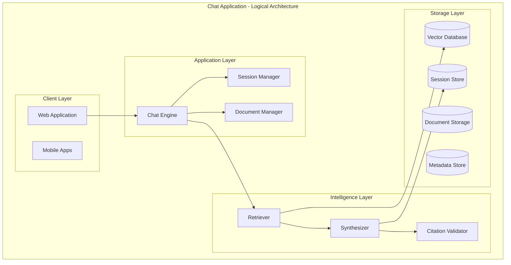

# Case Assistant: System Design (Conceptual Architecture)

**Domain**: Tax Law (100% Focus)
**Document Version**: 2.0.0
**Date**: 2026-03-23
**Author**: Principal AI Engineer
**Status**: Production Architecture Specification
**Audience**: Engineering, Product, Architecture Teams

> **NOTE**: This directory contains the conceptual architecture documentation without AWS-specific implementation details. For AWS deployment specifics, see [system_designs_aws.md](../system_designs_aws.md).

> **DOMAIN SCOPE**: This system is designed **exclusively for tax law** - federal and state tax codes, IRS regulations, tax court cases, and tax-related legal documents.

---

## Document Structure

This system design documentation is organized into the following modules:

### Core Architecture Documents

| Document | Description |
|----------|-------------|
| **[01-chat-architecture.md](./01-chat-architecture.md)** | Chat application architecture, conversation flow, and high-level system design |
| **[02-document-ingestion.md](./02-document-ingestion.md)** | Document ingestion pipeline with page-level chunking, table detection, and VLM+GPU processing |
| **[03-message-routing.md](./03-message-routing.md)** | Message types, orchestrator-based routing, and cost-optimized paths |
| **[04-session-lifecycle.md](./04-session-lifecycle.md)** | Session state management, lifecycle, and data persistence |
| **[05-evaluation-strategy.md](./05-evaluation-strategy.md)** | Comprehensive evaluation framework with LLM-as-Judge, gold dataset, and metrics |
| **[06-core-components.md](./06-core-components.md)** | Component descriptions, data flow, and technology mapping overview |

### Related Documents

- **[../system_designs_aws.md](../system_designs_aws.md)** - AWS-specific implementation details
- **[../evaluation_strategy.md](../evaluation_strategy.md)** - Evaluation framework and gold dataset specification

---

## Quick Navigation

### For New Engineers

1. Start with **[01-chat-architecture.md](./01-chat-architecture.md)** to understand the overall system
2. Review **[02-document-ingestion.md](./02-document-ingestion.md)** for document processing (critical for understanding VLM usage)
3. Read **[05-evaluation-strategy.md](./05-evaluation-strategy.md)** to understand quality and compliance requirements

### For Product Managers

- **[01-chat-architecture.md](./01-chat-architecture.md)** - High-level overview
- **[05-evaluation-strategy.md](./05-evaluation-strategy.md)** - Quality metrics and testing approach

### For DevOps/SRE

- **[06-core-components.md](./06-core-components.md)** - Technology mapping
- **[../system_designs_aws.md](../system_designs_aws.md)** - AWS implementation specifics

---

## Key Architecture Decisions

### Tax Law Domain Specialization
The system is designed exclusively for tax law, not general legal applications. This focus shapes:
- User personas (taxpayers, CPAs, tax attorneys, IRS agents)
- Document types (IRC sections, tax court opinions, IRS forms)
- Evaluation criteria (tax code accuracy, citation requirements)
- Safety boundaries (no general legal advice outside tax law)

### Page-Level Document Processing
Documents are split at page-level granularity primarily to:
1. **Detect tables** and route them to VLM+GPU processing
2. Enable efficient delta updates on re-upload
3. Handle cross-page content tracking

See **[02-document-ingestion.md](./02-document-ingestion.md)** for complete details.

### Orchestrator-Based Message Routing
An LLM-based orchestrator classifies message intent before any expensive operations:
- Routes ~30% of messages to low-cost paths (greetings, clarifications)
- Pre-DB classification prevents unnecessary vector queries
- Single efficient LLM call for routing decisions

See **[03-message-routing.md](./03-message-routing.md)** for complete details.

### Session Persistence with Document TTL
- Sessions persist indefinitely (users can return anytime)
- Documents have 7-day inactivity TTL (auto-deleted)
- Conversation history persists even after document deletion
- Enables compliance while maintaining user experience

See **[04-session-lifecycle.md](./04-session-lifecycle.md)** for complete details.

### Defensive Evaluation Framework
Three-tier evaluation model with LLM-as-Judge:
- Tier 1: Automated continuous (every commit)
- Tier 2: Scheduled batch (daily/weekly)
- Tier 3: Manual expert review (monthly/quarterly)

See **[05-evaluation-strategy.md](./05-evaluation-strategy.md)** for complete details.

---

## System Diagram Overview

---

## Document Metadata

| Attribute | Value |
|-----------|-------|
| **Domain** | Tax Law (Federal and State) |
| **Architecture Style** | Microservices with Event-Driven Ingestion |
| **Deployment** | Single-region (AWS) |
| **Session Model** | Persistent sessions with temporary document storage |
| **Evaluation Approach** | Three-tier (Automated → Batch → Manual) |
| **Primary Users** | Individual taxpayers, CPAs, tax professionals, tax attorneys |

---

## Change History

| Version | Date | Changes |
|---------|------|---------|
| 2.0.0 | 2026-03-23 | Domain specialization to tax law; document split into modules |
| 1.0.0 | 2026-03-19 | Initial comprehensive system design |
