# Case Assistant: System Design (Conceptual Architecture)

**Domain**: Tax Law (100% Focus)
**Document Version**: 2.0.0
**Date**: 2026-03-23
**Author**: Principal AI Engineer
**Status**: Production Architecture Specification
**Audience**: Engineering, Product, Architecture Teams

> **NOTE**: This document describes the conceptual architecture without AWS-specific implementation details. For AWS deployment specifics, see [system_designs_aws.md](./system_designs_aws.md).

> **DOMAIN SCOPE**: This system is designed **exclusively for tax law** - federal and state tax codes, IRS regulations, tax court cases, and tax-related legal documents.

---

## Table of Contents

1. [High-Level Architecture](#1-high-level-architecture)
   - 1.1 Chat Application Architecture (Conceptual)
   - 1.2 Chat Conversation Flow
   - 1.3 Document Ingestion Pipeline (Conceptual)
   - 1.4 Message Types and Routing
   - 1.5 Session Lifecycle (Conceptual)
   - 1.6 Evaluation Strategy (Conceptual)
   - 1.7 Core Component Descriptions
   - 1.8 Data Flow Overview
   - 1.9 Technology Mapping Overview
2. [Document Ingestion Flow](#2-document-ingestion-flow)
3. [Chat Service Flow](#3-chat-service-flow)
4. [Evaluation and Observability Flow](#4-evaluation-and-observability-flow)
5. [Session and Data Lifecycle](#5-session-and-data-lifecycle)
6. [Security and Compliance](#6-security-and-compliance)
7. [Technology Mapping](#7-technology-mapping)

---

**Related Documents**:
- [system_designs_aws.md](./system_designs_aws.md) - AWS-specific implementation details
- [evaluation_strategy.md](./evaluation_strategy.md) - Evaluation framework and gold dataset

---

## 1. High-Level Architecture

### 1.1 Chat Application Architecture (Conceptual)

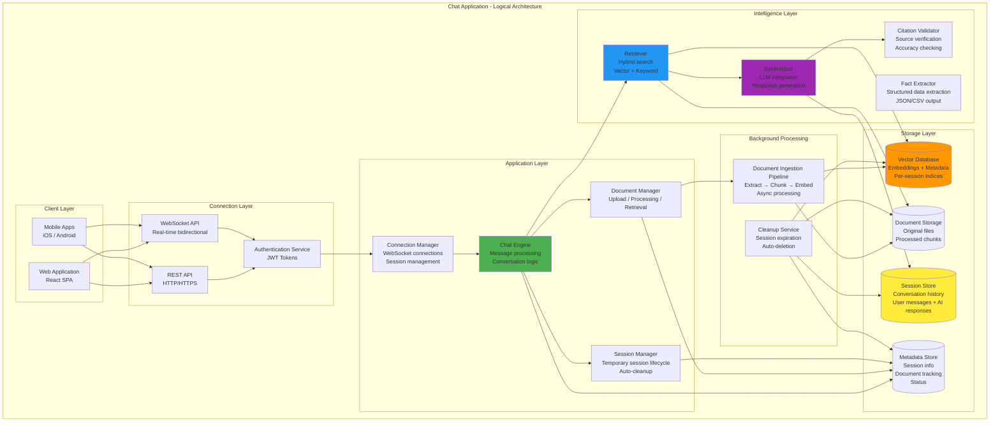

### 1.2 Chat Conversation Flow

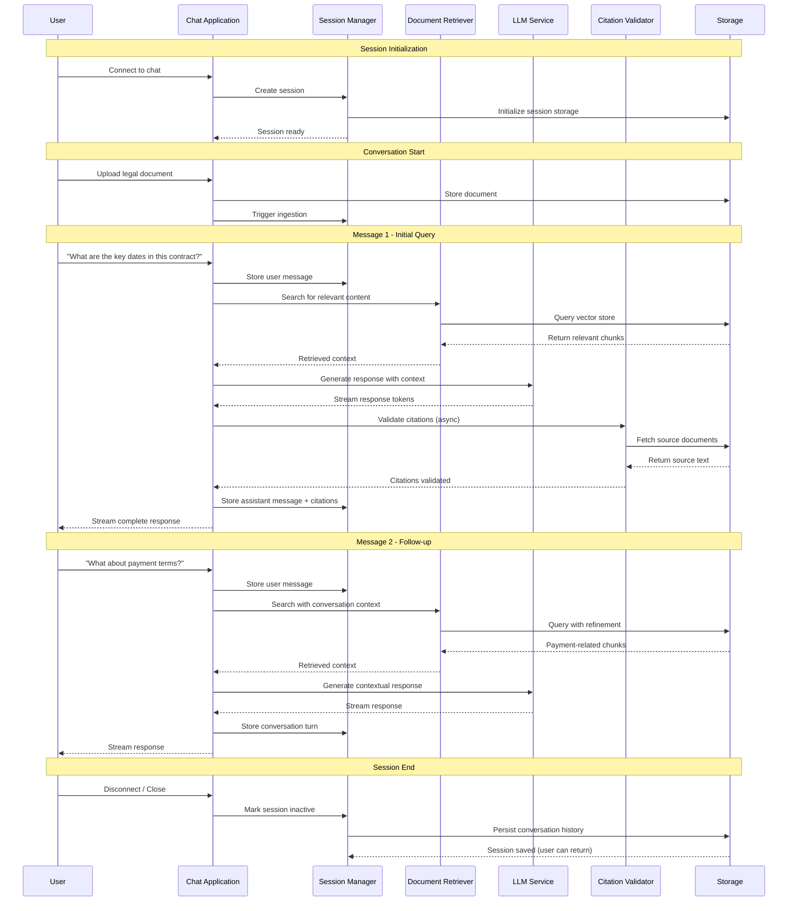

### 1.3 Document Ingestion Pipeline (Conceptual)

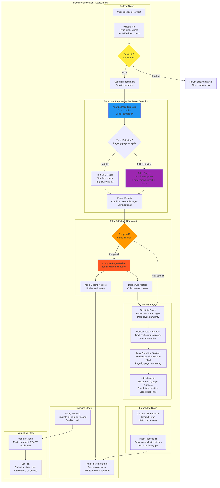

**Why Page-Level Splitting? Table Detection Problem**:

The primary reason for splitting documents into pages is to **detect and handle tables separately** to preserve their structural integrity.

**The Table Chunking Problem**:

| Issue | Description | Example |
|-------|-------------|---------|
| **Broken Columns** | Text chunking splits mid-column | "Column A: Value A123..." → broken |
| **Lost Rows** | Row relationships destroyed | Header row separated from data rows |
| **Merged Cells** | Complex tables lose structure | Spans not recognized after split |
| **Nested Tables** | Tables within tables broken | Inner table isolated from context |

**Example of Broken Table Chunking**:

❌ **WRONG - Text-based splitting**:
```
Chunk 1: "| Name | Age |"
Chunk 2: "| John | 25 |"
Chunk 3: "| Jane | 30 |"
```
→ **Problem**: No column context, headers separated from data

✅ **CORRECT - VLM with GPU**:
```
Table Page → VLM processes as image → Extracts complete table with structure
```
→ **Solution**: Preserves column/row relationships, merged cells, formatting

**VLM + GPU Solution for Tables**:

```
Table Page
    ↓
[VLM Model with GPU]
    ├─ LlamaParse (Vision Model)
    ├─ Bedrock Multimodal (Claude)
    └─ Processes page as IMAGE
    ↓
Structured Table Output
    ├─ Column headers preserved
    ├─ Row mappings intact
    ├─ Merged cells detected
    └─ Nested tables handled
```

**Why GPU is Required**:
- **Image Processing**: Tables rendered as images need GPU inference
- **Complex Layout**: Merged cells, multi-level headers need compute
- **Accuracy**: GPU ensures precise cell boundary detection
- **Speed**: Batch processing of table pages faster with GPU

**Page-Level Decision Flow**:

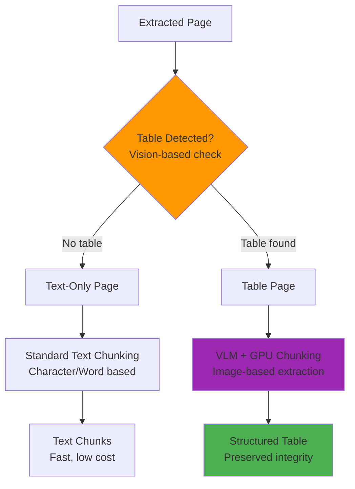

**Table Detection Criteria**:

| Feature | Detection Method | Action |
|---------|-----------------|--------|
| **Grid lines** | Visual detection | Flag for VLM |
| **Tabular patterns** | Layout analysis | Flag for VLM |
| **Multiple columns** | Structure analysis | Flag for VLM |
| **Merged cells** | Visual complexity | Flag for VLM |
| **Headers + data rows** | Pattern matching | Flag for VLM |

**Benefits of Page-Level Table Detection**:

1. **Preserve Table Integrity** - No broken columns/rows
2. **GPU Efficiency** - Only table pages use expensive GPU resources
3. **Cost Optimization** - Text pages use cheaper text extraction
4. **Accuracy** - Tables extracted with proper structure
5. **Scalability** - Targeted GPU usage, not whole document

**Page-Level Chunking Process**:

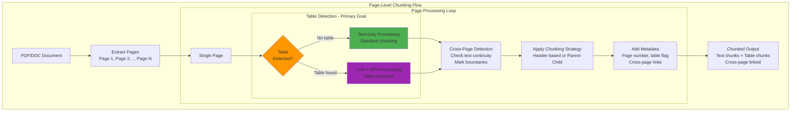

**Cross-Page Text Handling**:

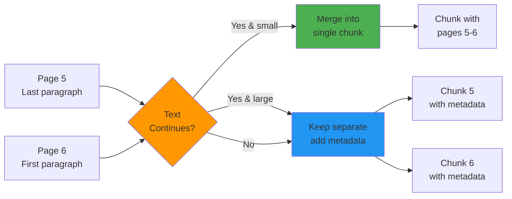

**VLM + GPU Usage - Table Pages Only**:

The system uses **Vision Language Models (VLM) with GPU** for pages containing tables to preserve structural integrity:

| Page Type | Parser Used | GPU? | Cost | Examples |
|-----------|-------------|------|------|----------|
| **Text-only pages** | Textract/PyMuPDF | No | Low | Plain text contracts, letters, agreements |
| **Simple tables** | Textract Tables | No | Medium | Basic 2-column tables, simple lists |
| **Complex tables** | VLM (LlamaParse/Bedrock) | Yes | High | Merged cells, nested headers, multi-level tables |
| **Scanned docs** | Textract OCR | No | Medium | Image-based PDFs (no tables) |

**Table Detection Triggers VLM + GPU**:
- ✅ **Tables with merged cells** - Visual boundaries needed
- ✅ **Nested headers** - Multi-level column structure
- ✅ **Complex grid layouts** - Irregular cell sizes
- ✅ **Tables spanning pages** - Cross-page continuity
- ✅ **Financial tables** - Numbers, calculations, currencies
- ✅ **Legal tables** - Schedules, appendices, references

**Why GPU for Tables?**:

| Requirement | Why GPU is Needed |
|-------------|-------------------|
| **Image Processing** | Table pages processed as images |
| **Cell Boundary Detection** | Precise visual boundary detection |
| **Merged Cell Recognition** | Complex spatial relationships |
| **Multi-Level Headers** | Nested structure understanding |
| **Cross-Page Tables** | Continuity across page breaks |
| **Batch Processing** | Faster inference with GPU acceleration |

**Cost Optimization**:
- Page-level detection before VLM processing
- Only table pages use expensive GPU resources
- Text pages use cheaper text extraction
- ~60-70% cost savings vs. processing all pages with VLM

**Delta Update on Reupload**:

When same file is reuploaded:
1. Compare SHA-256 page hashes
2. Identify changed pages
3. Delete vectors ONLY from changed pages
4. Re-index only changed pages
5. Keep existing vectors from unchanged pages

**Benefit**: Faster reuploads, reduced embedding costs

**Page-Level Chunking with Cross-Page Tracking**:

The chunking process operates at **page-level granularity** for two critical reasons:

1. **PRIMARY: Table Detection** - Identify and route table pages to VLM+GPU
2. **SECONDARY: Delta Updates** - Enable efficient re-processing of changed pages

```
Document → Pages → Table Detection → Chunking → Vectors
                    ↓ (if table)
                  VLM + GPU
```

**Why Page-Level?**:
- **Table Integrity**: Detect tables before chunking to preserve structure
- **Targeted GPU Usage**: Only table pages use expensive VLM resources
- **Efficient Updates**: Re-process only changed pages on re-upload
- **Cross-Page Tracking**: Handle content spanning page boundaries

**Process Flow**:

1. **Page Extraction**
   - Split document into individual pages
   - Each page gets a unique page_id
   - Store page boundaries for reference

2. **Table Detection (PRIMARY GOAL)**
   - Analyze page structure for tables
   - Detect grid lines, tabular patterns
   - Check for merged cells, complex layouts
   - **If table found**: Route to VLM + GPU
   - **If no table**: Use standard text extraction

3. **Cross-Page Content Detection**
   - Detect when text/tables span across pages
   - Mark continuation relationships (e.g., "page 5 continued from page 4")
   - Track logical sentence boundaries across page breaks
   - Add metadata: `cross_page: true`, `continued_from: page_N`, `continues_to: page_N+1`

4. **Page-by-Page Chunking**
   - **Text pages**: Apply header-based or parent-child chunking
   - **Table pages**: VLM extracts structured table with preserved integrity
   - For cross-page content:
     - Option A: Merge split content into single chunk (if < max size)
     - Option B: Keep separate but add continuity metadata
   - Tag each chunk with source page number

5. **Metadata Enrichment**
   - Document ID, Session ID
   - Page number(s) (single or range for cross-page)
   - Content type: `text`, `table`, `cross_page_text`, `cross_page_table`
   - Chunk position in page
   - Cross-page flags and links
   - Table structure (for table chunks): columns, rows, merged cells

**Example**:

| Chunk | Content | Page | Type | Processing |
|-------|---------|------|------|------------|
| Chunk 1 | "The party of the first part..." | 5 | Text | Standard chunking |
| Chunk 2 | "Financial Schedule (table)" | 6 | Table | **VLM + GPU** |
| Chunk 3 | "| Year | Revenue |" | 6 | Table cell | **VLM extracted** |
| Chunk 4 | "| 2024 | $1.2M |" | 6 | Table cell | **VLM extracted** |
| Chunk 5 | "...hereby agrees to the terms..." | 6-7 | Cross-page text | Merged chunk |
| Chunk 6 | "...continued from previous page" | 7 | Cross-page text | `continued_from: 6` |

**Benefits**:
- **Table Integrity** (PRIMARY): No broken columns/rows, VLM preserves structure
- **Targeted GPU Usage**: Only table pages use expensive VLM resources
- **Targeted Updates**: Re-process only changed pages
- **Context Preservation**: Track content across page boundaries
- **Efficient Retrieval**: Search includes cross-page context
- **Cost Savings**: Skip re-embedding unchanged pages

### 1.4 Message Types and Routing

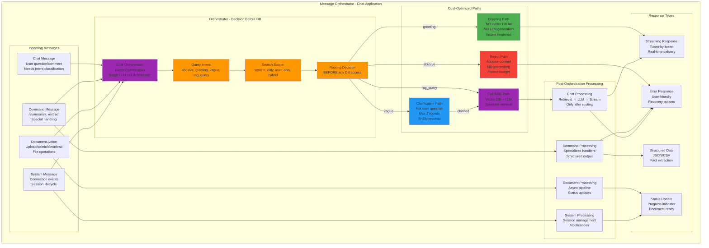

**What is an Orchestrator?**

An **Orchestrator** is a message routing component that uses LLM-based intent classification to determine the appropriate processing path **before** any expensive operations (vector DB queries, LLM generation) are executed.

**Key Characteristics**:

| Aspect | Description |
|--------|-------------|
| **Decision Point** | First component that processes every incoming message |
| **Single LLM Call** | Determines intent + scope + routing in one efficient call |
| **Cost Optimization** | Routes ~30% of messages to low-cost paths (greetings, clarifications) |
| **Pre-DB Classification** | Makes routing decisions BEFORE hitting vector database |
| **Not an Agent** | It's a router/classifier, not an autonomous decision-maker |

**Orchestrator vs Agent**:

| Orchestrator | Agent |
|--------------|-------|
| Routes messages based on intent | Makes autonomous decisions |
| Single decision point per message | Multi-step reasoning chains |
| Pre-determined paths | Dynamic behavior |
| Fast, predictable | Slower, exploratory |
| Best for: Chat applications | Best for: Complex workflows |

**Example Flow**:

```
User message: "hi"
  ↓
Orchestrator (LLM call): Intent=greeting, Scope=none
  ↓
Routing Decision: Greeting path
  ↓
Response: "Hello! How can I help?" (NO vector DB hit, NO LLM generation)
  ↓
Cost: $0 (saved vector DB + LLM call)
```
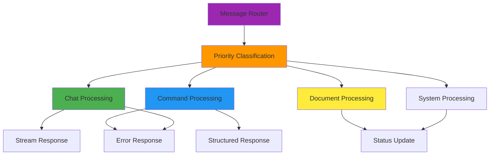

### 1.5 Session Lifecycle (Conceptual)

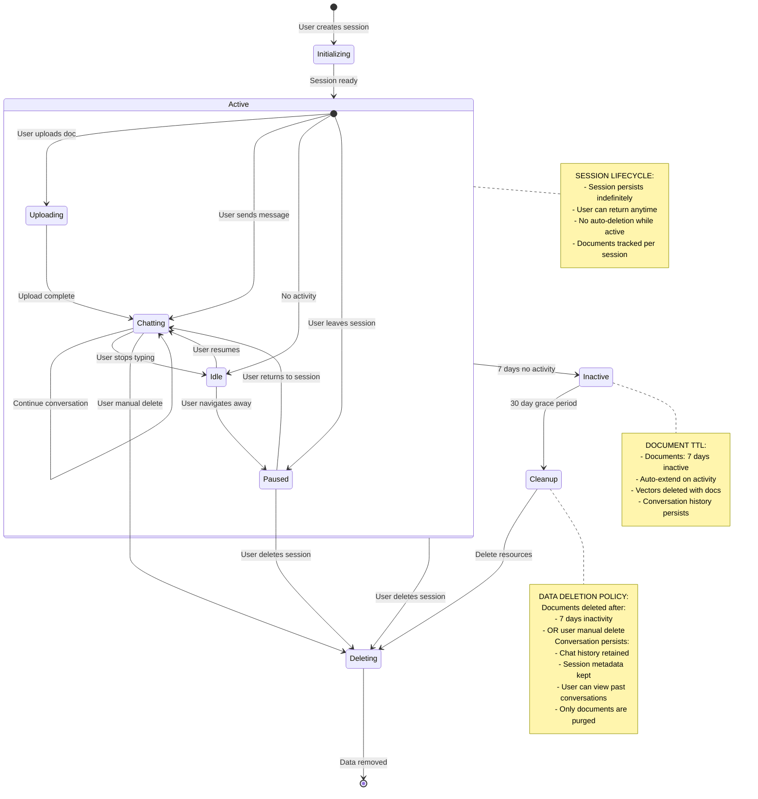

### 1.6 Evaluation Strategy (Conceptual)

Evaluation ensures the **tax law AI system** produces accurate, trustworthy, and compliant outputs. Tax law AI requires a **defensive, attribution-first** approach where errors can result in incorrect tax advice, penalties, or legal liability.

**Evaluation Philosophy**:

| Aspect | General Chatbot | Tax Law AI |
|--------|----------------|-------------|
| **Error Impact** | User inconvenience | Incorrect tax advice, IRS penalties, legal liability |
| **Attribution** | Optional | Mandatory (IRC sections, tax court citations required) |
| **Accuracy** | ~80-90% acceptable | ≥95% required (tax codes are precise) |
| **Hallucinations** | Minor annoyance | Zero tolerance (cannot invent tax laws) |
| **Testing** | Basic QA tests | Multi-layered validation against tax code |

#### Three-Tier Evaluation Model

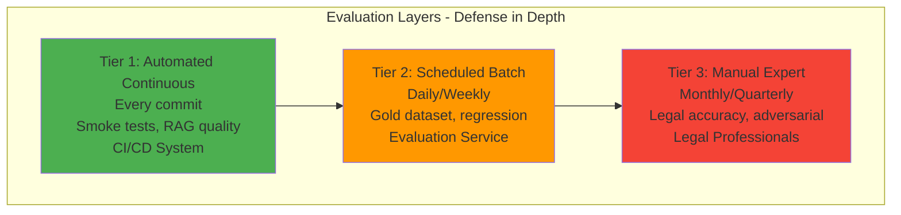

**Tier Comparison**:

| Tier | Frequency | Scope | Owner | Pass Criteria |
|------|-----------|-------|-------|--------------|
| **Tier 1: Automated Continuous** | Every commit | Smoke tests, basic RAG quality | CI/CD System | 100% tests pass, precision ≥90% |
| **Tier 2: Scheduled Batch** | Daily/Weekly | Gold dataset, regression testing | Evaluation Service | Precision ≥95%, recall ≥90% |
| **Tier 3: Manual Expert** | Monthly/Quarterly | Legal accuracy, edge cases | Legal Professionals | Qualitative approval |

#### Gold Dataset Approach

The **Gold Dataset** provides ground truth for systematic evaluation:

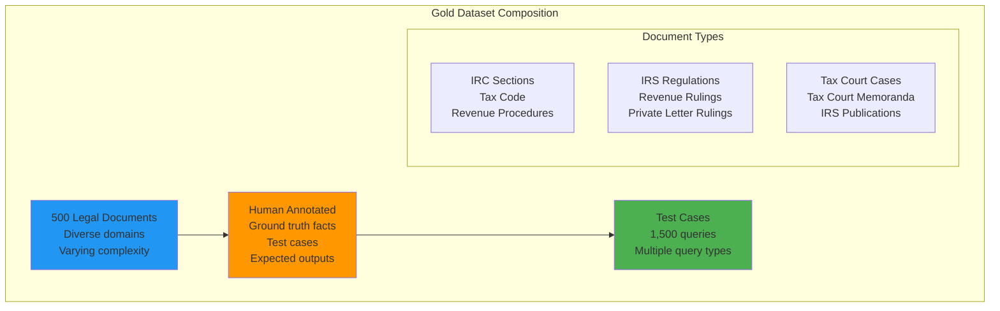

**Gold Dataset Characteristics**:

| Characteristic | Value |
|----------------|-------|
| **Total Documents** | 500 tax law documents |
| **Test Cases** | ~1,500 (3 per document) |
| **Tax Law Domains** | Federal tax code, IRS regulations, Tax court cases, State tax codes |
| **Document Types** | IRC sections, Revenue Rulings, Tax Court opinions, IRS forms, Private letter rulings |
| **Complexity Levels** | Simple (40%), Medium (40%), Complex (20%) |
| **Annotation** | 100% human-verified by tax professionals |
| **Ground Truth Facts** | ~10,000 facts (tax sections, regulations, case citations, tax amounts, deadlines) |

#### LLM-as-Judge Framework

**Concept**: Use a high-quality LLM to evaluate system outputs against ground truth with **strict content confinement**.

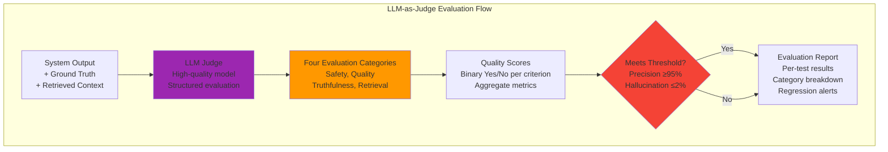

**Four Evaluation Categories** (expanded from basic approach):

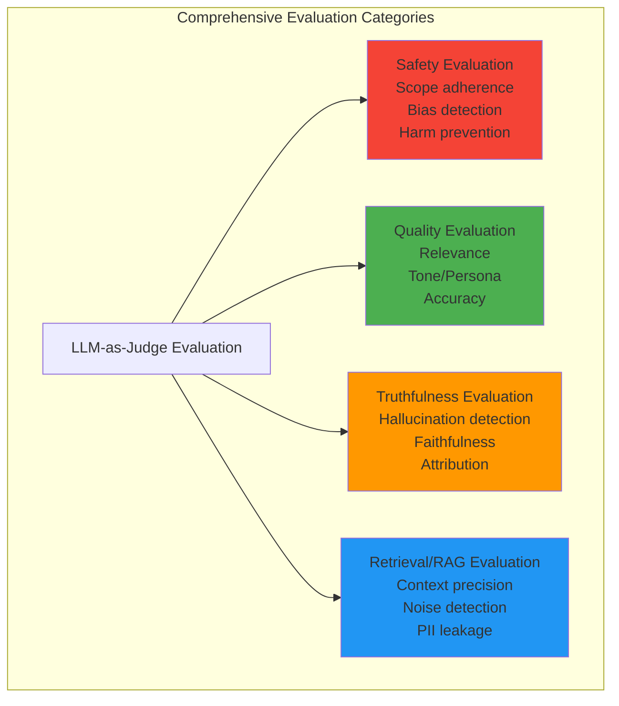

**LLM Judge Responsibilities** (enhanced):

1. **Safety Evaluation**
   - **Scope Adherence**: Does response stay within tax law domain (IRC, regulations, tax court)?
   - **Bias & Harm**: Detect harmful bias in tax advice
   - **Tax Advice Boundaries**: Ensure appropriate disclaimers (not professional tax advice)
   - **Sensitive Topics**: Handle audits, penalties, tax debt appropriately

2. **Quality Evaluation**
   - **Relevance**: Directly relevant to user's tax question
   - **Tone/Persona**: Professional, empathetic, tax-appropriate
   - **Accuracy**: Tax-law sound advice (IRC citations, regulations)
   - **Clarity**: Understandable to non-tax professionals
   - **Completeness**: Addresses user's tax question fully

3. **Truthfulness Evaluation**
   - **Hallucination Detection** (3 types):
     - New facts not in source documents
     - Contradictions to source material
     - Fabricated legal citations
   - **Faithfulness**: Response entirely based on retrieved facts
   - **Attribution**: All claims properly sourced

4. **Retrieval/RAG Evaluation**
   - **Context Precision**: Enough relevant information retrieved
   - **Context Irrelevance**: No significant irrelevant chunks
   - **Context Sufficiency**: Information sufficient for complete answer
   - **Noisy Ratio**: Noise doesn't interfere with understanding
   - **Distractor Presence**: No semantically similar but incorrect chunks
   - **Context Utilization**: Active use of provided context
   - **PII Leakage**: Retrieved context doesn't expose PII
   - **Prompt Leakage**: Response doesn't repeat system instructions

**Judge Question Schema** (structured approach):

```json
{
  "type": "question",
  "question": "STRICTLY CONFINE YOUR EVALUATION to the content of the system_response. Does the response introduce any facts not present in the retrieved_context?",
  "category": "Truthfulness",
  "expected_answer": "No",
  "required_content": ["system_response", "retrieved_context"],
  "rationale": "Tax law AI must not hallucinate tax codes, regulations, or case law"
}
```

**Binary Yes/No Scale**:
- Every judge question has binary Yes/No answer
- Declared `expected_answer` for automated scoring
- Strict content confinement prevents external knowledge leakage

#### Key Evaluation Metrics

**Comprehensive Metric Hierarchy**:

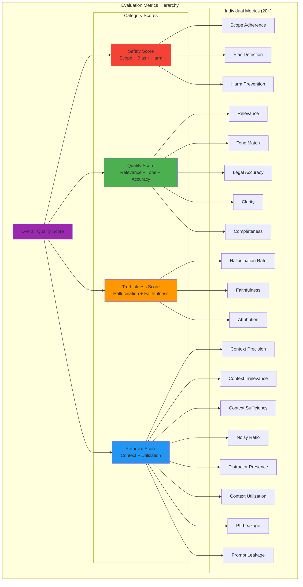

**Legal Quality Metrics** (expanded):

**Operational Metrics**:

| Metric | Target | Rationale |
|--------|--------|-----------|
| **Session Creation Success** | ≥99.9% | Core functionality must work |
| **Query Response Time (p95)** | <3 seconds | User experience |
| **Document Ingestion Success** | ≥99% | Users must be able to upload documents |

**Compliance Metrics**:

| Metric | Target | Rationale |
|--------|--------|-----------|
| **Data Deletion Compliance** | 100% | Legal requirement |
| **Session Isolation** | 100% | Security requirement |
| **PII Leakage** | 0 incidents | Privacy requirement |

#### Observability and Trace Collection

**Concept**: Capture detailed traces of every query to understand what the system retrieved, how it processed information, and where it may have failed.

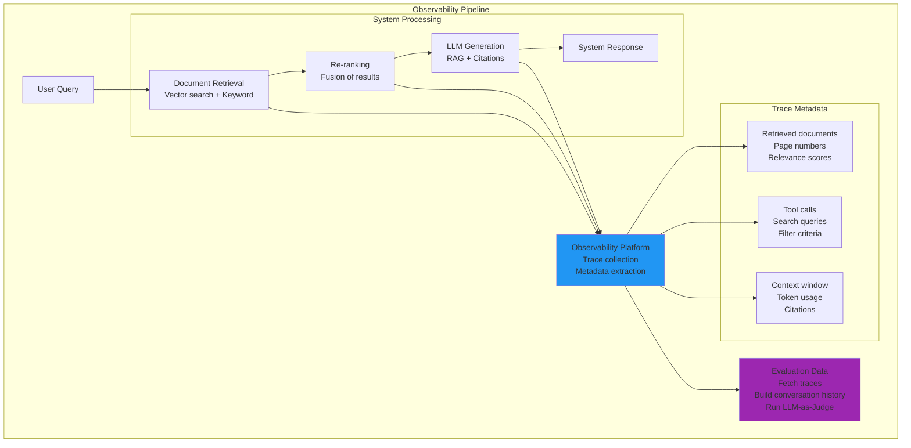

**Trace Metadata Collected**:

| Metadata Type | What It Captures | Evaluation Value |
|---------------|------------------|------------------|
| **Retrieved Documents** | Document IDs, page numbers, relevance scores | Evaluate retrieval quality |
| **Tool Calls** | Search queries, filters, database operations | Understand what system searched for |
| **Context Window** | Token usage, context size, truncation | Detect context overflow |
| **Citations** | Source locations, page references | Validate citation accuracy |
| **Timing** | Latency per component, total response time | Performance optimization |
| **Errors** | Failures, retries, fallbacks | Identify reliability issues |

**Data Cleaning Pipeline**:

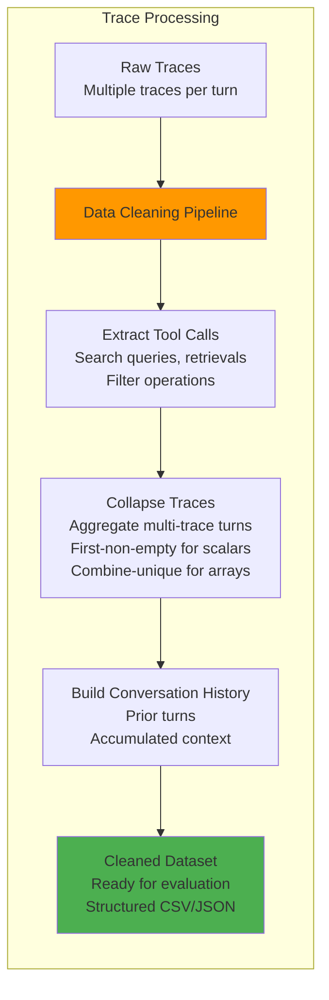

**Cleaned Dataset Schema**:

| Column | Description | Evaluation Use |
|--------|-------------|----------------|
| `session_id` | Unique conversation session | Track multi-turn conversations |
| `trace_id` | Observability trace IDs | Link to full traces |
| `user_query` | User's question | Input for evaluation |
| `system_response` | System's answer | Output for evaluation |
| `retrieved_documents` | Document IDs, pages | Evaluate retrieval quality |
| `retrieval_scores` | Relevance scores | Context precision analysis |
| `tool_calls` | Search/filter operations | Understand system behavior |
| `citations` | Source references | Citation accuracy check |
| `conversation_history` | Prior turns | Context handling evaluation |
| `latency_ms` | Response time | Performance metrics |
| `token_count` | Tokens used | Cost analysis |

#### Continuous Evaluation Pipeline

#### Test Case Categories

**Query Types**:

| Query Type | Description | Example | Evaluation Focus |
|------------|-------------|---------|------------------|
| **Fact Extraction** | Extract specific tax facts | "What are the key tax dates?" | Precision, Recall |
| **Summary** | Document summary | "Summarize this Tax Court opinion" | Completeness, Accuracy |
| **Cross-Document** | Multi-document queries | "Compare Section 199A and Section 162" | Synthesis, Citations |
| **Tax Law Reasoning** | Tax analysis | "What are the requirements for this deduction?" | Tax accuracy |
| **Adversarial** | Edge cases, attacks | "What if I don't report this income?" | Robustness, Hallucinations |

#### Persona-Driven Stress Testing

**Concept**: Simulate different user communication styles to test system robustness and adaptability.

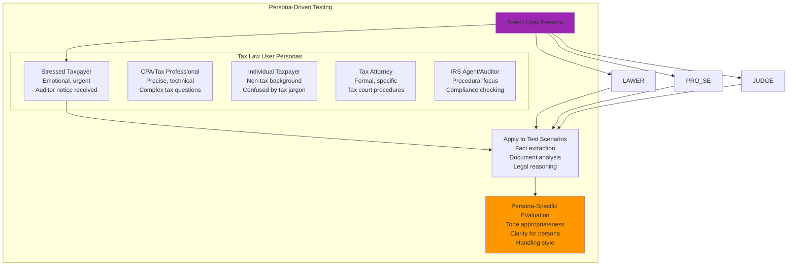

**Persona Definitions for Tax Law AI**:

| Persona | Communication Style | Tests |
|---------|---------------------|-------|
| **Stressed Taxpayer** | Emotional, rushed, typos, incomplete | Can system extract facts from audit notice? |
| **CPA/Tax Professional** | Precise, tax terminology, complex | Can system handle technical tax questions? |
| **Individual Taxpayer** | Non-tax background, confused by jargon | Can system explain tax concepts simply? |
| **Tax Attorney** | Formal, specific, tax court procedures | Does system provide proper procedural guidance? |
| **IRS Agent/Auditor** | Procedural focus, compliance checking | Does system handle audit-related queries accurately? |
| **Efficient User** | Brief, direct, minimal context | Can system work with minimal information? |
| **Verbose User** | Long-winded, story-telling | Can system extract key tax facts from narrative? |
| **Skeptical User** | Challenging, adversarial | Does system maintain composure and accuracy? |
| **Multi-Document User** | References many tax forms/cases | Can system synthesize across documents? |
| **Follow-up User** | Asks series of related tax questions | Does system maintain context? |

**Persona-Based Evaluation Criteria**:

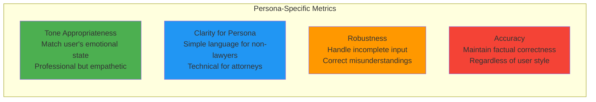

**Example Persona Test**:

| Persona | User Query | System Should |
|---------|-----------|--------------|
| **Stressed Taxpayer** | "I got an IRS audit notice wat do I do HELP" | Calm response, extract notice details, explain audit process |
| **CPA** | "What are the Section 199A deduction limitations for specified service trades?" | Technical tax analysis, precise IRC citations |
| **Individual Taxpayer** | "I don't understand 'adjusted gross income' - what is it?" | Simple explanation, examples, plain language |
| **Tax Attorney** | "Cite controlling precedent for the economic substance doctrine in tax court" | Formal response, precise tax court citations |
| **IRS Agent** | "What documentation supports this Schedule C deduction?" | Procedural response, documentation requirements, compliance standards |

#### Compliance Evaluation

Tax law AI systems must validate compliance requirements:

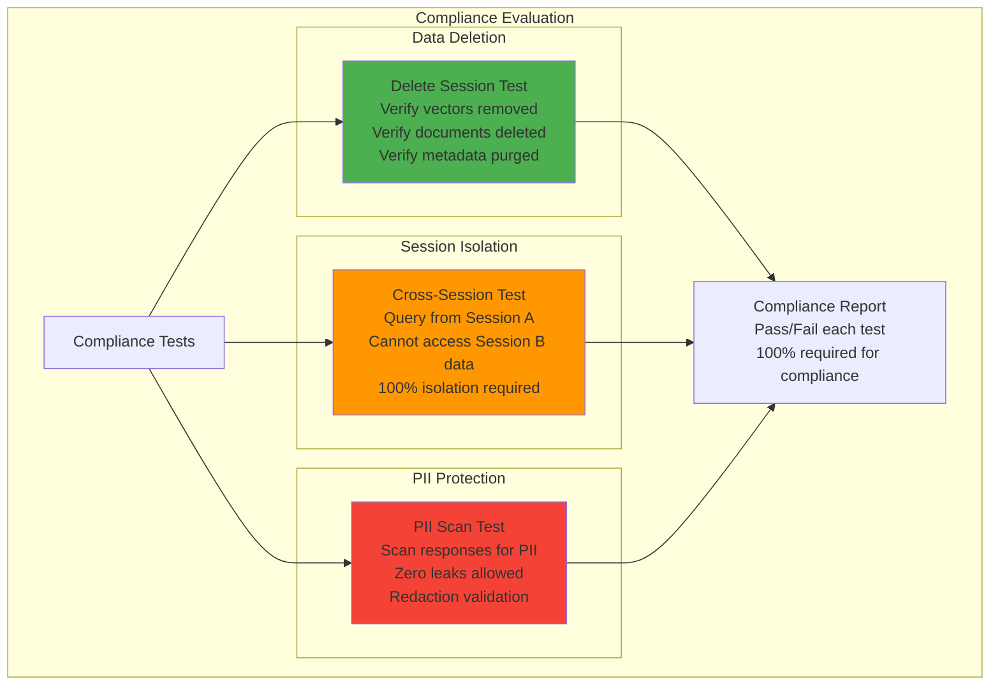

**Compliance Requirements**:

| Requirement | Test Method | Pass Criteria |
|-------------|-------------|---------------|
| **Data Deletion** | Delete session, verify cleanup | 0 vectors, 0 documents, 0 metadata remain |
| **Session Isolation** | Cross-session queries | 0% data leakage between sessions |
| **PII Protection** | PII scan on responses | 0 PII leaks |
| **Retention Policy** | Verify 7-day document TTL | Documents auto-deleted after inactivity |

#### Evaluation-Driven Development

**Development Workflow**:

1. **Write Test Case First**
   - Define query and expected output
   - Add to gold dataset
   - Establish baseline metrics

2. **Implement Feature**
   - Build functionality
   - Run automated evaluation (Tier 1)

3. **Validate Against Gold Dataset**
   - Run LLM-as-Judge evaluation
   - Verify metrics meet thresholds
   - Fix regressions

4. **Manual Review (Critical Features)**
   - Legal professional review
   - Adversarial testing
   - Edge case validation

**Regression Prevention**:

- Every commit runs Tier 1 tests
- Daily runs full gold dataset (Tier 2)
- Any degradation blocks deployment
- Trends tracked over time
- Manual review for significant changes

### 1.7 Core Component Descriptions

#### Connection Manager
- **Purpose**: Manages WebSocket connections and real-time communication
- **Responsibilities**:
  - Accept and authenticate WebSocket connections
  - Maintain connection registry (active sessions)
  - Route messages to appropriate handlers
  - Handle connection lifecycle (connect, disconnect, heartbeat)
  - Manage message queues per connection
  - Broadcast real-time updates (status changes, errors)

#### Chat Engine
- **Purpose**: Core orchestration for chat conversations
- **Responsibilities**:
  - Process incoming messages
  - Coordinate conversation flow
  - Manage conversation state and history
  - Route to retriever for document queries
  - Invoke LLM for response generation
  - Stream responses back to client
  - Handle multi-turn context management

#### Session Manager
- **Purpose**: Manage temporary session lifecycle
- **Responsibilities**:
  - Create ephemeral sessions (4-16 hour lifetime)
  - Track session expiration and extensions
  - Schedule automatic cleanup
  - Isolate data between sessions
  - Provide session-scoped resources (vector index, storage prefix)
  - Enforce zero data retention policy

#### Document Manager
- **Purpose**: Handle document upload, processing, and retrieval
- **Responsibilities**:
  - Accept file uploads via presigned URLs
  - Trigger ingestion pipeline
  - Track document processing status
  - Provide document metadata
  - Enable document deletion
  - Manage per-document access control

#### Retriever
- **Purpose**: Find relevant content from uploaded documents
- **Responsibilities**:
  - Hybrid search (vector + keyword)
  - Reciprocal Rank Fusion (RRF)
  - Context-aware retrieval (conversation history)
  - Query rewriting for follow-up questions
  - Reranking and result filtering
  - Citation extraction

#### Synthesizer
- **Purpose**: Generate AI responses using LLM
- **Responsibilities**:
  - Build conversation context
  - Assemble retrieved documents
  - Invoke LLM with appropriate prompts
  - Stream responses in real-time
  - Handle different query types (summary, extraction, chat)
  - Manage conversation tone and style

#### Fact Extractor
- **Purpose**: Extract structured data from documents
- **Responsibilities**:
  - Identify fact types (dates, parties, amounts, deadlines)
  - Generate structured output (JSON/CSV)
  - Provide confidence scores
  - Handle cross-document synthesis
  - Export results in multiple formats

#### Citation Validator
- **Purpose**: Ensure response accuracy and attribution
- **Responsibilities**:
  - Verify citation accuracy
  - Check document existence
  - Validate page numbers
  - Confirm text snippets match sources
  - Assess relevance of citations
  - Filter invalid citations

### 1.8 Data Flow Overview

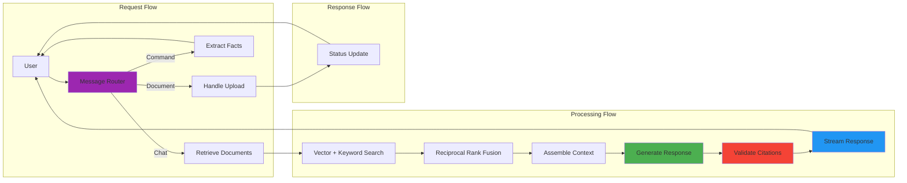

### 1.9 Technology Mapping Overview

| Component Category | Conceptual | AWS Implementation |
|-------------------|------------|-------------------|
| **API Layer** | REST API + WebSocket | API Gateway |
| **Authentication** | JWT Tokens | Amazon Cognito |
| **Application** | Chat Engine, Session Manager | EKS with Kubernetes |
| **Background Jobs** | Ingestion, Cleanup | Lambda + SQS |
| **Vector Database** | Vector Store | Amazon OpenSearch |
| **Document Storage** | Document Store | Amazon S3 |
| **Session Storage** | Session Store, Conversation History | DynamoDB + Redis |
| **Metadata Storage** | Metadata Store | DynamoDB + RDS PostgreSQL |
| **LLM** | LLM Service | Amazon Bedrock |
| **Observability** | Observability Platform | Self-hosted on EKS |

---
